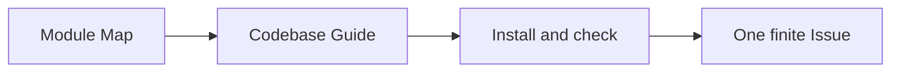
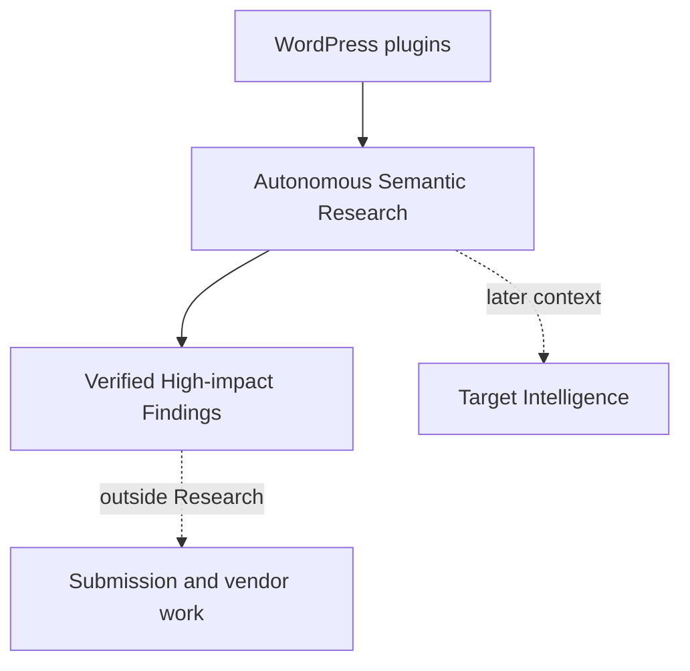

# WordPress Harness

WordPressプラグインのsource reviewを、LLMの自由な探索力と独立した実証を組み合わせて反復するresearch harnessです。第一目的は、既知脆弱性のoracleなしに**高impactな脆弱性を取りこぼさず発見する能力**を作ることです。特定のsinkやCWEを網羅すること自体を目的にせず、trust boundary、state transition、producer/consumer mismatch、decode/reparse、authorization assumption、複数機能のcompositionなど、**broken security semantics**を優先して探索します。

> **Do not optimize for sinks. Optimize for broken security semantics.**

RCEやsite-wide compromiseは最上位impactですが、長いchainだけを成功と定義しません。Unauthenticated SQL injection、意味的に深いStored XSS、account takeover、privilege escalation、arbitrary file operation、object injectionなど、単独でも十分に重大なFindingはその時点で価値があります。darooは公開Findingのportfolioから目指すhigh-impact mechanism breadthを定める`Researcher Reference`として扱い、非公開methodやAI利用は推測しません。wp2shellとWordfence Argusからは、有望primitiveを捨てずに深く追う姿勢と反復原則を参照します。

通常運転は、強いmodelがTarget全体へraw-source-firstで自由にpivotする有限の**Semantic Research Wave**です。全Targetへ最初からmulti-wave深掘りを強制せず、重大なsource-bound HypothesisはIndependent Verificationへ、強いread/write/file/auth/state primitive、persistent state、cross-request flow、decode/reparse等の**strong semantic frontier**はDepth AdmissionからArgus-likeなSynthesis・Critic・missing-link Waveへ昇格します。最終RCE/ATO/PrivEscが既に見えていることを昇格条件にはしません。

最上位の設計原則は、Wordfence Argusが示した10動詞です。

> confine, constrain, focus, motivate, parallelize, hypothesize, verify, record, prioritize, iterate

これらを標語や10段の固定pipelineではなく、所有module、永続artifact、実行時に観測できるgateを持つcontrol propertyとして実装します。Harnessはscope、budget ceiling、tool permission、isolation、provenance、persistence、fresh verificationを所有し、**どのfileを見るか、何が怪しいか、どの脆弱性classを疑うか、どこへpivotするかというresearch decisionはAgentへ残します**。Discoveryが作るものは未確認の`Hypothesis`または`Route Fragment`であり、cleanな環境で独立Verificationを通過したものだけを`Finding`と呼びます。

> **Harness owns the research process; agents own research decisions.**

現段階ではtoken costやwall timeを最小化するより、high-impact recallとroot-cause qualityを優先します。budgetは暴走を防ぐhard ceilingとして持ちますが、性能を落としてまで早期に削りません。コスト最適化は、oracle-separated development casesとprospective Campaignでrecall baselineを作った後にablationで行います。

旧`whitebox-harness`からcodeやcontractを移植せず、`wp2shell` promptの意図を小さなModuleとversioned artifactへ分解しています。Target source、prompt、provider output、payload、未公開FindingはGit外に置きます。現在の完成度は[Codebase Guide](docs/CODEBASE-GUIDE.md)、公開CVEでの実測は[experiments](docs/experiments/README.md)だけを正本とします。

## Start here

- [Research Design Principles — high-impact semantic recallを最上位に置く](docs/design/research-design-principles.md)
- [Module Map — コードを読まずに機能関係を把握する](docs/design/architecture/module-map.md)
- [Autonomous Research Loop — semantic researchとconditional depth escalation](docs/design/architecture/autonomous-research-loop.md)
- [Semantic Research, Breadth and Depth — PRISM/Argusとの関係](docs/design/architecture/breadth-depth-research-loop.md)
- [Harness Completeness Audit — 成功・不足・次の優先順位](docs/audits/harness-completeness-2026-09-03.md)
- [Codebase Guide — 現在のInterface・実装・Test・設計の対応](docs/CODEBASE-GUIDE.md)
- [Architecture overview diagram](docs/design/architecture/architecture-overview.md)
- [Development rules](AGENTS.md)

詳細が必要になったら、Codebase Guideから変更対象のSeamへ進みます。用語は[Context map](CONTEXT-MAP.md)、[Domain language](CONTEXT.md)、[日本語用語早見表](docs/JAPANESE-GLOSSARY.md)を正本とします。

## Design and research references

- [Architecture](docs/design/architecture.md)
- [Module architecture](docs/design/module-architecture.md)
- [Development harness](docs/design/development-harness.md)
- [Exploration seam](docs/design/exploration-seam.md)
- [Capability-first roadmap](docs/design/roadmap.md)
- [Design references](docs/REFERENCES.md)
- [Research synthesis](docs/research/agentic-source-review-ten-verbs.md)
- [AI-navigable codebase and development-harness research](docs/research/ai-navigable-codebase-specification-reference.md)
- [Codex Security development-harness reference](docs/research/codex-security-development-harness-reference.md)
- [daroo researcher reference](docs/research/daroo-researcher-reference.md)
- [White-box Surface Mapping security reference](docs/research/white-box-surface-mapping-security-reference.md)
- [Why the ten verbs are control properties](docs/adr/0001-ten-verbs-as-control-properties.md)
- [Why high-impact semantic recall comes before cost optimization](docs/adr/0117-optimize-for-high-impact-semantic-recall.md)

## Setup



```bash
pnpm install
cd tools/php-program-index
composer install --no-dev --prefer-dist --no-interaction --no-scripts --no-plugins
cd ../..
pnpm check
pnpm build
mkdir -p .private
node dist/cli.js campaign prepare --database .private/research.sqlite --input campaign.json
node dist/cli.js campaign inspect --database .private/research.sqlite --campaign <campaign-id>
```

`vendor/`は生成物でありGitへ含めません。解析時にtargetのautoload、Composer script、WordPress bootstrapは実行しません。`campaign.json`のruntime schemaは[`contracts.ts`](src/research/contracts.ts)を正本とし、private artifactは`.private/`へ置きます。

## Scope



programme eligibility、報告書作成、vendor communication、patch生成はResearchの外側に置きます。能力の拡張順は[Capability-first roadmap](docs/design/roadmap.md)を参照してください。
