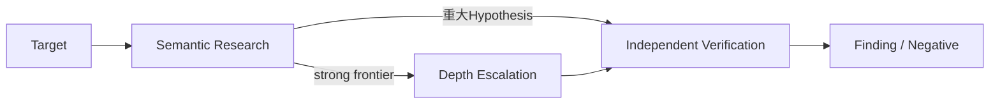

# WordPress Harness

WordPressプラグインを対象に、LLMの自由なsource reasoningと独立Verificationを反復するresearch harnessです。第一目的は、既知脆弱性のoracleなしに**high-impactなbroken security semanticsを取りこぼさず発見すること**です。

> **Do not optimize for sinks. Optimize for broken security semantics.**
>
> **Harness owns the research process; agents own research decisions.**

通常運転はraw-source-firstの有限`Semantic Research Wave`です。単独で重大なSQLi、Stored XSS、PrivEsc等はIndependent Verificationへ進め、強いread/write/file/auth/state primitive、persistent state、cross-request flow、decode/reparse等の`strong semantic frontier`が残るTargetだけをDepth Admissionからwp2shell / Argus-likeなSynthesis・Critic・missing-link Waveへ昇格します。RCEやsite-wide compromiseは最上位impactですが、長いchainだけを成功とは定義しません。



現段階ではtoken costやwall timeよりhigh-impact recallとroot-cause qualityを優先します。budgetはhard ceilingとして持ち、cost最適化はrecall baseline確立後にablationで行います。

## Quickstart

```bash
pnpm install
cd tools/php-program-index
composer install --no-dev --prefer-dist --no-interaction --no-scripts --no-plugins
cd ../..
pnpm check
pnpm build
mkdir -p .private
node dist/cli.js campaign prepare --database .private/research.sqlite --input campaign.json
node dist/cli.js campaign inspect --database .private/research.sqlite --campaign <campaign-id>
```

`vendor/`は生成物でありGitへ含めません。source analysisのためにtargetのautoload、Composer script、WordPress bootstrapをhost上で実行しません。private Target source、prompt、provider output、payload、未公開FindingはGit外へ置きます。

## Docs

- [Documentation index](docs/README.md) — 目的別の最短reading path
- [Research Design Principles](docs/design/research-design-principles.md) — high-impact semantic recallとHarness/Agent境界
- [Architecture Overview](docs/design/architecture/architecture-overview.md) — system context、research loop、trust zones
- [Codebase Guide](docs/CODEBASE-GUIDE.md) — 現在の実装状態、Interface、Test、sourceの対応
- [Development Rules](AGENTS.md) — repositoryで作業するagent / contributor向け規則

公開CVEでの実測は[Experiments](docs/experiments/README.md)、判断理由は[ADR index](docs/adr/README.md)、外部資料の調査証拠は[Research Notes](docs/research/README.md)を入口にします。

## Scope

現在のResearch対象はWordPress pluginsです。Target Intelligenceによる自動選定、Human OS、submission、vendor communication、patch generation、dashboardはResearch capabilityの外側または後段に置きます。能力の拡張順は[Roadmap](docs/design/roadmap.md)を参照してください。
