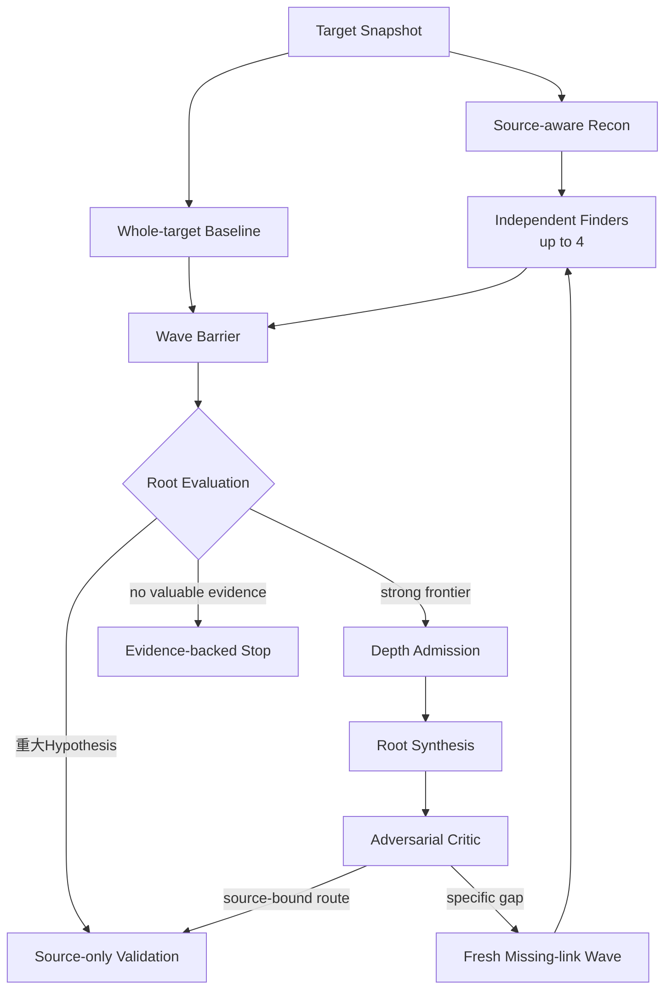

# Harness Architecture

Status: accepted whole-system view, 2026-09-05

この文書だけで、WordPress Targetの選定からHuman Verification済みFindingまでのsystem、Research内部のModule、主要なartifact、完了条件を追えるようにする。現在の実装状態は[Codebase Guide](CODEBASE-GUIDE.md)、各Moduleの詳細なInterfaceとfailure semanticsは[Design index](design/README.md)を正本とする。

[Editable draw.io source](architecture.drawio) · [SVG view](architecture.svg)

## 1. Three contexts

systemは`Target Intelligence -> Research -> Human OS`の三つのownership contextで構成する。context間ではversioned handoffだけを渡し、別contextのstorageや内部Moduleを直接参照しない。

| Context | Owns | Handoff | Does not own |
| --- | --- | --- | --- |
| Target Intelligence | eligibility、ranking、acquisition、canonical identity | Target Intake Packet | Researchの技術判断、Finding |
| Research | semantic discovery、conditional Depth、source-only Validation、Research Record | Human Review Packet | runtime reproduction、Finding、外部行動 |
| Human OS | verification queue、fresh Human Verification、Finding、Evidence Request、外部承認 | External Action Authorization | Research session、Research Ledgerの変更 |

Model ProviderとAgent ProcessはResearchのdecision workerであってsystem of recordではない。Human Operatorはpolicy、Finding、外部行動を決めるが、Campaignの記録や再開処理を手作業で代替しない。

## 2. Research Modules

Researchは六つのModuleで構成する。`Source Understanding -> Exploration -> Validation`がsource evidenceを強くし、Campaign Control、Model Execution、Research Recordがそのprocessを安全かつ再開可能にする。

| Module | Owns | Input -> Output | Does not own |
| --- | --- | --- | --- |
| [Campaign Control](design/campaign-execution-seam.md) | lifecycle、budget、wave、replay | Campaign Plan -> Work Lease、terminal decision | candidateの真偽、provider処理 |
| [Source Understanding](design/source-mapping-seam.md) | source inventory、Map、gap、source query | Target Snapshot -> source evidence、optional Map | Finding、探索範囲 |
| [Exploration](design/exploration-seam.md) | research thesis、Hypothesis、Fragment、Approach Family、Depth Admission | raw source -> candidate、frontier、closure | Finding、runtime実験、event storage |
| [Validation](design/validation-seam.md) | independent source review、Synthesis、Risk Assessment、Review Packet | evaluated candidate -> disposition、packet、proof gap | Finding、runtime reproduction、human scheduling |
| [Model Execution](design/model-execution-seam.md) | provider isolation、tool binding、process lifecycle | Attempt Plan -> normalized terminal result | research verdict |
| Research Record | append-only facts、artifact refs、checkpoint、replay projection | versioned event -> durable read model | semantic identity、priority、reopen判断 |

**Harness owns the research process; agents own research decisions; humans own Findings and external actions.**

## 3. Research loop

HarnessはTarget、tool permission、budget ceiling、並列数、隔離、source provenance、typed artifact、persistence、barrier、fresh Validation、停止を所有する。Finderはどのfileを見るか、何が怪しいか、どのsecurity semanticsを疑うか、どこへpivotするかを決める。

最初のWaveではsource-aware Reconとwhole-target Baselineを並行する。最大4つの独立research thesisを保ち、同じmodelの支持数、到着順、多数決でcandidateを捨てない。Finderはsource-boundなHypothesis、Route Fragment、Frontier Gapが成立した時点でdurable checkpointを作るが、ValidationはWave BarrierとRoot Evaluationの後に開始する。

Surface Map、PHP Program Index、AST、Semgrep、CodeQLはnavigation、evidence、coverageの補助である。non-matchを`safe`、candidate reject、priority downgrade、Campaign closureへ使わない。

## 4. Semantic Research, Depth, and Breadth

| Mode | When | Main work | Success |
| --- | --- | --- | --- |
| Semantic Research | 通常運転、一Targetの有限Wave | raw-source free reasoning | standaloneな重大Hypothesisまたはstrong frontier |
| Conditional Depth | high-impactへ伸びる具体的frontierがある時 | Fragment統合、Critic、fresh missing-link work | source-bound high-impact routeまたは根拠付きstop |
| Breadth | recall baseline確立後 | validated seedとstatic toolを使う多数Target運行 | recallを落とさずtargets/hourとcostを改善 |

Depth Admissionは最終RCE、ATO、PrivEscが既に見えていることを要求しない。強いread/write/file/auth/state capability、secretやreset material、persistent state、cross-request/cross-actor flow、decode/reparse、producer/consumer mismatch、security assumption mismatch、具体的missing linkを追加投資の根拠にできる。

単発で十分重大なSQLi、Stored XSS、PrivEsc等を、長いchainでないという理由で未完成扱いしない。単独severityが低いFragmentも、高impactへ伸びる具体的可能性があれば保持する。運用原則と優先順位は[Research Design](RESEARCH-DESIGN.md)を正本とする。

## 5. End-to-end lifecycle

1. **Select** — programme条件に合うTargetを選び、既知脆弱性などのoracleをResearch inputから除外する。
2. **Canonicalize** — identity、version、取得元、全file digestを固定し、Target Intelligence Recordを保存する。
3. **Handoff** — versioned Target Intake Packetとimmutable Target SnapshotをCampaignへ渡す。
4. **Discover** — finite workを管理しながら、broken security semanticsとhigh-impact frontierをraw sourceから探す。
5. **Deepen conditionally** — strong frontierだけをSynthesis、Critic、fresh Missing-link workへ進める。
6. **Validate independently** — Discovery contextを引き継がない複数Attemptとtool-free Synthesisで明らかなfalse positiveを抑える。
7. **Record and stop** — evidence、counterevidence、gap、decision、budget event、再開条件をResearch Recordへ残す。
8. **Prepare review** — `ready-for-human` candidateへriskとruntime uncertaintyを付け、Human Review Packetを作る。
9. **Verify freshly** — 人間がfreshな使い捨て隔離環境と実Target interfaceでFindingへの昇格を判断する。
10. **Act separately** — 外部報告や公開を行う場合は、Findingとは別に対象と内容を承認する。

## 6. Stable Interfaces and artifacts

| Interface / artifact | Producer -> Consumer | Meaning |
| --- | --- | --- |
| Target Intelligence Record | Target Intelligence内部 | 選定、取得、canonical identityのprovenance |
| Target Intake Packet | Target Intelligence -> Research | oracle-freeなTarget identity、source manifest、開始条件 |
| Immutable Target Snapshot | Target Intelligence -> Research tools | untrustedで実行しないmanifest-bound source |
| Research Record / CAS | Research Modules間 | append-only event、artifact、checkpoint、replay source |
| Human Review Packet | Research -> Human OS | source route、確認したcontrol、risk、runtime uncertainty |
| Evidence Request | Human OS -> 新しいResearch work | 不足証拠を既存Campaignの暗黙再開ではなく新しいfinite workにする |
| Human OS Record | Human OS内部 | queue、verification、Finding、authorizationの監査記録 |

## 7. Validation and Human Verification

Research Validationの目的はFindingを証明することではない。fresh Attemptがroute、premise、control、effect、counterevidenceをsourceから確認し、明らかなfalse positiveをHumanへ渡さない。sourceだけでは決められないruntime uncertaintyはHuman Review Packetへ明示する。

Findingを生成できるのはHuman OSだけである。人間はPacketと一致するTarget/version、freshな隔離環境、claimed attacker premise、実Target interface、観測したSecurity Effectから`verified-finding / rejected / more-evidence-required / blocked`を判断する。proof methodはcaseごとに人間が選ぶ。

## 8. Terminal states

| Boundary | Terminalの意味 | Terminalではないもの |
| --- | --- | --- |
| Research work | finite workがdecision、failure、または明示的な次workへproject済み | process exit、timeout、budget exhaustionだけ |
| Research Campaign | explorationとvalidationが閉じ、record、packet、未解決事項、再開条件がdurable | Human queueの消化待ち |
| Human Verification | 人間がverified、rejected、needs-evidence、blockedを記録 | model verdict、static rule、`ready-for-human` |
| Product goal | Human Verificationを経たFindingまで閉じた | Review Packetの生成だけ、外部報告の送信 |

`validation-pending`やbudget exhaustionをfalse positive、`disproven`、`rejected`へ読み替えない。External Action AuthorizationはProduct goalの後段にある別のhuman-gated decisionである。

## 9. Trust and execution rules

- Target sourceはuntrusted dataとして扱い、host上でTarget PHP、autoload、build、test、WordPress bootstrapを実行しない。
- FinderとValidatorはimmutable snapshotに対するHarness管理のread-only source toolだけを使う。
- Agent Sandboxはfresh contextとisolated scratchを持ち、ambient shell、network、credential、container socket、MCPを受け取らない。
- Research Validationはsource-onlyであり、runtime attackを行わない。
- Human Verificationだけがfreshな使い捨て隔離環境で実Target interfaceを使う。
- credential、private Target、transcript、PoC、未公開FindingをGitやReview Packetへ含めない。

## 10. Capability order

runtime flowと実装順は一致しない。capabilityは次の順に閉じる。日付、進捗率、実装file、次のticketはここへ置かず、Codebase GuideとGitHub Issuesを正本とする。

| Order | Capability | Completion condition | Deliberately later |
| --- | --- | --- | --- |
| 1 | Closed mechanics | finite work、typed failure、artifact integrity、crash recovery、replayが一Targetで閉じる | 未知発見能力の評価 |
| 2 | Prospective semantic research | oracle-freeな最新Targetから重大Hypothesisまたはstrong frontierを得る | 完全なMap、多数Target |
| 3 | Conditional depth | Fragment、Synthesis、Critic、missing-link workがrouteまたは根拠付きstopへ収束する | 全Targetへの常時Depth |
| 4 | Validation and Human Verification | fresh source reviewからPacketを作り、人間だけがFindingへ昇格する | submission、vendor連絡 |
| 5 | Target Intelligence | 手動経路を残してeligibility、ranking、acquisitionを自動化する | Research判断との混合 |
| 6 | Breadth and cost optimization | recallを落とさないablationで多数Targetへscaleする | costを理由にしたrecall低下 |

現在のTargetはWordPress pluginである。Themes、WordPress Core、自動submission、vendor communication、patch generation、dashboardは最初のproduct goalではない。

## 11. Where to go next

- 現在動く範囲、source path、Behavior Test: [Codebase Guide](CODEBASE-GUIDE.md)
- research policyと外部referenceの採用方法: [Research Design](RESEARCH-DESIGN.md)
- ModuleのInterface、不変条件、failure semantics: [Design index](design/README.md)
- contextとhandoff vocabulary: [Context Map](../CONTEXT-MAP.md)
- 次の有限workと受入条件: [GitHub Issues](https://github.com/momoponwork1415-lgtm/wordpress-harness/issues)
