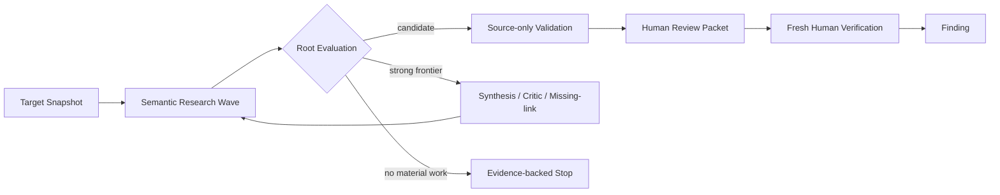

# Harness Architecture

Status: accepted whole-system view, 2026-09-05

WordPress Targetの選定からHuman Verification済みFindingまでの全体像を示す。実装状況とModule契約は[Codebase Guide](CODEBASE-GUIDE.md)を正本とする。

[Editable draw.io source](architecture.drawio) · [SVG view](architecture.svg)

## Contexts

`Target Intelligence -> Research -> Human OS`の三Contextで構成する。Context間はversioned handoffだけを渡す。

| Context | Owns | Output |
| --- | --- | --- |
| Target Intelligence | eligibility、ranking、acquisition、canonical identity | Target Intake Packet |
| Research | discovery、conditional Depth、source-only Validation、Research Record | Human Review Packet |
| Human OS | verification queue、Human Verification、Finding、外部承認 | Human OS Record |

ResearchはFindingを作らない。Human OSはResearch Ledgerを変更しない。Model Providerはdecision workerでありsystem of recordではない。

## Research Modules

| Module | Owns | Interface |
| --- | --- | --- |
| [Campaign Control](CODEBASE-GUIDE.md#campaign-control) | lifecycle、budget、wave、replay | Campaign Plan -> terminal decision |
| [Source Understanding](CODEBASE-GUIDE.md#source-understanding) | source inventory、query、optional Map | Target Snapshot -> source evidence |
| [Exploration](CODEBASE-GUIDE.md#exploration) | thesis、Hypothesis、frontier、Depth、closure | source evidence -> research decision |
| [Validation](CODEBASE-GUIDE.md#validation) | fresh source review、Synthesis、risk、packet | candidate -> disposition / packet |
| [Model Execution](CODEBASE-GUIDE.md#model-execution) | provider isolation、tool binding、process lifecycle | Attempt Plan -> normalized result |
| Research Record | immutable artifact、append-only event、replay projection | event -> durable read model |

**Harness owns the research process; agents own research decisions; humans own Findings and external actions.**

## Primary flow

- 通常運転はraw-source-first。Reconとwhole-target Baselineを並行し、最大4個の独立thesisを保つ。
- Candidateを支持数、多数決、到着順で捨てない。
- strong semantic frontierだけをconditional Depthへ送る。
- Validationはfreshな複数Attemptとtool-free Synthesisで明らかなfalse positiveを抑える。
- Findingへの昇格はHuman Verificationだけが行う。

| Mode | Start condition | Goal |
| --- | --- | --- |
| Semantic Research Wave | 全Campaignの通常運転 | candidate、frontier、または根拠付きstop |
| Conditional Depth | high-impactへ伸びる具体的frontier | source-bound routeまたは根拠付きstop |
| Breadth | recall baseline確立後 | recallを維持したcost / throughput改善 |

Surface Map、AST、PHP Program Index、Semgrep、CodeQLは補助toolであり探索境界ではない。

## Stable handoffs

| Artifact | Producer -> Consumer | Meaning |
| --- | --- | --- |
| Target Intake Packet | Target Intelligence -> Research | oracle-free identityとsource manifest |
| Immutable Target Snapshot | Target Intelligence -> Research tools | 実行しないmanifest-bound source |
| Research Record / CAS | Research Modules間 | event、artifact、checkpoint、replay source |
| Human Review Packet | Research -> Human OS | source route、control、risk、runtime uncertainty |
| Evidence Request | Human OS -> finite Research work | 不足証拠を新しいworkとして要求 |

## Completion boundaries

| Boundary | Complete when |
| --- | --- |
| Research work | decision、typed failure、または次workがdurable |
| Research Campaign | ExplorationとValidationが閉じ、packet、未解決事項、再開条件がdurable |
| Human Verification | 人間がverified / rejected / needs-evidence / blockedを記録 |
| Product goal | Human Verification済みFindingまで閉じる |

`validation-pending`やbudget exhaustionをnegativeへ読み替えない。外部報告・公開はFindingとは別の承認を要する。

## Trust rules

- Target sourceをhost上で実行しない。
- FinderとValidatorにはmanifest-boundなread-only source toolだけを渡す。
- Agentへambient shell、network、credential、container socket、MCPを渡さない。
- runtime確認はHuman Verificationのfreshな使い捨て隔離環境だけで行う。
- credential、private Target、transcript、PoC、未公開FindingをGitやReview Packetへ含めない。

## Capability order

1. finite work、artifact integrity、crash recovery、replayを閉じる。
2. oracle-freeなprospective semantic researchを成立させる。
3. conditional Depthをrouteまたは根拠付きstopへ収束させる。
4. Validation、Review Packet、Human Verificationを閉じる。
5. Target Intelligenceを自動化する。
6. recall-preserving ablationでbreadthとcostを改善する。

現在動く範囲は[Codebase Guide](CODEBASE-GUIDE.md)、research policyは[Research Design](RESEARCH-DESIGN.md)、次の有限workは[GitHub Issues](https://github.com/momoponwork1415-lgtm/wordpress-harness/issues)を参照する。
