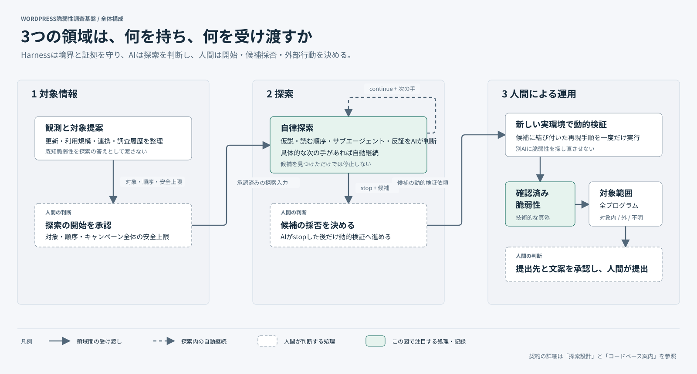

# Harness Architecture

**Target Intelligenceが対象を準備し、ResearchがCandidateを作り、Human OSが動的検証・programme scope・提出前の判断を扱う。**

## この図の読み方

- 大きな箱はcontext、実線の矢印は主要handoff、破線は戻りのhandoff。
- contextごとに所有する記録がある。別contextのstorageを直接読む・更新する関係は作らない。
- 人間の判断点は各context内に示す。詳細な時間順は[System Walkthrough](SYSTEM-WALKTHROUGH.md)へ進む。

責務・handoff・用語の正本は[Context Map](../CONTEXT-MAP.md)。現在のModule、Interface、source、failure semantics、Behavior Testは[Codebase Guide](CODEBASE-GUIDE.md)に集約する。

## 設計を読む入口

| 判断したいこと | 正本 |
| --- | --- |
| AI・Harness・人間の権限をどこに置くか | [Research Design: Decision ownership](RESEARCH-DESIGN.md#decision-ownership) |
| Research Campaignsの外部Interfaceに何を隠すか | [Codebase Guide: Research Campaigns](CODEBASE-GUIDE.md#research-campaigns) |
| native機能とHarnessの分担 | [Research Design: Agent-led Research](RESEARCH-DESIGN.md#agent-led-research) |
| Candidate VerificationとVerified Vulnerabilityの条件 | [Research Design: Candidate Verification](RESEARCH-DESIGN.md#candidate-verification) |
| trust・isolation・failureの共通原則 | [Research Design: Trust and versioning](RESEARCH-DESIGN.md#trust-and-versioning) |

設計理由が必要なときだけ、対応する設計節からADRへ進む。
