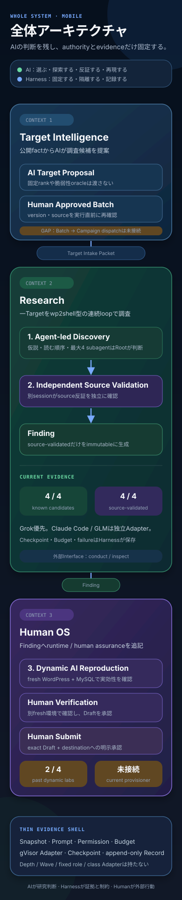
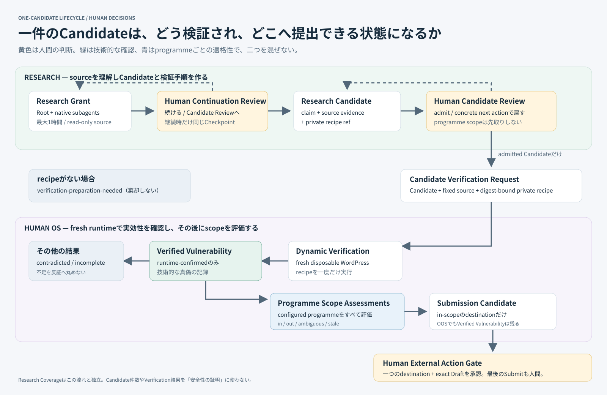

# Harness Architecture

Status: accepted whole-system view, 2026-09-08

WordPress Targetの選定からagent-led Research、Independent Validation、fresh verification、人間の外部提出判断までのownershipを示す。実装状態は[Codebase Guide](CODEBASE-GUIDE.md)を正本とする。



## Architecture rule

**Diagnostic core owns evidence and limits; agents own Discovery decisions; Independent Validation owns Findings; humans own external actions.**

診断coreの必須flowは`Target Snapshot + Dependency Snapshots -> Discovery -> Source Validation -> Finding`である。Source Validationは明白なsource矛盾を落とす独立sanity gateに留め、実質的なtrue-positive assuranceは`Finding -> fresh Dynamic AI Reproduction`で得る。Target Intelligenceは前段、Human OSはruntime / human assuranceと外部提出判断を所有する。隔離は各Runtime Adapterの内部安全条件であり、診断結果やpromotionの目的にしない。

短い診断coreだけを見る場合は[スマホ向け診断core図](visuals/diagnosis-architecture.svg)を参照する。

Harnessが固定するのはTarget identity、source provenance、Prompt、Permission、Budget、freshness、record、failure semanticsと人間のauthorizationである。AIがTargetの優先順位、探索方法、native subagent、読む順序、継続、停止、candidateと検証方法を決める。

## Contexts

Context間は図に示したversioned handoffだけを渡す。Target IntelligenceはFindingやknown routeをResearchへ渡さない。Researchはselection policyを再評価しない。Human OSはResearch storageを直接更新しない。用語と関係の正本は[Context Map](../CONTEXT-MAP.md)に置く。

## Deep modules

### Target Proposals

`TargetProposals.propose / inspect`は、oracle-freeなCandidate PoolからAI提案を作り、入力、usage、failure、理由と不確実性をdurableにする。Harnessのhard gateはCandidate Pool membership、source acquisition、identity、provenance、freshnessである。全候補rank、固定Bandまたは固定reason codeを要求しない。

### Research Campaigns

```ts
interface ResearchCampaigns {
  conduct(input: CampaignInput): Promise<CampaignOutcomeRef>;
  inspect(query: CampaignQuery): Promise<ResearchCampaignView>;
}
```

`conduct`はsealed input、agent-led research、AIのcontinue / stop、fresh Validation、Finding、Coverage、append-only recordとresumeを隠す。callerはPlanner、Finder、Wave、Depth、role、rubricまたはValidation Queueを知らない。

### Native Agent Runtime

```ts
interface NativeAgentRuntime {
  execute(run: SealedAgentRun): Promise<NativeAgentReceipt>;
}
```

Grok BuildとClaude Codeのprovider固有CLIはAdapter内へ局所化する。GLM 5.3はZ.AI endpointへ固定したClaude Code process Adapterを使い、Claude Code自身のagent、subagent、source tool運用を再実装しない。各runはimmutable imageをrunscで起動し、read-only Target、read-only Dependency Snapshots、isolated scratch / provider homeだけをmountする。Dependencyはframework behaviorのauthoritative referenceでありaudit Targetにしない。Research continuationはprovider-native conversationとscratchをprivate Agent Checkpointから再開し、append-only recordにはopaque refだけを置く。ValidationはCheckpointを共有しない。runtime profileで指定したproviderからsilent fallbackしない。

### Independent Validation

Researchと別のfresh native runがcandidateを同じread-only sourceから再導出し、`source-validated / needs-research / disproven / validation-pending`を返す。固定rubricやclass Adapterをpublic seamへ出さない。最適payloadやruntime reproductionを要求せず、必要条件がsourceで直接反証された時だけ`disproven`にする。`source-validated`だけがFindingを生成する。

複数Targetは独立したCampaign processを同時起動する。Target間を調整するproduction schedulerは持たず、一CampaignのDiscoveryとValidationはそのCampaignだけで完結する。

### Human OS

`HumanOs`はFindingを受け取り、freshなWordPress / MySQL環境でのDynamic AI Reproduction、別fresh environmentでのhuman verification、Submission Draft、exact Draft digestとdestinationへbindしたauthorizationをappend-onlyに記録する。Dynamic AI Reproductionは`runtime-confirmed / disproved / incomplete`を返し、失敗や反証でも元Findingを削除しない。実際の外部送信は所有しない。

## Research flow



一Targetの文章によるwalkthroughは[System Walkthrough](SYSTEM-WALKTHROUGH.md)に分離する。

Unauthenticated SQLi、Stored XSS、ATO、PrivEsc、arbitrary file operation、object injection、authorizationやbusiness-logic failureは、RCEへ昇格しなくてもFindingになり得る。

## Invariants

- Target sourceをhost上で実行しない。
- TargetとDependency mountはread-only、scratchだけをwriteableにする。
- Rootとnative subagentへ同じPermission Profileを適用する。
- ambient shell、network、credential、container socket、host path、plugin、hook、memory、未承認MCPを渡さない。
- runsc capabilityを確認できないruntimeへfallbackしない。
- Independent ValidationはResearchのconversation、scratch、verdictを共有しない。
- Findingの有無とCoverage completionを分離する。
- provider、budget、tool、source、permission、schema、storage failureをno-findingまたは`disproven`へ丸めない。
- Dynamic AI Reproductionは実WordPress / MySQLをfresh gVisor environment内だけで動かし、失敗をsource Findingの削除へ読み替えない。
- exact payload、HTTP request、screenshot、runtime logはPrivate Evidenceへ置く。
- external actionはhuman-confirmed verificationとexact authorizationを要求する。

旧v7はtag `research-v7-before-native-agent-loop`と旧storageで再現する。現行binaryへlegacy reader、feature flagまたは旧writerを残さない。判断根拠は[ADR 0125](adr/0125-put-agent-decisions-behind-thin-evidence-shells.md)、[ADR 0127](adr/0127-make-validated-findings-the-product-success-criterion.md)、[ADR 0129](adr/0129-keep-validation-out-of-active-discovery.md)を参照する。
