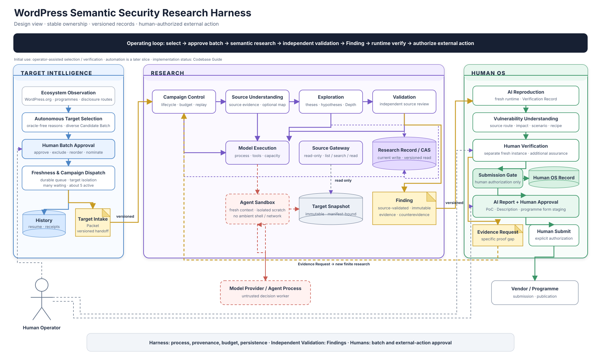

# Harness Architecture

Status: accepted whole-system view, 2026-09-06

WordPress Targetの自律選定から無人Research、人間のfresh再実行、report承認、Submit直前のstagingまでの全体像を示す。実装状況とModule契約は[Codebase Guide](CODEBASE-GUIDE.md)を正本とする。

[Editable draw.io source](architecture.drawio) · [SVG view](architecture.svg) · [Detailed system walkthrough](SYSTEM-WALKTHROUGH.md)

図は採用した設計を示す。実装済みという意味ではなく、現在の接続状況はCodebase Guideで確認する。

## Product and maintenance direction

6〜12か月の継続利用に向け、3 Contextのmodular monolithと既存の主要ownerを維持し、段階的に構造を整理する。現行Interfaceが旧依存や保存世代の知識をcallerへ要求する箇所を見直す。Module数や行数だけで良し悪しを判断せず、変更と検証のLocality、互換性、失敗時の説明可能性を基準にする。

- 初期利用のTarget選定とVerificationは、operatorがClaude Code / Codexとの対話で進める形を許容する。会話の結論は、versionedな承認・証拠・記録を代替しない。
- 自律ranking、無人Batch dispatch、複数Campaignのcapacity、form automationの完成を初期利用の必須条件にしない。既存のsource identity、隔離、human authorizationは維持する。
- 正本recordと表示を分け、表示を再生成できるようにする。current writeとlegacy readの意味を分け、旧writerの削除は移行証拠を条件とする。
- 個別の構造変更はowner、Interface、owned state、failure semantics、Behavior Testを明確にしてから行う。既存Moduleの上へ新しい汎用workflow層を重ねない。

比較の根拠は[reference harness comparison](knowledge/reference-harness-observability.md)。有限workは[Issue #119](https://github.com/momoponwork1415-lgtm/wordpress-harness/issues/119)、旧writer退役は[Issue #129](https://github.com/momoponwork1415-lgtm/wordpress-harness/issues/129)を正本とする。ADR 0084とADR 0124を維持し、参照Harnessのstage構成への全面置換は採用しない。

## Contexts

`Target Intelligence -> Research -> Human OS`の三Contextで構成する。Context間はversioned handoffだけを渡す。

| Context | Owns | Output |
| --- | --- | --- |
| Target Intelligence | observation、自律選定、Human Batch Approval、acquisition、dispatch、Research History | Target Intake Packet |
| Research | 一TargetのCampaign、conditional Depth、source Validation、Finding、Coverage、model capacity | Finding / Campaign Coverage Receipt |
| Human OS | AI / human runtime verification、理解支援、report、submission staging | Verification Record / Approved Submission Draft |

FinderはFindingを作らず、freshなIndependent Validationだけがsource-validated Findingを生成する。Human OSはResearch LedgerまたはFindingを変更せず、append-only Verification Recordを作る。Model Providerはdecision workerでありsystem of recordではない。

## Research Modules

| Module | Owns | Interface |
| --- | --- | --- |
| [Campaign Control](CODEBASE-GUIDE.md#campaign-control) | lifecycle、budget、wave、replay | Campaign Plan -> terminal decision |
| [Source Understanding](CODEBASE-GUIDE.md#source-understanding) | source inventory、query、optional Map | Target Snapshot -> source evidence |
| [Exploration](CODEBASE-GUIDE.md#exploration) | thesis、Hypothesis、frontier、Depth、closure | source evidence -> research decision |
| [Validation](CODEBASE-GUIDE.md#validation) | fresh source review、dedup、Finding projection | candidate -> disposition / Finding |
| [Model Execution](CODEBASE-GUIDE.md#model-execution) | provider isolation、tool binding、process lifecycle、Campaign横断capacity | Attempt Plan -> normalized result |
| Research Record | immutable artifact、append-only event、replay projection | event -> durable read model |

**Harness owns the process; agents own research decisions; Independent Validation owns Findings; humans own external actions.**

## Operating flow

1. Target Intelligenceがecosystemとprogrammeを観測し、oracle-freeなCandidate Batchを自律選定する。
2. 人間が理由、欠損、freshness、Research Historyを確認し、Approved Target Batchを一括承認する。
3. durable queueが実行直前のversionとsourceを確認し、異なるTargetを複数Campaignへdispatchする。
4. ResearchがSemantic Wave、conditional Depth、Independent Validationを行い、source-validated FindingとCoverageをdurableにする。
5. Human OSがFindingをfresh gVisor environmentでAI Reproductionし、runtime Verification Recordを作る。人間の別fresh environmentでの再実行はhuman Verification Recordを追加するがFinding生成条件ではない。
6. FindingからAIがtemplate reportを作り、人間が必要なVerification、PoC、Descriptionを確認する。Programme AdapterはExternal Action Authorizationと完全一致するrevisionだけをSubmit直前まで入力し、最後のSubmitは人間だけが行う。

- 通常運転はraw-source-first。Reconとwhole-target Baselineを並行し、最大4個の独立thesisを保つ。
- current Campaignは未認証またはsubscriber-equivalentの最低開始権限だけを探索後段へ進め、Contributor以上と`unresolved`をValidation、Finding、Runtime Verificationへ昇格させない。
- Candidateを支持数、多数決、到着順で捨てない。
- strong semantic frontierだけをconditional Depthへ送る。
- Finder自身のcandidateを同じsessionでFindingへ昇格させない。freshなIndependent ValidationだけがFindingを生成する。
- AI ReproductionはFindingのruntime confirmationを追加する。setup failure、provider failure、曖昧な観測をFinding削除またはnegativeへ丸めない。
- Human VerificationはFindingのassuranceを追加するがFinding生成条件ではない。必須の人間gateは外部行動に置く。
- source-to-sinkは人間への説明に使うが、Target選定や探索をsink中心へ変えない。
- confirmed impactとplausible abuse scenarioを分け、AIの推測をFindingの事実へ昇格しない。

| Mode | Start condition | Goal |
| --- | --- | --- |
| Semantic Research Wave | 全Campaignの通常運転 | candidate、frontier、または根拠付きstop |
| Conditional Depth | high-impactへ伸びる具体的frontier | source-bound routeまたは根拠付きstop |
| Breadth | recall baseline確立後 | recallを維持したcost / throughput改善 |

Surface Map、AST、PHP Program Index、Semgrep、CodeQLは補助toolであり探索境界ではない。

## Stable handoffs

| Artifact | Producer -> Consumer | Meaning |
| --- | --- | --- |
| Selection Receipt | Target Selection -> Human Batch Approval | oracle-freeな候補、理由、不確実性 |
| Approved Target Batch | Human -> Target Campaign Dispatch | Target順、policy、単一model family profile、budget、execution window |
| Target Intake Packet | Target Intelligence -> Research | oracle-free identityとsource manifest |
| Immutable Target Snapshot | Target Intelligence -> Research tools | 実行しないmanifest-bound source |
| Campaign Coverage Receipt | Research -> Target Intelligence | candidate detailsを除いたlifecycle、resume、terminal state |
| Research Record / CAS | Research Modules間 | event、artifact、checkpoint、replay source |
| Finding | Research -> Human OS | source-validatedなcausal claim、premise、broken property、evidence、counterevidence |
| Verification Record | Human OS内 | fresh environment、Recipe、AI / human observation、Private Evidence Bundle参照 |
| Vulnerability Understanding Response | Human OS内 | fact、inference、scenarioを分けた人間向け説明 |
| Approved Submission Draft | Human -> Form Stager | 人間確認済みPoC、Description、report revision |
| Evidence Request | Human OS -> finite Research work | 不足証拠を新しいworkとして要求 |

## Completion boundaries

| Boundary | Complete when |
| --- | --- |
| Target selection | Selection Receiptと理由がdurable |
| Batch approval | 人間判断、policy、budget、execution windowがdurable |
| Batch dispatch | 全Targetがterminal、paused、staleまたは理由付きfailure |
| Research work | decision、typed failure、または次workがdurable |
| Research Campaign | ExplorationとIndependent Validationが閉じ、Finding、Coverage、未解決事項、再開条件がdurable |
| AI Reproduction | `runtime-confirmed / disproved / inconclusive / setup-blocked`のVerification Recordがdurable。claimだけでは完了ではない |
| Human Verification | 人間が別fresh instanceでRecipeを実行し、FindingへVerification Recordを追加 |
| Report preparation | immutableなSubmission Draftと根拠がdurable |
| Research product goal | Independent Validation済みFindingとhonest Coverageまで閉じる |
| Operating loop | Approved Submission Draftとhuman-ready stagingまで閉じ、提出は人間が行う |

`validation-pending`やbudget exhaustionをnegativeへ読み替えない。外部報告・公開はFindingとは別の承認を要する。

## Scheduling and model policy

- Opusをrecall比較のreference baselineとする。Opus、GLM、Grokは同じTargetでも別Campaignとして実行し、一つのCampaign内では全roleを一つのmodel familyへ固定する。Finder間はmodelが同じでもsession、conversation、scratch、thesisを共有しない。
- Target Campaignのactive目安は5件とする。待機Target数、active Campaign数、active Model Attempt数を別policyで制御する。
- Validation、Synthesis、terminal処理を新規Finderより優先し、探索だけでcapacityを使い切らない。
- rate limit、provider unavailable、capacity timeoutをno-findingへ丸めず、別modelまたは別transportへsilent fallbackしない。
- GLMとGrokはOpus baselineに対する比較Campaignとして使い、recall、unique candidate、runtime成立率、costをmodel family別に記録する。model間の多数決でcandidateを棄却しない。

## Trust rules

- Target sourceをhost上で実行しない。
- FinderとValidatorにはmanifest-boundなread-only source toolだけを渡す。
- Agentへambient shell、network、credential、container socket、MCPを渡さない。
- AIと人間のruntime確認は互いに異なるfreshな使い捨て隔離環境だけで行う。
- exact payload、HTTP request、screenshot、runtime logはHuman OSのPrivate Evidence Bundleへ置き、Gitへ入れない。
- credential、private Target、transcript、PoC、未公開FindingをGitやResearch artifactへ含めない。
- AIはTarget選定、Finding生成、runtime verification、理解支援、report作成を行えるが、人間のBatch承認、External Action Authorization、Submitを代行しない。

現在動く範囲は[Codebase Guide](CODEBASE-GUIDE.md)、research policyは[Research Design](RESEARCH-DESIGN.md)、次の有限workは[GitHub Issues](https://github.com/momoponwork1415-lgtm/wordpress-harness/issues)を参照する。
