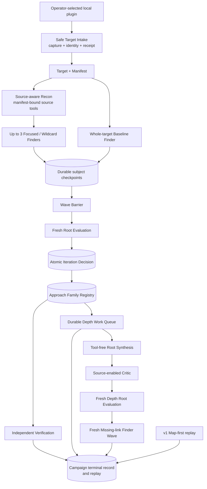
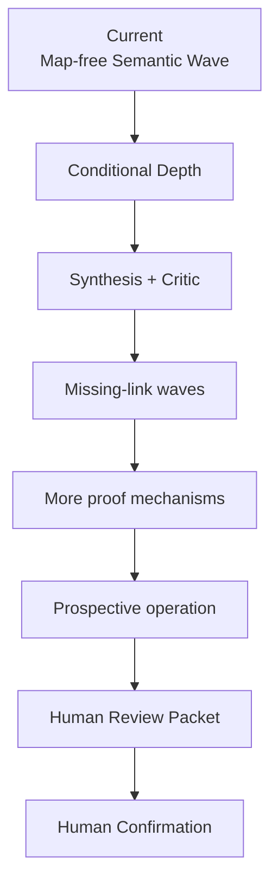

# Codebase Guide

Status: living implementation map, 2026-09-05

現在の実装、owner、Interface、Testへ戻るための唯一のliving documentである。安定した設計はSeam、実Targetの実測はexperimentsへ分ける。

## Five things to remember

1. Productの到達点は、oracle-freeにhigh-impactなbroken security semanticsを高recallで発見し、独立VerificationとHuman Confirmationまで閉じること。Researchは発見から独立Verificationまでを所有する。
2. 通常運転の到達形はraw-source-firstのSemantic Research Waveで、strong semantic frontierだけをconditional Depthへ昇格する。
3. `confine -> constrain -> focus -> motivate -> parallelize -> hypothesize -> verify -> record -> prioritize -> iterate`をcontrol propertyとして実装する。
4. ResearchはCampaign Control、Source Understanding、Exploration、Verification、Model Execution、Research Recordの6 Moduleで構成する。
5. context外のpublic入口は`openResearch`である。

schema field、SQLite table、provider argv、全ADR、内部helperは暗記しない。

## Current completion map

## Current vertical slice

これはDefault Map-free Semantic Waveのproduction vertical sliceである。Root EvaluationのIteration DecisionはCASと単一Ledger eventへ固定し、modelが選んだ`admit-depth` action groupingからCampaign-localなactive Approach Familyを開く。Research Recordはeventから同じRegistry digestを再構築し、この境界より前にRoot Synthesisを開始させない。Depth AdmissionとDepth Work Queue、Queue全batchのtool-freeなRoot Synthesis、各immutable artifactをfresh source readで攻撃するAdversarial Critic、全Proposalを処遇するfresh Depth Root Evaluation、具体的Critic Gapへbindしたfresh Missing-link Finder WaveをCampaignへdurableに接続済みである。Depth DecisionをCASとLedgerへ先に固定してからMissing-link Waveを開始し、そのHypothesis、Route Fragment、Frontier Gapを元のApproach Familyへattachしたfollow-up Queueでfresh Synthesis / Critic / Evaluationを反復する。Missing-link WaveもTarget全体へpivotでき、checkpoint Hypothesisを既存Verification Queueへ先行投入し、最大3 WaveのCampaign envelopeを越えない。容量を越えたGapは`unscheduledGaps`としてRun recordに残してIncompleteにし、黙示的に捨てない。batchはstable orderで処理し、各artifactをCASへ置く前に次roleを始めない。Proposal 0件またはtyped incompleteでは完了roundとVerificationを保持する。既存v1 CampaignのMap-first one-wave sliceはreplay専用で残す。target-specificな成否、Waveの時系列、所要時間は[公開CVEのE2E実験記録](experiments/e2e-campaign-results-2026-09-02.md)にだけ置く。

`CampaignRunner.prepareFromTargetIntake`はreadyなPacket / ReceiptをResearch CASへ複製し、PacketのTarget SnapshotとCanonical File Manifestをcallerによる再入力なしで`campaign.prepared@3`へ固定する。Packet / Receipt / source tree / Manifest bindingはreplayとworker起動前にもResearch CASだけから検査され、改変または欠落はtyped integrity errorになる。v2入力の直接prepareとv1/v2 replayも維持する。`CampaignRunner.run`はMapなしでwhole-target Baseline Finderを直ちに開始し、同時にmanifest-boundな`list / search / read`を持つSource-aware Reconを実行する。Recon完了をBaselineの開始条件にせず、実source readがないRecon結果は受理しない。Reconが返す最大3個のsource-backed Focus Packetは開始点に限り、Focused Finderも同じTarget Snapshot全体へpivotできる。Recon failure時もBaseline AttemptとcheckpointはRunへ残る。その後、最大4個の独立Finder、Wave Barrier、fresh Root Evaluation、Independent Verification、terminal recordまでを一つのdurable Runとして接続する。各model Attemptは外部実行より先にintentを記録し、result、Wave terminal、Iteration Decisionを次stageより先にCASとLedgerへ固定する。FinderはClaude bridgeの`checkpoint_research`からHypothesis、Route Fragment、Frontier Gapを一件ずつ提出でき、Campaign ControlがManifest検査、subject CAS、checkpoint CAS、Ledger eventを完了してからackする。同一subjectの再送は同じrefへ収束し、後続provider failure後もcheckpointはreplayできる。source-bound Hypothesisはcheckpoint直後にstable identityでVerification Queueへ入り、Finder terminal、Wave Barrier、Root Evaluatorを待たない。同じcandidateをterminal outputまたはEvaluatorが再要求しても一つのVerificationへ収束し、Evaluator failure時も完了済みVerification refをRunへ残す。ReconとFinderのTool Receipt valueはtrusted-sideで全件検証してCAS / Ledgerへ保持し、Root EvaluationへはFinder Receiptのdigest-bound ref、query ordinal、operation、terminal resultとAttempt別集計を渡す。provider failure、partial/invalid Finder output、invalid Evaluation、Verification blockerと予約枠超過は区別して保持し、一件のFinding後もretainまたはDepthのactive frontierがあれば`Incomplete`にする。`CampaignReader.inspect`は全Finding recordを保持したまま、source rederivation、Experiment、Lab binding、Witness / Control effectが一致する別subjectをversioned `Finding Mechanism Group`へまとめ、Blockedを除外した`1 mechanism / N discoveries` viewを決定的に再構築する。完了済みPlan replayはproviderを再起動しない。

Wave BarrierはFinderOutputV2のHypothesis、Route Fragment、Frontier GapをManifest検査し、Attempt / Lease / Wave / Target / Manifest provenanceを持つimmutable CAS artifactとしてstable orderでRun viewへ公開する。欠けた配列、partial output、Manifest外anchorはtyped `incomplete`となる。途中checkpointはBarrier前にdurableで、HypothesisのVerificationだけはここから先行する。Wave terminal集合とRoot Evaluation inputは引き続きterminal FinderOutputに依存する。`Exploration.decide`はBarrierの全subject、Finder outcome、Tool Receiptをstableなfresh Root Evaluatorへ渡し、Verification、Depth、next work、retain、close、blockを非排他的なIteration Decision v2として返せる。silent omission、foreign ref、binding不正、早すぎるCoverage Closureはfresh retry後にtyped `evaluation-incomplete`となる。v1 preparationとMap-first Runは既存Campaignのreplay用に読み続ける。

## Main capability gap

二段Coverage Closureはproduction sliceへ接続済みである。初回complete WaveまたはterminalなDepth後の評価を一回目の観測とし、一回のno-material-deltaだけでは閉じない。後段は既知subjectやclosure hintをassignmentへ渡さないfresh Wildcard Finderとfresh Root Evaluatorを起動する。最後のmaterial evidence以後にcompleteなno-material-deltaが二回連続し、後者がfresh Wildcardで、active / blocked Family、pending Verification、未解決workがない時だけdigest固定したClosure Recordから`coverage-closed`を作る。review plan、terminal、decision、observation、closureはRun replayへ残り、新subject、provider failure、Wave issue、容量不足は`coverage-review-incomplete`になる。直近の実装gapは、複数WaveをまたぐExploration実消費のhard enforcement、archive acquisition、Canonical ConfigurationからLab Baselineを作るCampaign setupである。Map、PHP Program Index、AST、Semgrep、CodeQLは補助に残し、Map外candidateを拒否しない。

`semantic-research-recall-baseline-v4`は新規Default Campaignのversioned resource policyである。Finderは512 source query、16 GiB scan、256 MiB response、256 turn、USD 20、2 MiB output、3 hours、Reconは256 query、128 turn、USD 10、1 hour、Root Evaluationは128 turn、USD 10、1 hourを遠いemergency envelopeとして持つ。Campaign全体は3 Wave、12 Finder Attempt、4 concurrent Finder、128 model Attempt、USD 150、12 hoursで、VerificationへUSD 30、2 hours、最大96 Verifier Attempt、各Verification最大8 Experimentを予約する。96は12 Finder × 8 Hypothesisの構造上限で、件数消費を促すquotaではない。source query / byte、wall time、provider cost、output byteはhard guardrailとして残し、source ceiling後の追加取得は止める。ただし既取得evidenceからschema-validなterminal outputが返れば、budget exhaustion Receiptとusageを保持したままcompleted researchを受理する。現Claude transportでは生成後にしか判明しないreported turnとtokenも`telemetry-only`として保存し、それだけでterminal output、checkpoint、Findingを失効させない。Verification Queueもtokenまたは低いcandidate件数で予約を打ち切らず、累積provider costとwall timeを残り予約へ反映する。Brizy、Simply Schedule Appointments、TranslatePressのPlanはmodel / Labを起動しないpreflight testを通す。v1 / v2 / v3 budgetは完了済みRunのreplay用にdecodeするが、新規Default Campaignでは拒否する。

Source GatewayはReconとFinderのAttempt別query上限をReceipt付きで強制する。Attempt terminal resultはv3 Finder上限512 query分と最後のbudget-exhaustion queryのTool Receiptを保持でき、旧64件上限で長いtraceを失効させない。Finder output schemaは割当済みLease IDを`const`で拘束する。v2 Model Attemptは補助modelを含むturn / token、source query / scan / response byte、structured output、wall time、provider cost estimateを正規化する。Independent Verifierも同じusage contractを使い、usage欠落、provider cost超過、wall-time超過はLab前のBlockedとして区別する。Default Campaign terminal recordはExplorationとVerificationをowner別に集計する。Claude processはPlanのprovider cost上限を起動時に渡す。file identity mismatchはTool Receiptへ残す回復可能なquery resultとし、checkpointと最終candidateのanchorをManifestへ再検査する。Claude Finderはusage付き429/5xxをAttempt専用のephemeral configで同じsessionへ最大3回resumeでき、各segmentのcost、turn、tokenを合算する。usageまたはcostが不明なCLI crashは上限内の残budgetを証明できないためresumeせず、元Attemptをpartial accountingで閉じてack済みcheckpointを残す。複数WaveをまたぐExploration実消費のhard enforcementは未実装である。二段Coverage Closureは実装済みで、一Waveだけの`coverage-closed`自己申告は受理しない。

Manual local-directory Target IntakeからCampaign preparationへのversioned context handoffまで実装済みである。Target選定、archive acquisition、Campaign setup、Human Review PacketからHuman Confirmationまでのproduct pathは未実装である。

## Implementation index

| Capability | Status | Public or owner Interface | Source | Behavior Tests | Design |
| --- | --- | --- | --- | --- | --- |
| Manual Target Intake | partial; local directoryのraw-byte capture、stable manifest、WordPress.org identity / header version照合、link / hardlink / path collision / quota拒否、曖昧なmain fileのdeferred、CAS-first Packet / Receipt、Packet / ReceiptをResearch CASへ複製するv3 Campaign handoff。archive acquisitionは未実装 | `TargetIntake.intake` / `CampaignRunner.prepareFromTargetIntake` | [`target-intelligence/acquisition/`](../src/target-intelligence/acquisition), [`target-intake-campaign-handoff.ts`](../src/research/campaign-control/target-intake-campaign-handoff.ts) | [`local-directory intake`](../tests/target-intelligence/local-directory-target-intake.test.ts), [`Campaign handoff`](../tests/research/target-intake-campaign-handoff.test.ts) | [Target Intake seam](design/target-intake-seam.md) |
| Campaign prepare、run、replay | partial; Default Map-free Semantic Wave E2E、recall baseline v4 preflight、v2 Manifest-bound prepare、v1/v2/v3 replay | `openResearch` / `CampaignRunner` | [`campaign-control/`](../src/research/campaign-control), [`target-file-manifest.ts`](../src/research/source-mapping/target-file-manifest.ts), [`open-research.ts`](../src/research/open-research.ts) | [`semantic E2E`](../tests/research/campaign-semantic-e2e.test.ts), [`v4 budget dry-check`](../tests/research/semantic-recall-budget.test.ts), [`campaign-prepare`](../tests/research/campaign-prepare.test.ts), [`semantic run`](../tests/research/campaign-semantic-run.test.ts), [`campaign-run`](../tests/research/campaign-run.test.ts) | [Campaign seam](design/campaign-execution-seam.md) |
| Research Ledger and CAS | partial; Finder checkpoint eventとclose/reopen replay | internal `ResearchRecord` | [`research-record/`](../src/research/research-record) | [`semantic run`](../tests/research/campaign-semantic-run.test.ts), [`ledger compatibility`](../tests/research/ledger-compatibility.test.ts) | [Module Map](design/architecture/module-map.md) |
| PHP Program Index | implemented internal slice | `PhpSourceAnalysis` | [`php-program-index/`](../src/research/source-mapping/php-program-index) | [`php-program-index`](../tests/research/php-program-index.test.ts) | [Index seam](design/php-program-index-seam.md) |
| Surface Map and AI delta | partial | `SourceMapping.build` | [`source-mapping/`](../src/research/source-mapping) | [`source-mapping`](../tests/research/source-mapping.test.ts), [`map-delta`](../tests/research/map-delta-synthesizer.test.ts) | [Source Mapping seam](design/source-mapping-seam.md) |
| Target-bound source queries | partial; Recon / Finder向けv2 paginated `list/search/read`、Claude v2 binding、v1 replay | `SourceEvidenceGateway.query` / `ModelExecution.run` | [`source-evidence-gateway.ts`](../src/research/source-mapping/source-evidence-gateway.ts), [`claude-source-evidence-bridge.ts`](../src/research/model-execution/claude-source-evidence-bridge.ts) | [`v2 gateway`](../tests/research/source-evidence-gateway-v2.test.ts), [`Claude bridge`](../tests/research/claude-source-evidence-bridge.test.ts), [`v1 gateway`](../tests/research/source-evidence-gateway.test.ts) | [Source Mapping seam](design/source-mapping-seam.md) |
| Planning and Hypothesis intake | partial; Source-aware Reconとwhole-target Baselineの並行開始、source-backed Focus Packet、Manifest-bound Wave Barrier、checkpoint Hypothesisの先行Verification、fresh Root Evaluation、atomic Iteration Decision、active Approach Family Registry、全Depth Admission / next workを失わないversioned Depth Work Queue、tool-freeなfresh Root SynthesisとManifest-bound Chain Proposal、fresh source readを必須にするAdversarial Critique、fresh Depth Root Evaluation、Gap-boundなMissing-link Wave、Family evidence attachment、最大3 Waveのfresh反復、容量超過Gapのtyped incomplete、Depth Chain ProposalからSource-bound Hypothesisへの変換、Verification outcomeのFamily feedback、fresh Wildcardによる二段Coverage ClosureをCampaign E2Eで実装済み | `Exploration.decide` / `SemanticChainSynthesis.synthesize` / `SemanticAdversarialCritique.critique` / `CampaignRunner.run` | [`exploration/`](../src/research/exploration), [`campaign-control/`](../src/research/campaign-control) | [`semantic E2E`](../tests/research/campaign-semantic-e2e.test.ts), [`Depth work queue`](../tests/research/semantic-depth-work-queue.test.ts), [`Root Synthesis`](../tests/research/semantic-chain-synthesis.test.ts), [`Adversarial Critic`](../tests/research/semantic-adversarial-critique.test.ts), [`semantic-root-planning`](../tests/research/semantic-root-planning.test.ts), [`root evaluation`](../tests/research/semantic-root-evaluation.test.ts), [`semantic run`](../tests/research/campaign-semantic-run.test.ts), [`wave barrier`](../tests/research/semantic-wave-barrier.test.ts), [`exploration-bootstrap`](../tests/research/exploration-bootstrap.test.ts) | [Exploration seam](design/exploration-seam.md) |
| Provider execution | partial; Claude process、planner/finder/evaluator/root-synthesizer/adversarial-critic AttemptPlan v2、Recon / Finder / Critic source tools v2、tool-free Synthesis、Critic fresh-read gate、checkpoint observer、Receipt伝播、Exploration / Verifier共通usage正規化、v3 reported turn/token telemetry、source byte / provider cost ceiling、usage付き429/5xxのcredential-safeなsame-session resume、usage不明crashのcheckpoint-preserving non-resume | `ModelExecution.run(plan, observer?)` | [`model-execution/`](../src/research/model-execution) | [`model-execution`](../tests/research/model-execution.test.ts), [`Root Synthesis`](../tests/research/semantic-chain-synthesis.test.ts), [`Adversarial Critic`](../tests/research/semantic-adversarial-critique.test.ts), [`Claude bridge`](../tests/research/claude-source-evidence-bridge.test.ts) | [Model seam](design/model-execution-seam.md) |
| Independent proof | partial; TargetFileManifest-boundでMap-freeなIndependent Verifier、browser execution（Stored / Reflected / DOM）とSQL query semantics（readback / state change / response / timing / authentication）のSecurity Effect Adapter、方式中立なAccount Takeover authentication-state Adapter、v1 replay decode、exact SourceRederivation-bound Experiment、固定Labのsource-route protocol検査、Plan v2予算、Lab前usage gate、durable owner別集計、evidence-derived Finding Mechanism Group view。Target固有Lab strategyの汎用typed DSL化とTranslatePress private experimentは未接続 | `Verification.verify` / `CampaignReader.inspect(finding-mechanism-groups)` | [`verification/`](../src/research/verification) | [`verification`](../tests/research/verification.test.ts), [`Claude verifier`](../tests/research/claude-independent-verifier.test.ts), [`semantic E2E grouping`](../tests/research/campaign-semantic-e2e.test.ts), [`ATO Lab`](../tests/research/gvisor-account-takeover-lab.test.ts), [`XSS Lab`](../tests/research/gvisor-stored-xss-lab.test.ts), [`SQLi Lab`](../tests/research/gvisor-sql-injection-lab.test.ts) | [Verification seam](design/verification-seam.md) |
| Operator CLI | partial; prepare/inspect only | `runCli` | [`cli.ts`](../src/cli.ts) | [`campaign-cli`](../tests/cli/campaign-cli.test.ts) | [ADR 0054](adr/0054-keep-the-cli-as-a-thin-adapter.md) |
| Target Selection / Human OS | planned | not implemented | — | — | [Module Map](design/architecture/module-map.md) |

## Fifteen-minute reading path

1. [Documentation](README.md)で目的別の入口を選ぶ。
2. [Module Map](design/architecture/module-map.md)でownerを確認する。
3. 上のImplementation indexからowning Seam、Behavior Test、sourceへ進む。
4. 理由が必要な時だけSeamからlinkされたADRを読む。
5. 次の作業はGitHub Issueで確認する。

## Source of truth

| Question | Canonical source |
| --- | --- |
| Mission / research policy | [Research Design Principles](design/research-design-principles.md) |
| 用語と所有関係 | `CONTEXT.md`、`docs/domain/` |
| 安定したModule関係 | [Module Map](design/architecture/module-map.md) |
| Interface、不変条件、failure | owning Seam |
| 現在のstatus、path、Test | このCodebase Guide |
| 実行可能なbehavior | Behavior Test |
| 判断理由 | ADR |
| 次の有限work | GitHub Issue |
| 対象別の実測 | dated experiment |

同じ事実を複数文書で保守しない。内部helper追加だけなら、このGuideも設計書も更新しない。
