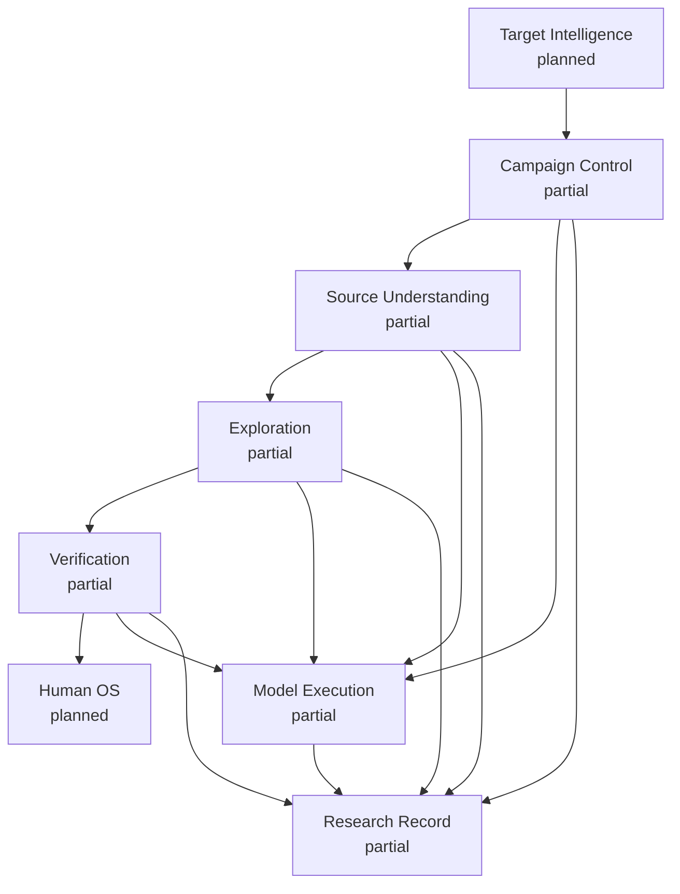
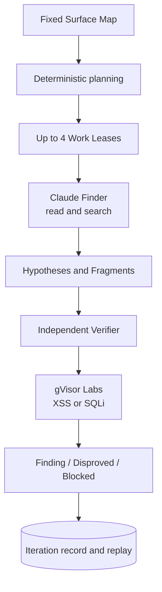
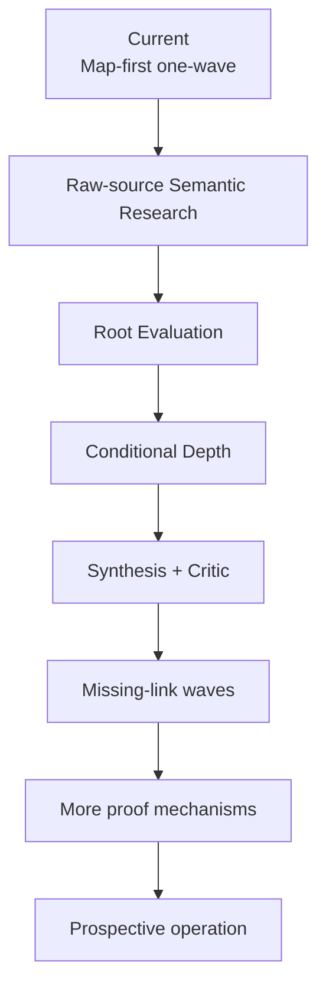

# Codebase Guide

Status: living implementation map, 2026-09-03

現在の実装、owner、Interface、Testへ戻るための唯一のliving documentである。安定した設計はSeam、実Targetの実測はexperimentsへ分ける。

## Five things to remember

1. 第一目的はoracle-freeにhigh-impactなbroken security semanticsを高recallで発見し、独立Verificationで実証すること。
2. 通常運転の到達形はraw-source-firstのSemantic Research Waveで、strong semantic frontierだけをconditional Depthへ昇格する。
3. `confine -> constrain -> focus -> motivate -> parallelize -> hypothesize -> verify -> record -> prioritize -> iterate`をcontrol propertyとして実装する。
4. ResearchはCampaign Control、Source Understanding、Exploration、Verification、Model Execution、Research Recordの6 Moduleで構成する。
5. context外のpublic入口は`openResearch`である。

schema field、SQLite table、provider argv、全ADR、内部helperは暗記しない。

## Current completion map

## Current vertical slice

これは現在動くMap-first one-wave sliceであり、到達設計ではない。target-specificな成否、Waveの時系列、所要時間は[公開CVEのE2E実験記録](experiments/e2e-campaign-results-2026-09-02.md)にだけ置く。

## Main capability gap

最重要gapは、Surface Mapで先に選んだ範囲へ探索を寄せる現在経路を、raw sourceからTarget全体へ自由にpivotできるSemantic Researchへ置き換えること。Map、PHP Program Index、AST、Semgrep、CodeQLは補助に残し、Map外candidateを拒否しない。`Route Fragment`はschema出力まで存在するが、Root Evaluation、Depth Admission、Synthesis、Critic、missing-link再投入は未接続である。

## Implementation index

| Capability | Status | Public or owner Interface | Source | Behavior Tests | Design |
| --- | --- | --- | --- | --- | --- |
| Campaign prepare、run、replay | partial | `openResearch` / `CampaignRunner` | [`campaign-control/`](../src/research/campaign-control), [`open-research.ts`](../src/research/open-research.ts) | [`campaign-prepare`](../tests/research/campaign-prepare.test.ts), [`campaign-run`](../tests/research/campaign-run.test.ts) | [Campaign seam](design/campaign-execution-seam.md) |
| Research Ledger and CAS | partial | internal `ResearchRecord` | [`research-record/`](../src/research/research-record) | [`ledger compatibility`](../tests/research/ledger-compatibility.test.ts) | [Module Map](design/architecture/module-map.md) |
| PHP Program Index | implemented internal slice | `PhpSourceAnalysis` | [`php-program-index/`](../src/research/source-mapping/php-program-index) | [`php-program-index`](../tests/research/php-program-index.test.ts) | [Index seam](design/php-program-index-seam.md) |
| Surface Map and AI delta | partial | `SourceMapping.build` | [`source-mapping/`](../src/research/source-mapping) | [`source-mapping`](../tests/research/source-mapping.test.ts), [`map-delta`](../tests/research/map-delta-synthesizer.test.ts) | [Source Mapping seam](design/source-mapping-seam.md) |
| Target-bound source queries | partial; `read/search` | `SourceEvidenceGateway.query` | [`source-evidence-gateway.ts`](../src/research/source-mapping/source-evidence-gateway.ts) | [`gateway`](../tests/research/source-evidence-gateway.test.ts), [`Attempt loop`](../tests/research/source-evidence-attempt-loop.test.ts) | [ADR 0112](adr/0112-treat-analysis-units-as-seeds-for-bounded-source-retrieval.md) |
| Planning and Hypothesis intake | partial | `Exploration.decide` | [`exploration/`](../src/research/exploration) | [`exploration-bootstrap`](../tests/research/exploration-bootstrap.test.ts) | [Exploration seam](design/exploration-seam.md) |
| Provider execution | partial; Claude process only | `ModelExecution.run` | [`model-execution/`](../src/research/model-execution) | [`model-execution`](../tests/research/model-execution.test.ts), [`Claude bridge`](../tests/research/claude-source-evidence-bridge.test.ts) | [Model seam](design/model-execution-seam.md) |
| Independent proof | partial; Stored XSS and SQLi | `Verification.verify` | [`verification/`](../src/research/verification) | [`verification`](../tests/research/verification.test.ts), [`XSS Lab`](../tests/research/gvisor-stored-xss-lab.test.ts), [`SQLi Lab`](../tests/research/gvisor-sql-injection-lab.test.ts) | [Verification seam](design/verification-seam.md) |
| Operator CLI | partial; prepare/inspect only | `runCli` | [`cli.ts`](../src/cli.ts) | [`campaign-cli`](../tests/cli/campaign-cli.test.ts) | [ADR 0054](adr/0054-keep-the-cli-as-a-thin-adapter.md) |
| Target Intelligence / Human OS | planned | not implemented | — | — | [Module Map](design/architecture/module-map.md) |

## Fifteen-minute reading path

1. [Documentation](README.md)で目的別の入口を選ぶ。
2. [Module Map](design/architecture/module-map.md)でownerを確認する。
3. 上のImplementation indexからowning Seam、Behavior Test、sourceへ進む。
4. 理由が必要な時だけSeamからlinkされたADRを読む。
5. 次の作業はGitHub Issueで確認する。

## Source of truth

| Question | Canonical source |
| --- | --- |
| Mission / research policy | [Research Design Principles](design/research-design-principles.md) |
| 用語と所有関係 | `CONTEXT.md`、`docs/domain/` |
| 安定したModule関係 | [Module Map](design/architecture/module-map.md) |
| Interface、不変条件、failure | owning Seam |
| 現在のstatus、path、Test | このCodebase Guide |
| 実行可能なbehavior | Behavior Test |
| 判断理由 | ADR |
| 次の有限work | GitHub Issue |
| 対象別の実測 | dated experiment |

同じ事実を複数文書で保守しない。内部helper追加だけなら、このGuideも設計書も更新しない。
