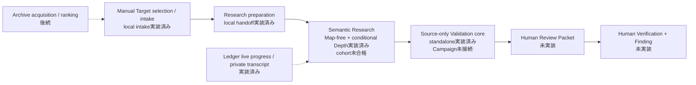
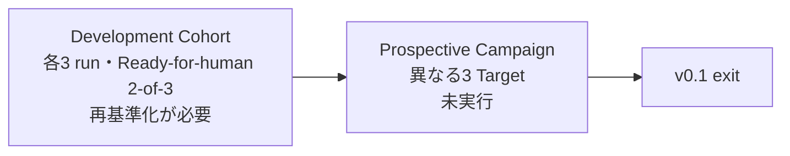
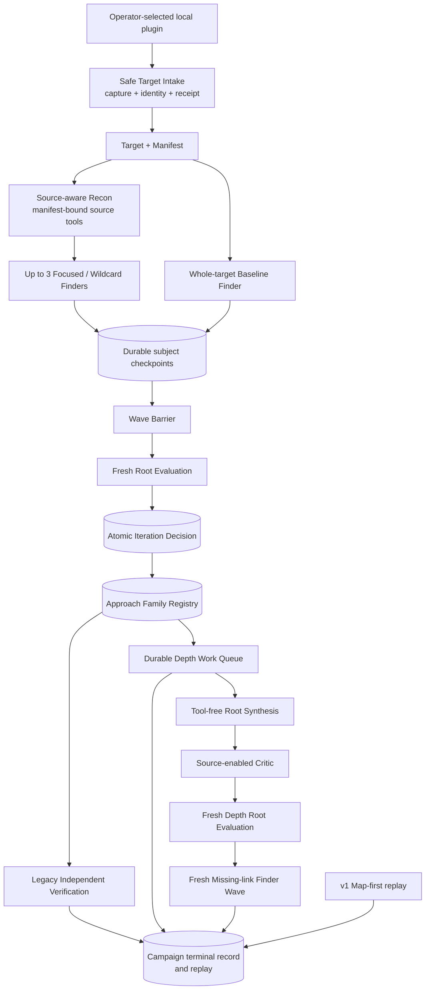
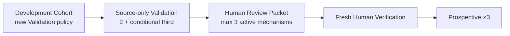

# Codebase Guide

Status: living implementation map, 2026-09-05

現在の実装、owner、Interface、Testへ戻るための唯一のliving documentである。安定した設計はSeam、実Targetの実測はexperimentsへ分ける。

## Five things to remember

1. Productの到達点は、oracle-freeにhigh-impactなbroken security semanticsを高recallで発見し、source-only Validation、Human Review Packet、Human Verification済みFindingまで閉じること。ResearchはReview Packet handoffまで、Human OSはHuman VerificationとFindingを所有する。
2. 通常運転の到達形はraw-source-firstのSemantic Research Waveで、strong semantic frontierだけをconditional Depthへ昇格する。
3. `confine -> constrain -> focus -> motivate -> parallelize -> hypothesize -> verify -> record -> prioritize -> iterate`をcontrol propertyとして実装する。
4. accepted designではResearchをCampaign Control、Source Understanding、Exploration、Validation、Model Execution、Research Recordの6 Moduleで構成する。現在のruntimeには移行前のVerification Moduleが残る。
5. context外のpublic入口は`openResearch`である。

schema field、SQLite table、provider argv、全ADR、内部helperは暗記しない。

## v0.1 product goal

手動で選定したWordPress pluginから、Map-free Semantic Research、必要時のconditional Depth、source-only Validation、Human Review Packet、fresh Human Verificationまでを一つのoperator workflowとして閉じる。Development Cohortの各mechanismを反復基準で通過した後、既知答えを持ち込まない3件のProspective Campaignをdurable Research terminalとHuman Review dispositionまで完走できた時点をv0.1とする。

v0.1ではtarget選定の自動化、multi-model、完全なDashboardを要求しない。Finding件数だけをResearch完了条件にせず、Ready-for-human、Disproved、Rejected、Validation-pending、理由付きIncompleteを同じ証拠規則で再生できることを要求する。Product exitには一件以上のHuman Verification済みFindingを要求する。

## Current completion map

上段はaccepted product path、下段はその能力を判定するevaluation gateである。主経路の現行codeはDepthと旧Independent Verificationまで接続済みで、Validationはstandalone coreまで、Human OSは未実装である。接続済みを発見能力の証明とは数えず、Brizy、SSA、TranslatePressの各mechanismが新しい反復基準を満たすまではProspectiveへ進まない。

残作業は次の三群に分ける。

| 群 | 状態 | 次の有限work |
| --- | --- | --- |
| **いま閉じる** | Validationのstandalone core、post-Barrier Root Evaluation@3のexplicit Family-bound `admit-validation`、model-owned ordered routeからのexact Candidate materializationは実装済み。CampaignはまだDecision@2と旧Verificationへ接続中 | Decision@3のFamily Registry / Validation Ledger、Disposition feedbackをCampaignへvertical sliceで接続する |
| **最初のproduct goalまで** | Review Packet、Human Verification Environment、Human OSがない | Human Review Packet、最大3 active mechanismのHuman queue、fresh Human Verification、[Prospective Campaign #32](https://github.com/momoponwork1415-lgtm/wordpress-harness/issues/32)を順に閉じる |
| **到達後に広げる** | 自動選定、multi-model、breadth、cost最適化は未着手 | archive acquisition、eligibility / ranking、`3 baseline + 1 challenger`、Semgrep / CodeQL横展開、recall-preserving ablationを実測順に追加する |

Surface Map、PHP Program Index、追加provider、完全なDashboardは主経路の前提ではない。実TargetのHypothesisが要求していないExperiment frameworkも先回りして作らない。

## Current vertical slice

これはDefault Map-free Semantic Waveのproduction vertical sliceである。Root EvaluationのIteration DecisionはCASと単一Ledger eventへ固定し、modelが選んだ`admit-depth` action groupingからCampaign-localなactive Approach Familyを開く。Research Recordはeventから同じRegistry digestを再構築し、この境界より前にRoot Synthesisを開始させない。Depth AdmissionとDepth Work Queue、Queue全batchのtool-freeなRoot Synthesis、各immutable artifactをfresh source readで攻撃するAdversarial Critic、全Proposalを処遇するfresh Depth Root Evaluation、具体的Critic Gapへbindしたfresh Missing-link Finder WaveをCampaignへdurableに接続済みである。Depth DecisionをCASとLedgerへ先に固定してからMissing-link Waveを開始し、そのHypothesis、Route Fragment、Frontier Gapを元のApproach Familyへattachしたfollow-up Queueでfresh Synthesis / Critic / Evaluationを反復する。Missing-link WaveもTarget全体へpivotでき、checkpoint Hypothesisを既存Verification Queueへ先行投入し、Familyごと最大3 evidence generation、Campaign全体最大12 Work Waveを越えない。容量を越えたGapは`unscheduledGaps`としてRun recordに残してIncompleteにし、黙示的に捨てない。batchはstable orderで処理し、各artifactをCASへ置く前に次roleを始めない。Proposal 0件またはtyped incompleteでは完了roundとVerificationを保持する。既存v1 CampaignのMap-first one-wave sliceはreplay専用で残す。target-specificな成否、Waveの時系列、所要時間は[公開CVEのE2E実験記録](experiments/e2e-campaign-results-2026-09-02.md)にだけ置く。

`CampaignRunner.prepareFromTargetIntake`はreadyなPacket / ReceiptをResearch CASへ複製し、PacketのTarget SnapshotとCanonical File Manifestをcallerによる再入力なしで`campaign.prepared@3`へ固定する。Packet / Receipt / source tree / Manifest bindingはreplayとworker起動前にもResearch CASだけから検査され、改変または欠落はtyped integrity errorになる。v2入力の直接prepareとv1/v2 replayも維持する。`CampaignRunner.run`はMapなしでwhole-target Baseline Finderを直ちに開始し、同時にmanifest-boundな`list / search / read`を持つSource-aware Reconを実行する。Recon完了をBaselineの開始条件にせず、実source readがないRecon結果は受理しない。Reconが返す最大3個のsource-backed Focus Packetは開始点に限り、Focused Finderも同じTarget Snapshot全体へpivotできる。Recon failure時もBaseline AttemptとcheckpointはRunへ残る。その後、最大4個の独立Finder、Wave Barrier、fresh Root Evaluation、Independent Verification、terminal recordまでを一つのdurable Runとして接続する。各model Attemptは外部実行より先にintentを記録し、result、Wave terminal、Iteration Decisionを次stageより先にCASとLedgerへ固定する。FinderはClaude bridgeの`checkpoint_research`からHypothesis、Route Fragment、Frontier Gapを一件ずつ提出でき、Campaign ControlがManifest検査、subject CAS、checkpoint CAS、Ledger eventを完了してからackする。同一subjectの再送は同じrefへ収束し、後続provider failure後もcheckpointはreplayできる。source-bound Hypothesisはcheckpoint直後にstable identityでVerification Queueへ入り、Finder terminal、Wave Barrier、Root Evaluatorを待たない。同じcandidateをterminal outputまたはEvaluatorが再要求しても一つのVerificationへ収束し、Evaluator failure時も完了済みVerification refをRunへ残す。ReconとFinderのTool Receipt valueはtrusted-sideで全件検証してCAS / Ledgerへ保持し、Root EvaluationへはFinder Receiptのdigest-bound ref、query ordinal、operation、terminal resultとAttempt別集計を渡す。provider failure、partial/invalid Finder output、invalid Evaluation、Verification blockerと予約枠超過は区別して保持し、一件のFinding後もretainまたはDepthのactive frontierがあれば`Incomplete`にする。`CampaignReader.inspect`は全Finding recordを保持したまま、source rederivation、Experiment、Lab binding、Witness / Control effectが一致する別subjectをversioned `Finding Mechanism Group`へまとめ、Blockedを除外した`1 mechanism / N discoveries` viewを決定的に再構築する。実行中は同じReaderの`progress` viewがLedger / CASだけからstatus、active role、checkpoint、Verification、Depth、usageを再構築する。private runnerは変更時と25秒heartbeatでstderrへ表示し、provider process segmentとSource Evidence tool lifecycleをrun-local private JSONLへflushする。観測先の失敗はCampaign outcomeを変えない。完了済みPlan replayはproviderを再起動しない。

Wave BarrierはFinderOutputV2のHypothesis、Route Fragment、Frontier GapをManifest検査し、Attempt / Lease / Wave / Target / Manifest provenanceを持つimmutable CAS artifactとしてstable orderでRun viewへ公開する。欠けた配列、partial output、Manifest外anchorはtyped `incomplete`となる。途中checkpointはBarrier前にdurableで、旧Decision@2のHypothesisだけはVerificationへ先行する。Wave terminal集合とRoot Evaluation inputは引き続きterminal FinderOutputに依存する。`Exploration.decide`の現行Decision@3 contractは、Barrier後の全subjectを処遇し、`admit-validation`と`admit-depth`をexplicitなApproach Family refへbindする。同じmechanismを両方へ送る場合は一つのFamily Admissionを共有し、missing/foreign/unused Family bindingをtyped incompleteにする。旧Decision@2の`request-verification`とCampaign実行はreplay互換のため残る。silent omission、foreign ref、binding不正、早すぎるCoverage Closureはfresh retry後にtyped `evaluation-incomplete`となる。v1 preparationとMap-first Runは既存Campaignのreplay用に読み続ける。

## Main capability gap

二段Coverage Closureは旧production sliceへ接続済みである。初回complete WaveまたはterminalなDepth後の評価を一回目の観測とし、一回のno-material-deltaだけでは閉じない。後段は既知subjectやclosure hintをassignmentへ渡さないfresh Wildcard Finderとfresh Root Evaluatorを起動する。現行Campaign codeはactive / blocked Family、pending legacy Verification、未解決workがない時だけ`coverage-closed`を作る。新policyではこれをpending Validationへ置き換え、Human DeferredまたはHuman VerificationをResearch closure条件にしない。直近の実装gapはDecision@3のCampaign/Ledger接続、checkpoint即時Verificationの廃止、Review Packet handoffである。Map、PHP Program Index、AST、Semgrep、CodeQLは補助に残し、Map外candidateを拒否しない。

`semantic-research-recall-baseline-v5`は現行runtimeのversioned resource policyである。Finderは512 source query、16 GiB scan、256 MiB response、256 turn、USD 20、2 MiB output、3 hours、Reconは256 query、128 turn、USD 10、1 hour、Root Evaluationは128 turn、USD 10、1 hourを遠いemergency envelopeとして持つ。Campaign全体は12 Wave、48 Finder Attempt、4 concurrent Finder、128 model Attempt、USD 150、12 hoursで、旧VerificationへUSD 30を予約する。新policyもこのUSD 30をValidation専用予約として維持するが、Verifier Attempt数とExperiment数の旧上限は引き継がない。Validationを低いcandidate件数またはtokenだけで打ち切らず、累積provider costとwall timeを残り予約へ反映する。source query / byte、wall time、provider cost、output byteはhard guardrailとして残し、ceiling到達をnegativeへ丸めない。Brizy、Simply Schedule Appointments、TranslatePressのPlanはmodelやHuman Verification Environmentを起動しないpreflight testを通す。旧budget schemaは完了済みRunのreplay用にdecodeする。

Source GatewayはReconとFinderのAttempt別query上限をReceipt付きで強制する。Attempt terminal resultはv3 Finder上限512 query分と最後のbudget-exhaustion queryのTool Receiptを保持でき、旧64件上限で長いtraceを失効させない。Finder output schemaは割当済みLease IDを`const`で拘束する。v2 Model Attemptは補助modelを含むturn / token、source query / scan / response byte、structured output、wall time、provider cost estimateを正規化する。Independent Verifierも同じusage contractを使い、usage欠落、provider cost超過、wall-time超過はLab前のBlockedとして区別する。Default Campaign terminal recordはExplorationとVerificationをowner別に集計する。Claude processはPlanのprovider cost上限を起動時に渡す。file identity mismatchはTool Receiptへ残す回復可能なquery resultとし、checkpointと最終candidateのanchorをManifestへ再検査する。Claude Finderはusage付き429/5xxをAttempt専用のephemeral configで同じsessionへ最大3回resumeでき、各segmentのcost、turn、tokenを合算する。usageまたはcostが不明なCLI crashは上限内の残budgetを証明できないためresumeせず、元Attemptをpartial accountingで閉じてack済みcheckpointを残す。複数WaveをまたぐExploration実消費のhard enforcementは未実装である。二段Coverage Closureは実装済みで、一Waveだけの`coverage-closed`自己申告は受理しない。

Manual local-directory Target IntakeからCampaign preparationへのversioned context handoffまで実装済みである。Target選定、archive acquisition、source-only Validation、Human Review Packet、Human Verification EnvironmentとHuman OSは未実装である。

## Implementation index

| Capability | Status | Public or owner Interface | Source | Behavior Tests | Design |
| --- | --- | --- | --- | --- | --- |
| Manual Target Intake | partial; local directoryのraw-byte capture、stable manifest、WordPress.org identity / header version照合、link / hardlink / path collision / quota拒否、曖昧なmain fileのdeferred、CAS-first Packet / Receipt、Packet / ReceiptをResearch CASへ複製するv3 Campaign handoff。archive acquisitionは未実装 | `TargetIntake.intake` / `CampaignRunner.prepareFromTargetIntake` | [`target-intelligence/acquisition/`](../src/target-intelligence/acquisition), [`target-intake-campaign-handoff.ts`](../src/research/campaign-control/target-intake-campaign-handoff.ts) | [`local-directory intake`](../tests/target-intelligence/local-directory-target-intake.test.ts), [`Campaign handoff`](../tests/research/target-intake-campaign-handoff.test.ts) | [Target Intake seam](design/target-intake-seam.md) |
| Campaign prepare、run、replay | partial; Default Map-free Semantic Wave E2E、recall baseline v4 preflight、v2 Manifest-bound prepare、v1/v2/v3 replay、Ledger-derived live progress | `openResearch` / `CampaignRunner` / `CampaignReader.inspect(progress)` | [`campaign-control/`](../src/research/campaign-control), [`campaign-progress-reporter.ts`](../src/research/campaign-progress-reporter.ts), [`target-file-manifest.ts`](../src/research/source-mapping/target-file-manifest.ts), [`open-research.ts`](../src/research/open-research.ts) | [`semantic E2E`](../tests/research/campaign-semantic-e2e.test.ts), [`v4 budget dry-check`](../tests/research/semantic-recall-budget.test.ts), [`campaign-prepare`](../tests/research/campaign-prepare.test.ts), [`semantic run`](../tests/research/campaign-semantic-run.test.ts), [`campaign-run`](../tests/research/campaign-run.test.ts), [`progress reporter`](../tests/research/campaign-progress-reporter.test.ts) | [Campaign seam](design/campaign-execution-seam.md) |
| Research Ledger and CAS | partial; Finder checkpoint event、close/reopen replay、Ledger / CAS prefixからの決定的progress projection、Iteration Decision@3と初期Family Registry v3のCAS-first単一event記録およびLedger-only replayを実装済み。現行CampaignRunnerはv3 record seamを未使用 | internal `ResearchRecord` | [`research-record/`](../src/research/research-record) | [`campaign run`](../tests/research/campaign-run.test.ts), [`semantic run`](../tests/research/campaign-semantic-run.test.ts), [`Decision v3 record`](../tests/research/semantic-iteration-decision-record-v3.test.ts), [`ledger compatibility`](../tests/research/ledger-compatibility.test.ts) | [Module Map](design/architecture/module-map.md) |
| PHP Program Index | implemented internal slice | `PhpSourceAnalysis` | [`php-program-index/`](../src/research/source-mapping/php-program-index) | [`php-program-index`](../tests/research/php-program-index.test.ts) | [Index seam](design/php-program-index-seam.md) |
| Surface Map and AI delta | partial | `SourceMapping.build` | [`source-mapping/`](../src/research/source-mapping) | [`source-mapping`](../tests/research/source-mapping.test.ts), [`map-delta`](../tests/research/map-delta-synthesizer.test.ts) | [Source Mapping seam](design/source-mapping-seam.md) |
| Target-bound source queries | partial; Recon / Finder / Critic / Validator向けv2 paginated `list/search/read`、Claude v2 binding、v1 replay | `SourceEvidenceGateway.query` / `ModelExecution.run` | [`source-evidence-gateway.ts`](../src/research/source-mapping/source-evidence-gateway.ts), [`claude-source-evidence-bridge.ts`](../src/research/model-execution/claude-source-evidence-bridge.ts) | [`v2 gateway`](../tests/research/source-evidence-gateway-v2.test.ts), [`Claude bridge`](../tests/research/claude-source-evidence-bridge.test.ts), [`v1 gateway`](../tests/research/source-evidence-gateway.test.ts), [`Validation`](../tests/research/validation.test.ts) | [Source Mapping seam](design/source-mapping-seam.md) |
| Planning and Hypothesis intake | partial; Source-aware Reconとwhole-target Baselineの並行開始、source-backed Focus Packet、Manifest-bound Wave Barrier、checkpoint Hypothesisの先行legacy Verification、fresh Root Evaluation、atomic Iteration Decision、active Approach Family Registry、全Depth Admission / next workを失わないversioned Depth Work Queue、tool-freeなfresh Root SynthesisとManifest-bound Chain Proposal、fresh source readを必須にするAdversarial Critique、fresh Depth Root Evaluation、Family未接続Proposalのmodel-owned genesis、Gap-boundなMissing-link Wave、Family evidence attachment、Familyごと最大3世代かつ全体最大12 Waveのfresh反復、容量超過Gapのtyped incomplete、Depth Chain ProposalからSource-bound Hypothesisへの変換、Verification outcomeのFamily feedback、fresh Wildcardによる二段Coverage ClosureをCampaign E2Eで実装済み。現行Root Evaluation@3はValidation/Depth actionをexplicitな同一Family Admissionへbindし、Decision単体からCampaign-local Registry v3を決定論的に投影する。同じAdmissionを両actionが参照しても一Familyだけを開き、Validation Candidate originと同じFamily IDへ収束する。Research RecordのCAS-first記録とLedger replayは実装済みだが、CampaignRunnerは未接続 | `Exploration.decide` / `SemanticChainSynthesis.synthesize` / `SemanticAdversarialCritique.critique` / `CampaignRunner.run` | [`exploration/`](../src/research/exploration), [`campaign-control/`](../src/research/campaign-control) | [`semantic E2E`](../tests/research/campaign-semantic-e2e.test.ts), [`Family transition`](../tests/research/semantic-approach-family-transition.test.ts), [`Depth work queue`](../tests/research/semantic-depth-work-queue.test.ts), [`Root Synthesis`](../tests/research/semantic-chain-synthesis.test.ts), [`Adversarial Critic`](../tests/research/semantic-adversarial-critique.test.ts), [`semantic-root-planning`](../tests/research/semantic-root-planning.test.ts), [`root evaluation`](../tests/research/semantic-root-evaluation.test.ts), [`Candidate admission`](../tests/research/validation-candidate-admission.test.ts), [`Decision v3 record`](../tests/research/semantic-iteration-decision-record-v3.test.ts), [`semantic run`](../tests/research/campaign-semantic-run.test.ts), [`wave barrier`](../tests/research/semantic-wave-barrier.test.ts), [`exploration-bootstrap`](../tests/research/exploration-bootstrap.test.ts) | [Exploration seam](design/exploration-seam.md) |
| Provider execution | partial; Claude process、Exploration rolesに加えてvalidator / validation-synthesizer AttemptPlan v2、ValidatorのManifest-bound source toolとfresh-read gate、tool-free Synthesis、checkpoint observer、Receipt伝播、usage正規化、source byte / provider cost ceiling、same-session resume、private transcript | `ModelExecution.run(plan, observer?)` / `ModelProcessObserver` | [`model-execution/`](../src/research/model-execution) | [`model-execution`](../tests/research/model-execution.test.ts), [`Validation`](../tests/research/validation.test.ts), [`Claude bridge`](../tests/research/claude-source-evidence-bridge.test.ts) | [Model seam](design/model-execution-seam.md) |
| Source-only Validation | partial; exact semantic candidate identity、2 fresh Validator、material rubric conflict時だけ第三Attempt、各model resultの次stage前CAS固定、tool-free Synthesis、evidence ref検査、4 terminal Dispositionとfailure時Validation-pendingをstandalone `Validation.validate`で実装済み。Decision@3のmodel-owned ordered routeをHypothesis anchorへ検査し、exact duplicateの全Campaign-local Family originを保持するCandidate materializerも実装済み。Campaign Ledger、Needs-research feedback、Risk Assessment、Review Packetは未接続 | `Validation.validate` | [`validation/`](../src/research/validation), [`validation-candidate-admission.ts`](../src/research/campaign-control/validation-candidate-admission.ts) | [`Validation`](../tests/research/validation.test.ts), [`Candidate admission`](../tests/research/validation-candidate-admission.test.ts) | [Validation seam](design/validation-seam.md) |
| Legacy Independent Verification | replay compatibility only in accepted design; runtime codeはTargetFileManifest-bound Verifier、gVisor Lab、Witness / Causal Control、旧Finding / Mechanism Groupを実装済み | `Verification.verify` / `CampaignReader.inspect(finding-mechanism-groups)` | [`verification/`](../src/research/verification) | [`verification`](../tests/research/verification.test.ts), [`Claude verifier`](../tests/research/claude-independent-verifier.test.ts), [`ATO Lab`](../tests/research/gvisor-account-takeover-lab.test.ts), [`XSS Lab`](../tests/research/gvisor-stored-xss-lab.test.ts), [`SQLi Lab`](../tests/research/gvisor-sql-injection-lab.test.ts) | [Legacy Verification seam](design/verification-seam.md) |
| Human Verification and Finding | not implemented; Packet intake、max 3 active unique mechanisms、Human Deferred、fresh environment、Review Dispositionが必要 | planned Human OS Interfaces | — | — | [Human Verification seam](design/human-verification-seam.md), [Setup seam](design/campaign-setup-seam.md) |
| Operator CLI | partial; prepare/inspect only | `runCli` | [`cli.ts`](../src/cli.ts) | [`campaign-cli`](../tests/cli/campaign-cli.test.ts) | [ADR 0054](adr/0054-keep-the-cli-as-a-thin-adapter.md) |
| Target Selection / Human OS | planned | not implemented | — | — | [Module Map](design/architecture/module-map.md) |

## Fifteen-minute reading path

1. [Documentation](README.md)で目的別の入口を選ぶ。
2. [Module Map](design/architecture/module-map.md)でownerを確認する。
3. 上のImplementation indexからowning Seam、Behavior Test、sourceへ進む。
4. 理由が必要な時だけSeamからlinkされたADRを読む。
5. 次の作業はGitHub Issueで確認する。

## Source of truth

| Question | Canonical source |
| --- | --- |
| Mission / research policy | [Research Design Principles](design/research-design-principles.md) |
| 用語と所有関係 | `CONTEXT.md`、`docs/domain/` |
| 安定したModule関係 | [Module Map](design/architecture/module-map.md) |
| Interface、不変条件、failure | owning Seam |
| 現在のstatus、path、Test | このCodebase Guide |
| 実行可能なbehavior | Behavior Test |
| 判断理由 | ADR |
| 次の有限work | GitHub Issue |
| 対象別の実測 | dated experiment |

同じ事実を複数文書で保守しない。内部helper追加だけなら、このGuideも設計書も更新しない。
