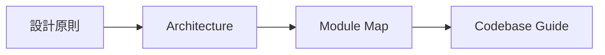

# Documentation Guide

このdirectoryは文書の更新責任を分離する。コード変更のたびに複数文書へ同じ状態を書かない。

## 最初に読むもの

1. [調査設計原則](design/research-design-principles.md) — 変わりにくい探索原則
2. [アーキテクチャ概要](design/architecture/architecture-overview.md) — system全体と信頼領域
3. [Module Map](design/architecture/module-map.md) — Moduleの機能と関係
4. [Codebase Guide](CODEBASE-GUIDE.md) — 現在の実装場所、状態、Test

現在の完成度だけを確認する場合は、日付付きの[最新監査](audits/harness-completeness-2026-09-03.md)を読む。実Targetで何が起きたかは[実験記録](experiments/README.md)を読む。

## 文書の種類

| Directory / file | 責任 | 更新規則 |
| --- | --- | --- |
| `CONTEXT.md` / `docs/domain/` | 正式語とdomain関係 | 用語または所有関係が変わる時だけ更新 |
| `docs/design/` | Interface、不変条件、Module ownership、失敗意味、到達architecture | implementation path、version、LOC、run結果、現在の未実装一覧を書かない |
| `docs/design/architecture/` | GitHubで読める小さいMermaid view | stable flowを優先し、現行と到達形を明記する |
| `docs/CODEBASE-GUIDE.md` | 現在のproduction status、実装path、Behavior Test | 現在地を記す唯一のliving document |
| `docs/adr/` | hard-to-reverseな判断履歴 | accepted本文を実装追随で書き換えず、新ADRでsupersedeする |
| `docs/experiments/` | 公開CVEに対する日付付き実測 | append-only。将来のcode状態として読ませない |
| `docs/audits/` | 日付時点の完成度・整合性snapshot | frozen。次回は新しい日付の文書を作る |
| `docs/research/` | 外部資料、比較、設計根拠 | dated evidence。production仕様または現在地の正本にしない |
| `docs/history/` | 完了Goal、旧設計snapshot、過去baseline | frozen。通常の読書経路または正本から参照しない |
| GitHub Issues | 次に行う有限work、受入条件、作業順 | 完了後に設計書へ作業日誌を転記しない |
| Behavior Test | 実行可能なbehavior | codeと同じ変更で更新する |

## 削除規則

次の文書は新しく作らず、見つけたら内容を正本へ移して削除または`history`へ凍結する。Git履歴が過去版を保持する。

- codeのfile、helper、version、件数、現在の未実装一覧を文章で再現するだけの文書
- 完了済みGoalやSetup Planをactive designとして残す文書
- 同じ図またはstatus tableを別表現で複製する文書
- ADRへ固定済みの判断をもう一度説明するだけの設計メモ
- 実験の時刻・対象別成否をSeam文書へコピーした節

文書を追加する前に、既存の正本への数行の追記、Behavior Test、Issueのいずれかで足りないか確認する。
