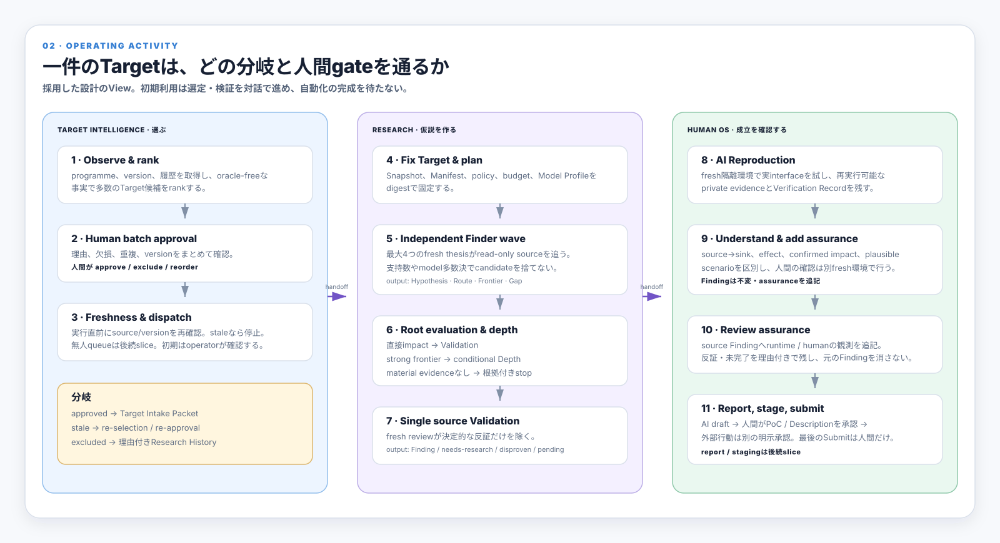
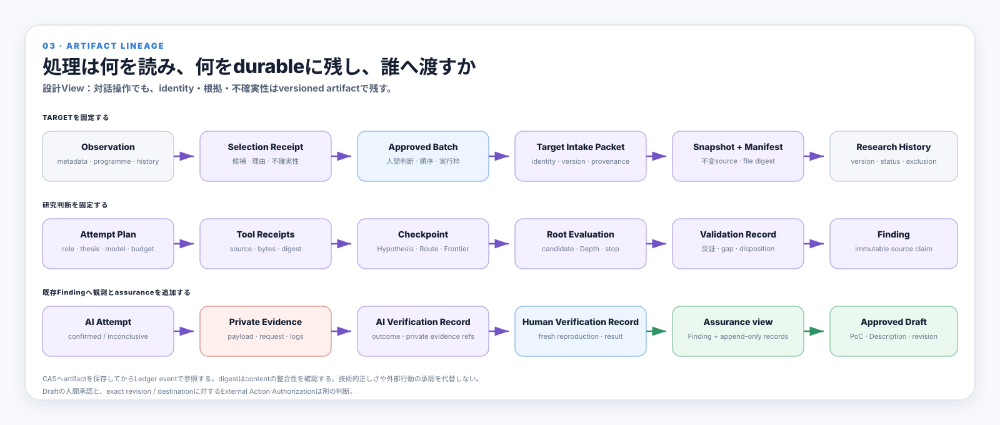
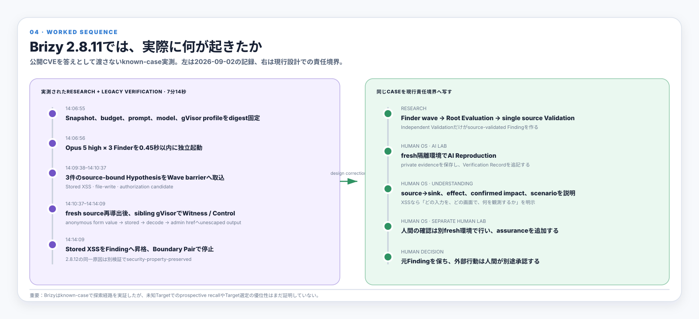
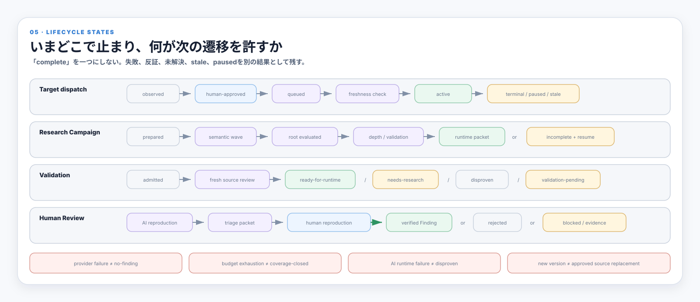
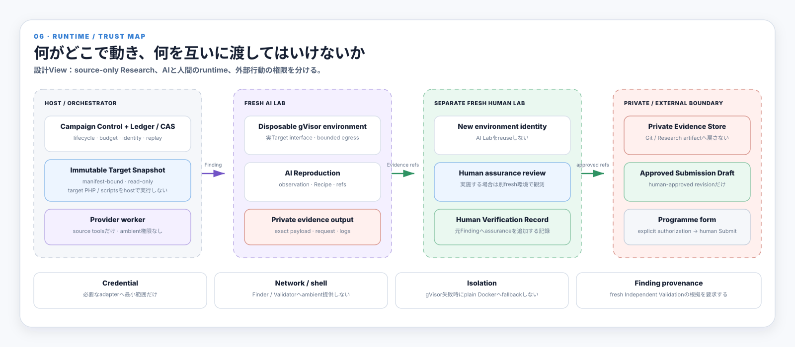

# System Walkthrough

同じsystemを六つの問いで順に見る。図を選んで拡大できる。実装状況の正本は[Codebase Guide](CODEBASE-GUIDE.md)、設計の正本は[Harness Architecture](ARCHITECTURE.md)とversioned contractである。

図は採用した設計のViewであり、全接続の実装完了を表さない。初期利用はTarget選定・Verificationの対話操作を許容する。自動化の完成を初期利用の前提にしない。

現在地を知る場合は先に[Current capability](CODEBASE-GUIDE.md#current-capability)を読む。以下の図は役割と処理を理解するために使い、実装済み・移行中・未接続の判定はCodebase Guide、次の有限workは[Issue #86](https://github.com/momoponwork1415-lgtm/wordpress-harness/issues/86)へ戻る。

## 1. 誰が何を所有するか

## 2. 一件のTargetがどう処理されるか

## 3. 各処理が何を読み、何を残すか

## 4. 実際の一件では何が起きたか

Brizyはknown-caseの探索経路を実証したが、未知Targetのprospective recallはまだ実証していない。

## 5. どこで止まり、何が次の遷移を許すか

## 6. 何がどこで動き、何を渡してはいけないか

