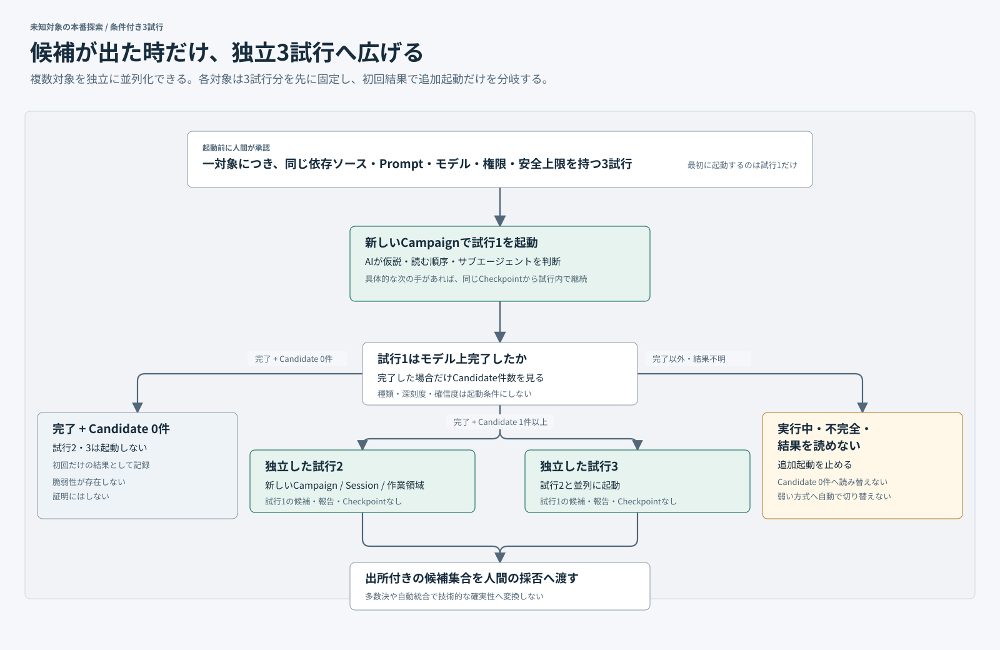

# 一件の処理の流れ

**一件の対象を例に、処理の順序と人間が判断する場所を追います。** これは設計上の流れです。現在どこまで接続されているかは[コードベース案内](CODEBASE-GUIDE.md#current-capability)で確認します。

## 1. 対象を選び、開始を承認する

対象情報の領域は、取得したソース、プログラムの対象範囲、報告経路、公開履歴の集約値、観測事実から候補群を組み立てます。AIが調査対象を提案し、人間が正確な対象群、探索方式、各対象の独立3試行、全体の安全上限を一括承認します。実行直前に版、ソース、プログラムの対象範囲が最新の観測に一致することを確認してから、承認済みの探索入力を渡します。

## 2. 初回から条件付きで3試行へ広げる

未知対象の本番探索は、対象ごとに同じ条件の3試行を先に承認し、各対象の初回を独立したprocessで並列起動できます。ある対象の初回がモデル上完了して候補を一件以上返した場合だけ、その対象の残り2試行を互いに独立して並列起動します。別対象や先行試行の候補、報告、Checkpointを渡しません。

初回が候補なしで正常完了した場合は追加試行を起動しません。実行中、`incomplete`、結果欠損、形式不整合を候補なしへ読み替えず、追加起動を止めて対応が必要な状態として残します。これは本番の費用配分であり、既知事例を必ず3回実行する`pass@3`評価とは分けます。

## 3. 各試行でAIが探索を続け、止める

探索は承認済みCampaignの安全上限内で連続して動きます。AIがソースコードに基づく具体的な次の手と`continue`を返すと、Harnessはその実行のCheckpointから次のNative Runを自動で始めます。候補が見つかっただけでは止めません。

| AIまたは実行基盤の結果 | 次に起きること |
| --- | --- |
| `continue`と具体的な次の手 | 同じCheckpointから自動継続する |
| `stop`かつ候補あり | 人間による候補の採否判断へ進む |
| `stop`かつ候補なし | 今回の探索範囲を閉じる |
| 安全上限に到達したが次の手あり | `incomplete`として残し、探索完了にしない |
| プロバイダー・認証・出力・保存の失敗 | 自動継続せず、失敗理由と再開可能性を残す |

人間はAIが`stop`した後に候補を確認し、動的検証へ進めるものを選びます。探索へ戻す候補が一件でもあれば、動的検証より先に探索へ戻します。プログラム対象外で、対象となる影響へつながる具体的な経路がない手掛かりは保留し、この判断には出しません。

### 探索エージェントへ渡す情報

| 入力の役割 | 内容 |
| --- | --- |
| 対象と参照ソース | 版を固定した読み取り専用の対象ソースと依存ソース |
| 判断の前提 | 攻撃者の前提、対象とする影響、プログラム上の探索境界 |
| 実行条件 | Prompt、実行環境、権限、Campaign全体の安全上限 |
| 探索の継続 | 同じ入力に結び付いた非公開Checkpointと、直前のRoot AIが残した具体的な次の手 |

Root AIは候補を返すとき、同じソース理解から最小の再現手順も作ります。実行Adapterは手順本文をGit外の非公開ストレージへ退避し、探索記録には参照だけを残します。手順がなければ`verification-preparation-needed`となり、候補そのものを棄却しません。

既知脆弱性を答えとして与えない入力と権限制約の正本は[探索設計](RESEARCH-DESIGN.md#trust-and-versioning)です。スキーマ、プロンプトの組立、入力例、再現手順の保存場所は[コードベース案内のエージェント入力](CODEBASE-GUIDE.md#agent-input)から辿れます。

## 4. 新しい環境で動的に確かめる

人間による運用の領域は、人間が採用した候補だけを新しい使い捨てWordPress / MySQL環境で検証します。候補に結び付いた再現手順を実際の対象Interfaceへ一度だけ実行し、別のAIにソースから脆弱性を探し直させることはしません。

| 結果 | 次の状態 |
| --- | --- |
| `runtime-confirmed` | 技術的に確認済みの脆弱性を作る |
| `contradicted` | 通常前提と再現手順は満たしたが、主張した影響を観測しなかった記録を残す |
| `incomplete` | 環境、依存、再現手順、観測、後片付け、証拠の不足を反証と分けて残す |

技術的に確認済みの脆弱性と探索範囲の記録は別の成果物です。動的検証の結果で探索の完了状態を決めません。

## 5. 対象範囲を判定し、提出を決める

人間による運用の領域は、確認済み脆弱性を設定済みの全プログラムの最新対象範囲へ照合します。`in-scope`のプログラムだけに提出候補を作ります。すべて対象外、判断不能、または対象範囲の取得に失敗しても、技術的に確認済みの脆弱性は残します。

AIは提出文案の作成を支援できます。人間が一つの提出候補を選び、提出先と文案の正確な版に対する外部行動を承認します。最後の提出操作も人間が行います。

## 再開・失敗を調べる

通常の流れから外れた状態、入力の競合、古い判断、プロバイダー障害、チェックポイントの再開条件は[コードベース案内の探索キャンペーン](CODEBASE-GUIDE.md#research-campaigns)と[標準エージェント実行環境](CODEBASE-GUIDE.md#gvisor-native-agent-runtimes)に集約します。
