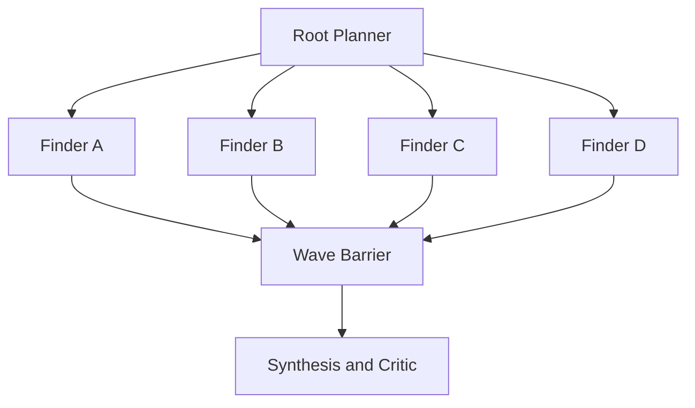

# Use four Finder slots per Depth Work Wave

標準のDepth Work Waveは最大4個の独立Finder slotを持つ。通常のproduction policyは`maxLeases: 4`と`maxFinderAttempts: 4`を指定し、Root Plannerが互いに異なるApproach Familyを割り当てる。Root Planner、Root Synthesizer、Adversarial Critic、Independent Verifierはこの4 Finderへ数えない。

これはwp2shell PromptがCDCの大規模並列をWordPress調査向けの4 agentへ縮小した構成を、provider内部spawnではなくharness所有の独立Work Leaseとして引き継ぐ判断である。3 Finderは初期vertical sliceの実装制約であり、legacy designとの対応を一枠欠いていた。

4はhard ceilingであって、同じideaを水増しする義務ではない。distinct familyが4件未満、残予算が不足、または明示的なBlockedがある場合は空枠を許す。4を超える並列化はPlan schemaで拒否し、別のBudget Profileと新しい設計判断なしに増やさない。

このADRは[ADR 0113](0113-keep-finder-methods-free-behind-an-evidence-shell.md)にある「最大3個」という数値だけを置き換える。Finderの自由度、独立barrier、Surface Mapを補助に限定する判断は変更しない。過去の3 Finder実験記録は当時の実測として書き換えない。
