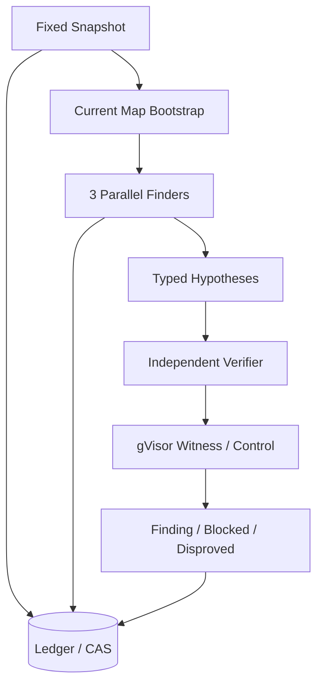
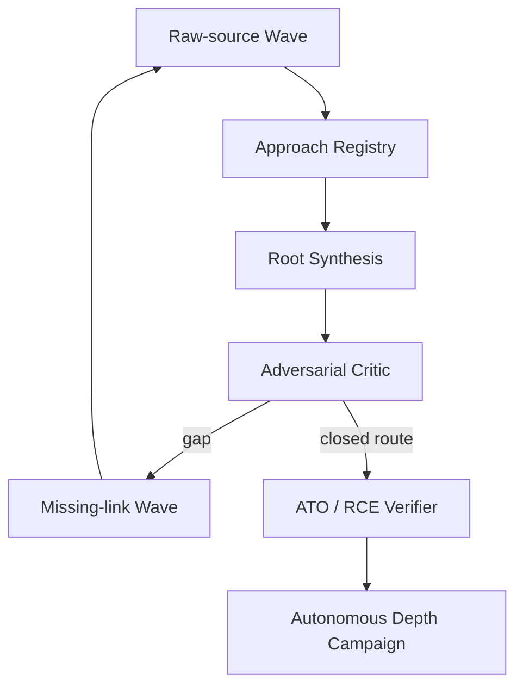

# ハーネス完成度監査（Harness Completeness Audit）

Status: current-state audit, 2026-09-03

結論は`integrated alpha`である。Stored XSSとSQLiについては実Targetを使う一WaveのE2E縦切りが動く。一方、North StarであるArgus型Depth Campaignに必要な自由探索の複数Wave、自動Synthesis/Critic、ATO/RCE verifier、multi-model運行はまだproduction codeで閉じていない。

完成度をLOCやmodule数では測らず、次の段階で評価する。

| Level | 意味 |
| --- | --- |
| 0 | 設計のみ |
| 1 | private prototypeまたは合成fixtureだけ |
| 2 | 公開InterfaceとBehavior Testがある |
| 3 | 実TargetでE2E実測済み |
| 4 | prospective Campaignを反復運用し、失敗回復と複数Caseで安定 |

## 1. 現在の完成度

| Capability | Level | 成功していること | 足りないこと |
| --- | ---: | --- | --- |
| Target Snapshot / manifest | 3 | identity、digest、file manifestを固定して実Targetを処理 | Target Intelligenceからの自動取得・選定 |
| Operator CLI / production composition | 1 | `campaign prepare/inspect`とlibrary `CampaignRunner.run`は存在 | CLIの`run/status/resume`、production dependency組立て、private runner不要の起動経路 |
| Ledger / CAS / replay | 3 | eventとevidence refを追記し、runを再読可能 | multi-wave全artifactのproduction replay |
| gVisor isolation | 3 | Brizy/SSAのfresh sibling lab、plain Docker非fallback | external dependency grantの実運用と長時間stability |
| Source Evidence Gateway | 3 | Snapshot-bound Search/Read、今回Listを追加。denyもReceipt化 | Glob/Grep ergonomics、symbol/graph、query効率 |
| Map-first一Wave planning | 3 | 最大3 Finder、finite budget、barrierが実Targetで動作 | 最新方針では移行元。Depthの主plannerにはしない |
| Raw-source free Finder | 2 | production materializer/tool contractを使う実Target runに成功 | raw-source Context Profileを`CampaignRunner`へ統合 |
| Route Fragment | 2 | schema、provider decode、CAS保存 | Wave barrierでの取込、registry、次Wave生成 |
| Root Planner / Family Registry | 0 | ADRと図はaccepted | state model、public seam、Behavior Test、実装 |
| Root Synthesis / Critic | 1 | TranslatePress private runnerで効果を確認 | production artifact、fresh Attempt、replay、停止判定 |
| Stored XSS Verification | 3 | Brizy Findingとpatched Disproved、browser Witness/Control | 複数parser/browser mechanismへの一般化 |
| SQLi Verification | 3 | SSAでdatabase Witness/ControlとFinding | attacker premise gate、同一Causal Identityのpatched pair再実行 |
| ATO Verification | 0 | source-bound ATO Hypothesisのみ | password-reset state、secret read、account controlのtyped Experiment |
| RCE Verification | 0 | canary設計のADRのみ | category-specific source gate、Execution Canary、control |
| Provider neutrality | 2 | provider-neutral contract、Claude process adapter | GPT、Grok、GLMの公式native transport adapterと実測 |
| Breadth rule Campaign | 0 | Depth→rule→Breadth方針のみ | Pattern Extraction、rule fixture、Semgrep/CodeQL runner |
| Target Intelligence | 0 | manual intake設計のみ | Wordfence API観測、ranking、acquisition loop |
| Human OS / Remote control | 0 | context ownershipのみ | UI、queue、remote commands。探索能力のcritical path外 |

全体を一つの数へ潰すならLevel 2/4である。ただしこれは「半分の機能がある」という意味ではない。基盤はLevel 3へ進んでいる一方、探索のかなめであるmulti-wave Depth loopとhigh-impact verifierがLevel 0–1なので、未知RCEを自律発見できる完成品とはまだ呼べない。

## 2. 成功している縦切り

これはモックだけの経路ではない。Brizy CVE-2026-5324とSSA CVE-2026-3658の公開Caseで、公式Claude Code subscription transport、Opus 5 high、3並列、source-bound output、fresh verifier、gVisor labを通した。詳細は[公開E2E実験記録](../experiments/e2e-campaign-results-2026-09-02.md)を参照する。

## 3. North Starまでの欠落

現在はraw-source Waveとmissing-linkの効果をprivate TranslatePress実験で確認した段階であり、中央4要素がproduction orchestratorにない。このため「単発Finderが良い候補を出す」ことには成功しても、「失敗を受けて自分で別familyを起動し、複数primitiveを閉じる」ことはまだHarnessの能力ではない。

## 4. 課題の優先順位

### P0 — 最初の実戦投入前

1. `CampaignRunner`へMapを見せないraw-source Context Profileを統合する。
2. Route FragmentをWave barrierで取込み、Approach Family Registryへ記録する。
3. Root SynthesisとAdversarial Criticをfresh Attemptとして実装し、具体的なmissing-linkから次Waveを自動生成する。
4. TranslatePress ATO用のtyped verifierを作り、source-bound chainをfresh gVisor Witness/Controlへ進める。
5. SSA `fields` SQLiについて、完全unauthenticated premiseと同一Causal Identityのpatched negativeを再検証する。
6. 上記loopをprivate開発runnerではなく、公式CLIまたは同等に固定したproduction compositionから起動・status確認・resumeできるようにする。

### P1 — 実戦投入後の拡張

1. RCE用Execution Canary verifierを追加する。
2. GPT、Grok、GLMの公式native CLI/OAuth transportを一つずつ同じconformance testへ通す。
3. 検証済みFindingから構文patternだけを抽出し、positive/negative fixture付きSemgrep/CodeQL ruleへ昇格する。
4. Target Intelligenceのmanual intakeからWordfence API観測・rankingへ進む。
5. Dependency Wishlist、egress grant、長時間Campaignのcrash/resumeを実Targetで確認する。

### 後回しでよいもの

Human OS UI、Remote Control、通知、複数利用者、dashboardは、探索と証拠の経路が壊れた実例が出るまで最小限でよい。これらの未完成を理由にDepth engineの実戦投入を遅らせない。

## 5. 保守性と人間の把握可能性

2026-09-03時点のproduction TypeScriptは39 files、11,736 linesで、Testは20 files、10,785 linesである。全145件のTestは144件pass、1件skipで、主要な公開Interface、failure、crash/replay、digest bindingをbehaviorとして固定している。外部から見る`ResearchModule`は`runner`、`reader`、`close`だけで、`CampaignRunner`も`prepare/run`の二methodに留まる。これは複雑なlifecycleを小さなInterfaceの背後へ隠すdeep Moduleとして成功している。

一方、内部の認知負荷は上がり始めている。

| Risk | 現状 | 対応方針 |
| --- | --- | --- |
| 大きい実装file | Finder materializer 1,127行、SQLite Ledger 964行、Exploration bootstrap 722行、Campaign Control 576行 | 行数だけで分割しない。次の変更で独立した不変条件または第二Adapterが生じた箇所だけ、内部Seamへ抽出する |
| 設計と実装の距離 | ADR 115件に対し、Depth loop中央部は未実装 | 新ADR追加を抑え、accepted decisionを実装IssueとBehavior Testへ変換する |
| 文書の重複 | SSAのBoundary Pairについて古い成功記述が複数文書へ残った | 実験結果と完成度監査をstatusの正本にし、概要文書はlinkと短い要約だけにする |
| currentとtargetの混同 | Map-first実装図とraw-source到達図が同時に存在 | 図と見出しへ`現行`または`到達形`を明記し、色だけに意味を依存させない |
| private prototype依存 | TranslatePressのWave間assignmentがGit外runner | 効果が確認できた最小behaviorからproduction Root Planner/Synthesisへ移す。private runner自体を移植しない |

コードが無秩序に散らかっている状態ではない。問題は、設計済み概念が多く、現在動く経路と将来像の差を人間が記憶だけで追うのが難しくなったことである。新機能を横に増やすより、次のDepth vertical sliceを既存の小さい公開Interfaceへ閉じる方が保守性にも探索能力にも効く。

## 6. 次の完了条件

次のmilestoneは「TranslatePress 3.2.5でATOをsource-bound候補にする」ではなく、次の全条件とする。

- production `CampaignRunner`がraw-source Waveを開始する。
- Route Fragmentからfresh Synthesis/Criticを経てmissing-link Waveを自動生成する。
- CVE情報をFinderへ渡さずATO chainを再構成する。
- 独立ATO verifierとfresh gVisor Witness/Controlが成立する。
- patched Snapshotで同じCausal IdentityがDisprovedになる。
- 全判断がLedger replayで同じterminal stateへ戻る。

ここまで通れば、現在の`integrated alpha`から「一つのlong-chain mechanismについてproduction-quality Depth Campaignが動く」段階へ進んだと判定できる。
