# アーキテクチャ概要

Status: accepted design overview, 2026-09-01

この図は、実装時に最初に把握すべきcontext、主要module、artifact、trust zone、人間介入点を一枚にまとめたものである。矢印は主なcommand、artifact、結果の流れを示し、内部処理の時間順を厳密には表さない。

```mermaid
flowchart LR
    operator["人間<br/>対象投入・開始・停止・再認証・最終確認"]
    remote["CLI / Remote Control / Web<br/>driving adapters"]
    feeds["WordPress.org / Wordfence /<br/>正規入手したpremium source"]
    provider["公式Model Transport<br/>Opus / GPT / Grok / GLM候補"]
    providerCreds[("Provider認証保管庫<br/>secret control plane")]
    external["許可された外部service<br/>External Dependency Grant"]

    subgraph TI["Target Intelligence — 対象選定と安全な取得"]
        observation["観測カタログ<br/>immutable facts"]
        selection["選定<br/>oracle-free priority"]
        acquisition["取得・受入<br/>archive検査 / manifest / provenance"]
    end

    intake[["Target Intake Packet<br/>versioned / oracle-free"]]

    subgraph R["Research — 自律的な探索・独立検証・反復"]
        campaign["調査進行制御<br/>Campaign lifecycle / budget / Work Wave<br/>constrain・parallelize"]

        subgraph SU["対象理解（Source Understanding）"]
            workspace["Target Workspace<br/>read-only Target Snapshot<br/>confine"]
            baseline["Lab Baseline Builder<br/>typed Setup Plan / gVisor / seal"]
            mapping["Source Mapping<br/>observed・inferred・unknown<br/>focus"]
        end

        exploration["脆弱性仮説の探索<br/>Focus Area / Lane / priority<br/>motivate・hypothesize・prioritize"]
        model["AI実行管理（Model Execution）<br/>Attempt Plan / schema output / supervision"]
        tools["Harness Tool Gateway<br/>role別read・search・graph・隔離scratch"]
        verification["独立検証<br/>再導出 / Witness / Causal Control / Skeptic<br/>verify"]
        lab["検証環境制御<br/>fresh sibling Verification Labs / gVisor"]
        iteration["反復レビュー<br/>gap / Lesson / Rule / next plan<br/>iterate"]
        packaging["Review Packaging<br/>最小証拠だけを固定"]
        record[("研究記録（Research Record）<br/>append-only SQLite Ledger + private CAS<br/>record")]
    end

    reviewPacket[["Human Review Packet<br/>digest-fixed evidence"]]
    evidenceRequest[["Evidence Request"]]

    subgraph H["Human OS — 人間の判断と外部行動"]
        review["Review Cases<br/>Human Confirmation"]
        programme["Programme Eligibility<br/>Wordfence適格性 / 既知重複"]
        action["External Action Control<br/>明示的な提出承認"]
    end

    reports["Wordfence / vendor<br/>外部report・連絡"]

    operator --> remote
    operator -->|"manual intake"| acquisition
    operator -.->|"外部接続の承認"| external
    operator -.->|"公式login / 再認証"| providerCreds
    feeds --> observation --> selection --> acquisition --> intake
    remote -->|"context command/queryだけ"| campaign
    remote -->|"review command/queryだけ"| review
    intake --> campaign

    campaign --> workspace
    workspace --> baseline
    workspace --> mapping
    baseline -->|"ready"| mapping
    mapping -->|"Mapper Attempt"| model
    model -->|"schema-valid map result"| mapping
    mapping --> exploration
    exploration -->|"Attempt Plan"| model
    model -->|"schema-valid result"| exploration
    exploration -->|"Hypothesis"| verification
    verification -->|"fresh verification Attempt"| model
    model --> tools
    tools -->|"Target限定read/search"| workspace
    tools -->|"Verifier/Skepticだけ"| lab
    baseline -->|"clone-only"| lab
    external -->|"grant scopeだけ"| lab
    lab -->|"typed observation"| verification
    verification -->|"Finding / negative evidence"| record
    campaign --> record
    mapping --> record
    exploration --> record
    model --> record
    record --> iteration -->|"次の有限Work Wave"| exploration
    verification -->|"confirmed Finding"| packaging --> reviewPacket --> review

    review --> programme
    review -->|"追加証拠"| evidenceRequest --> campaign
    programme --> action -->|"毎回authorization必須"| reports

    providerCreds -.->|"launcherだけ・secret非公開"| model
    provider <-->|"eligible official transportだけ"| model

    classDef context fill:#edf4ff,stroke:#3767a6,stroke-width:1px,color:#172b4d;
    classDef durable fill:#fff5d6,stroke:#a87800,stroke-width:1px,color:#3f2d00;
    classDef security fill:#fce8e8,stroke:#a33a3a,stroke-width:1px,color:#4a1717;
    classDef human fill:#e9f7ed,stroke:#337a46,stroke-width:1px,color:#173d22;
    class campaign,workspace,baseline,mapping,exploration,model,verification,iteration,packaging,observation,selection,acquisition context;
    class intake,reviewPacket,evidenceRequest,record durable;
    class providerCreds,tools,lab,external security;
    class review,programme,action,operator human;
```

## 読み方

- 左から右が正本の流れであり、Target Intelligenceは既知脆弱性oracleを除いたTarget Intake PacketだけをResearchへ渡す。
- Researchの第一階層は、調査進行制御、対象理解、脆弱性仮説の探索、AI実行管理、独立検証、研究記録の6moduleである。
- AI workerはHarness Tool Gateway以外を操作できず、provider credential、container socket、host path、Research Ledger writerへ到達できない。
- Verificationはsealed Lab Baselineから成立証拠と因果対照実験用のfresh sibling Labを作り、Discoveryの自己評価をFindingにしない。
- Remote ControlはCampaignとHuman OSの公開interfaceだけを呼び、provider PTY、OAuth token、SQLite、Lab handleへ直接接続しない。
- 人間が通常関与するのは対象投入、Campaign開始・停止、External Dependency Grant、provider再認証、最終確認、外部提出承認であり、実戦Campaign中のroute・priority・Hypothesis選択には介入しない。

詳細なmodule ownershipは[Module architecture](module-architecture.md)、AI実行は[Model execution seam](model-execution-seam.md)、setupは[Campaign setup seam](campaign-setup-seam.md)、対象理解は[Source mapping seam](source-mapping-seam.md)を正本とする。
