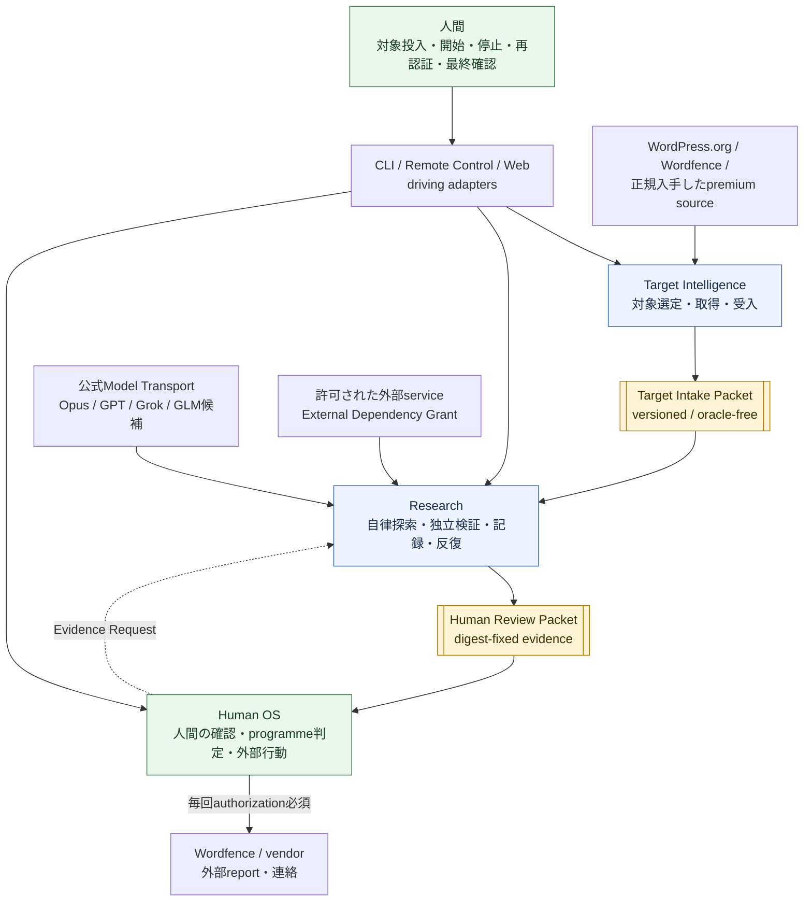
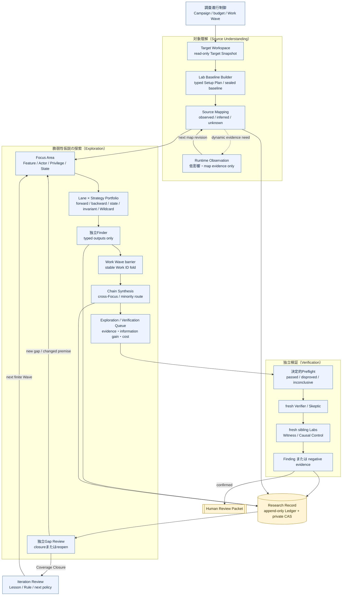
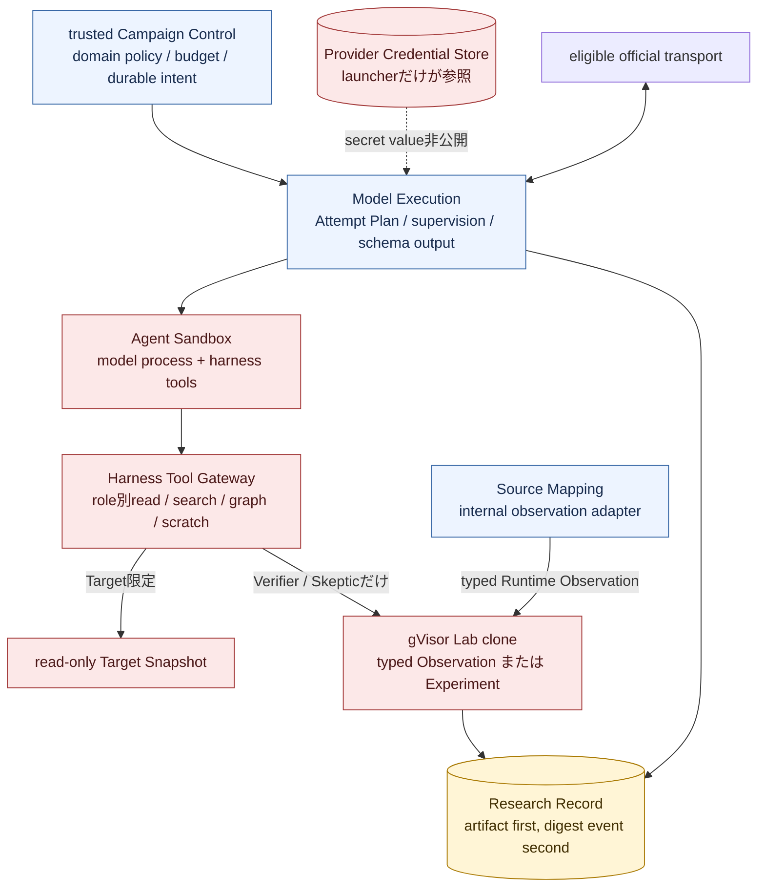

# アーキテクチャ概要

Status: accepted design overview, 2026-09-01

横長の一枚図ではGitHub上で縮小されるため、全体のcontext、Research内部、実行時の信頼境界を三枚に分ける。矢印は主なcommand、artifact、結果の流れであり、内部処理の厳密な時間順ではない。

## 1. System context

正本は`Target Intelligence -> Research -> Human OS`の順に進む。Human OSからResearchへ戻るのは、過去のFindingを変更しない新しいEvidence Requestだけである。

## 2. Research and exploration loop

- Surface Mapの全解析完了を待たず、stable anchorと明示gapを持つ最小revisionから探索を始める。
- Laneは探索目的、Strategyは探索方法であり、vulnerability class別agentを増やさない。
- Finder同士は会話せず、型付き成果物だけをWork Wave後のChain Synthesisへ渡す。
- 一つのmodelだけが示したsource-bound routeを多数決で捨てない。
- Runtime Observationはmapを補うだけで、Finding用のWitnessまたはCausal Controlには使わない。
- Coverage ClosureはFinderの自己申告ではなく、独立Gap Reviewを通す。

## 3. Execution and trust zones

AI workerはHarness Tool Gateway以外を操作できず、provider credential、container socket、host path、Research Ledger writerへ到達できない。FinderはTargetのread/search/graphと隔離scratchだけを使い、runtime操作はできない。VerificationだけがHypothesisに拘束したtyped Experimentを使う。

詳細なmodule ownershipは[Module architecture](module-architecture.md)、探索は[Exploration seam](exploration-seam.md)、AI実行は[Model execution seam](model-execution-seam.md)、setupは[Campaign setup seam](campaign-setup-seam.md)、対象理解は[Source mapping seam](source-mapping-seam.md)を正本とする。
