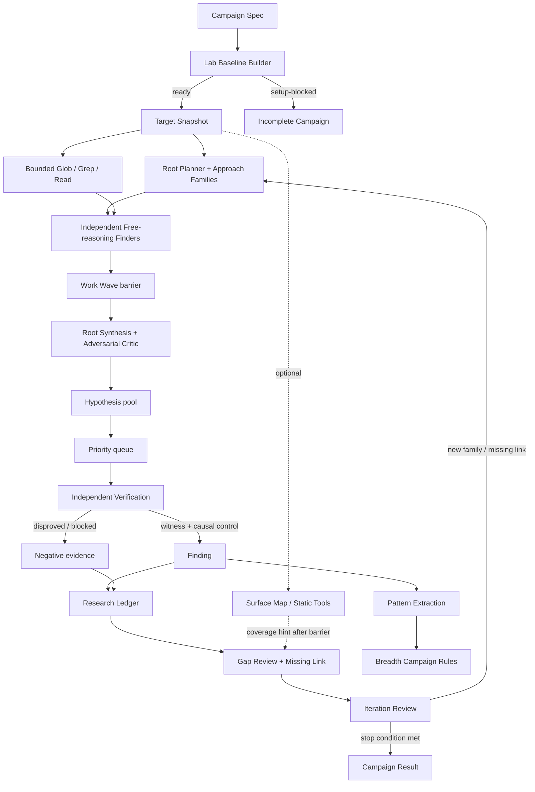
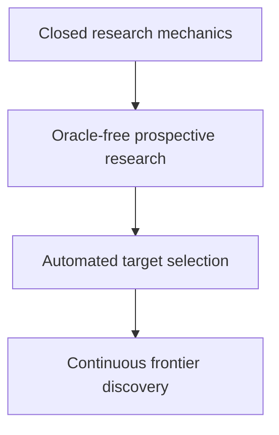

# Ten-verb architecture

Status: accepted baseline; exploration policy revised by ADR 0113 and ADR 0114, 2026-09-03

## Design intent

このharnessの目的は「LLMにpluginを読ませてreportを書かせる」ことではない。探索を広く保ちながら、各主張を独立した実証へ収束させ、失敗を次の探索へ再利用できる研究系を作ることである。North Starは、既知脆弱性のoracleなしにPermitted AttackerからRCEまたは同等のsite-wide compromiseへ至る未知routeを発見・実証できる`Frontier Discovery Capability`である。

探索判断の優先規則、Argusの10動詞、Anthropic Defending Code Reference Harnessの適用方法は[調査設計原則](research-design-principles.md)を最初の正本とする。

保存した[三つの設計参照資料](../REFERENCES.md)から次を土台にする。

- Wordfence Argus: `confine`から`iterate`までの10動詞、model agnostic、prompt・harness・task-specific model・deterministic programmingの組合せ
- Mandiant AVDH: threat modelからentry point、context enrichment、hypothesis generation、independent validation、human expert validationへ進む構造と、language/framework/vulnerability知識の階層
- Anthropic reference harness: search spaceの明示的partition、DiscoveryとVerificationの分離、executable witness、clean sandbox、反復がraw parallelismより重要という実務則

この初期設計では、旧`whitebox-harness`のcontract、queue、case、programme、submission subsystemをそのまま移植しない。旧版から維持するのは、Campaign開始後に人間の追加指示なしで探索・仮説更新・検証・次反復・停止まで進む完全自律性、固定sourceへの拘束、Discovery主張の独立Verification、private証拠の公開codeからの分離である。自律性の実装場所はroot agentの巨大Promptではなく、Campaign Control、有限Work Lease、Research Ledger、typed Iteration Decisionへ移す。

## Context architecture

大きな流れは`Target Intelligence -> Research -> Human OS`とする。「探索」だけではload-bearingなVerificationと反復を表せないため、中央contextのcanonical nameは`Research`とする。詳細な用語とhandoff ownershipは[Context Map](../../CONTEXT-MAP.md)に固定する。

```text
Target Intelligence -- Target Intake Packet --> Research
Research            -- Human Review Packet --> Human OS
Research            <-- Evidence Request ----- Human OS
```

- **Target Intelligence**: ecosystem observation、eligibility、ranking、source acquisitionを所有する。Oracle FactをResearchから隔離する。
- **Research**: Surface Map、Discovery、Verification、Research Ledger、priority、iterationを所有する。Findingまでは機械系の独立検証で作る。
- **Human OS**: review queue、独立した人間再現、Review Disposition、Evidence Request、External Action Authorizationを所有する。UIではなくdecision systemであり、Research Campaignの途中進行を承認する必須gateではない。

Target IntakeからCampaignを開始した後、Researchは原則として人間介入なしにterminalな停止理由まで進む。Human OSは確認または外部提出を行う下流contextであり、応答がなくてもResearchの探索loop、negative evidence記録、予算停止を妨げない。

Target IntelligenceはWordfence programme対象内の候補を外部提出価値のため優先するが、それを技術的Researchのhard gateにしない。選定の主要因は潜在impact、Permitted Attackerから到達し得る攻撃面、利用規模、現行安定版と更新状況、取得可能性とする。報奨金額とmodel confidenceは使わない。既知脆弱性の履歴を使う場合も、将来の低比重な脆弱性履歴集計に限り、元のOracle Factと集計値のどちらもResearchへ渡さない。詳細は[ADR 0095](../adr/0095-prioritize-targets-by-non-oracle-research-value.md)に記録する。

Milestone 2ではoperatorが最新安定版pluginを選び、手動対象投入を行い、readyになったTarget Intake PacketからCampaignを明示的に開始する。自動選定、候補queue、feed-driven rankingは行わず、Campaign開始後のResearchだけを自律化する。手動入力はsource、version、入手経路、必要な構成と環境依存に限定し、対象固有の脆弱性hintを拒否する。受入判定は`ready | deferred | rejected`を理由付きで残し、黙ってskipしない。詳細は[ADR 0096](../adr/0096-bootstrap-prospective-research-with-manual-intake.md)に記録する。

Target Acquisitionはuntrustedなsourceをhost上で実行せず、取得原本と正規化ファイル一覧を別々にdigest固定する。archiveまたはdirectoryのabsolute path、parent traversal、symlink・hardlink、device・FIFO・socket、正規化後のpath衝突、versioned quotaを超えるfile数・単体size・総展開sizeを拒否する。`ready`は安全なResearch handoffが作れたことだけを意味し、install・activate成功を保証しない。Canonical Configurationの構築はCampaign開始後のgVisor内で行い、失敗はセットアップ阻害の未完了Campaignとして記録する。詳細は[ADR 0097](../adr/0097-separate-source-admission-from-runtime-setup.md)に記録する。

source treeの主identityは正規化ファイル一覧のdigestとし、取得原本digestはprovenanceとして別に保持する。manifestは単一プラグインルートからの相対path、原文のfile bytesに対するdigest、sizeだけをsource contentへ反映し、改行・encoding・内容を変換しない。archive timestamp、owner、compression、local host pathはtree identityに含めない。一つのinstall対象を一意に決められない外側bundleは推測して展開せずdeferredとするが、確定済みplugin root内のarchive fileは通常のdata fileとして保存する。詳細は[ADR 0098](../adr/0098-identify-target-source-by-canonical-file-manifest.md)に記録する。

pluginの論理identityはdirectory名から作らず、WordPress.org版を`wporg:<slug>`、premium版を`premium:<vendor>/<product>`としてprovenanceへ固定する。主プラグインファイルは明示pathを検証するか、有効なplugin header候補が一つだけの場合に限り自動確定する。候補がゼロまたは複数ならdeferredとする。main header version、要求version、利用可能な配布metadataを照合し、値の不足はdeferred、矛盾はrejectedとする。詳細は[ADR 0099](../adr/0099-bind-plugin-identity-main-file-and-version.md)に記録する。

WordPress.org版の正規インストールディレクトリはofficial slugへ固定する。premium版はvendor配布provenanceまたは手動対象投入で明示し、`premium:<vendor>/<product>`から自動生成しない。正規インストールディレクトリと主プラグインファイルを結んだPlugin BasenameをTarget Intake PacketとTarget Snapshotへ固定する。別directoryでの調査はTarget Snapshotのcanonical値を変更せず、根拠付きConfiguration Variantとしてruntime evidenceへ結び付ける。詳細は[ADR 0100](../adr/0100-fix-the-canonical-plugin-basename.md)に記録する。

初期deploymentは一つのstrict TypeScript modular monolithとする。contextはnetwork serviceで分離せず、versioned contractとrecord ownershipで分離する。PHP parser helperだけをresource-limited child processにする。詳細は[ADR 0084](../adr/0084-use-a-modular-monolith.md)と[ADR 0085](../adr/0085-separate-target-intelligence-research-and-human-os.md)に記録する。

## Lineage from wp2shell

旧repositoryの原型は`wp2shell`の探索promptである。これは第4の設計参照資料ではなく、今回再設計するsystemの直接の祖先として扱う。

原型promptは、10動詞の多くをすでに一つのinstruction surfaceに圧縮していた。

| wp2shell promptの仕掛け | 対応するcontrol |
| --- | --- |
| fixed source、no internet、first-principles analysis | confine / constrain |
| `/flag`へ至る明確なgoal | focus / motivate |
| diverse approach portfolioとapproach-family registry | focus / hypothesize / record |
| convergenceしたworkerのredirectと複数routeの維持 | parallelize / prioritize |
| blocked routeはnew mechanismがある時だけ再開 | record / iterate |
| adversarial double-check | verifyの原型 |
| short-lived worker、tool-call ceiling | constrain |
| rootによるsynthesis、challenge、new rounds | prioritize / iterate |
| `research/<family>.md`と`REGISTRY.md` | record |
| consecutive empty wavesによる停止 | iterate / constrain |

ここから残すのは、強いgoal、異質な探索portfolio、family単位のregistry、blocked routeの明示、root synthesis、短いworker、反復的な停止判定である。ただしprompt内のお願いとしては残さず、Campaign Spec、Work Lease、Research Ledger、supervisor gateとしてharness側で強制または観測する。

そのまま残さないものも明確にする。

- 「既知のpre-auth RCEが必ずある」というpriorと`/flag` oracleは、prospective reviewではHypothesisを歪めるため使わない。
- aggressiveなfan-outは、Target inventoryとApproach Family Registryから作る重複しないleaseへ置き換える。Surface Mapは後段coverageへ利用できるが、Depthの最初のWaveでは探索境界にしない。
- adversarial agentの再読だけをVerificationと呼ばず、fresh context、独立再導出、clean runtimeのWitness、causal controlを要求する。
- agent自身へwall timeやbudget遵守を申告させず、外側のrunnerが測定して止める。
- free-form research noteは残せるが、昇格対象は最小Hypothesis contractを満たすものに限る。

したがって新設計はwp2shell promptを捨てるのではなく、promptの中で暗黙だった研究methodを10個の最上位設計原則として採用し、それぞれを観測可能なcontrol propertyへ外在化する。

## 最上位の10設計原則（Ten design principles）

| Verb | Harness control | Durable artifact | Observable gate |
| --- | --- | --- | --- |
| Confine | Targetをlocal sandboxに置き、sourceをread-only、研究出力だけをwriteableにし、未宣言egressを閉じる | Workspace receipt / External Dependency Grant | 許可外path・host・networkへ到達できない |
| Constrain | Campaign開始前にscope、attacker premise、budget、許可tool、停止条件を固定する | Campaign Spec | 上限超過、scope逸脱、identity driftを実行系が拒否する |
| Focus | 高水準のsecurity goalと具体的なfrontier gapを与え、読む順序とpivotはFinderへ任せる | Campaign Goal / Approach Family Registry | 全assignmentが異なる研究ideaを持ち、固定手順がTarget全体へのpivotを妨げない |
| Motivate | workerへ抽象的な「scan」ではなく、security goal、成功証拠、未解決gap、残予算を渡す | Assignment | 次の行動がgoalまたはgapに結び付く |
| Parallelize | 意味の異なるApproach Familyを独立Finderへleaseし、barrierまで成果を相互に見せない | Work Lease / Wave Barrier | 同じpromptの複製や表面的な言い換えを多様性と数えない |
| Hypothesize | DiscoveryとChain Synthesisがpremise、route、impact、反証条件、不足証拠を持つHypothesisを作る | Hypothesis / Route Fragment / Frontier Gap | 自由文verdict、model多数決、単純なgraph結合だけの候補を受理しない |
| Verify | fresh contextでrouteを再導出し、programmatic gate、Witness、causal control、skeptical reviewを通す | Verification Record | Discovery transcriptやwritable stateを根拠にしない |
| Record | positive/negativeをResearch Ledgerへ追記し、証拠と決定をcontent hashで結ぶ | Ledger / Evidence | Findingからsource、Experiment、Witnessまで辿れる |
| Prioritize | impactだけでなく、attacker premise、route evidence、novelty、information gain、検証費用、coverage debtでqueueを更新する | Priority Snapshot | LLMのscore、confidence、支持model数で順序を決めない |
| Iterate | 各Wave後にchain、gap、family state、priority、Lesson、rule、次の問いを更新する | Root Synthesis / Gap Review / Iteration Review | 前回と同じ探索を理由なく繰り返さない |

10動詞は全設計判断を評価する最上位原則であり、直列のphaseではない。たとえば`record`は全phaseに作用し、`confine`と`constrain`はworkerだけでなくverifierにも作用する。`parallelize`は`focus`の後にだけ価値を持ち、`iterate`は一回の大規模fan-outより短い証拠loopを優先する。

## Research loop



### Campaign lifecycle

1. `prepare`: 一つの主対象Target Snapshot、必要最小限の環境依存、scope、検証予約を含む予算枠、sandbox policyを固定する。
2. `setup`: digest固定したRuntime Profileと版付き・型付きSetup Planを使ってgVisor内にCanonical Configurationを構築し、客観的な正常機能確認を経てLab Baselineをsealする。失敗はセットアップ阻害として停止する。
3. `plan`: Target inventory、過去artifact、未解決gapから、意味の異なるApproach Familyと有限Work Waveを選ぶ。固定Strategyを実行手順にしない。
4. `discover`: raw sourceへ拘束したGlob/Grep/Readを使う分離workerが自由にpivotし、HypothesisとRoute Fragmentを作る。最初のDepth WaveへSurface Map routeを見せない。
5. `synthesize`: Wave barrier後にRoot Synthesisがprimitiveを接続し、Adversarial Criticが成立しないhopとoracle的補完を攻撃する。不足primitiveはfreshなMissing-link Waveへ送る。
6. `verify`: 優先Hypothesisを別contextとclean runtimeで反証しに行く。
7. `review`: positive/negative/blocked evidenceをまとめ、family state、coverage debt、Lesson、priorityを更新する。必要な場合だけ後段Map-assisted coverageを行う。
8. `repeat | stop`: 次のiterationへ進むか、停止理由を確定する。

検証済みFindingのうち構文的に一般化できる部分は、positiveとnegative fixtureを持つSemgrep/CodeQL ruleへ変換し、別のBreadth Campaignで横展開する。static ruleはDepth Campaignの代替またはclosure gateにしない。

停止は「agentが完了と言った」ではなく、少なくとも次のどれかで決める。

- Campaignの予算枠を消費した（未完了として停止）
- すべてのin-scope Approach Familyがterminal状態になり、blocked routeに再開条件が記録された
- 連続Waveで新しいsource evidence、Route Fragment、idea familyが生まれず、Criticも新mechanismを提示できなかった
- operatorが明示的にCampaign取消またはscope変更を行った
- sandbox、target identity、toolingの異常で結果を信頼できない

## Research deep modules and seams

context内部のmodule ownership、許可・禁止依存、record ownership、target source layoutは[Module architecture](module-architecture.md)に固定する。

外部から見えるcommand interfaceは一つに保ち、queryをread-only readerへ分ける。

```text
CampaignRunner.prepare(NewCampaignInput) -> PreparedCampaign
CampaignRunner.run(CampaignRunPlan)       -> CampaignRunRecordRef
CampaignReader.read | inspect(...)        -> View
```

CampaignRunnerはResearch Ledgerをreplayし、固定PlanをterminalなIteration Decisionまで進めるevent-sourced reconcilerである。`run`は新規開始、通常継続、crash resumeに同じ経路を使い、phase別commandをcallerへ公開しない。現行production sliceは一つの有限Work Waveと次Decisionまでを一回の`run`で閉じる。到達形では`continue-unresolved-work`を内部で次Waveへ消費し、人間の追加入力なしにbudgetまたはclosureまで反復する。reconcilerの由来は[ADR 0058](../adr/0058-drive-campaigns-through-an-event-sourced-reconciler.md)、現在のpublic APIは[Campaign execution seam](campaign-execution-seam.md)と[ADR 0110](../adr/0110-expose-plan-bound-run-instead-of-incremental-advance.md)に記録する。

callerがworker数、prompt順、provider session、artifact file名を知る必要はない。CampaignRunnerのimplementationが次のmoduleを所有する。

| Module | Interface at the seam | Hidden implementation |
| --- | --- | --- |
| Target Workspace | `open(TargetRef, Policy) -> Workspace` | snapshot identity、read/write mounts、network policy、cleanup |
| Lab Baseline Builder | `establish(TargetSnapshot, RuntimeProfile, SetupPlan) -> SetupDisposition` | Plan validation、gVisor setup、dependency ordering、principal、health・正常機能確認、sealing |
| Model Execution | `run(AttemptPlan) -> AttemptExecutionResult` | transport適格性、provider認証、role別tool、process supervision、schema output、resume |
| Source Mapping | `build(SurfaceMappingInput) -> SurfaceMapRef` | PHP Program Index、asset inventory、根拠状態、bounded context、Mapper synthesis、Runtime Observation、immutable revisions |
| Exploration | `decide(ExplorationDecisionInput) -> ExplorationDecision` | Focus Area、Lane/Strategy allocation、minority preservation、Chain Synthesis、ranking、Gap Review、reopen/closure |
| Research Ledger | `append(Event)` / `view(Query)` | append-only storage、hashing、index、redaction |
| Verifier | `verify(Hypothesis, TargetSnapshot) -> VerificationRecord` | fresh sandbox、re-derivation、category-specific Experiment、judge |
| Human Review Packager | `prepare(FindingRef) -> HumanReviewPacketRef` | evidence minimization、digest binding、source excerpts、reproduction recipe |
| Learner | `review(Iteration) -> LessonsAndPlan` | transcript retro、rule proposals、benchmark deltas |

Model ExecutionはPrompt Set、Model Profile、role別tool policy、Output Schema、Attempt ceiling、retry、usage accountingを所有する。provider adapterはversion固定したProfileを公式CLI argvまたはwire formatへ変換し、正規化Outcomeを返すだけで、Campaign lifecycleを所有しない。Agent SDKへcross-Attempt orchestrationを委譲しない。詳細は[Model execution seam](model-execution-seam.md)と[ADR 0060](../adr/0060-keep-model-execution-policy-outside-provider-adapters.md)に記録する。

subscription modelはprovider公式のnative agent processを優先するが、公式配布・公式用途、version固定、built-in tool無効化、credential isolation、structured output、process terminationのcapability probeを通過したTransport Eligibility Receiptがある場合だけproductionへ採用する。consumer OAuthまたはsubscription keyを独自APIへ転用せず、条件を満たさない候補は保留する。Direct APIは公式API/service credentialを別途導入した場合だけ追加する。詳細は[ADR 0104](../adr/0104-admit-only-official-model-transports.md)に記録する。

一時的なprovider failureでは同じCLI sessionをresumeできるが、一回のprocess invocationをAttempt内の`Segment`として個別に記録する。session resumeは同じfrozen inputsと外部ceilingの内側だけで行い、別Work Lease、独立Verification、Skepticへcontextを引き継がない。詳細は[ADR 0062](../adr/0062-resume-provider-sessions-only-within-an-attempt.md)に記録する。

runtimeはtrusted CampaignRunner、per-Attempt Agent Sandbox、disposable WordPress Verification Labの三zoneへ分ける。Agentはcontainer socketを持たず、versioned typed Experiment brokerだけを通してLabを操作する。AgentとLabはgVisor相当以上で隔離し、利用不能時にhost executionへfallbackしない。詳細は[ADR 0063](../adr/0063-separate-the-orchestrator-agent-and-target-trust-zones.md)に記録する。

Agent Sandboxのegressはprovider通信だけに制限する。Verification Labはdefault-denyだが、pluginの通常機能またはHypothesisが外部serviceを必要とする場合、local emulator、record/replay、live `External Dependency Grant`の順で選ぶ。live接続はproxyが最小scopeと上限を強制し、Experimentをnon-hermeticと記録する。詳細は[ADR 0064](../adr/0064-gate-live-plugin-egress-with-external-dependency-grants.md)に記録する。

live service credentialはtrusted Credential BrokerがSecretRefとして管理し、原則proxyで最終requestへ注入する。plugin自身がcredentialを読む必要がある時だけGrantへ`target-visible`を明示し、Campaign専用かつ期限付きのtest credentialをLabへ渡す。Agentとartifactにはsecret値を渡さない。詳細は[ADR 0065](../adr/0065-broker-live-service-credentials.md)に記録する。

workerへはhash固定したharness所有toolだけを公開する。Target限定read/search/graph queryと、credential・network・host pathを持たない隔離scratch computeをrole別manifestで与え、provider組込みshell、filesystem tool、web、plugin、hook、ambient MCP、memory、subagentを無効にする。FinderにはRuntime ObservationまたはExperimentを渡さず、Source Mappingだけが内部seamから低影響なObservation Planを実行し、Verifierと必要なSkepticだけへWork Leaseとmechanismに拘束したtyped Experiment toolを追加する。詳細は[ADR 0105](../adr/0105-expose-only-harness-owned-attempt-tools.md)と[ADR 0108](../adr/0108-observe-dynamic-mapping-with-typed-lab-plans.md)に記録する。

初期production isolation backendはgVisor `runsc`とし、Agent SandboxとVerification Labの両方へ要求する。plain Dockerはsynthetic fixtureの開発用`non-evidentiary` modeだけで許可し、その結果をFindingまたはbenchmark evidenceへ昇格させない。詳細は[ADR 0067](../adr/0067-require-gvisor-for-production-evidence.md)に記録する。

WitnessとCausal Controlは、同じsealed Lab Baselineから生成した別々のfresh sibling Labで実行する。両者は一つのcausal factor以外を同じにし、先行実行のdatabase、cache、session、filesystemを共有しない。詳細は[ADR 0068](../adr/0068-run-witness-and-control-in-sibling-labs.md)に記録する。

最初のvertical sliceはTransport Eligibilityを満たした場合のClaude process/Opus Profile一つでbootstrapし、end-to-end evidenceとresumeが安定してからGLM、Codex、Grok候補を個別probe後に追加する。これはadapter実装順であり、4候補を全roleで比較するbenchmark判断とは分離する。bootstrap順は[ADR 0069](../adr/0069-bootstrap-with-the-claude-process-adapter.md)、適格性条件は[ADR 0104](../adr/0104-admit-only-official-model-transports.md)に記録する。

Adapter seamは、現実に二つ以上の実装が必要な場所だけに置く。初期からprovider、container runtime、ledger backendの抽象化frameworkを作らない。最初の実装が動き、二つ目が必要になった時点でinterfaceを抽出する。

PHP Source Analysisは、Composer lockした`nikic/PHP-Parser` helperをresource-limited child processとして実行する。Target Snapshotはread-only、networkはdenyとし、target PHP、target autoloader、target Composer script、WordPress bootstrapを実行しない。TypeScript coreへ渡すのはruntime schemaで検証したversioned `PHP Program Index`だけである。初期実装が一つの間は汎用Parser portを作らず、tree-sitter等は実測したcoverage gapが第二実装を正当化した時だけ評価する。詳細は[ADR 0074](../adr/0074-extract-php-through-a-pinned-parser-helper.md)に記録する。

Milestone 1のPHP Program Indexはgeneric symbol・call relationとWordPress固有factのdeterministic inventoryに限定し、汎用taint analysisまたはvulnerability verdictを持たせない。これにより最初のsliceを閉じながら、Source Mapping内部のMapperとDiscoveryが記録されたread-only context経由でmulti-file routeを仮説化する余地を保つ。

## WordPress-specific focusing

Source Mapping内部のMapperはfileを均等分割しない。最初に次を抽出し、実行可能なrouteとして関連付ける。

- REST routes、AJAX actions、`admin_post`、shortcodes、blocks、widgets、cron、WP-CLI、direct-access PHP
- callbackの登録条件と到達role
- nonce、capability、authentication、object ownershipのguard
- request、cookie、header、upload、database option/post metaから入るdata
- database、HTML/JS context、filesystem、HTTP、deserialization、dynamic callなどのsink
- install/upgrade/uninstall hook、multisite差分、third-party framework、shared helper

RCE-oriented focusingでは、単一の危険関数だけでなく、uploadまたはwriteからexecutable pathへ至るroute、path manipulation、command invocation、unsafe deserializationとgadget、dynamic includeまたはevaluation、template execution、権限獲得からcode変更へ至るchainをsecurity property単位で扱う。この列挙は固定checklistではなく、Surface Mapと実測したgapから拡張する。SQL injection、Stored XSS、account takeoverを別queueへ追放せず、それ自体のimpactと重大routeへのchain可能性を記録する。

初期Focus Areaはvulnerability classだけで固定しない。たとえば「unauthenticated AJAXから永続stateへ入る全route」「subscriberがobject ownershipを越えるREST mutation」「stored valueがadmin HTML attributeへ出る経路」のように、attacker premise × surface × security propertyで切る。workerは担当file外のcalleeやguardを追ってよいが、Hypothesisの所有権はFocus Areaに残す。

現行Map-first実装はFocus Areaと固定Strategyを使うが、これは移行元であり到達形ではない。Depth CampaignではRoot Plannerがraw source全体から最大4個の独立したApproach Familyを割り当て、Finder自身が読む順序、pivot、機能間の接続を自由に決める。entry-forward、sink-backward、state-chain等は開始時のlensまたは観測labelに限り、探索手順や提出可能routeを制限しない。Surface Map、AST、Semgrep、CodeQLのnon-matchを候補棄却またはclosureに使わない。詳細は[Exploration seam](exploration-seam.md)、[ADR 0113](../adr/0113-keep-finder-methods-free-behind-an-evidence-shell.md)、[ADR 0114](../adr/0114-separate-breadth-and-depth-campaign-policies.md)、[ADR 0116](../adr/0116-use-four-finder-slots-per-depth-wave.md)に記録する。

Surface MapはTarget SnapshotとMapping Profileへ固定した不変revisionとし、nodeとrelationを`observed`、`inferred`、未解決（`unknown`）に分ける。PHP Program Indexとtyped Runtime Observationのobserved factをmodelが上書きせず、追加contextは理由付きContext Request、dynamic evidenceは低影響な`runtime-revision`として記録する。通常の初期mapはLab完成を待たず、Runtime Observationを使うrevisionだけをsealed Lab Baselineへ固定する。PHPを骨格に関連するJavaScript、template、SQL、configuration、bundled vendor assetを接続し、未解析assetをcoverage gapとして残す。詳細は[Source mapping seam](source-mapping-seam.md)、[ADR 0103](../adr/0103-build-evidence-graded-surface-map-revisions.md)、[ADR 0108](../adr/0108-observe-dynamic-mapping-with-typed-lab-plans.md)に記録する。

## Hypothesis contract

最初のcontractは小さくする。必須なのは次だけである。

```yaml
id: stable local identity
focus_area: owning partition
attacker_premise: role, access, initial control
security_property: property that may fail
evidence_route:
  nodes: attacker-control, entry, guard, transform, state-write/read, dispatch, sink, impact
  edges: typed causal relations with observed, inferred, or unknown evidence state
impact: concrete terminal effect
unknowns: facts still required
falsifier: observation that would disprove it
next_experiment: cheapest decisive action
```

Hypothesisにconfidence scoreやseverityを必須にしない。もっともらしさの数字は証拠の代用になりやすい。Priorityは、観測済みpremise、route completeness、terminal impact、information gain、novelty、検証費用、coverage debtから決定的に計算し、同点はstable identityで解消する。支持model数またはmodel judgementをpriorityへ使わない。

Evidence Routeは一つのpremiseから一つのimpactまでを表す最小のtyped causal subgraphである。Hypothesisではinferredまたはunknown relationを許すが、各gapにfalsifierと次のExperimentを要求する。Findingのessential routeにはunknownを残さず、Verifierがsourceとruntime evidenceから独立に再導出する。cross-requestまたはpersistent chainはstate-writeとstate-readを分け、保存identityを明示する。詳細は[ADR 0077](../adr/0077-represent-each-hypothesis-with-an-evidence-route.md)に記録する。

同じTarget Snapshot内で観測済みの連続subgraphはRoute Fragmentとして共有できる。FragmentはTarget digestとsource/Experiment evidenceへ拘束し、別Hypothesisの接続edgeまたはimpactを証明しない。別Targetへの一般化はLesson ProposalまたはRule Proposalとしてgateする。詳細は[ADR 0080](../adr/0080-reuse-only-target-bound-verified-route-fragments.md)に記録する。

Finder同士は会話せず、Work Waveがterminalになった後に型付きRoute Fragment、Hypothesis、state transitionだけをstable orderでChain Synthesisへ渡す。ATO、Stored XSS、SQL injection等を新しいstate、privilege、execution capabilityとして別Focus Areaのrouteへ接続できるが、接続結果は新しいHypothesisでありFindingではない。一つのmodelだけが提示したsource-bound routeを多数決で捨てず、相反するrouteは決定的PreflightまたはVerificationまで別artifactとして保持する。詳細は[ADR 0107](../adr/0107-synthesize-cross-focus-chains-at-wave-barriers.md)に記録する。

## Verification is the load-bearing module

VerifierはDiscovery workerのconversation、scratch files、自己評価を受け取らない。受け取るのは固定Target Snapshotと最小Hypothesisだけである。

Verificationは次の順序にする。

1. source routeとattacker premiseを独立に再導出する
2. category-specificなcheap gateで不成立候補を落とす
3. cleanなlocal WordPress runtimeへ最小Experimentを構築する
4. security propertyの破壊をobjective Witnessで観測する
5. causal factorを一つ除いたnegative controlで消失を確認する
6. skepticが反証、compensating control、scopeを確認する
7. humanがexternal disclosure前に再現する

実行環境または必要な前提を構築できず、security propertyの破壊を機械検査可能なWitnessとして確認できないものは、source argumentが強くてもFindingへ昇格させずBlockedとして残す。

Frontier Hypothesisは異なるExecution Canaryとfresh sibling LabsによるIndependent Reproductionを二回成功させ、その後Human Confirmationへ送る。第二Verifierは第一Attemptのpayloadまたはraw evidenceを受け取らず、routeとExperimentを再導出する。詳細は[ADR 0081](../adr/0081-require-two-independent-reproductions-for-frontier-findings.md)に記録する。

Skepticを通過したFindingは、必要証拠をdigest固定したHuman Review PacketとしてHuman OSへ渡す。Human OSのReview DispositionはResearch Ledgerの過去eventを変更せず、別のappend-only human decision recordへ残す。`more-evidence-required`の場合はEvidence Requestから新しいWork LeaseまたはExperimentを作り、元のpacketと結果を保持する。

Milestone 2以降は、eligibleなProfileがある限りFinder、二つのVerifier、Skepticを異なるmodel familyへ分散する。分離不能時はModel Separation Exceptionを残し、同一familyの複数runを異種model reviewと同等に数えない。詳細は[ADR 0082](../adr/0082-diversify-model-families-across-frontier-review.md)に記録する。

RCE Experimentは`executable-upload`、`command-injection`、`dynamic-php-execution`、`object-injection-gadget`のtyped Planとして始める。Experiment Brokerのinterfaceは`execute(ExperimentPlan) -> ExperimentObservation`一つに保ち、mechanism固有adapterを内部seamに置く。成功証拠はLab内のExecution Canaryに限定し、file uploadまたはfile writeだけをRCEと呼ばない。詳細は[ADR 0078](../adr/0078-verify-rce-with-mechanism-specific-canary-experiments.md)に記録する。

## Recording without rebuilding the old harness

Research Ledgerはeventの少数typeから始める。

- `campaign.started`
- `surface.observed`
- `focus.leased | focus.closed`
- `hypothesis.proposed | hypothesis.merged`
- `experiment.planned | experiment.observed`
- `verification.decided`
- `lesson.proposed | lesson.accepted`
- `iteration.closed`
- `campaign.stopped`

eventには`who / when / input refs / output refs / cost / reason`を持たせる。artifactごとの専用JSON Schema、複数のmirror state、provider固有session objectは、実測で必要になるまで作らない。Ledgerから再構成できるprojectionを正本と同時に更新しない。

保存層はsingle-writer SQLiteのappend-only event tableと、Git外のprivate content-addressed artifact storeに分ける。小さな因果記録とtransaction境界はLedgerが持ち、大きなtranscript、tool receipt、trace、Witnessは先にartifact storeへdurable writeしてからdigestだけをeventへ記録する。詳細は[ADR 0056](../adr/0056-store-the-ledger-in-sqlite-and-evidence-in-a-cas.md)に記録する。

event schemaはkindごとにversionを持ち、過去eventを更新せず純粋なupcasterで現在型へ変換する。未知kind/versionは読み飛ばさずCampaignを変更しないまま停止する。過去Ledger fixtureのreplay testを互換性の基準とする。詳細は[ADR 0057](../adr/0057-evolve-ledger-events-with-versioned-upcasters.md)に記録する。

## Iteration and evaluation

一iterationは「全workerが止まるまで」ではなく、priority上位の有限batchで閉じる。reviewは次を決める。

各batchは開始前にassignmentを確定するWork Waveとする。結果は到着時に保存するが、全Attemptがterminalになるまで次Waveを計算せず、stable Work ID順にfoldする。これによりprovider response順が次の研究方針を変えない。詳細は[ADR 0059](../adr/0059-schedule-parallel-work-in-deterministic-waves.md)に記録する。

探索Work Waveは、表現ではなくmechanismとpremiseで分けた複数の`Approach Family`から構成する。固定LaneやStrategyを提出可能routeの制限にせず、相容れないresearch ideaを複数round維持する。Surface Mapや静的ruleは任意の補助入力であり、raw-source探索を置き換えない。詳細は[ADR 0113](../adr/0113-keep-finder-methods-free-behind-an-evidence-shell.md)に記録する。旧三Lane必須方針は[ADR 0076](../adr/0076-compose-each-work-wave-from-three-exploration-lanes.md)に履歴として残す。

- confirmed routeのvariantをどこへ探すか
- disproved Hypothesisから除外規則を作れるか
- blocked Hypothesisに不足したtool/contextは何か
- untouched surfaceと重複探索はどこか
- LessonをWordPress core、language、framework、vulnerability familyのどの階層へ置くか
- 同じTargetで続ける価値と、次Targetへ移る価値のどちらが高いか

Frontier workではmodel confidenceを使わず、Permitted Attacker、terminal impact、observed Route Fragment、Frontier Gapの決定可能性、次のExperiment費用、novelty、coverage debtをpriority tupleへ加える。Frontier Gapは未確認edgeの個数ではなく、必要fact、falsifier、次のExperimentを持つessential causal relationである。詳細は[ADR 0079](../adr/0079-prioritize-frontier-work-by-observed-route-gaps.md)に記録する。

prompt、model、Lesson、priority policyを変更する時はversionを上げる。日常の改善は実戦Campaignのverified Finding、false-positive rejection、surface coverage、cost、time、run varianceを主に比較し、小さなDevelopment Cohortで安全性と明白な回帰を確認する。高リスクなpolicyまたはKnowledge昇格だけSealed Evaluation Cohortを使う。一つの成功例、一回のrun、既知Caseの再発見を能力向上の証拠にしない。

Researcher Reference Corpusから作るKnowledge Capsule候補はtarget identity、CVE、固有symbol、payload、patch informationをrendered promptから除き、Oracle Leakage Gateを通す。由来Caseを除いたDevelopment評価とSealed Evaluationで改善を示すまでglobal Knowledgeへ昇格させない。詳細は[ADR 0083](../adr/0083-gate-corpus-derived-knowledge-against-oracle-leakage.md)に記録する。

## Implementation language

coreはstrict TypeScriptとする。Campaign stateとExperiment evidenceをversioned discriminated unionで表し、すべての外部入力をruntime schemaでdecodeする。provider HTTP、subprocess、container、browser待ちが中心となるため、Nodeの非同期実行で十分であり、Playwrightを含むVerificationまで同じ型を共有する。

PHPは`nikic/PHP-Parser` helperにだけ使用し、Campaign stateを所有させない。PythonはCampaignの正本を持たない補助解析toolとして許容する。Goはprocess supervisionまたはCPU-bound処理が実測上の主負荷になった時だけ再評価する。詳細は[ADR 0055](../adr/0055-use-strict-typescript-for-the-core.md)と[ADR 0074](../adr/0074-extract-php-through-a-pinned-parser-helper.md)に記録する。

## Capability growth

Architectureの拡張は水平な部品数ではなく、実戦で閉じる縦の能力を一つずつ増やす。



各増分はTargetからterminal outcomeまでを通し、公開InterfaceのBehavior Testと実戦Campaignの観測で評価する。現在の完了状態は[Codebase Guide](../CODEBASE-GUIDE.md)、次の有限作業はGitHub Issues、能力の順序は[Roadmap](roadmap.md)を正本とする。過去の最初の実装計画は[history](../history/README.md)へ凍結する。

## Source material

設計資料の正本URLは[Design references](../REFERENCES.md)に保存する。資料から確認できる事実と、そこから導いたこちらの設計判断は[Research synthesis](../research/agentic-source-review-ten-verbs.md)で分けて記録する。

目指す研究成果とmechanism breadthは[daroo researcher reference](../research/daroo-researcher-reference.md)も参照する。これはarchitectureを正当化する第4のDesign referenceではなく、公開Findingからcoverage gapを作るResearcher Referenceである。public vulnerability detailsをprospective workerへ渡すoracleにはしない。

Wordfenceのprogramme適格性と共通誤検出基準の現行一次資料は[Wordfence programme scope and false-positive controls](../research/wordfence-programme-scope.md)に版付きで記録する。これも設計原理を追加する資料ではなく、Target選定、Verification、外部提出判定に使う変更可能なprogramme evidenceである。
