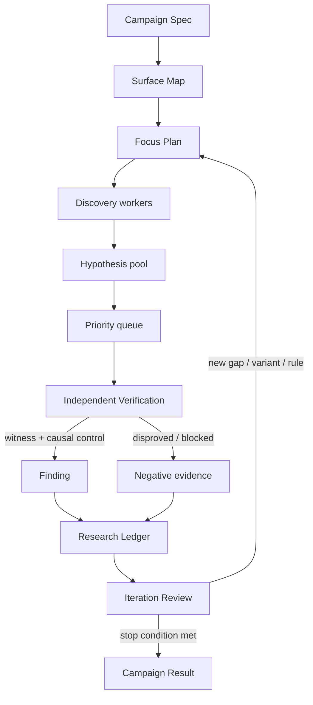

# Ten-verb architecture

Status: Design Baseline v0.1, 2026-09-01

## Design intent

このharnessの目的は「LLMにpluginを読ませてreportを書かせる」ことではない。探索を広く保ちながら、各主張を独立した実証へ収束させ、失敗を次の探索へ再利用できる研究系を作ることである。North Starは、既知脆弱性のoracleなしにPermitted AttackerからRCEまたは同等のsite-wide compromiseへ至る未知routeを発見・実証できる`Frontier Discovery Capability`である。

保存した[三つの設計参照資料](../REFERENCES.md)から次を土台にする。

- Wordfence Argus: `confine`から`iterate`までの10動詞、model agnostic、prompt・harness・task-specific model・deterministic programmingの組合せ
- Mandiant AVDH: threat modelからentry point、context enrichment、hypothesis generation、independent validation、human expert validationへ進む構造と、language/framework/vulnerability知識の階層
- Anthropic reference harness: search spaceの明示的partition、DiscoveryとVerificationの分離、executable witness、clean sandbox、反復がraw parallelismより重要という実務則

この初期設計では、旧`whitebox-harness`のcontract、queue、case、programme、submission subsystemを移植しない。旧版から維持するのは、固定sourceに結び付けること、Discoveryの主張をVerificationで再導出すること、privateな証拠を公開codeから分離すること、の三原則だけである。

## Context architecture

大きな流れは`Target Intelligence -> Research -> Human OS`とする。「探索」だけではload-bearingなVerificationと反復を表せないため、中央contextのcanonical nameは`Research`とする。詳細な用語とhandoff ownershipは[Context Map](../../CONTEXT-MAP.md)に固定する。

```text
Target Intelligence -- Target Intake Packet --> Research
Research            -- Human Review Packet --> Human OS
Research            <-- Evidence Request ----- Human OS
```

- **Target Intelligence**: ecosystem observation、eligibility、ranking、source acquisitionを所有する。Oracle FactをResearchから隔離する。
- **Research**: Surface Map、Discovery、Verification、Research Ledger、priority、iterationを所有する。Findingまでは機械系の独立検証で作る。
- **Human OS**: review queue、独立した人間再現、Review Disposition、Evidence Request、External Action Authorizationを所有する。UIではなくdecision systemである。

初期deploymentは一つのstrict TypeScript modular monolithとする。contextはnetwork serviceで分離せず、versioned contractとrecord ownershipで分離する。PHP parser helperだけをresource-limited child processにする。詳細は[ADR 0084](../adr/0084-use-a-modular-monolith.md)と[ADR 0085](../adr/0085-separate-target-intelligence-research-and-human-os.md)に記録する。

## Lineage from wp2shell

旧repositoryの原型は`wp2shell`の探索promptである。これは第4の設計参照資料ではなく、今回再設計するsystemの直接の祖先として扱う。

原型promptは、10動詞の多くをすでに一つのinstruction surfaceに圧縮していた。

| wp2shell promptの仕掛け | 対応するcontrol |
| --- | --- |
| fixed source、no internet、first-principles analysis | confine / constrain |
| `/flag`へ至る明確なgoal | focus / motivate |
| diverse approach portfolioとapproach-family registry | focus / hypothesize / record |
| convergenceしたworkerのredirectと複数routeの維持 | parallelize / prioritize |
| blocked routeはnew mechanismがある時だけ再開 | record / iterate |
| adversarial double-check | verifyの原型 |
| short-lived worker、tool-call ceiling | constrain |
| rootによるsynthesis、challenge、new rounds | prioritize / iterate |
| `research/<family>.md`と`REGISTRY.md` | record |
| consecutive empty wavesによる停止 | iterate / constrain |

ここから残すのは、強いgoal、異質な探索portfolio、family単位のregistry、blocked routeの明示、root synthesis、短いworker、反復的な停止判定である。ただしprompt内のお願いとしては残さず、Campaign Spec、Work Lease、Research Ledger、supervisor gateとしてharness側で強制または観測する。

そのまま残さないものも明確にする。

- 「既知のpre-auth RCEが必ずある」というpriorと`/flag` oracleは、prospective reviewではHypothesisを歪めるため使わない。
- aggressiveなfan-outは、Surface MapとFocus Planを作った後の重複しないleaseへ置き換える。
- adversarial agentの再読だけをVerificationと呼ばず、fresh context、独立再導出、clean runtimeのWitness、causal controlを要求する。
- agent自身へwall timeやbudget遵守を申告させず、外側のrunnerが測定して止める。
- free-form research noteは残せるが、昇格対象は最小Hypothesis contractを満たすものに限る。

したがって新設計はwp2shell promptを捨てるのではなく、promptの中で暗黙だった研究methodを10個のcontrol propertyへ外在化する。

## The ten controls

| Verb | Harness control | Durable artifact | Observable gate |
| --- | --- | --- | --- |
| Confine | Targetをlocal sandboxに置き、sourceをread-only、研究出力だけをwriteableにし、未宣言egressを閉じる | Workspace receipt / External Dependency Grant | 許可外path・host・networkへ到達できない |
| Constrain | Campaign開始前にscope、attacker premise、budget、許可tool、停止条件を固定する | Campaign Spec | 上限超過、scope逸脱、identity driftを実行系が拒否する |
| Focus | Surface Mapから重複しないFocus Areaを作り、明示的な問いとclosure conditionを与える | Surface Map / Focus Plan | 全assignmentが所有範囲を持ち、未所有surfaceが見える |
| Motivate | workerへ抽象的な「scan」ではなく、security goal、成功証拠、未解決gap、残予算を渡す | Assignment | 次の行動がgoalまたはgapに結び付く |
| Parallelize | 同じpromptの複製ではなく、partitionしたFocus Areaまたは独立validationをleaseする | Work Lease | 二つのactive workerが同じclaimを所有しない |
| Hypothesize | Discoveryはpremise、route、impact、反証条件、不足証拠を持つHypothesisを作る | Hypothesis | 自由文verdictだけの候補を受理しない |
| Verify | fresh contextでrouteを再導出し、programmatic gate、Witness、causal control、skeptical reviewを通す | Verification Record | Discovery transcriptやwritable stateを根拠にしない |
| Record | positive/negativeをResearch Ledgerへ追記し、証拠と決定をcontent hashで結ぶ | Ledger / Evidence | Findingからsource、Experiment、Witnessまで辿れる |
| Prioritize | impactだけでなく、attacker premise、reachability evidence、novelty、information gain、検証費用でqueueを更新する | Priority Snapshot | LLMの自称severityだけで順序を決めない |
| Iterate | 各batch後にmap、priority、Lesson、rule、次のFocus Planを更新する | Iteration Review | 前回と同じ探索を理由なく繰り返さない |

10動詞は直列のphaseではない。たとえば`record`は全phaseに作用し、`confine`と`constrain`はworkerだけでなくverifierにも作用する。`parallelize`は`focus`の後にだけ価値を持ち、`iterate`は一回の大規模fan-outより先に選ぶ。

## Research loop



### Campaign lifecycle

1. `prepare`: Target Snapshot、scope、budget、sandbox policyを固定する。
2. `map`: WordPress固有のentry pointとsecurity-relevant relationを列挙する。
3. `plan`: coverageとexpected information gainからFocus Areaを選ぶ。
4. `discover`: 分離したworkerがfalsifiableなHypothesisを作る。
5. `verify`: 優先Hypothesisを別contextとclean runtimeで反証しに行く。
6. `review`: positive/negative evidenceをまとめ、map・Lesson・priorityを更新する。
7. `repeat | stop`: 次のiterationへ進むか、停止理由を確定する。

停止は「agentが完了と言った」ではなく、少なくとも次のどれかで決める。

- Campaign budgetを消費した
- すべてのin-scope Focus Areaがclosure conditionを満たした
- 一定回数、priority thresholdを超える新Hypothesisが生まれなかった
- operatorがFinding確認またはscope変更のgateで停止した
- sandbox、target identity、toolingの異常で結果を信頼できない

## Research deep modules and seams

context内部のmodule ownership、許可・禁止依存、record ownership、target source layoutは[Module architecture](module-architecture.md)に固定する。

外部から見えるcommand interfaceは一つに保ち、queryをread-only readerへ分ける。

```text
CampaignRunner.prepare(NewCampaignInput)        -> PreparedCampaign
CampaignRunner.advance(CampaignId, AdvanceUntil) -> CampaignView
CampaignRunner.requestStop(CampaignId, Reason)   -> StopReceipt
CampaignReader.read | inspect(...)               -> View
```

CampaignRunnerはResearch Ledgerをreplayし、次の有限workだけを決めるevent-sourced reconcilerである。`advance`は新規開始、通常継続、crash resumeに同じ経路を使う。CLIの`start`はSetupの`prepare`後に`advance`を呼び、`resume`は同じ`advance`だけを呼ぶ。詳細は[ADR 0058](../adr/0058-drive-campaigns-through-an-event-sourced-reconciler.md)に記録する。

callerがworker数、prompt順、provider session、artifact file名を知る必要はない。CampaignRunnerのimplementationが次のmoduleを所有する。

| Module | Interface at the seam | Hidden implementation |
| --- | --- | --- |
| Target Workspace | `open(TargetRef, Policy) -> Workspace` | snapshot identity、read/write mounts、network policy、cleanup |
| Model Execution | `invoke(Role, Assignment) -> Attempt` | provider/model selection、prompt rendering、usage capture、retry |
| PHP Source Analysis | `analyze(TargetSnapshotRef, AnalysisProfile) -> PhpProgramIndexRef` | pinned PHP-Parser helper、name resolution、WordPress fact extraction、schema validation、canonical ordering、CAS storage |
| Surface Mapper | `map(Workspace, Knowledge) -> SurfaceMap` | PHP/WordPress extraction、cross-file navigation、LLM synthesis |
| Research Ledger | `append(Event)` / `view(Query)` | append-only storage、hashing、index、redaction |
| Verifier | `verify(Hypothesis, TargetSnapshot) -> VerificationRecord` | fresh sandbox、re-derivation、category-specific Experiment、judge |
| Human Review Packager | `prepare(FindingRef) -> HumanReviewPacketRef` | evidence minimization、digest binding、source excerpts、reproduction recipe |
| Prioritizer | `rank(State) -> OrderedWork` | score calibration、deduplication、information-gain policy |
| Learner | `review(Iteration) -> LessonsAndPlan` | transcript retro、rule proposals、benchmark deltas |

Model Executionはprompt、tool policy、Attempt ceiling、retry、usage accountingを所有する。provider adapterはversion固定したProfileをCLI argvまたはwire formatへ変換し、正規化Outcomeを返すだけで、Campaign lifecycleを所有しない。CLI、低水準SDK、直接HTTPは交換可能なadapter implementationであり、Agent SDKへcross-Attempt orchestrationを委譲しない。詳細は[ADR 0060](../adr/0060-keep-model-execution-policy-outside-provider-adapters.md)に記録する。

subscription modelの初期実装は`NativeAgentProcessTransport`とし、Claude/GLMを`claude -p`、GPTを`codex exec`、Grokを`grok -p`で起動する。CLIが一Work Lease内のagent loopを実行し、外側のsupervisorが隔離、policy、ceiling、記録を強制する。Direct APIはAPI/service credentialを別途導入した場合だけ追加する。詳細は[ADR 0061](../adr/0061-use-native-agent-processes-for-subscription-models.md)に記録する。

一時的なprovider failureでは同じCLI sessionをresumeできるが、一回のprocess invocationをAttempt内の`Segment`として個別に記録する。session resumeは同じfrozen inputsと外部ceilingの内側だけで行い、別Work Lease、独立Verification、Skepticへcontextを引き継がない。詳細は[ADR 0062](../adr/0062-resume-provider-sessions-only-within-an-attempt.md)に記録する。

runtimeはtrusted CampaignRunner、per-Attempt Agent Sandbox、disposable WordPress Verification Labの三zoneへ分ける。Agentはcontainer socketを持たず、versioned typed Experiment brokerだけを通してLabを操作する。AgentとLabはgVisor相当以上で隔離し、利用不能時にhost executionへfallbackしない。詳細は[ADR 0063](../adr/0063-separate-the-orchestrator-agent-and-target-trust-zones.md)に記録する。

Agent Sandboxのegressはprovider通信だけに制限する。Verification Labはdefault-denyだが、pluginの通常機能またはHypothesisが外部serviceを必要とする場合、local emulator、record/replay、live `External Dependency Grant`の順で選ぶ。live接続はproxyが最小scopeと上限を強制し、Experimentをnon-hermeticと記録する。詳細は[ADR 0064](../adr/0064-gate-live-plugin-egress-with-external-dependency-grants.md)に記録する。

live service credentialはtrusted Credential BrokerがSecretRefとして管理し、原則proxyで最終requestへ注入する。plugin自身がcredentialを読む必要がある時だけGrantへ`target-visible`を明示し、Campaign専用かつ期限付きのtest credentialをLabへ渡す。Agentとartifactにはsecret値を渡さない。詳細は[ADR 0065](../adr/0065-broker-live-service-credentials.md)に記録する。

AgentからLabへの唯一のcross-zone tool境界は、hash固定したharness専用stdio MCPとする。Discoveryには渡さず、Verifier/SkepticへWork Leaseとmechanismに必要なtyped Experiment toolsだけを公開する。ambient MCP、plugin、hook、memory、web toolは無効にし、ad-hocなread-only解析はscratch内の小さなscriptとして許可する。詳細は[ADR 0066](../adr/0066-expose-only-a-harness-owned-experiment-mcp.md)に記録する。

初期production isolation backendはgVisor `runsc`とし、Agent SandboxとVerification Labの両方へ要求する。plain Dockerはsynthetic fixtureの開発用`non-evidentiary` modeだけで許可し、その結果をFindingまたはbenchmark evidenceへ昇格させない。詳細は[ADR 0067](../adr/0067-require-gvisor-for-production-evidence.md)に記録する。

WitnessとCausal Controlは、同じsealed Lab Baselineから生成した別々のfresh sibling Labで実行する。両者は一つのcausal factor以外を同じにし、先行実行のdatabase、cache、session、filesystemを共有しない。詳細は[ADR 0068](../adr/0068-run-witness-and-control-in-sibling-labs.md)に記録する。

最初のvertical sliceはClaude process adapterのOpus profile一つでbootstrapし、end-to-end evidenceとresumeが安定してからGLM、Codex、Grokを順に追加する。これはadapter実装順であり、4候補を全roleで比較するbenchmark判断とは分離する。詳細は[ADR 0069](../adr/0069-bootstrap-with-the-claude-process-adapter.md)に記録する。

Adapter seamは、現実に二つ以上の実装が必要な場所だけに置く。初期からprovider、container runtime、ledger backendの抽象化frameworkを作らない。最初の実装が動き、二つ目が必要になった時点でinterfaceを抽出する。

PHP Source Analysisは、Composer lockした`nikic/PHP-Parser` helperをresource-limited child processとして実行する。Target Snapshotはread-only、networkはdenyとし、target PHP、target autoloader、target Composer script、WordPress bootstrapを実行しない。TypeScript coreへ渡すのはruntime schemaで検証したversioned `PHP Program Index`だけである。初期実装が一つの間は汎用Parser portを作らず、tree-sitter等は実測したcoverage gapが第二実装を正当化した時だけ評価する。詳細は[ADR 0074](../adr/0074-extract-php-through-a-pinned-parser-helper.md)に記録する。

Milestone 1のPHP Program Indexはgeneric symbol・call relationとWordPress固有factのdeterministic inventoryに限定し、汎用taint analysisまたはvulnerability verdictを持たせない。これにより最初のsliceを閉じながら、MapperとDiscoveryがTarget Snapshotを直接たどってmulti-file routeを仮説化する余地を保つ。

## WordPress-specific focusing

Surface Mapperはfileを均等分割しない。最初に次を抽出し、実行可能なrouteとして関連付ける。

- REST routes、AJAX actions、`admin_post`、shortcodes、blocks、widgets、cron、WP-CLI、direct-access PHP
- callbackの登録条件と到達role
- nonce、capability、authentication、object ownershipのguard
- request、cookie、header、upload、database option/post metaから入るdata
- database、HTML/JS context、filesystem、HTTP、deserialization、dynamic callなどのsink
- install/upgrade/uninstall hook、multisite差分、third-party framework、shared helper

RCE-oriented focusingでは、単一の危険関数だけでなく、uploadまたはwriteからexecutable pathへ至るroute、path manipulation、command invocation、unsafe deserializationとgadget、dynamic includeまたはevaluation、template execution、権限獲得からcode変更へ至るchainをsecurity property単位で扱う。この列挙は固定checklistではなく、Surface Mapと実測したgapから拡張する。SQL injection、Stored XSS、account takeoverを別queueへ追放せず、それ自体のimpactと重大routeへのchain可能性を記録する。

初期Focus Areaはvulnerability classだけで固定しない。たとえば「unauthenticated AJAXから永続stateへ入る全route」「subscriberがobject ownershipを越えるREST mutation」「stored valueがadmin HTML attributeへ出る経路」のように、attacker premise × surface × security propertyで切る。workerは担当file外のcalleeやguardを追ってよいが、Hypothesisの所有権はFocus Areaに残す。

## Hypothesis contract

最初のcontractは小さくする。必須なのは次だけである。

```yaml
id: stable local identity
focus_area: owning partition
attacker_premise: role, access, initial control
security_property: property that may fail
evidence_route:
  nodes: attacker-control, entry, guard, transform, state-write/read, dispatch, sink, impact
  edges: typed causal relations with observed, inferred, or unknown evidence state
impact: concrete terminal effect
unknowns: facts still required
falsifier: observation that would disprove it
next_experiment: cheapest decisive action
```

Hypothesisにconfidence scoreやseverityを必須にしない。もっともらしさの数字は証拠の代用になりやすい。Priorityは、観測済みのpremise、route completeness、terminal impact、novelty、検証費用からdeterministicに計算し、同点時だけmodel judgementを使う。

Evidence Routeは一つのpremiseから一つのimpactまでを表す最小のtyped causal subgraphである。Hypothesisではinferredまたはunknown relationを許すが、各gapにfalsifierと次のExperimentを要求する。Findingのessential routeにはunknownを残さず、Verifierがsourceとruntime evidenceから独立に再導出する。cross-requestまたはpersistent chainはstate-writeとstate-readを分け、保存identityを明示する。詳細は[ADR 0077](../adr/0077-represent-each-hypothesis-with-an-evidence-route.md)に記録する。

同じTarget Snapshot内で観測済みの連続subgraphはRoute Fragmentとして共有できる。FragmentはTarget digestとsource/Experiment evidenceへ拘束し、別Hypothesisの接続edgeまたはimpactを証明しない。別Targetへの一般化はLesson ProposalまたはRule Proposalとしてgateする。詳細は[ADR 0080](../adr/0080-reuse-only-target-bound-verified-route-fragments.md)に記録する。

## Verification is the load-bearing module

VerifierはDiscovery workerのconversation、scratch files、自己評価を受け取らない。受け取るのは固定Target Snapshotと最小Hypothesisだけである。

Verificationは次の順序にする。

1. source routeとattacker premiseを独立に再導出する
2. category-specificなcheap gateで不成立候補を落とす
3. cleanなlocal WordPress runtimeへ最小Experimentを構築する
4. security propertyの破壊をobjective Witnessで観測する
5. causal factorを一つ除いたnegative controlで消失を確認する
6. skepticが反証、compensating control、scopeを確認する
7. humanがexternal disclosure前に再現する

source argumentだけで完了できるbusiness logic classでは、実行不能の理由と必要な前提を明示し、single higher-bar reviewerへrouteする。実行可能なclassでPoCがないものをFindingへ昇格させない。

Frontier Hypothesisは異なるExecution Canaryとfresh sibling LabsによるIndependent Reproductionを二回成功させ、その後Human Confirmationへ送る。第二Verifierは第一Attemptのpayloadまたはraw evidenceを受け取らず、routeとExperimentを再導出する。詳細は[ADR 0081](../adr/0081-require-two-independent-reproductions-for-frontier-findings.md)に記録する。

Skepticを通過したFindingは、必要証拠をdigest固定したHuman Review PacketとしてHuman OSへ渡す。Human OSのReview DispositionはResearch Ledgerの過去eventを変更せず、別のappend-only human decision recordへ残す。`more-evidence-required`の場合はEvidence Requestから新しいWork LeaseまたはExperimentを作り、元のpacketと結果を保持する。

Milestone 2以降は、eligibleなProfileがある限りFinder、二つのVerifier、Skepticを異なるmodel familyへ分散する。分離不能時はModel Separation Exceptionを残し、同一familyの複数runを異種model reviewと同等に数えない。詳細は[ADR 0082](../adr/0082-diversify-model-families-across-frontier-review.md)に記録する。

RCE Experimentは`executable-upload`、`command-injection`、`dynamic-php-execution`、`object-injection-gadget`のtyped Planとして始める。Experiment Brokerのinterfaceは`execute(ExperimentPlan) -> ExperimentObservation`一つに保ち、mechanism固有adapterを内部seamに置く。成功証拠はLab内のExecution Canaryに限定し、file uploadまたはfile writeだけをRCEと呼ばない。詳細は[ADR 0078](../adr/0078-verify-rce-with-mechanism-specific-canary-experiments.md)に記録する。

## Recording without rebuilding the old harness

Research Ledgerはeventの少数typeから始める。

- `campaign.started`
- `surface.observed`
- `focus.leased | focus.closed`
- `hypothesis.proposed | hypothesis.merged`
- `experiment.planned | experiment.observed`
- `verification.decided`
- `lesson.proposed | lesson.accepted`
- `iteration.closed`
- `campaign.stopped`

eventには`who / when / input refs / output refs / cost / reason`を持たせる。artifactごとの専用JSON Schema、複数のmirror state、provider固有session objectは、実測で必要になるまで作らない。Ledgerから再構成できるprojectionを正本と同時に更新しない。

保存層はsingle-writer SQLiteのappend-only event tableと、Git外のprivate content-addressed artifact storeに分ける。小さな因果記録とtransaction境界はLedgerが持ち、大きなtranscript、tool receipt、trace、Witnessは先にartifact storeへdurable writeしてからdigestだけをeventへ記録する。詳細は[ADR 0056](../adr/0056-store-the-ledger-in-sqlite-and-evidence-in-a-cas.md)に記録する。

event schemaはkindごとにversionを持ち、過去eventを更新せず純粋なupcasterで現在型へ変換する。未知kind/versionは読み飛ばさずCampaignを変更しないまま停止する。過去Ledger fixtureのreplay testを互換性の基準とする。詳細は[ADR 0057](../adr/0057-evolve-ledger-events-with-versioned-upcasters.md)に記録する。

## Iteration and evaluation

一iterationは「全workerが止まるまで」ではなく、priority上位の有限batchで閉じる。reviewは次を決める。

各batchは開始前にassignmentを確定するWork Waveとする。結果は到着時に保存するが、全Attemptがterminalになるまで次Waveを計算せず、stable Work ID順にfoldする。これによりprovider response順が次の研究方針を変えない。詳細は[ADR 0059](../adr/0059-schedule-parallel-work-in-deterministic-waves.md)に記録する。

探索Work Waveは、重大侵害へのchainを探すFrontier Lane、SQLi・Stored XSS・authorization・file等のsecurity primitiveを探すPrimitive Lane、未探索surfaceとmap gapを閉じるCoverage Laneから構成する。eligible workがある間は各Laneを最低一枠含めるが、等分にはせず、Exploration Queueがevidenceとcoverageから追加枠を決める。Laneはworkerまたはmodelの固定属性ではない。詳細は[ADR 0076](../adr/0076-compose-each-work-wave-from-three-exploration-lanes.md)に記録する。

- confirmed routeのvariantをどこへ探すか
- disproved Hypothesisから除外規則を作れるか
- blocked Hypothesisに不足したtool/contextは何か
- untouched surfaceと重複探索はどこか
- LessonをWordPress core、language、framework、vulnerability familyのどの階層へ置くか
- 同じTargetで続ける価値と、次Targetへ移る価値のどちらが高いか

Frontier Laneではmodel confidenceを使わず、Permitted Attacker、terminal impact、observed Route Fragment、Frontier Gapの決定可能性、次のExperiment費用、novelty、coverage debtをpriority tupleへ加える。Frontier Gapは未確認edgeの個数ではなく、必要fact、falsifier、次のExperimentを持つessential causal relationである。詳細は[ADR 0079](../adr/0079-prioritize-frontier-work-by-observed-route-gaps.md)に記録する。

prompt、model、Lesson、priority policyを変更する時はversionを上げ、同じbenchmark cohortを複数回走らせる。評価はverified Finding、false-positive rejection、surface coverage、cost、time、run varianceを分けて測る。一つの成功例や一回のrunを能力向上の証拠にしない。

Researcher Reference Corpusから作るKnowledge Capsule候補はtarget identity、CVE、固有symbol、payload、patch informationをrendered promptから除き、Oracle Leakage Gateを通す。由来Caseを除いたDevelopment評価とSealed Evaluationで改善を示すまでglobal Knowledgeへ昇格させない。詳細は[ADR 0083](../adr/0083-gate-corpus-derived-knowledge-against-oracle-leakage.md)に記録する。

## Implementation language

coreはstrict TypeScriptとする。Campaign stateとExperiment evidenceをversioned discriminated unionで表し、すべての外部入力をruntime schemaでdecodeする。provider HTTP、subprocess、container、browser待ちが中心となるため、Nodeの非同期実行で十分であり、Playwrightを含むVerificationまで同じ型を共有する。

PHPは`nikic/PHP-Parser` helperにだけ使用し、Campaign stateを所有させない。PythonはCampaignの正本を持たない補助解析toolとして許容する。Goはprocess supervisionまたはCPU-bound処理が実測上の主負荷になった時だけ再評価する。詳細は[ADR 0055](../adr/0055-use-strict-typescript-for-the-core.md)と[ADR 0074](../adr/0074-extract-php-through-a-pinned-parser-helper.md)に記録する。

## First implementation sequence

Milestone 1は一つのclosed vertical sliceだが、実装は次の細い増分で進める。

1. versioned event schema、single-writer SQLite Research Ledger、pure replay、crash-boundary testを作る
2. `CampaignRunner.prepare`と`CampaignReader.read | inspect`だけを通し、同一inputとLedgerから決定的なviewを再構成する
3. pinned PHP helperからdeterministic PHP Program Indexを作り、Target Snapshotへ結び付ける
4. Opusのnative agent process transportを接続し、one Work LeaseのAttemptをLedgerへ記録する
5. gVisor上のBrizy Boundary Pairへtyped Experimentを通し、Witness、Causal Control、Finding、Human Review Packetまで閉じる

各増分は合意したpublic seamからred -> greenで作り、次の増分を先回りしない。最初の二増分ではmodel、parser、browser、containerを導入せず、event compatibilityとresume可能性を先に固定する。

## First closed research slice

最初に作るcodeは次の一本だけでよい。

```text
Target Snapshot
  -> deterministic WordPress surface extraction
  -> one mapper synthesis
  -> 3-6 non-overlapping Focus Areas
  -> parallel Hypothesis discovery
  -> deduplicated priority queue
  -> one independent source verifier
  -> one clean WordPress runtime Experiment
  -> Witness + causal control, or a recorded disproof
  -> Research Ledger
  -> next-iteration plan
```

最初から全vulnerability familyを動的検証しようとせず、最初に得た有望Hypothesisへ必要なcategory-specific Experimentを一本だけ通す。これで`verify`を後回しにせず、Target Snapshotから次iterationまでの閉ループを実測できる。二つ目以降のverifier、benchmark、task-specific model selectionは、この縦切りのartifactと停止条件が安定してから足す。ProgrammeとSubmissionはさらに後にHuman OSと接続する別contextとして設計する。

最初のpublic Boundary PairはBrizy 2.8.11のunauthenticated stored XSSをpositive、2.8.12をpatched negative、同じfileUpload/formの正常動作をbenign controlとする。browser script Witnessとsibling Causal Controlまでを最初のtyped Experimentとして実装する。詳細は[ADR 0070](../adr/0070-use-brizy-stored-xss-as-the-first-public-boundary-pair.md)に記録する。

Milestone 1は、Opus profile、gVisor、Brizy Boundary Pairだけでこのloopを完走し、positiveのみをFindingへ昇格させ、patched negativeとbenign controlを正しく扱い、Ledger replayとcrash resumeを確認した時に合格とする。ほかのproviderとvulnerability mechanismは含めない。詳細は[ADR 0071](../adr/0071-gate-milestone-one-on-one-complete-boundary-pair.md)に記録する。

Milestone 1はmechanicsの合格であり、Frontier Discovery Capabilityの証明ではない。private RCE Boundary Pairでは、使い捨てVerification Lab内の無害なcanary effectをWitnessとし、interactive shell、host access、許可外egressを必要としないtyped Experimentを構築する。詳細は[ADR 0075](../adr/0075-make-frontier-compromise-discovery-the-north-star.md)に記録する。

実装順はcapability-firstとする。Milestone 2で四Case・四modelによる探索と検証の能力を測定可能にし、その後のMilestone 3でWordfence Intelligence APIによるTarget Intelligenceを追加する。それまではmanual Target importを使用する。詳細は[Roadmap](roadmap.md)と[ADR 0072](../adr/0072-prove-research-capability-before-automating-target-selection.md)に記録する。

## Source material

設計資料の正本URLは[Design references](../REFERENCES.md)に保存する。資料から確認できる事実と、そこから導いたこちらの設計判断は[Research synthesis](../research/agentic-source-review-ten-verbs.md)で分けて記録する。

目指す研究成果とmechanism breadthは[daroo researcher reference](../research/daroo-researcher-reference.md)も参照する。これはarchitectureを正当化する第4のDesign referenceではなく、公開Findingからcoverage gapを作るResearcher Referenceである。public vulnerability detailsをprospective workerへ渡すoracleにはしない。
