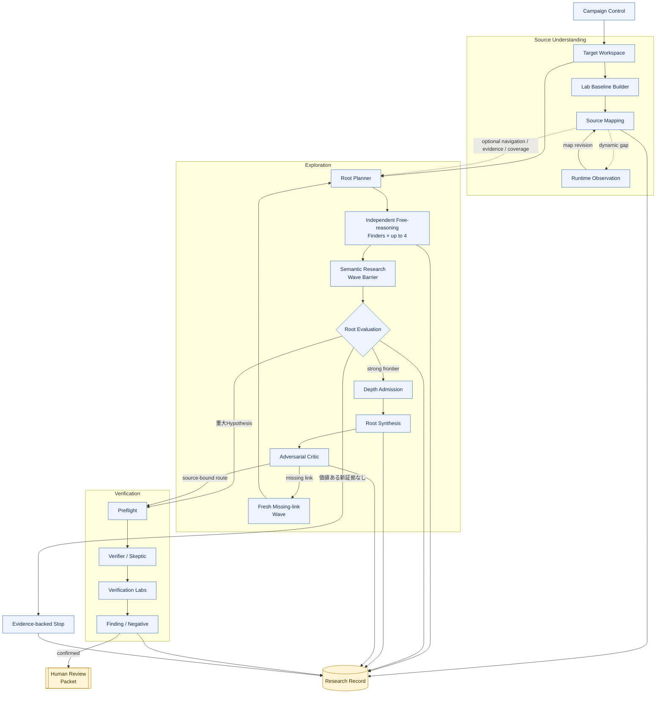
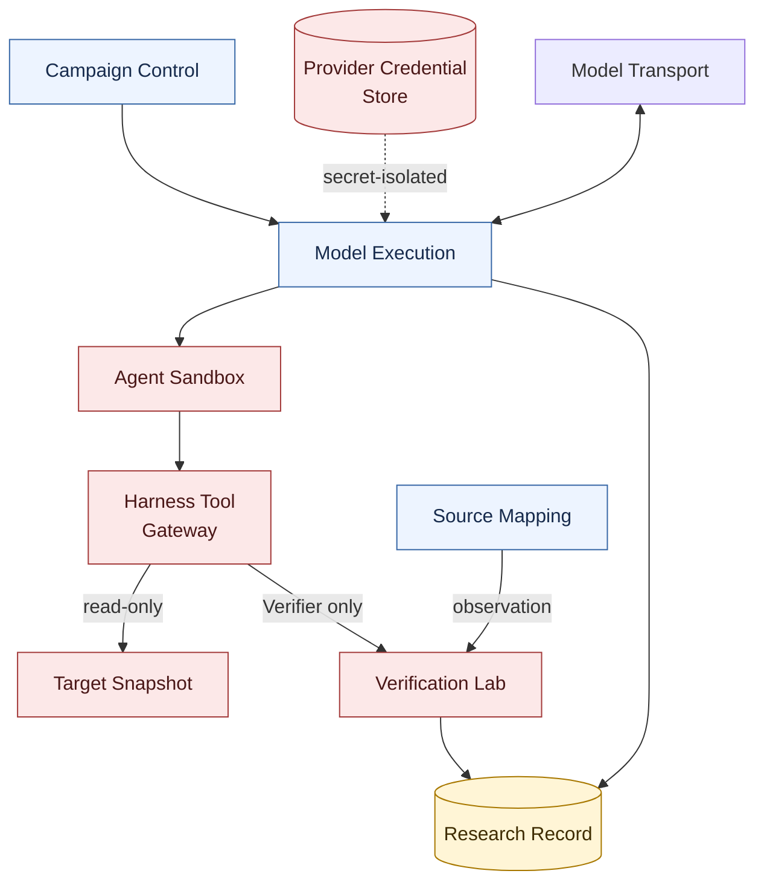

# アーキテクチャ概要

Status: accepted design overview, 2026-09-03

横長の一枚図ではGitHub上で縮小されるため、全体のcontext、Research内部、実行時の信頼境界を三枚に分ける。矢印は主なcommand、artifact、結果の流れであり、内部処理の厳密な時間順ではない。

箱の中はコードと一致する正式語を優先し、見切れを避けるため説明を短くしている。日本語の対応は[日本語用語早見表](../../JAPANESE-GLOSSARY.md)を参照する。

## 1. システム全体（System Context）

```mermaid
flowchart TB
    operator["Human Operator"]
    adapters["CLI / Remote / Web"]
    feeds["Target Sources"]

    ti["Target Intelligence"]
    intake[["Target Intake<br/>Packet"]]
    research["Research"]
    packet[["Human Review<br/>Packet"]]
    human["Human OS"]
    reports["External Reports"]

    models["Model Transport"]
    dependencies["External Dependency<br/>Grant"]

    operator --> adapters
    feeds --> ti
    adapters --> ti
    ti --> intake --> research
    adapters --> research
    models --> research
    dependencies --> research
    research --> packet --> human
    adapters --> human
    human -->|"authorize"| reports
    human -. "Evidence Request" .-> research

    classDef context fill:#edf4ff,stroke:#3767a6,color:#172b4d;
    classDef durable fill:#fff5d6,stroke:#a87800,color:#3f2d00;
    classDef human fill:#e9f7ed,stroke:#337a46,color:#173d22;
    class ti,research context;
    class intake,packet durable;
    class operator,human human;
```

`Target Intelligence`は対象を選定・取得し、既知脆弱性情報を除いた`Target Intake Packet`を`Research`へ渡す。`Research`はhigh-impact semantic discovery、必要時のDepth Escalation、独立検証、記録を行い、`Human Review Packet`を`Human OS`へ渡す。Human OSからResearchへ戻るのは、過去のFindingを変更しない新しい`Evidence Request`だけである。

## 2. 調査・探索ループ（Research and Exploration Loop）

通常運転はraw-source-firstのSemantic Research Waveである。すべてのTargetを最初からmulti-wave Depthへ投入せず、重大HypothesisはVerificationへ、strong semantic frontierだけをDepth Admissionへ送る。詳細は[通常研究・広域探索・深掘り調査](breadth-depth-research-loop.md)と[自由探索エージェント・ループ](autonomous-research-loop.md)を参照する。

- 第一目的はsink/CWE coverageではなくhigh-impactなbroken security semanticsのrecallである。
- Surface Mapを待たず、Target manifestとbounded Source Toolsだけで探索を始められる。Map、PHP Program Index、AST、Semgrep、CodeQLはnavigation、evidence、coverageへ使う。
- Root Plannerは異なるresearch thesisを割り当てるが、Finderのfile、CWE、手順を固定せず、全Targetへ自由にpivotできる。
- Finder同士は会話せず、型付きHypothesis、Route Fragment、UnknownをBarrier後へ渡す。支持数や多数決でcandidateを捨てない。
- 一Waveで閉じる重大SQLi、Stored XSS、PrivEsc等はそのままVerificationへ送れる。長いchainは成功の必須条件ではない。
- strong read/write/file/auth/state primitive、persistent state、cross-request/cross-actor flow、decode/reparse、producer/consumer mismatch等が残る場合、最終impactが未確定でもDepth Admissionできる。
- DepthではSynthesisがsemantic chain候補を作り、Criticがpremise、hop、actor、state identityを攻撃する。Finding昇格はfresh Verificationだけが行う。
- Runtime ObservationはSource Understandingを補うだけで、Finding用のWitnessまたはCausal Controlには使わない。

## 3. 実行・信頼領域（Execution and Trust Zones）

`Campaign Control`はdomain policy、予算、永続化した意図を所有する。AI workerは`Tool Gateway`以外を操作できず、provider credential、container socket、host path、Research Ledger writerへ到達できない。FinderはTargetのread/searchと隔離scratchだけを使い、runtime操作はできない。VerificationだけがHypothesisに拘束したtyped Experimentを使う。

この境界の原則は、**Harness owns the research process; agents own research decisions.** である。Harnessは安全性、有限性、独立性、証拠整合性を強制するが、探索先と脆弱性の意味判断を先回りして決めない。

コード詳細なしで各Moduleの機能を確認する場合は[Module Map](module-map.md)を入口にする。詳細なmodule ownershipは[Module architecture](../module-architecture.md)、探索は[Exploration seam](../exploration-seam.md)、AI実行は[Model execution seam](../model-execution-seam.md)、setupは[Campaign setup seam](../campaign-setup-seam.md)、対象理解は[Source mapping seam](../source-mapping-seam.md)を正本とする。

現在の実装状態は[Codebase Guide](../../CODEBASE-GUIDE.md)だけを正本とする。Map-first one-wave実装は現在地であり、この図の到達設計と混同しない。
