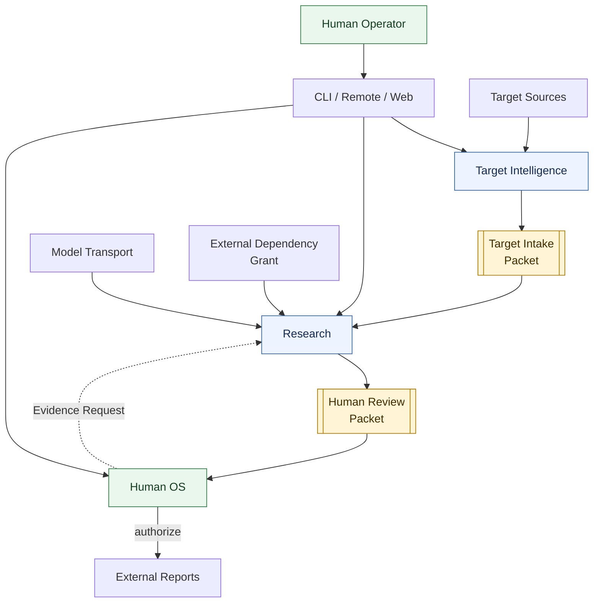
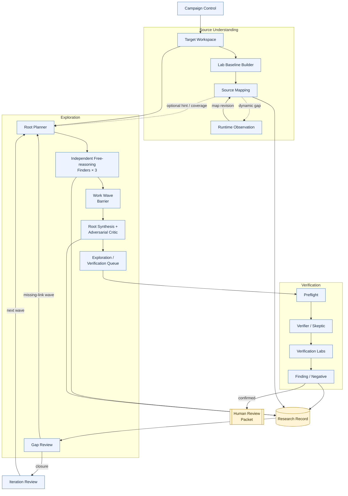
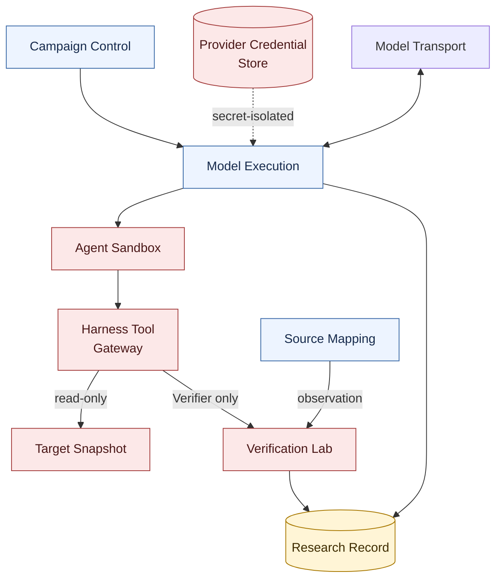

# アーキテクチャ概要

Status: accepted design overview, 2026-09-01

横長の一枚図ではGitHub上で縮小されるため、全体のcontext、Research内部、実行時の信頼境界を三枚に分ける。矢印は主なcommand、artifact、結果の流れであり、内部処理の厳密な時間順ではない。

箱の中はコードと一致する正式語を優先し、見切れを避けるため説明を短くしている。日本語の対応は[日本語用語早見表](../../JAPANESE-GLOSSARY.md)を参照する。

## 1. システム全体（System Context）

`Target Intelligence`（対象情報）は対象を選定・取得し、既知脆弱性情報を除いた`Target Intake Packet`を`Research`（調査）へ渡す。`Research`は自律探索・独立検証・記録・反復を行い、`Human Review Packet`を`Human OS`（人間確認基盤）へ渡す。Human OSからResearchへ戻るのは、過去のFindingを変更しない新しい`Evidence Request`だけである。

## 2. 調査・探索ループ（Research and Exploration Loop）

広いsurfaceから短いprimitiveを得る運行と、一Targetで複数primitiveを最終impactまで接続する運行は同じResearch基盤を使うが目的が異なる。現在地と到達形は[広域探索と深掘り調査](breadth-depth-research-loop.md)を参照する。

- Surface Mapを待たず、Target manifestとbounded Source Toolsだけで探索を始められる。Mapはhintとcoverageへ使う。
- 固定Strategyを逐次手順にしない。Root Plannerは独立idea familyを分け、Finderは全Targetへ自由にpivotできる。
- Raw sourceへのbounded Glob/Grep/Readを主経路とし、Surface Map、Semgrep、CodeQLはseed、coverage、発見済みpatternの横展開へ限定する。
- Finder同士は会話せず、型付き成果物だけをWork Wave後のChain Synthesisへ渡す。
- 一つのmodelだけが示したsource-bound routeを多数決で捨てない。
- Runtime Observationはmapを補うだけで、Finding用のWitnessまたはCausal Controlには使わない。
- Coverage ClosureはFinderの自己申告ではなく、独立Gap Reviewを通す。

## 3. 実行・信頼領域（Execution and Trust Zones）

`Campaign Control`（調査進行制御）はdomain policy、予算、永続化した意図を所有する。AI workerは`Tool Gateway`（ハーネス用ツール窓口）以外を操作できず、provider credential、container socket、host path、Research Ledger writerへ到達できない。FinderはTargetのread/search/graphと隔離scratchだけを使い、runtime操作はできない。VerificationだけがHypothesisに拘束したtyped Experimentを使う。

コード詳細なしで各Moduleの機能を確認する場合は[Module Map](module-map.md)を入口にする。詳細なmodule ownershipは[Module architecture](../module-architecture.md)、探索は[Exploration seam](../exploration-seam.md)、AI実行は[Model execution seam](../model-execution-seam.md)、setupは[Campaign setup seam](../campaign-setup-seam.md)、対象理解は[Source mapping seam](../source-mapping-seam.md)を正本とする。

Finderの分割、最大3並列、Work Wave Barrier、独立Verifier、gVisor実験、Model Profile差替えまでの現在の構成は、横長化を避けて複数枚に分けた[探索エージェント構成](exploration-agent-architecture.md)を参照する。
