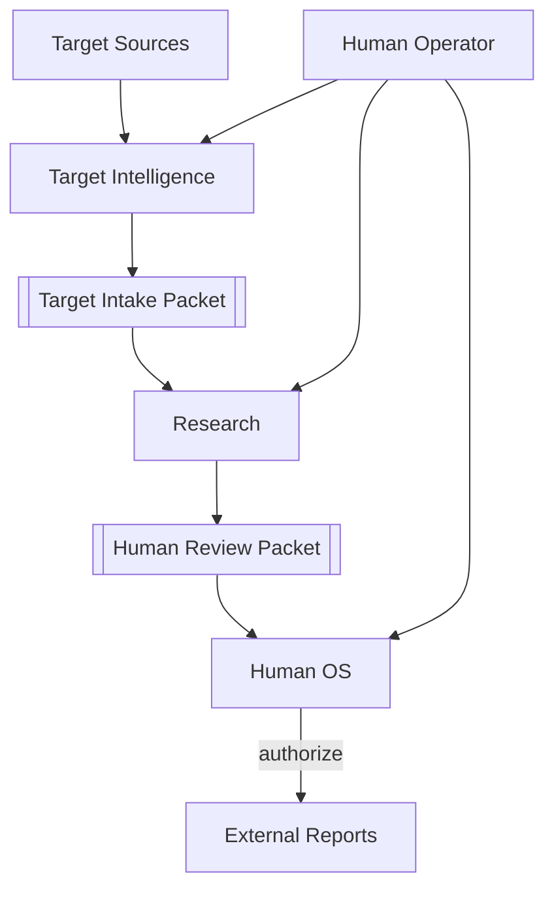
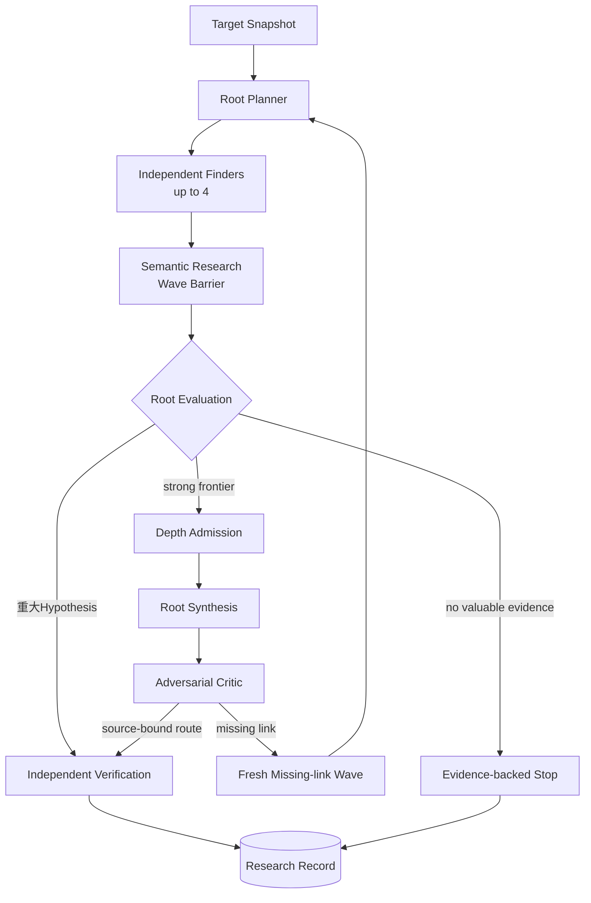
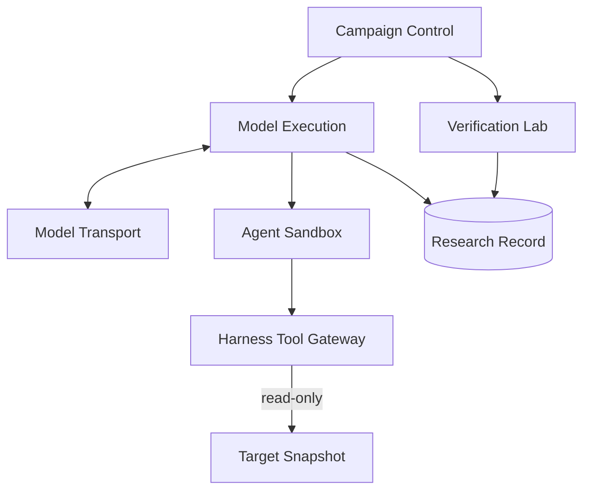

# アーキテクチャ概要

Status: accepted design overview, 2026-09-03

## 1. System context

`Target Intelligence`は対象を選定・取得し、oracleを除いたIntakeをResearchへ渡す。`Research`はhigh-impact semantic discovery、conditional Depth、独立Verification、記録を所有する。`Human OS`はFinding後のreviewと外部行動の明示承認を所有する。

## 2. Research loop

- raw sourceから探索を開始し、Surface Mapやstatic analysisを探索境界にしない。
- Plannerはresearch thesisを分けるが、Finderのfile、CWE、手順を固定しない。
- 一Waveで閉じる重大FindingはそのままVerificationへ進める。
- high-impact potentialが残る時だけDepthへ追加投資する。
- Synthesis/Criticはsemantic chainを扱い、Finding昇格はfresh Verificationだけが行う。

詳細な探索policyは[Autonomous Research Loop](autonomous-research-loop.md)、三つの運行差は[Semantic Research, Breadth and Depth](breadth-depth-research-loop.md)を参照する。

## 3. Trust zones

**Harness owns the research process; agents own research decisions.** Harnessはscope、budget、tool permission、isolation、provenance、persistence、fresh Verificationを強制し、探索先と脆弱性の意味判断を先回りして決めない。

各Moduleのownerは[Module Map](module-map.md)、詳細contractは[Design Documentation](../README.md)からowning Seamへ進む。現在の実装状態は[Codebase Guide](../../CODEBASE-GUIDE.md)だけを正本とする。
