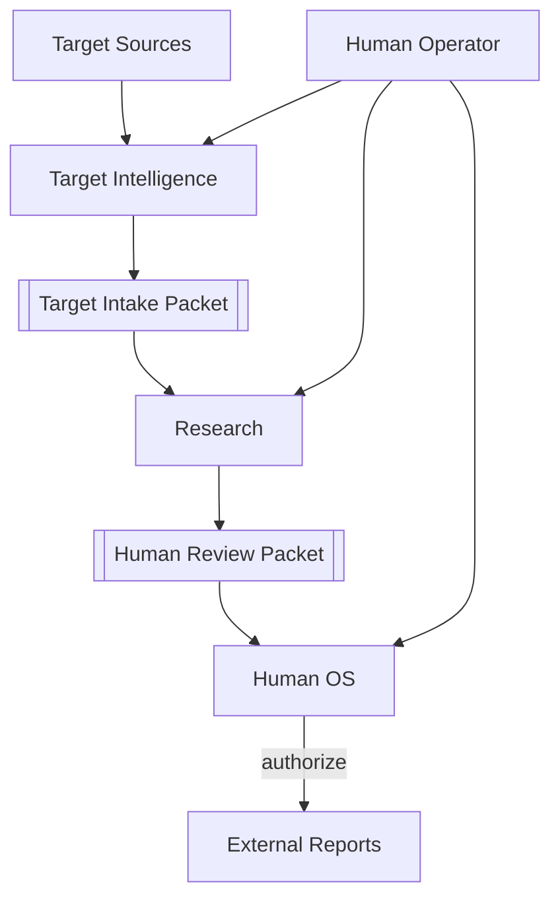
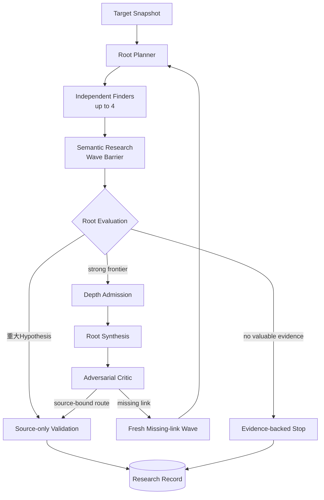
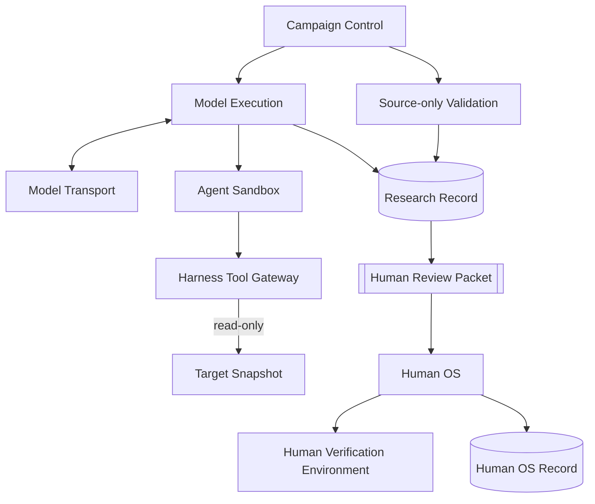

# アーキテクチャ概要

Status: accepted design overview, 2026-09-05

## 1. System context

`Target Intelligence`は対象を選定・取得し、oracleを除いたIntakeをResearchへ渡す。`Research`はhigh-impact semantic discovery、conditional Depth、source-only Validation、Review Packetを所有する。`Human OS`はfresh Human Verification、Finding、外部行動の明示承認を所有する。

三つのcontextはversioned handoff contractだけで接続する。Target Intelligenceの取得内部状態をResearchから直接読まず、Researchのmodel sessionやstorageをHuman OSから直接読まない。Intake PacketとHuman Review Packetがそれぞれの境界で必要な事実を固定する。

最初のproduct goalは、手動投入した最新TargetのProspective CampaignからHuman Verification済みFindingまでを閉じることである。External Reportの送信は到達条件に含めず、別のExternal Action Authorizationを必要とする。

## 2. 一つのTargetを処理する流れ

上のcontext図を、実際に一件のTargetが通る順番へ直すと次のようになる。この節はsystem全体の流れだけを説明し、各Moduleの細かなcontractは繰り返さない。

1. **ターゲットを一つ選ぶ。** 最初は人間がprogramme条件を満たす最新のWordPress pluginを選び、将来はTarget Intelligenceが同じ条件で候補の収集と順位付けを支援する。既知脆弱性の答えはResearchへ渡さない。

2. **調べるsourceを固定する。** 取得したpluginのidentity、version、全fileのdigest、設定、取得元を一つのTarget Intake Packetへ固定する。以後の判断と証拠は、すべてこの同じTargetを参照する。

3. **Research inputを準備する。** 固定したTarget sourceとManifestをResearch CASへ移し、target codeを実行せずsource-only Campaignを開始できる状態にする。Human Verification Environmentの構築はReview Packetができた後にHuman OSで行う。

4. **Campaignを開始する。** Harnessがscope、使えるtool、十分に緩い安全上限、並列数、記録先を固定する。AIにはTarget sourceと研究目標を渡すが、見るfileや疑う脆弱性classは先に決めない。

5. **source全体を独立した視点で調べる。** 一つのwhole-target探索とsource-awareな複数の探索を走らせ、入力からsecurity-sensitiveな結果までの壊れた意味を探す。Mapやstatic analysisは補助に使えるが、それらが見つけなかった範囲を安全とは扱わない。

6. **見つけた仮説と断片をすぐ保存する。** source-boundなHypothesis、Route Fragment、Frontier Gapが成立した時点でdurable checkpointにする。Validationの開始はWave BarrierとRoot Evaluationを待つが、途中candidateを失わない。

7. **一回の探索結果をまとめて判断する。** 新しい証拠、攻撃者の到達可能性、得られる能力、越えるtrust boundary、足りないlinkを整理する。重大HypothesisはValidation candidateへ、high-impactへ伸びる具体的なfrontierはDepthへ送り、価値ある次の調査がなければ終了候補にする。

8. **有力な仮説を別の担当がsourceから反証する。** exact duplicateをまとめ、Discoveryの会話と自己評価を引き継がない二つのfresh Validatorが共通rubricでroute、premise、control、effect、counterevidenceを確認する。material conflict時だけ三つ目を追加し、tool-free Synthesisが`ready-for-human / needs-research / disproven / rejected / validation-pending`を決める。

9. **つながりそうな断片だけを深掘りする。** Depthへ進んだfrontierは、fresh Root Synthesisで経路を接続し、別のAdversarial Criticが前提、actor、state、request順序、防御、因果hopを壊しにいく。具体的に足りない事実が残れば、その一点を調べるfresh Missing-link Waveを行う。

10. **十分な証拠が得られるまで反復し、根拠を持って止める。** 新しいmechanismが得られる限りは探索・統合・批判を反復する。`needs-research`は同じApproach Familyの具体的Frontier Gapへ戻す。探索workとValidationがterminalになり、未解決事項と再開条件を記録できた時にResearchを閉じる。

11. **Human Review Packetを作る。** `ready-for-human`なcandidateへRisk Assessmentを付け、Target identity、source route、調べたcontrol、Validatorの根拠、残るruntime uncertainty、再現sketchをdigest固定する。Finder transcript、credential、内部推論を含めない。

12. **人間が確認できるqueueへ渡す。** Human OSは一Campaign最大三つのunique mechanismをactiveにし、残るPacketをHuman Deferredとして保持する。Research terminalを人間のqueue消化へ従属させない。

13. **人間がfreshに再現してFindingを判断する。** 人間はPacketとfreshな使い捨て隔離環境から実Target interfaceを再現し、`verified-finding`、追加証拠、棄却またはblockedを判断する。gVisor Assistantは任意であり、proof methodを一形式へ固定しない。

14. **外部へ出す場合は別に承認する。** Human Verificationはvendor連絡、submission、公開を自動実行しない。外部行動は対象と内容を示したExternal Action Authorizationを改めて得てから行う。

runtimeで一件のTargetが通る順序と、capabilityを実装する順序は同じではない。開発順は[Capability-first Roadmap](../roadmap.md)、現在動く範囲とBehavior Testは[Codebase Guide](../../CODEBASE-GUIDE.md)を正本とする。

## 3. Research loop

- raw sourceから探索を開始し、Surface Mapやstatic analysisを探索境界にしない。
- Plannerはresearch thesisを分けるが、Finderのfile、CWE、手順を固定しない。
- 一Waveで閉じる重大HypothesisもRoot Evaluation後にValidationへ進める。
- high-impact potentialが残る時だけDepthへ追加投資する。
- Synthesis/Criticはsemantic chainを扱い、ValidationはFindingを昇格させずHuman Review Packetを作る。

詳細な探索policyは[Autonomous Research Loop](autonomous-research-loop.md)、三つの運行差は[Semantic Research, Breadth and Depth](breadth-depth-research-loop.md)を参照する。

## 4. Trust zones

**Harness owns the research process; agents own research decisions.** Research Harnessはscope、budget、read-only tool、provenance、persistence、fresh Validationを強制し、探索先と脆弱性の意味判断を先回りして決めない。Human OSはversioned Packetだけを受け取り、Researchの内部storageを直接読まない。

各Moduleのownerは[Module Map](module-map.md)、詳細contractは[Design Documentation](../README.md)からowning Seamへ進む。現在の実装状態は[Codebase Guide](../../CODEBASE-GUIDE.md)だけを正本とする。
