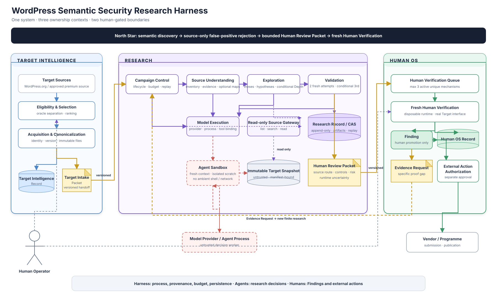

# Harness Architecture

Status: accepted whole-system view, 2026-09-05

このHarnessは、WordPress Targetの選定からHuman Verification済みFindingまでを一つのsystemとして閉じる。構成は`Target Intelligence -> Research -> Human OS`の三つのownership contextであり、context間ではversioned handoffだけを渡す。

このViewは全体の責任境界とartifact flowを理解するための入口である。現在の実装状態は[Codebase Guide](../../CODEBASE-GUIDE.md)、ModuleごとのInterfaceとfailure semanticsは[Design Documentation](../README.md)を正本とし、ここへ複製しない。

## 1. Whole-system view

[Editable draw.io source](harness-whole-system.drawio) · [SVG view](harness-whole-system.svg)

図は左から右へ一つのTargetのevidenceが成熟する順序を示す。

- **Target Intelligence**は対象の適格性、取得、identity、version、immutable filesを所有し、oracleを除いたTarget Intake Packetを渡す。
- **Research**はraw-source-firstのsemantic discovery、conditional Depth、source-only Validation、Research Record、Human Review Packetを所有する。
- **Human OS**はverification queue、fresh Human Verification、Findingへの昇格、追加証拠の要求、外部行動の承認を所有する。

Model ProviderとAgent ProcessはResearchのdecision workerであってsystem of recordではない。Human Operatorはpolicy、Finding、外部行動を決めるが、Campaignの記録や再開処理を手作業で代替しない。

## 2. Ownership rule

全体設計の中心は、process、research decision、promotion decisionを分離することである。

| Concern | Owner | Systemが保証すること |
| --- | --- | --- |
| scope、lifecycle、budget、replay、provenance、persistence | Harness | 同じTargetとcontractに結び付いた有限で再開可能な研究process |
| thesis、調査先、security semantics、次に必要な証拠 | Agent | static ruleや固定CWE listに閉じないresearch decision |
| source-only candidateの反証とhandoff判定 | Research Validation | 明らかなfalse positiveをHumanへ渡さず、runtime proofを装わない |
| Findingへの昇格とproof method | Human OS / Human Operator | freshな環境と実Target interfaceによる人間の判断 |
| vendor連絡、submission、publication | Human Operator | Findingとは別の明示的External Action Authorization |

したがって、Research Validationの目的は「Findingを証明すること」ではない。独立したfresh Attemptでroute、premise、control、effect、counterevidenceを確認し、sourceだけで明らかなfalse positiveを落とす。sourceだけでは決められないruntime uncertaintyはHuman Review Packetへ明示して人間へ渡す。

**Harness owns the research process; agents own research decisions; humans own Findings and external actions.**

## 3. End-to-end lifecycle

1. **Select** — programme条件に合うTargetを選び、既知脆弱性などのoracleをResearch inputから除外する。
2. **Canonicalize** — identity、version、取得元、全file digestを固定し、Target Intelligence Recordを保存する。
3. **Handoff** — versioned Target Intake Packetとimmutable Target SnapshotをCampaignへ渡す。
4. **Discover** — Campaign Controlがfinite workと記録先を管理し、Source UnderstandingとExplorationが最大4個の独立thesisからbroken security semanticsを探す。
5. **Deepen conditionally** — high-impactへ伸びる具体的frontierだけをDepth、Synthesis、Critic、fresh Missing-link workへ進める。
6. **Validate independently** — Wave BarrierとRoot Evaluation後、Discovery contextを引き継がない複数Attemptとtool-free Synthesisで明らかなfalse positiveを抑える。
7. **Record and stop** — hypothesis、counterevidence、gap、attempt、decision、budget eventをResearch Recordへappendし、未解決事項と再開条件を持ってResearchをterminalにする。
8. **Prepare review** — `ready-for-human` candidateへriskとruntime uncertaintyを付け、digest固定したHuman Review Packetを作る。
9. **Verify freshly** — Human OSがactive queueをboundedに保ち、人間がfreshな使い捨て隔離環境と実Target interfaceでFindingへの昇格を判断する。
10. **Act separately** — 外部報告や公開を行う場合は、Findingとは別に対象と内容を承認する。

Research loop内のwork projectionは[Autonomous Research Loop](autonomous-research-loop.md)、Module ownershipは[Module Map](module-map.md)を参照する。

## 4. Stable Interfaces and durable artifacts

contextやtrust boundaryを越える時は内部objectやstorageを直接共有せず、versioned contractまたはdigest-bound artifactを使う。

| Interface / artifact | Producer -> Consumer | Meaning |
| --- | --- | --- |
| Target Intelligence Record | Target Intelligence内部 | 選定、取得、canonical identityのdurable provenance |
| Target Intake Packet | Target Intelligence -> Research | oracle-freeなTarget identity、source manifest、Campaign開始条件 |
| Immutable Target Snapshot | Target Intelligence -> Research tools | untrustedかつ実行しない、manifest-boundなread-only source |
| Research Record / CAS | Research Modules間 | append-only event、artifact、checkpoint、replay source |
| Human Review Packet | Research -> Human OS | source route、確認したcontrol、risk、runtime uncertainty |
| Evidence Request | Human OS -> 新しいResearch work | Finding判定の不足を、既存Campaignの暗黙再開ではなく新しい有限workにする |
| Human OS Record | Human OS内部 | queue、verification decision、Finding promotion、authorizationの監査記録 |

Target Intake PacketとHuman Review Packetがprimary context boundaryである。ResearchからTarget Intelligenceの取得内部状態を読まず、Human OSからResearch sessionやstorageを直接読まない。

## 5. Terminal states

Researchの完了と製品全体の完了は別である。

| Boundary | Terminalの意味 | Terminalではないもの |
| --- | --- | --- |
| Research work | finite workがdecision、failure、または明示的な次workへproject済み | process exit、timeout、budget exhaustionだけ |
| Research Campaign | explorationとvalidationが閉じ、record、packet、未解決事項、再開条件がdurable | Human queueの消化待ち |
| Human Verification | 人間がverified、rejected、needs-evidence、blockedを記録 | model verdict、static rule、Researchの`ready-for-human` |
| Product goal | Human Verificationを経たFindingまで閉じた | Review Packetの生成だけ、外部報告の送信 |

`needs-research`は具体的なFrontier Gapを持つ新しいfinite workへ戻す。`validation-pending`やbudget exhaustionをfalse positive、`disproven`、`rejected`へ読み替えない。外部行動はProduct goalの後段にある別のhuman-gated boundaryである。

## 6. Trust and execution boundaries

- Target sourceはuntrusted dataであり、host上でTarget PHP、autoload、build、test、WordPress bootstrapを実行しない。
- FinderとValidatorが使えるのは、immutable snapshotに対するHarness管理のread-only source toolである。
- Agent Sandboxはfresh contextとisolated scratchを持ち、ambient shell、network、credential、container socket、MCPを受け取らない。
- Model Executionはprovider、process、tool bindingを所有するが、探索判断やFinding promotionを所有しない。
- Research Validationはsource-onlyであり、runtime attackを行わない。
- Human Verificationだけがfreshな使い捨て隔離環境で実Target interfaceを使う。Assistantは任意で、plain Dockerへsilent fallbackしない。
- credential、private Target、transcript、PoC、未公開FindingをGitやReview Packetへ含めない。

## 7. Reading path

- 現在動く範囲、source path、Behavior Test: [Codebase Guide](../../CODEBASE-GUIDE.md)
- contextとhandoff vocabulary: [Context Map](../../../CONTEXT-MAP.md)
- Module ownerとartifact flow: [Module Map](module-map.md)
- Campaign loopとwork projection: [Autonomous Research Loop](autonomous-research-loop.md)
- Interface、不変条件、failure semantics: [Design Documentation](../README.md)からowning Seam
- 次の有限workと受入条件: [GitHub Issues](https://github.com/momoponwork1415-lgtm/wordpress-harness/issues)

runtimeでTargetが通る順序とcapabilityを実装する順序は一致しない。開発順は[Capability-first Roadmap](../roadmap.md)を参照する。
