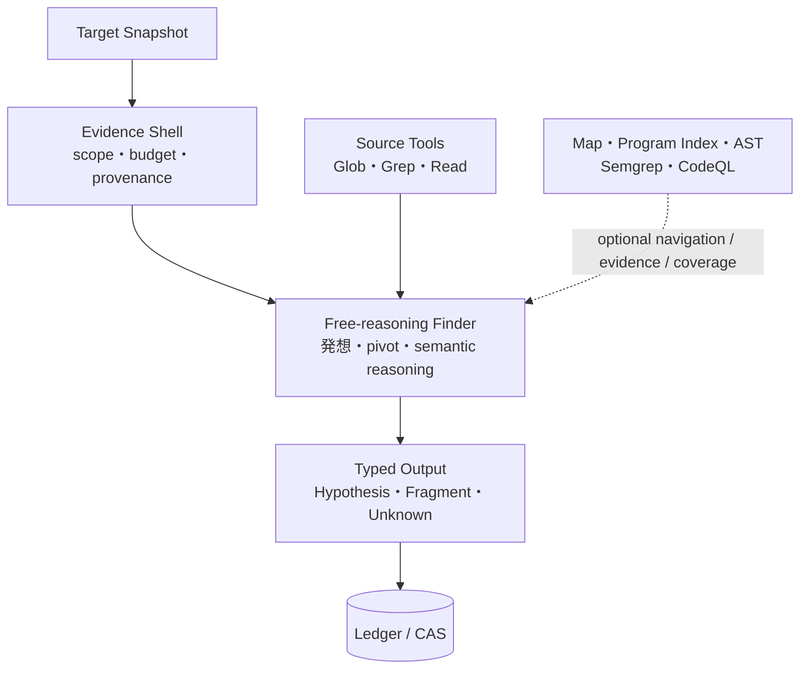
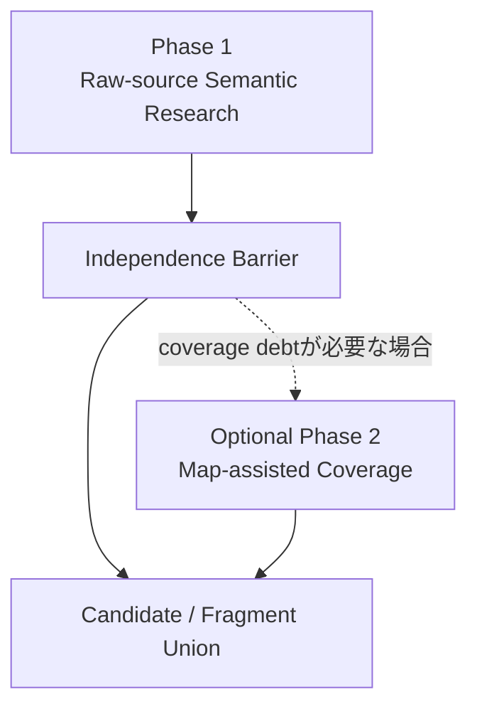
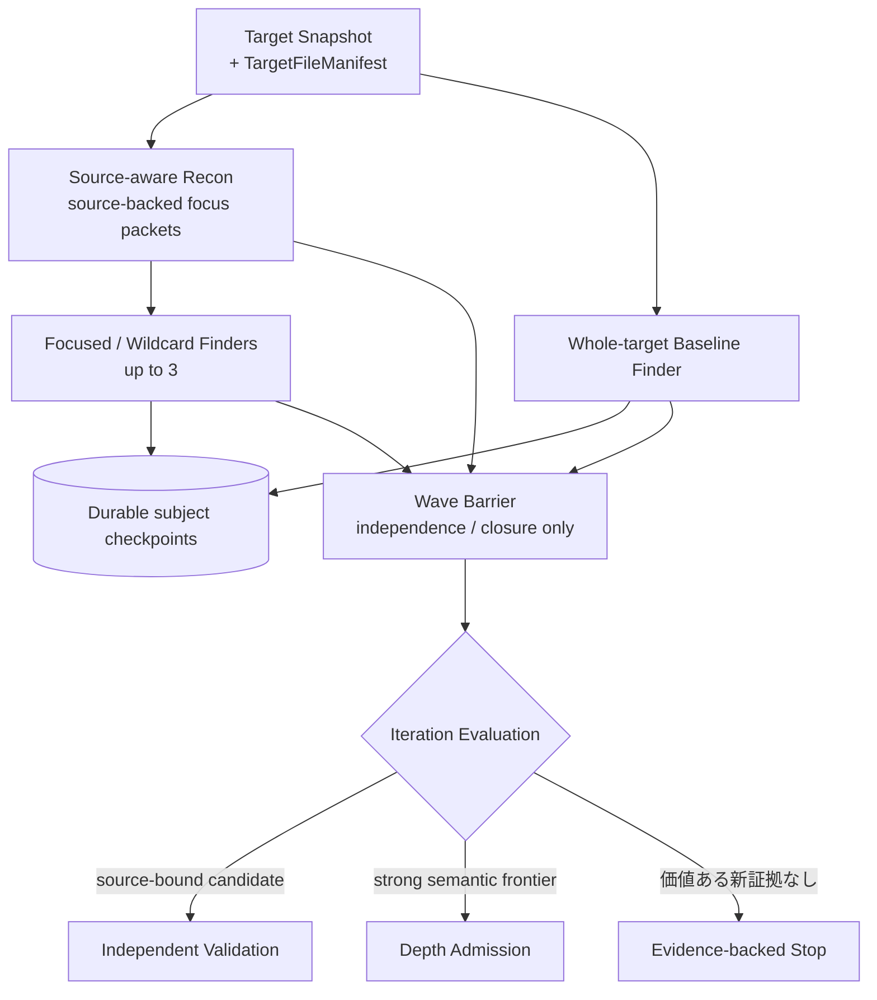
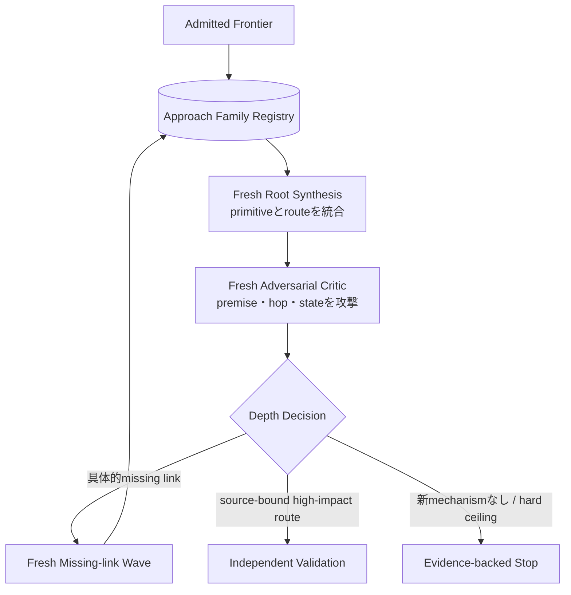

# 自由探索エージェント・ループ（Autonomous Research Loop）

Status: accepted target architecture, 2026-09-05

このviewは、raw-source free reasoningを通常運転にし、強いhigh-impact frontierが現れた時だけwp2shell / Argus-likeなmulti-wave深掘りへ昇格する到達形を示す。正本は[ADR 0113](../../adr/0113-keep-finder-methods-free-behind-an-evidence-shell.md)、[ADR 0116](../../adr/0116-use-four-finder-slots-per-depth-wave.md)、[ADR 0117](../../adr/0117-optimize-for-high-impact-semantic-recall.md)、[ADR 0120](../../adr/0120-run-source-aware-recon-alongside-a-whole-target-baseline.md)、[ADR 0122](../../adr/0122-separate-source-validation-from-human-verification.md)である。

## 1. 自由にする内側、固定する外側

Harnessが所有するのはTarget、tool permission、budget ceiling、並列数、隔離、source provenance、typed artifact、persistence、fresh Validation、停止である。どのfileを見るか、何が怪しいか、どの脆弱性classを疑うか、どこへpivotするか、どのprimitiveを接続するかというresearch decisionはFinderへ残す。

Surface Mapは地図であって探索エンジンではない。粗いMapまたはMapなしでも、Finderはmanifest-boundなTarget全体を探索できる。PHP Program Index、AST、Semgrep、CodeQLも同じく補助道具であり、non-matchを`safe`、candidate reject、priority downgrade、Campaign closureへ使わない。静的解析の見落としをmodelの見落としへ変換しない。

### Raw-source first

Default FinderへSurface Map excerpt、node priority、AST-derived routeを必須入力にしない。後段のmap-assisted workは未探索surfaceを追加できるが、raw-source candidateを削除、downgrade、反証できない。PHPのdynamic callback、string hook、cross-request database state、parser境界、機能間のsecurity assumption等、Mapへ表現されないrouteも常にin-scopeである。

## 2. 通常運転: Semantic Research Wave

最初のWaveでは、sourceを読むReconと一つのwhole-target Baseline Finderを同時に開始する。Reconは5--15個程度のinput-processing subsystem、security assumption、機能間interactionをsourceからinventoryし、初期Waveには最も強く独立した最大3個をsource anchor付きFocus Packetとして返す。Baseline Finderを待たせず、packetをfile allowlistまたは固定checklistにも変換しない。残り最大3枠のFocused / Wildcard FinderはFocus Packetを開始点にできる一方、同じTarget Snapshot全体へ自由にpivotできる。同じmodelの同意数、到着順、多数決をFinding成立またはcandidate破棄へ使わない。

Finderはsource-boundなHypothesis、Route Fragment、Frontier Gapが成立するたびにterminal outputを待たずcheckpointする。checkpointはTarget、Manifest、Attempt、Work LeaseへbindしてCASとLedgerへdurableになってからworkerへackする。ValidationはWave Barrierが全subjectをstable unionへまとめ、Root Evaluationが全件を明示的に処遇した後に開始する。checkpointを待機中に失わず、Finder failureまたはRoot Evaluation failureをcandidate rejectionへ丸めない。

通常Waveは長いchainを必須成果にしない。Unauthenticated SQLi、意味的に深いStored XSS、PrivEsc等、単独で十分重大なHypothesisはRoot Evaluation後にValidationへ進める。一方、単純なReflected XSS等の低優先candidateも、parser、transformation、state、authorization等の再利用可能なmechanismを示す場合はRoute Fragmentとして残せる。一つのReady-for-human candidateが出てもstrong frontierが残るならCampaignを自動停止しない。

`Root Evaluation`はCVSS scoreまたはFinder confidenceだけで判断しない。high-impact potential、attacker accessibility、primitive power、trust-boundary crossing、cross-request/cross-actor state、semantic novelty、具体的な不足linkをsource evidenceとともに見る。Finder confidenceが低くてもsource-boundで重大なHypothesisはValidation候補にできる。

## 3. Depth Admission

Depthは全Targetへ常時適用する通常モードではない。最終RCE、ATO、PrivEscが既に見えていることも要求しない。例えば次のようなsource-bound frontierはDepth Admissionの根拠になり得る。

- unauthenticatedまたはlow-privilegeな強いread / write / file / auth / state capability
- secret、token、credential、password-reset materialへ近いread primitive
- role、capability、identity、session、authentication stateの変更
- persistent attacker-controlled stateが別requestまたは別actorで消費されるroute
- decode / reparse、parser transition、producer / consumer mismatch
- component間のsecurity assumption mismatch
- 単独では弱いが、別機能と接続すると高impactへ伸びる具体的Route Fragment
- Adversarial Criticが閉じればimpactが大きく変わる具体的missing link

Depth Admissionは「RCE sinkを見つけた」というcategory matchではなく、**高impactへ伸びるsecurity-semantic frontierがある**という追加投資判断である。

## 4. Depth Escalation: wp2shell型の反復

旧wp2shellでは人間がpartial primitiveを再現し、次のmodelへ「さらに強いimpactへ伸ばせるか」を渡した。このcheckpointを`Route Fragment -> Root Synthesis -> Adversarial Critic -> Missing-link Wave`としてdurable artifactへ変える。意味上のchain接続はmodelへ任せ、Harnessは入力artifact、source binding、freshness、budget、state transition、provenanceだけを検査する。

CriticはFindingを昇格させない。attacker premise、actor、state identity、request順序、防御、security assumption、因果hopを積極的に壊し、残った不足を具体的な次の研究課題へ変換する。成立routeはDiscoveryの会話を共有しないfresh Validationへ進み、Ready-for-humanになった後もHuman VerificationまでFindingではない。

`Approach Family Registry`はPromptの言い換えではなく、研究ideaのmechanism単位で`thesis`、surface、round、evidence、`active / blocked / exhausted`、blocked理由、reopen条件を保持する。familyの意味分類とredirect案はmodelが推論し、HarnessはID、状態遷移、予算、参照artifactだけを強制する。

## 5. 評価と停止

当面の評価優先順位は次である。

1. high-impact recall
2. root-cause quality
3. attacker-premise closure
4. independent Validation到達
5. false-positive / blocked / unknownの正しい扱い
6. token、wall time、monetary cost

Budgetは研究quotaではなく安全envelopeであり、消費目標ではない。wall time、provider cost、process、output、隔離は外側から強制する一方、provider報告token、とくにcache readを含む値はusage telemetryとして保存し、それだけで完成済みcandidateを無効化しない。turnとsource queryは暴走防止に十分緩くし、通常のsource追跡を途中で切る値へ戻さない。cost削減を目的とする変更は、oracle-separated cohortとprospective Campaignのbaselineを作った後にFinder数、context、model、Wave数等を一変数ずつablationし、high-impact recallを落とさない場合だけ採用する。

通常Waveの早期終了は単なるFinderの「もうない」という自己申告で決めない。strong frontierがなく、重大HypothesisがValidationで処遇され、未取得dependencyと主要なunknownが記録され、追加の独立lensがmaterially new evidenceを生まない時にevidence-backed stopへ進む。DepthではApproach Familyのterminal化、具体的reopen条件、連続Waveの新証拠なし、Criticによる新mechanismなしも停止根拠に加える。Human DeferredまたはHuman Verificationの待機はResearch closureを阻害しない。

## 6. 参照ごとの責任

| 参照 | 採用する責任 |
| --- | --- |
| Anthropic | 高水準goal、modelへ方法を任せる、distinct slice、必要なsource tool、missing primitiveをfresh runへ渡す |
| Semgrep harness | agentごとの隔離、独立run、任意Human Verification Assistantのfresh siblingとexecutable witness |
| Codex Security | phase separation、inventory、partial result、durable workflow、resume可能なartifact |
| Mandiant AVDH | 複数Validation agent、Validation Synthesis、人間のdynamic reproduction、Distilled Knowledge |
| wp2shell / CDC | 独立idea family、早すぎる収束の防止、partial primitiveの保存、missing-link pursuit、root synthesis、反復 |
| Wordfence Argus | high-impactな深掘りを支える10設計原則。非公開のprompt、topology、memory、retrievalは推測しない |
| daroo Researcher Reference | 公開portfolioから目指すhigh-impact mechanism breadthとevaluation gapを定める。非公開methodまたはAI利用を推測しない |

wp2shellのinput parser、charset、upload、serialization、cache、race、crypto、typing等は発想例であり固定checklistにしない。`/flag`や最低6時間もproduction ruleにしない。known-positive benchmarkだけが肯定解motivationを利用でき、prospective Targetに特定impactの存在を保証しない。

現在の実装状態とTestは[Codebase Guide](../../CODEBASE-GUIDE.md)だけを正本とする。Map-first v1の新規実行は廃止し、完了済みLedgerのread-only replay互換だけを残す。
