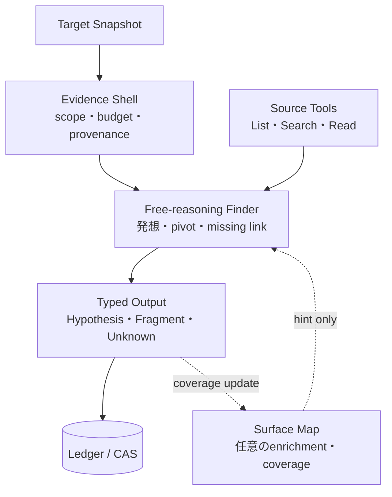
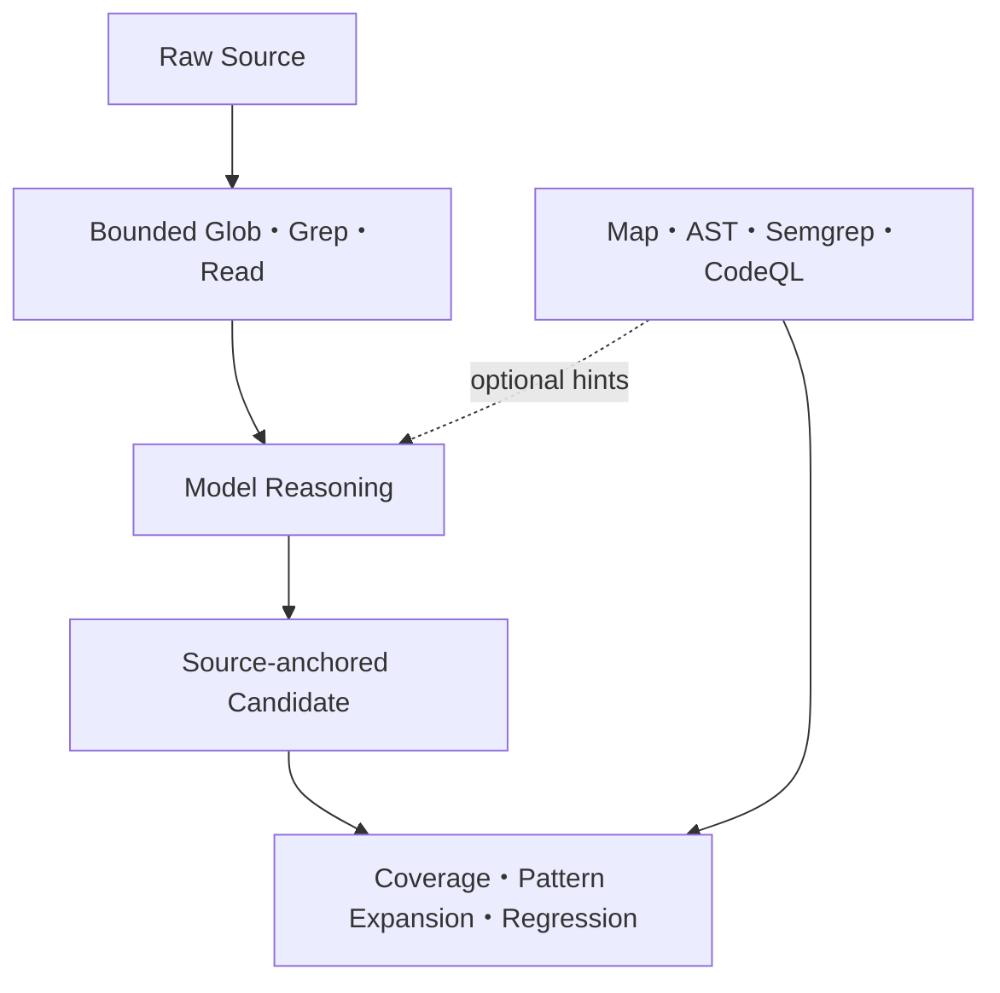
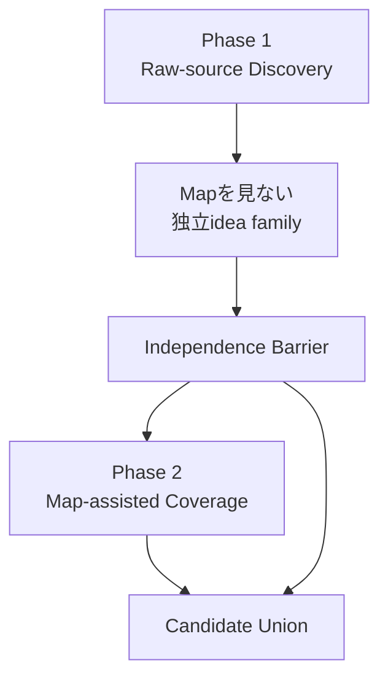
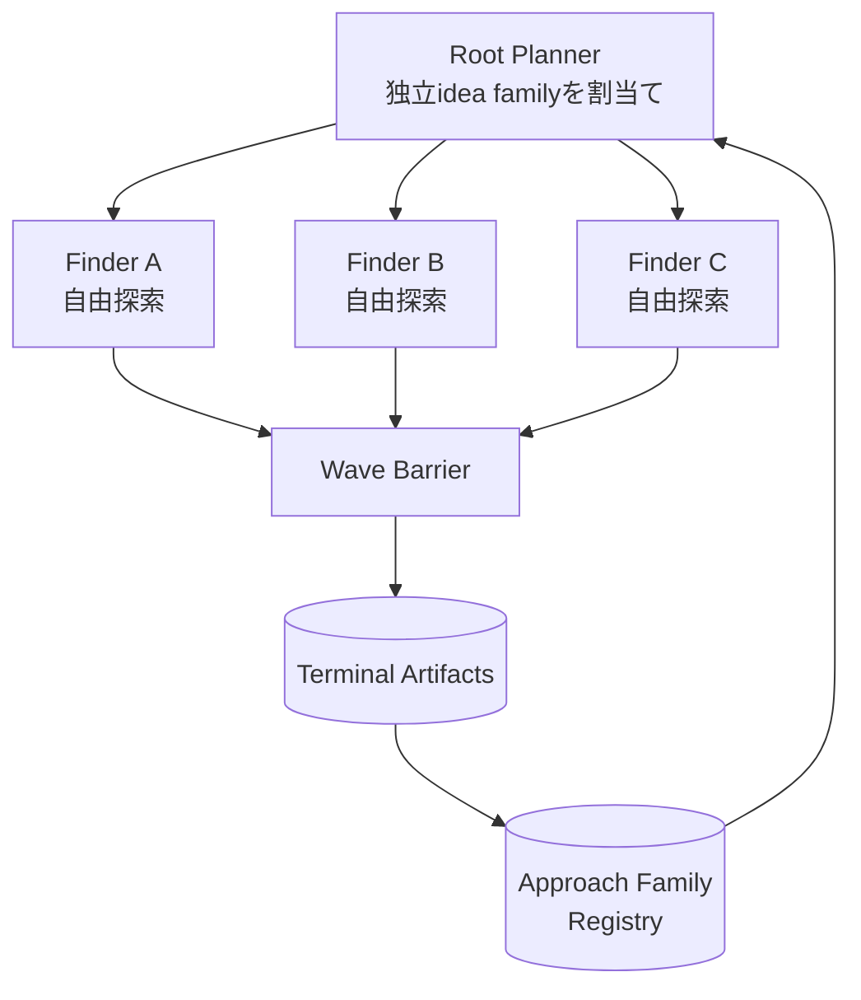
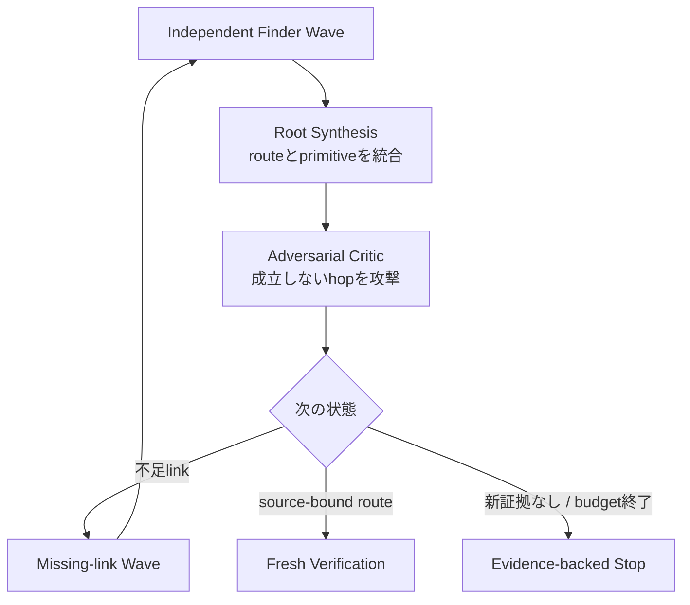

# 自由探索エージェント・ループ（Autonomous Research Loop）

Status: accepted target architecture, 2026-09-02

このviewは、wp2shell/CDC由来の自由な探索loopを、Anthropic型Finder、Semgrep型の隔離、Codex Security型のdurable workflowへ分解した到達形を示す。正本は[ADR 0113](../../adr/0113-keep-finder-methods-free-behind-an-evidence-shell.md)である。

## 1. 自由にする内側、固定する外側

Surface Mapは地図であって探索エンジンではない。粗いMapまたはMapなしでも、Finderはmanifest-boundなTarget全体を探索できる。静的解析の見落としをmodelの見落としへ変換しない。

Static toolのnon-matchから`safe`を導かない。Map nodeのないpathとcandidateを受理するBehavior Testを必須にする。Mapあり/なし比較でMapが繰り返しrecallを下げるなら、Finder inputから廃止し、offline coverageだけへ残す。

### Mapを見せる順序

Default FinderへMap excerpt、node priority、AST routeを見せない。Map-assisted agentは独立探索後にgapを追加するだけで、raw-source candidateを消去またはdowngradeできない。これにより詳細Mapの利点を残しつつ、ASTに表現されないWordPress/PHPのdynamic routeを探索対象外にしない。

## 2. 一つのWork Wave

三つの固定診断手順を実行するのではない。Root Plannerは重複しない開始仮説を与えるが、各FinderはTarget全体へpivotできる。到着順、多数決、同じmodelの同意数はFinding成立に使わない。

`Approach Family Registry`は表面的なPrompt表現ではなく、研究ideaのmechanism単位で`thesis`、対象surface、assigned Work、round、evidence、`active / blocked / exhausted`、blocked理由、再開に必要な新mechanismを保持する。familyの意味分類とredirect案はRoot Plannerが推論し、HarnessはID、状態遷移、予算、参照artifactだけを強制する。

## 3. wp2shell由来の反復loop

旧wp2shellでは人間がprimitiveを再現し、次のmodelへ「さらに強いimpactへ伸ばせるか」を渡した。このcheckpointを`Root Synthesis → Adversarial Critic → Missing-link Wave`へ置き換え、通常運行では人間介入なしにする。意味上のchain接続はmodelへ任せ、Harnessは入力artifact、証拠binding、budget、freshnessだけを検査する。

## 4. 参照実装ごとの責任

| 参照 | 採用する責任 |
| --- | --- |
| Anthropic | 高水準goal、modelへ方法を任せる、distinct slice、missing primitiveをfresh runへ渡す |
| Semgrep harness | agentごとの隔離、独立run、fresh sibling verification、executable witness |
| Codex Security | phase separation、inventory、coverage、partial result、resume可能なartifact |
| wp2shell / CDC | 独立idea family、早すぎる収束の防止、missing-link pursuit、root synthesis、反復 |
| Wordfence Argus | North Starと10設計原則。非公開実装は推測しない |

## 5. wp2shell Promptを実装責任へ分解する

| Prompt上の意図 | 実装owner | productionでの扱い |
| --- | --- | --- |
| 最初から異質なapproachを保つ | Root Planner + Approach Family Registry | input parser、charset、upload、error、builtin route、serialization、cache、race、crypto、typing、mass assignment等は発想例であり固定checklistにしない |
| 同一familyへの収束をredirectする | Diversity Planner | 現在の3枠と過去roundを見て未探索familyを優先する。単なる言い換えを新familyにしない |
| 有望な一案だけに独占させない | Campaign budget allocator | 少なくとも複数の相容れないfamilyをbarrierまで保持する |
| 行き詰まったrouteをblockedにする | Approach Family Registry | concreteな新mechanismまたは新source evidenceがない再投入を拒否する |
| 十分育つまでcross-pollinationしない | Independence Barrier | Finderへ他Finderのartifactを見せず、barrier後だけSynthesisへ渡す |
| adversarial agentで二重確認する | Adversarial Critic + Independent Verification | Criticは論理を攻撃し、fresh Verifier/Labがsourceと実行を再導出する |
| Rootが統合、挑戦、redirect、再開する | Campaign Reconciler | terminal artifactから次Waveを決め、1 Wave失敗だけで終了しない |
| intermediate bugをchainする | Route Fragment + Root Synthesis | read/write/authenticate/query/output等のcapabilityとrequest間stateを保持する |
| dependency sourceも調べる | Dependency Wishlist + Target Intake | 理由、version、provenanceを記録し、Harnessがpinしたsourceを次Snapshotへ追加する。Finder自身の任意cloneは許可しない |
| `/flag`まで完全chainを作る | Benchmark Motivation Profile | known-positiveだけで使用する。productionではsite-wide compromiseをNorth Starにするが存在をoracleとして保証しない |
| 最低6時間続ける | Campaign Budget Profile | 6時間を下限にしない。最大予算だけを強制し、evidence-backed closureへ先に到達すれば終了する |

早期終了は単なるFinderの「もうない」という自己申告では決めない。全Approach Familyが`verified / disproved / blocked / exhausted`のterminal状態になり、blocked routeは再開条件を持ち、連続Waveで新しいsource evidence・Fragment・familyが増えず、Adversarial Criticも残存gapへmaterially new mechanismを提示できず、coverage debtと未取得dependencyが記録された時に`evidence-backed closure`とする。最大時間はhard ceilingであり、消費目標ではない。

## 6. 実装状況

| 部分 | 状態 |
| --- | --- |
| Target固定、最大3並列、typed Finder output、CAS | 実装済み |
| Surface Map外を読めるbounded Search / Read | 実装済み |
| Surface Map非依存のbounded Source List | 実装済み |
| exact-literal Search / bounded Read | 実装済み |
| ripgrep相当のbounded Glob / Grep | 次の実装 |
| 自由探索goal、FocusをboundaryにしないPrompt | 実装済み |
| Mapを見ないraw-source Context Profile | 次の実装 |
| 独立barrier後のmap-assisted Coverage Profile | 次の実装 |
| Route Fragment保存 | 実装済み |
| Root Plannerによる独立idea family生成 | 次の実装 |
| Wave Barrier後のRoot Synthesis | 次の実装 |
| Adversarial CriticとMissing-link Wave自動再投入 | 次の実装 |
| source anchorだけで完全Hypothesisを提出 | 次の実装 |
| Approach Family RegistryとDiversity Planner | 次の実装 |
| Dependency Wishlistのadmission loop | 次の実装 |
| Map nodeなしのsource-anchored Hypothesis取込 | 次の実装 |
