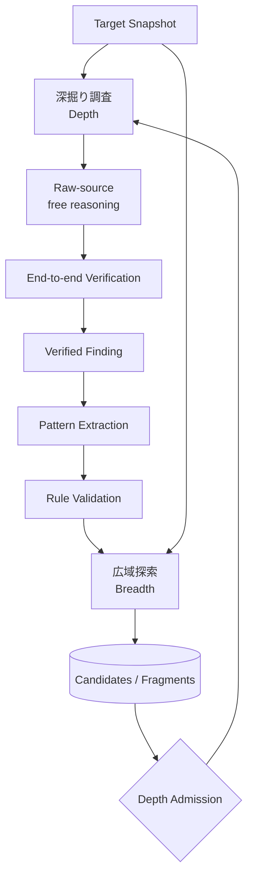
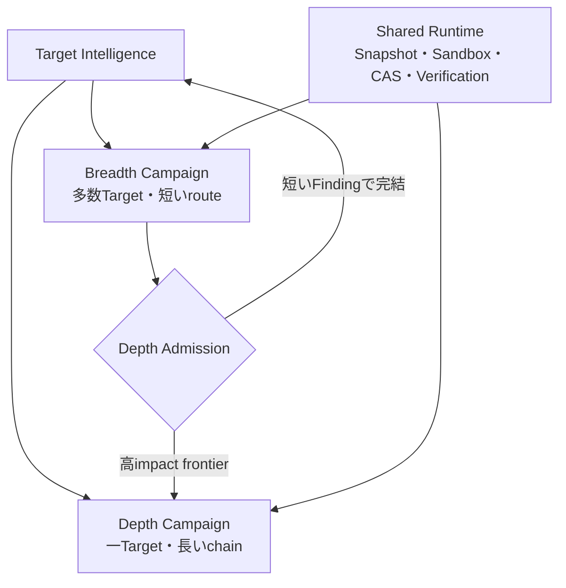
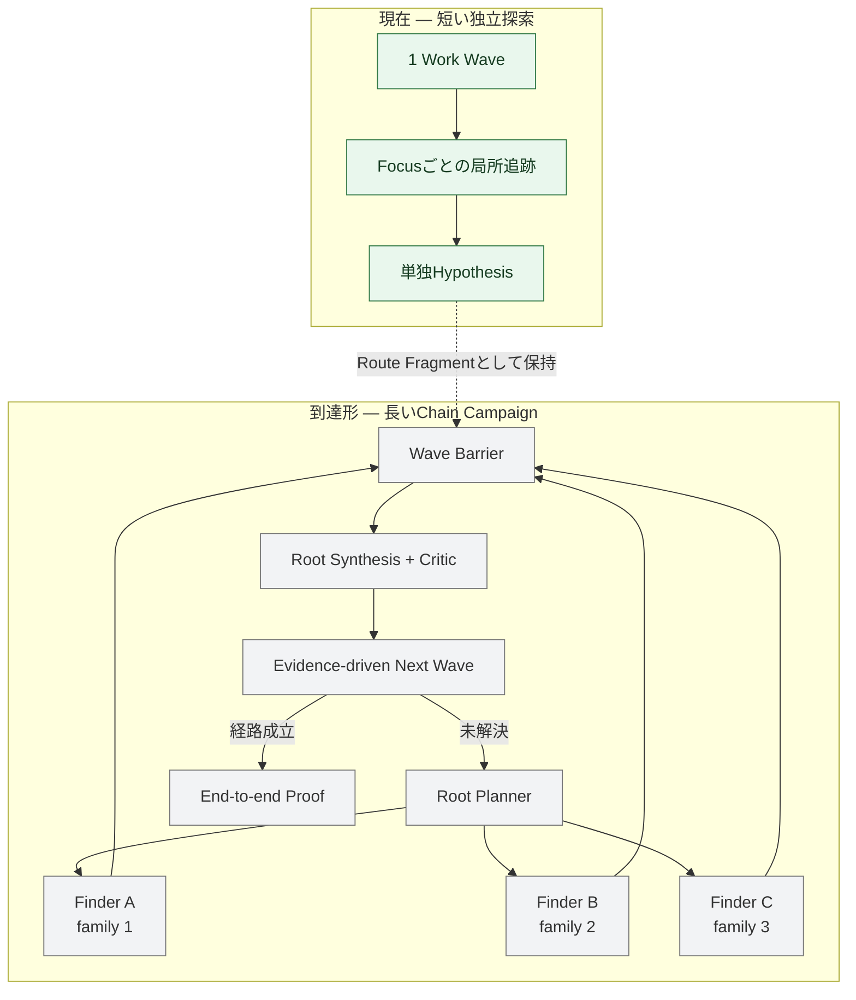
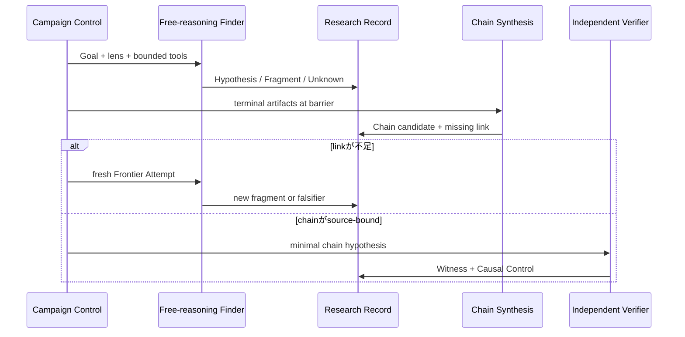

# 広域探索と深掘り調査（Breadth and Depth）

Status: accepted architecture view, 2026-09-02

この図はWordfenceが公開したPRISMとArgusの役割差を、現在のResearch architectureへ対応付ける。`PRISM`と`Argus`はWordfenceの名称であり、このrepositoryのModule名には使わない。実装では広域探索と深掘り調査を同じCampaign基盤上の異なる運行として扱う。

WordfenceはPRISMを多数の対象とbug classを短い経路で広く調べるbreadth-first側、Argusを一つのTargetに留まり、複数の弱点を長い依存順序へ接続するdepth-first側と説明している。公開されていないprompt、agent topology、retrieval、memoryを推測して模倣しない。[Wordfence, “Breadth and Depth”](https://www.wordfence.com/blog/2026/08/wordfence-argus-finds-complex-6-step-critical-rce-in-avada-theme-with-1-million-sales/#breadth-and-depth)

## 1. 深掘りを主探索にし、横展開をfeedback loopに置く

現在の主探索は深掘り調査であり、すべてのTargetを先に広域探索へ通す必要はない。深掘りで独立検証されたFindingから、構文的に一般化できる部分だけをruleへ変換し、広域探索で横展開する。広域探索は単独Findingだけでなく、impactへ届いていないsource-boundな経路断片を残し、価値の高いものをDepth Admission経由で深掘りへ戻す。

## 2. Modeを混ぜない

| 判断軸 | Breadth Campaign | Depth Campaign |
| --- | --- | --- |
| Target | 多数を短時間で回す | 一つへ留まる |
| 主探索 | static seed + model triage | raw-source free reasoning（本projectの主経路） |
| Static tool | Semgrep/CodeQL/Mapを積極利用 | 補助と後段pattern expansion |
| Model | cheap/medium中心 | frontier reasoning中心 |
| Loop | candidate→verify→次Target | family→synthesis→critic→missing link |
| 終了 | target単位budgetと短いcoverage | evidence-backed closureまたはhard ceiling |
| 指標 | targets/hour、precision、coverage、cost | chain closure、high-impact frontier、time-to-proof |

設計判断の正本は[ADR 0114](../../adr/0114-separate-breadth-and-depth-campaign-policies.md)とする。

## 3. 現在地と到達形

現在の3並列はMap由来FocusへStrategyを割り当てる実装を残しており、似たseedへ偏ることがある。到達形の3枠は固定された`Hunter / Analyst / Builder`役ではない。Root PlannerがそのTargetと過去Waveに応じて意味の異なるidea familyを毎回選び、各Finderは同じ出力schemaを使ってTarget全体へ自由にpivotする。

`source-first`、`sink-first`、`state-chain`等は逐次checklistではなく、Approach Family Registryの観測labelまたは開始lensに限る。HarnessはTarget、tool、予算、artifact schema、隔離、barrier、証拠基準だけを強制する。

## 4. 深掘り調査の反復

例えば匿名の値読出しと未認証の状態生成が別々に見つかった場合、単独severityで切り捨てない。各Fragmentの`attacker premise`、`precondition`、`consumed/produced value`、`state identity`、`effect/capability`、`unknown`、`falsifier`を保持し、Wave後に接続可能性を推論する。Findingへの昇格はChain Synthesisでは行わず、freshな独立Verificationだけが行う。

## 実装順

1. Finder terminal artifactへ`Route Fragment`、`Mapping Evidence Request`、`Closure Record`を追加する。
2. Mapを見ないraw-source Context Profileと、Target inventoryへアクセスするbounded Glob/Grep/Readを作る。
3. Root PlannerがApproach Family Registryから最大3個の独立familyを割り当てる。
4. Wave barrierでterminal artifactを安定順にfoldし、Root SynthesisとAdversarial Criticへ渡す。
5. Synthesisが示したmissing linkからfreshなAttemptを作り、成立chainをIndependent VerificationとgVisor Labへ渡す。

設計根拠と公開実装の責務分担は[Free-reasoning Finder and evidence-shell harness references](../../research/free-reasoning-evidence-shell-harness-references.md)、既存の型付きchain判断は[ADR 0107](../../adr/0107-synthesize-cross-focus-chains-at-wave-barriers.md)を参照する。
