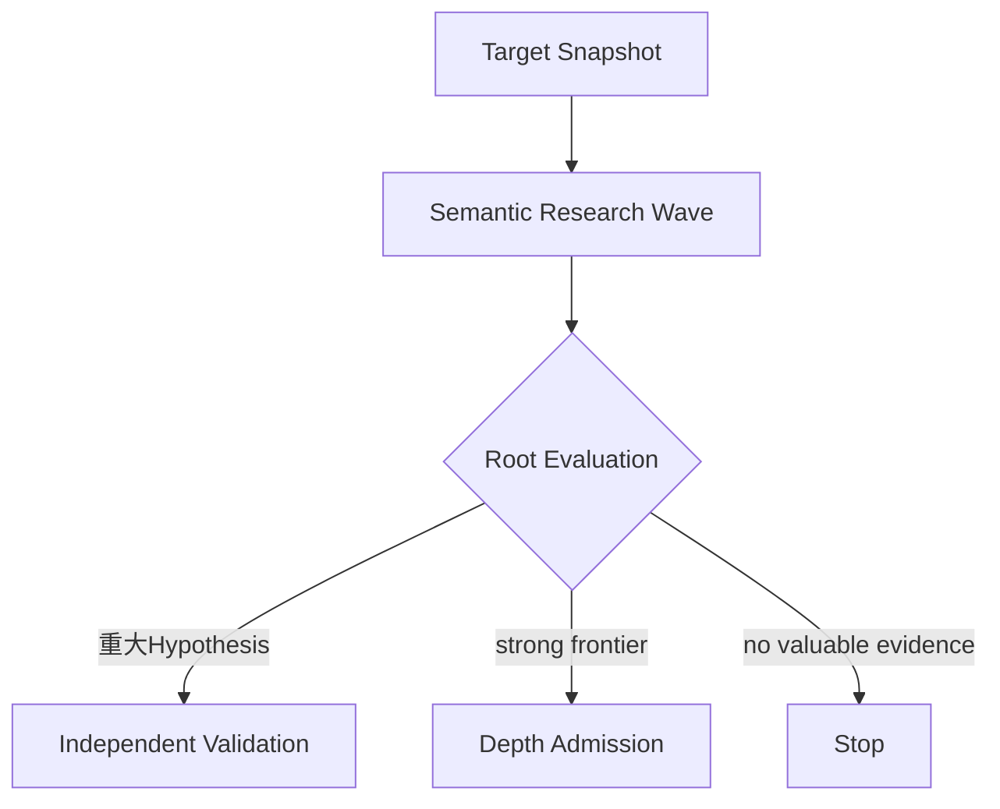
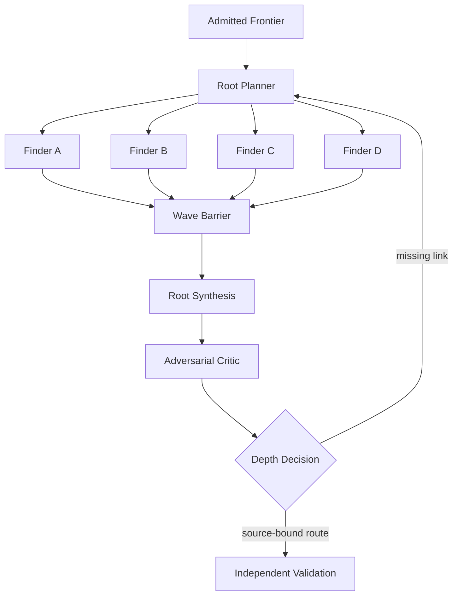

# 通常研究・広域探索・深掘り調査（Semantic Research, Breadth and Depth）

Status: accepted architecture view, 2026-09-05

`PRISM`と`Argus`はWordfenceの名称であり、このrepositoryのModule名には使わない。PRISM/Argusの違いはsimple sink対semantic bugではなく、**breadth対depth**である。

## Normal: Semantic Research

通常は高推論modelとraw-source navigationを使う有限Waveで、単独で重大なcandidateとhigh-impactへ伸びるpartial primitiveの両方を探す。SSA型SQLiやBrizy型Stored XSSのように一Waveで閉じるものもRoot Evaluation後のValidationへ進める。TranslatePress ATOのように複数Fragmentが必要な場合はDepthへ追加投資する。

## Depth Admission

最終RCE/ATO/PrivEscが既に見えていることを要求しない。strong read/write/file/auth/state capability、secret/reset material、persistent state、cross-request/cross-actor flow、decode/reparse、producer/consumer mismatch、security assumption mismatch、具体的missing linkをhigh-impact potentialとして扱う。

## Depth Campaign

4枠は固定されたSQLi/XSS/RCE roleではない。Root SynthesisはFragmentをsemanticに接続し、Criticはpremise、actor、state、hopを攻撃する。source-bound routeはfresh Validationへ進むが、Findingへの昇格はHuman Verificationだけが行う。

## Later: Breadth Campaign

Breadthは将来、多数Targetへscaleする運行である。Semgrep、CodeQL、Surface Map、Program Index、cheap/medium model等をseedとcoverageへ積極利用できるが、non-matchを安全性とせず、candidateは同じValidationへ送る。

現在はtargets/hourやcostよりSemantic Research / Depthのhigh-impact recallを優先し、recall baseline確立後にPRISM-like breadthへ進む。

| 判断軸 | Semantic Research | Depth | Breadth |
| --- | --- | --- | --- |
| Target | 一Target・有限Wave | 一Target・multi-wave | 多数Target |
| 主探索 | raw-source free reasoning | fragments + missing links | static seed + short reasoning |
| Static tool | optional | optional | 積極利用 |
| 成功 | standalone high-impact Hypothesis / strong frontier | high-impact route closure | 多数のhigh-value candidate |
| 当面の指標 | high-impact recall | frontier closure | 後でtargets/hour / cost |

単独severityが低いFragmentも、高impactへ伸びる具体的可能性があれば捨てない。単純Reflected XSS自体は低優先でも、parser transitionやdecode/reparse等のmechanismはFragmentとして残せる。

設計判断は[ADR 0114](../../adr/0114-separate-breadth-and-depth-campaign-policies.md)、[ADR 0117](../../adr/0117-optimize-for-high-impact-semantic-recall.md)、[ADR 0122](../../adr/0122-separate-source-validation-from-human-verification.md)、Finder自由度は[ADR 0113](../../adr/0113-keep-finder-methods-free-behind-an-evidence-shell.md)、4 Finderは[ADR 0116](../../adr/0116-use-four-finder-slots-per-depth-wave.md)を参照する。現在地は[Codebase Guide](../../CODEBASE-GUIDE.md)を正本とする。
