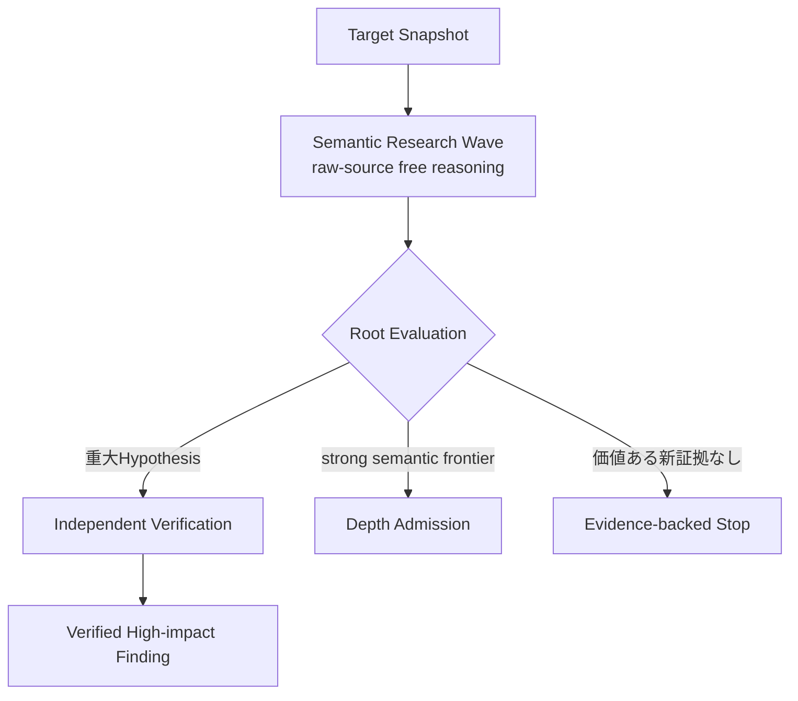
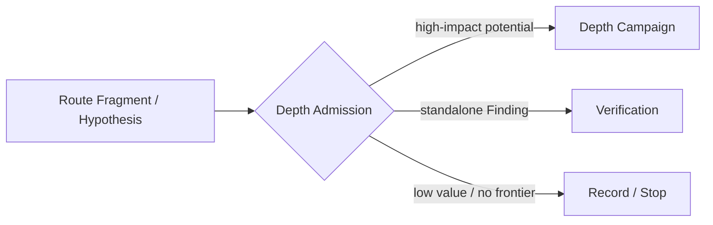
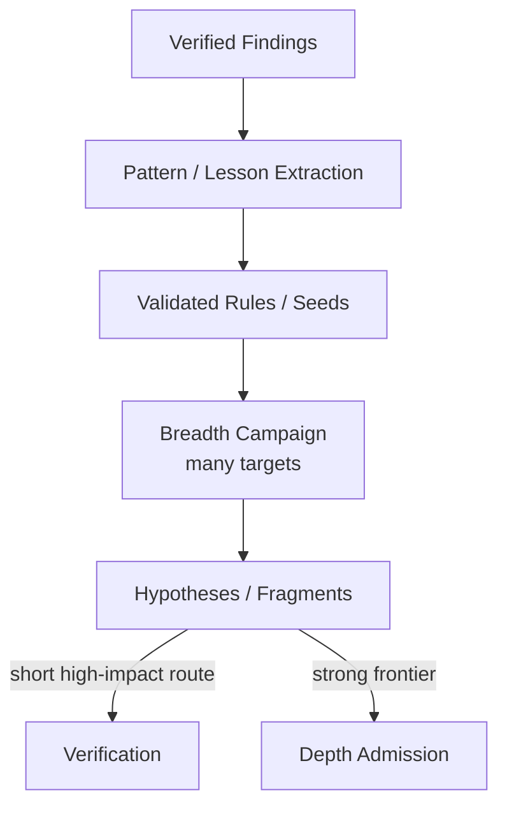

# 通常研究・広域探索・深掘り調査（Semantic Research, Breadth and Depth）

Status: accepted architecture view, 2026-09-03

この文書は、通常のhigh-impact semantic research、Wordfence PRISMに対応するbreadth-first運行、Wordfence Argusに対応するdepth-first運行を区別する。`PRISM`と`Argus`はWordfenceの名称であり、このrepositoryのModule名には使わない。公開されていないprompt、agent topology、retrieval、memoryを推測して模倣しない。

PRISMとArgusの違いは`simple sink`対`semantic bug`ではない。PRISMは多数Targetとbug classを短いrouteで広く調べるbreadth-first側、Argusは一Targetに留まり複数primitiveを長い依存順序へ接続するdepth-first側である。したがって短いauthorizationやbusiness-logic bugもBreadthで発見し得るし、SQLiやStored XSSでも状態・変換・複数requestを深く追う場合がある。

## 1. 現在の通常運転

現在の主探索は全TargetをDepth Campaignへ投入することではない。まず高推論modelとraw-source navigationを使う有限Semantic Research Waveを行い、単独で重大なFindingを閉じる能力と、high-impactへ伸びるpartial primitiveを発見する能力の両方を持たせる。

Simply Schedule Appointments型SQLiやBrizy型Stored XSSのように一Waveで十分強いsource-bound routeが閉じるなら、そのままIndependent Verificationへ進める。TranslatePress ATOのように、public read、persistent producer、authentication-sensitive value等のFragmentが別々に見えて最終impactがまだ閉じないなら、Depth Admissionから追加投資する。

## 2. Depth Admissionは最終impactを要求しない

Depth Admissionは`RCE sinkがある`または`ATOがほぼ完成した`ことを要求しない。次のようなsource-bound signalがあればhigh-impact potentialとして昇格できる。

- unauthenticatedまたはlow-privilegeなread、write、file、auth、state capability
- secret、token、credential、password-reset materialへのread path
- role、capability、identity、session、authentication stateの変更
- persistent attacker-controlled stateとlater privileged consumer
- cross-requestまたはcross-actorなvalue/state flow
- decode/reparse、parser boundary、producer/consumer mismatch
- component間のsecurity assumption mismatch
- 単独severityは低いが別primitiveと具体的に接続できるFragment
- Criticが示す、閉じればimpactが大きく変わる具体的missing link

これはcategory scoreではなく、同じTargetへ追加のhigh-reasoning budgetを投資するresearch decisionである。

## 3. Depth Campaign

4枠は固定されたSQLi/XSS/RCE roleではない。Root PlannerがTargetと過去artifactに応じて意味の異なるresearch thesisを割り当て、各Finderは同じoutput contractでTarget全体へ自由にpivotする。`source-first`、`sink-first`、`state-chain`等は逐次checklistではなく、開始lensまたは観測labelに限る。

Root SynthesisはRoute Fragmentをsemanticに接続するmodel roleであり、Harnessがdeterministic scriptでchainを作らない。Adversarial Criticはattacker premise、actor、state identity、request ordering、防御、security assumption、因果hopを攻撃し、成立しない主張をFindingへ昇格させず、具体的missing linkへ変える。Findingへの昇格はfresh Independent Verificationだけが行う。

## 4. Breadth Campaignは後段のscale-out

Breadthは将来、多数Targetへ速くscaleするための運行である。Semgrep、CodeQL、Surface Map、PHP Program Index、安価または中価格Model Profile等を候補seedとcoverageへ積極利用できる。ただしstatic toolのnon-matchを安全性とせず、rule matchもFindingではなくHypothesisとして同じVerificationへ送る。

現在はBreadthのtargets/hourやcostを最適化するより、Semantic ResearchとDepth Escalationがhigh-impact bugを取りこぼさないことを優先する。十分なrecall baselineを作った後に、validated Findingからpatternを横展開し、PRISM-likeなbreadthへ進む。

## 5. 三つの運行を比較する

| 判断軸 | Semantic Research | Depth Campaign | Breadth Campaign |
| --- | --- | --- | --- |
| 役割 | 通常のhigh-impact探索 | strong frontierの深掘り | 多数Targetへのscale-out |
| Target | 一Targetを有限Waveで調査 | 一Targetへ複数Wave留まる | 多数Targetを短く回す |
| 主探索 | raw-source free reasoning | raw-source + fragments + missing links | static seed + model triage +短いreasoning |
| Static tool | optional navigation / evidence / coverage | 補助のみ | 積極利用可能 |
| Model | frontier reasoning中心 | frontier reasoning中心 | 将来cheap/mediumも利用 |
| Loop | Wave → Root Evaluation | family → synthesis → critic → missing link | candidate → verify / admit → next target |
| 成功 | standalone high-impact Hypothesisまたはstrong frontier | high-impact route closure | high-value findings / candidatesを多数回収 |
| 終了 | evidence-backed stop / hard ceiling | evidence-backed closure / hard ceiling | target budget / coverage policy |
| 当面の指標 | high-impact recall、root-cause quality | frontier closure、time-to-proof | 後でtargets/hour、precision、cost |

設計判断の正本は[ADR 0114](../../adr/0114-separate-breadth-and-depth-campaign-policies.md)と[ADR 0117](../../adr/0117-optimize-for-high-impact-semantic-recall.md)である。

## 6. Fragmentを単独severityで捨てない

例えば匿名の値読出しと未認証の状態生成が別々に見つかった場合、各Fragmentの`attacker premise`、`precondition`、`consumed/produced value`、`state identity`、`effect/capability`、`unknown`、`falsifier`を保持する。単独で低severityでも、別機能と接続してATO、PrivEsc、RCE等へ伸びる具体的可能性があればDepth Admissionへ進める。

逆に単純なReflected XSS等が独立Findingとして低優先でも、そのroot mechanismがparser transition、decode/reparse、security-control bypass等を示すならFragmentとして残せる。優先度を下げることと、semantic evidenceを破棄することを同一にしない。

設計根拠と公開実装の責務分担は[Free-reasoning Finder and evidence-shell harness references](../../research/free-reasoning-evidence-shell-harness-references.md)、Finder自由度は[ADR 0113](../../adr/0113-keep-finder-methods-free-behind-an-evidence-shell.md)、4 Finderの根拠は[ADR 0116](../../adr/0116-use-four-finder-slots-per-depth-wave.md)を参照する。現在の実装状態は[Codebase Guide](../../CODEBASE-GUIDE.md)だけを正本とする。
