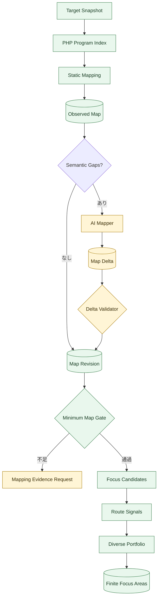
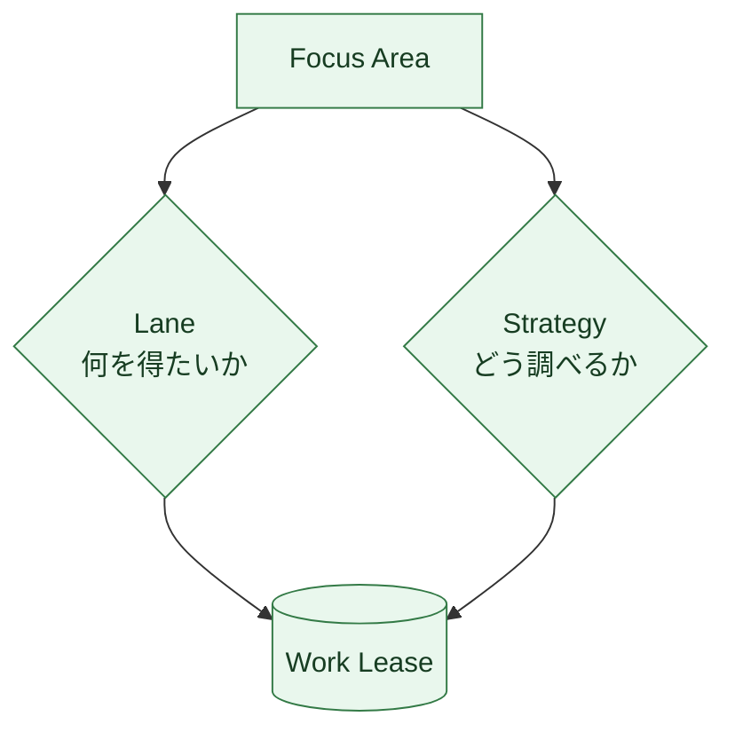
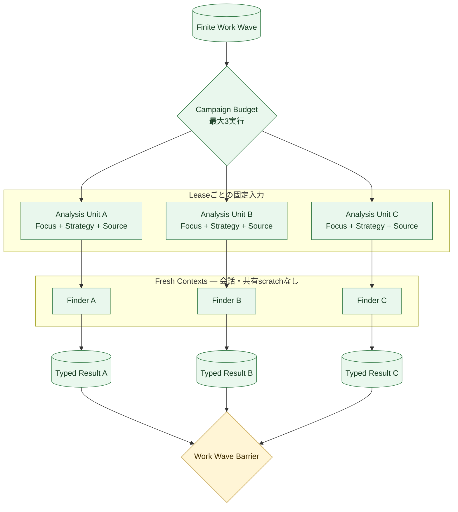
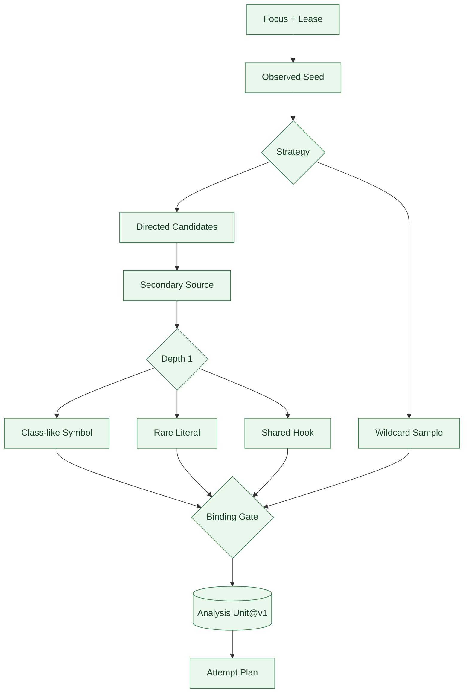
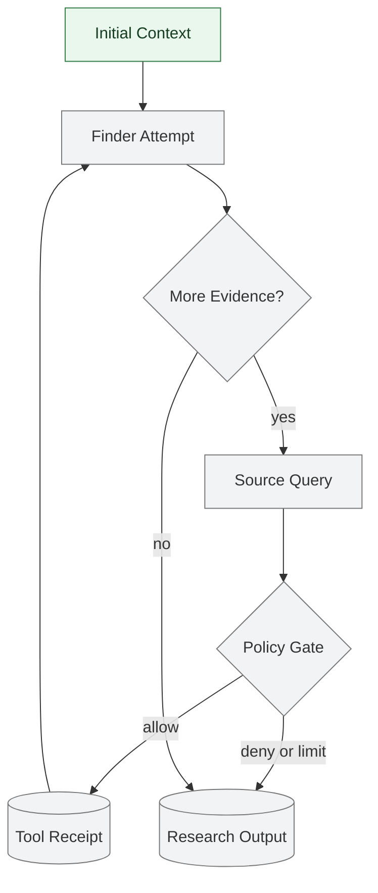
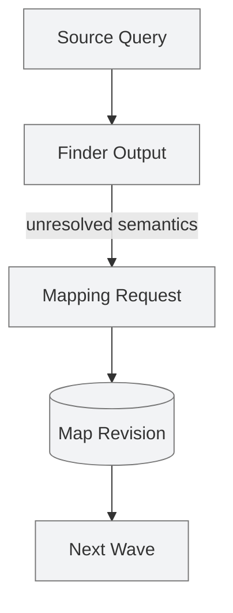
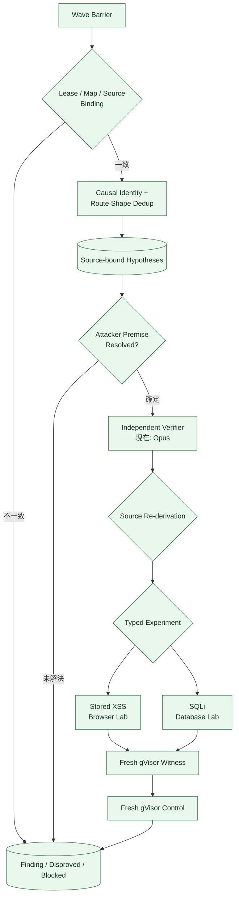
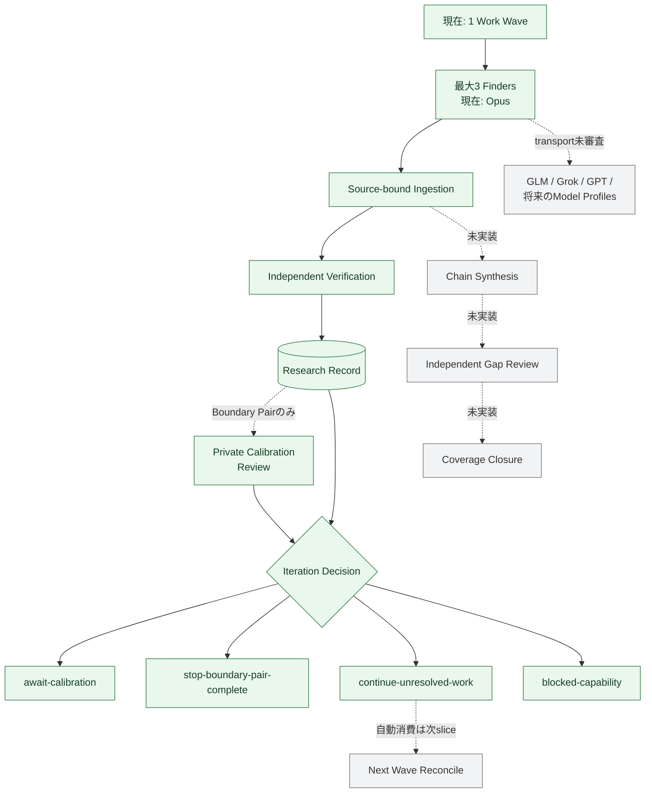
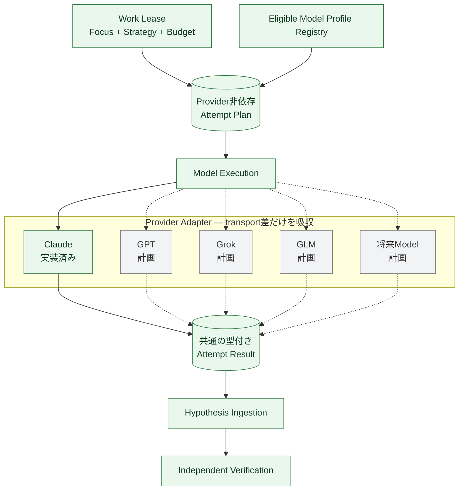

# 探索エージェント構成（Exploration Agent Architecture）

Status: living implementation view, 2026-09-02

この文書は、現在の探索処理をコードの詳細なしで追うための図である。設計上の正本は[Exploration seam](../exploration-seam.md)、実装場所とTestは[Codebase Guide](../../CODEBASE-GUIDE.md)とする。

図を横長にしないため、`対象理解 -> 作業分割 -> 並列Finder -> 仮説取込 -> 独立検証`を複数枚に分ける。緑は実装済み、黄は一部実装、灰は設計のみを表す。Module責任、実行時系列、現行と到達形の差、評価gate、主要fileを一画面ずつ確認する場合は[探索アーキテクチャ詳細ガイド](../../visuals/exploration-architecture.html)を開く。

## 1. Surface Mapから調査範囲を作る



Minimum Map Gateは全コードの完全理解を要求しない。ファイル一覧、実在するsource anchor、relationの結合、明示されたgapを検査し、根拠が足りなければ推測せず`Mapping Evidence Request`を返す。AI Mapperの直接出力はMapではなく`Map Delta Proposal`であり、path、digest、anchor、closed relation語彙を検査したclaimだけが新しいMap Revisionへ入る。現行の黄部分はContext pathをseedにした1-hop Map subgraphから既存node間の`flows-to`を提案する一回のstructured model実行、claim単位のDelta検査、Receipt、失敗/context-ceiling gapまでである。追加node、Conflict、Context Request、repair/continuation、tool付きMapperは未実装である。

Focus候補はREST entry、hook、source、state、guard、sink、未登録PHP、mapping gapから作る。同種のsurfaceだけで最初のWaveを埋めず、route signalと探索価値で候補を並べる。外部entry、server impact、database、browserは別bucketとして扱い、RCE系sinkが複数あるだけで最初の3件を使い切らない。

### 現行bootstrapの正確な選択規則

```text
candidates = every non-symbol Surface Map node
           + every PHP file without an entry in the same file
           + every mapping gap

known graph = observed + inferred relations
              unknown relations are never traversed

priority = external entry / known route
         -> dangerous primitive
         -> information-gain proxy
         -> coverage debt
         -> stable Focus ID

portfolio = one candidate per impact-aware bucket in each round

focus limit = min(maxFocusAreas, maxLeases)
leases      = one primary Lease per selected Focus
            + only when capacity remains, one alternate Strategy
              on the highest-priority elevated Focus
```

したがって`maxLeases = 3`で外部entry、server-impact sink、database sinkが揃う場合は、三つの異なるFocusへ一件ずつ割り当てる。候補が少なくcapacityが残る場合だけ、探索価値が最上位のelevated Focusへ別Strategyを重ねる。外部REST、`wp_ajax_*`、`admin_post_*`を最上位classとし、既知routeへ接続したsurface、code/process execution、file write、SQL、HTML output等を比較する。同程度ならcomponentのsurface kind数、unknown relation数、known relation数を情報利得のproxyにし、coverage debtとstable IDで決着する。

`unknown` relationを既知routeとして辿らず、架空の到達可能性を作らない。孤立した`bundled-vendor`候補も削除せず初回順位だけを下げ、Target固有entryまたはstateへ既知relationで接続していれば通常候補へ戻す。これはseverity scoreではなく、最初の有限Waveで何を調べるかを決める優先規則である。

候補生成とWork Waveは[bootstrap-exploration.ts](../../../src/research/exploration/bootstrap-exploration.ts)、内部順位は[focus-portfolio.ts](../../../src/research/exploration/focus-portfolio.ts)、外から観測する回帰仕様は[exploration-bootstrap.test.ts](../../../tests/research/exploration-bootstrap.test.ts)を参照する。

## 2. LaneとStrategyを別々に割り当てる



| 軸 | 現在の値 | 意味 |
| --- | --- | --- |
| Lane | Frontier / Primitive / Coverage | chain候補、単独primitive、未調査領域のどれを進めるか |
| Strategy | Entry Forward | 入力からguard、state、sinkへ進む |
| Strategy | Sink Backward | 危険なsinkから到達可能な入力へ戻る |
| Strategy | State Chain | 保存と読出し、actor交代、request間の順序を追う |
| Strategy | Invariant Review | 正常機能が守るべき権限・完全性を起点にする |
| Strategy | Wildcard | 既知classやsink catalogへ開始点を固定しない |

FinderをSQLi用、XSS用、RCE用という別interfaceへ分けない。全Finderは同じoutput schemaを使い、Focus AreaとStrategyだけを変える。高リスクFocusには可能なら異なるStrategyとmodel familyを重ねる。現在eligibleなのはClaude Opusだけなので、二系統目には`single-eligible-family`例外を明記して同じfamilyを使う。

## 3. 現在のFinder並列構成



現在のproduction pathは一つのWaveから安定順で最大3 Attemptを選び、`Promise.allSettled`で並列実行する。各Finderは次だけを受け取る。

- 自分のFocus Area、Lane、Strategy、上限
- Surface MapとPHP Program Indexから決定的に作った`Analysis Unit@v1`
- source-bound Hypothesisを返すためのversioned schema

現行のtool-free materializerは、Focus ownerのobserved anchorをseedにする。`sink-backward`は`Map relation -> 同じsink familyの近接source -> call neighbor -> literal参照 -> 共有hook`、`entry-forward`等は`共有hook -> literal参照 -> relation/call fallback`の順で最初の候補を作る。database sinkから始めた時は、同じdatabase-query familyのsourceを件数、bundled-vendor区分、directory近接、pathの安定順で比較できる。二次sourceを実際に読めた場合、そのsourceが参照するclass-like symbolの定義、低頻度literal参照、共有hookの別登録元を各最大1件、同じfile/byte上限内で前へ昇格する。これは一段だけで止まり、昇格したsourceから再帰展開しない。

`wildcard`は`directed候補を除いたSurface Map標本 -> 共有hook -> literal参照 -> relation/call fallback`の順を維持し、二次展開を行わない。標本はnode kindをround-robinし、同じkind内ではseedとのdirectory近接とpath順で決める。private closed sliceの上限は8 files、source全体650 KB、単一file 220 KBである。各fileはTarget manifestのsizeとSHA-256を再検査し、上限を越えるfileはobserved anchor周辺だけをrenderする。

### Analysis Unitの作り方



UnitはTarget、Map、Program Index、Focus、Leaseのdigestと、実際に採用したpath、file digest、line range、byte量、選択理由を持つ。同じsinkへ二つのLeaseを重ねても、directedとwildcardが同じsource集合へ収束しにくい。選択理由は「なぜcontextへ入れたか」の記録であり、sourceからsinkへの到達証拠ではない。実装は[finder-attempt-materializer.ts](../../../src/research/campaign-control/finder-attempt-materializer.ts)、外から観測する仕様は[finder-attempt-materializer.test.ts](../../../tests/research/finder-attempt-materializer.test.ts)を参照する。

FinderがHypothesisの`requiredEvidence`にTarget inventory内の具体的なPHP pathを挙げた場合、Independent Verifierはそのpathだけを追加sourceとして取得できる。これはFinderの主張を真と扱う処理ではない。pathの実在、PHP分類、manifest digest、file/total byte上限を再検査したうえで、Verifierが固定sourceから独立に支持または反証するためのbounded Context Responseである。

### 次のaccepted design: Finderが不足sourceを追う

現行の固定Analysis Unitは最初のcontextとして残し、次のsliceではFinderが同じTarget Snapshot内を予算付きで追跡できるようにする。これはSurface MapをAI出力で上書きする処理ではない。



model-visibleな操作は`read / search / symbol / graph`に限定し、任意shell、network、runtime、Target writeを追加しない。query、scope、走査量、truncation、result digestはprivate CASへ記録する。Focus Areaは「何を調べるか」の所有権であり、最初に選んだfileを越えてはならない境界ではない。

追加取得で解ける局所的なcaller、callee、wrapperはAttempt内の`Source Query`で追う。dynamic dispatch、cross-request state、dependency semantics等、Attempt内で決められない不足だけを`Mapping Evidence Request`として次のMap revisionへ送る。



詳細と受入条件は[Evidence-guided Finder loop](../evidence-guided-finder-loop.md)と[ADR 0112](../../adr/0112-treat-analysis-units-as-seeds-for-bounded-source-retrieval.md)に記録する。設計はacceptedだが、図の灰色部分は未実装である。

### Brizy pairで確認した6 Gate

| Gate | このsliceの結果 | artifactから確認したこと |
| --- | --- | --- |
| Target Identity | pass | 2.8.11と2.8.12を別Target Snapshotとし、manifest、Map、Program Index、実sourceのdigest bindingが一致した |
| Map Coverage | pass for this route | 外部entry、request source、保存、HTML outputのobserved anchorがAnalysis UnitとHypothesisをsourceへ拘束できた。全pluginの意味coverage完了は主張しない |
| Focus Rank | pass | 最大3 Leaseに外部entryの`entry-forward`と`wildcard`、別の危険sinkの`sink-backward`が入った |
| Context Reach | pass after correction | directed Unitが二次sourceからtemplateとsubmit側hook登録元を一段だけ取得した。`wildcard`の広い標本は変更していない |
| Hypothesis Recall | pass for stored-XSS slice | 2.8.11のFinderが保存値から管理画面renderまでの反証可能なCausal Identityを返した |
| Verification | pass for Stored XSS; partial globally | 2.8.11は独立source再導出とfresh gVisor Witness/ControlでFinding、2.8.12のoracle-free CampaignはFindingなし。file-writeやauthorization-bypass等は`unsupported-experiment`のまま |

最初の実行では、二次sourceを読んでもそこで見つかったtemplateとhookを追わず、Finderは不足sourceを`requiredEvidence`として返した。最初の一段展開ではliteral候補をpath順にしたため、一般的な文字列と同名のPHP fileがtemplateより先に入った。最終規則はmodelの自由文や既知脆弱性を読まず、固定source中のliteral頻度、出現順、Program Indexの共有hook、inventory digestだけで同じUnitを再現する。

### Appointment Booking Calendar SQLiで確認した6 Gate

| Gate | このsliceの結果 | artifactから確認したこと |
| --- | --- | --- |
| Target Identity | pass | `1.6.9.29@r3475885`とmechanism修正済み`1.6.10.0@r3480506`をmanifestとsource digestで別Snapshotへ固定した |
| Map Coverage | pass for slice | 749 files、2,750 nodes、271 relationsを持つMapからdatabase sinkと外部surfaceをsource anchorへ拘束した。573 gapsを残しており完全Mapとは主張しない |
| Focus Rank | pass | 最初の3 Leaseを外部entry、server-impact sink、database sinkへ分散した |
| Context Reach | pass after bounded response | 同sink family、class-like symbol、Finderが明示したinventory内pathから、route、model、database baseのsourceを独立Verifierへ到達させた |
| Hypothesis Recall | pass for SQLi slice | oracle-free positive Campaignがrequest-controlled `fields`からquery structureへ至る反証可能なHypothesisを生成した |
| Verification | pass for SQLi slice | positiveはfresh gVisor Witnessでdatabase-only canaryを観測しControlで消失、mechanism修正済みSnapshotは同じCausal IdentityでDisproved。negativeのoracle-free CampaignはFinding 0件だった |

公開advisoryの版境界とactual sourceの修正点に差があったため、version labelではなくSVN revision、manifest、Snapshot digestを正本にした。Finderにはadvisory、CVE、既知file、parameter、payload、patched narrativeを渡していない。初期Mapだけで継承、service lookup、public nonce経路を完全に表現できたとは主張せず、source-bound Hypothesisが要求した追加pathを独立Verifierの上限内で再取得してContext Reachを閉じた。

この順序は再現可能だが、動的property call、service locator、組立てcallback、fileをまたぐstate identityを静的call neighborだけで接続できない。現行のbounded Context Responseは独立Verification時に一回だけ補えるが、Finder自身は探索中に追加取得できない。acceptedな到達形では固定seedを小さくし、path・Lease・byte・turn budgetをharnessが検査する`read / search / symbol / graph` toolへ置き換える。shell、web、runtime、Target writeは追加しない。

Finderへ既知CVE、advisory、patched narrative、期待payload、別Finderの結果を渡さない。provider組込みのweb、shell、subagent、ambient MCPも無効にする。結果の到着順は判断に使わず、全Leaseが成功・失敗・取消のterminal resultになってから安定順へ戻す。

## 4. Finder出力から独立検証まで



多数決は使わない。一つのFinderだけが出した候補でも、Surface Mapのobserved anchorとrouteへ拘束でき、反証可能なら残す。重複は支持数ではなくCausal Identityとroute shapeでまとめる。

VerifierはFinderのsession、scratch、自己評価を読まず、固定Targetと最小Hypothesisからsourceを再導出する。現在はStored XSSとSQL injectionについて、Verifierが支持またはsource上の反証根拠とtyped Experimentを作り、Verification ModuleがfreshなgVisor sibling LabでWitnessとCausal Controlを順に実行する。共通のWordPress Lab lifecycleは一つの内部Moduleへ閉じ、mechanism adapterはsetupとsanitized observationだけを所有する。

## 5. 実装済みの閉路と次の拡張



2026-09-02時点で、Brizy Stored XSSとAppointment Booking Calendar SQLiの二つのmechanismが同じ公開Campaign/Verification Interfaceを通った。SQLiは脆弱Snapshotのoracle-free 3 Finder CampaignからFinding、mechanism修正済みSnapshotのoracle-free CampaignでFinding 0件、同じCausal Identityを拘束したprivate calibrationからDisprovedを記録した。全Finderがprovider通信で失敗したrunは`no-source-bound-hypothesis`へ丸めず、`provider-unavailable`として停止する。

旧whitebox-harnessと同じく、到達形ではCampaign投入後に人間の追加指示なしで反復する。新設計はその自律性を削らず、進行、上限、resume、停止判定をroot agentの巨大Promptから`Campaign Control`と型付きrecordへ移す。現行sliceは一つの有限Waveと次Decisionまでを自律実行するが、`continue-unresolved-work`を次Waveへ自動消費する部分はまだ未実装である。

図中のOpusは現在接続済みのModel Profileを表し、FinderまたはVerifierの型を意味しない。Target固定、Focus、tool manifest、出力schema、仮説取込、独立検証はprovider非依存である。Claude固有`high`は現在の開発baselineに限り、安価なeligible Profileで各gateを再現できることをハーネス能力として評価する。

## 6. Model Profileを差し替えても探索契約を変えない



`Attempt Plan`と`Attempt Result`が防火壁である。adapterは認証、CLI/API、model identity、provider固有effort、event形式、process lifecycleだけを変換し、Focus選定、tool権限、Hypothesisの意味、Findingへの昇格条件を変えない。したがってClaudeの`high`と別providerの設定を共通尺度へ変換せず、各Profileを同じrole contractとgateで評価する。

安価なProfileでContext Reachが不足した時は、上位modelへ即時fallbackせず、Surface Mapまたはbounded toolで不足sourceを供給する。source-boundな有望仮説まで進み、残りが推論上の曖昧さである場合だけ、同じTarget、Focus、context、schema、予算を固定した上位Profileと比較する。

## 実行主体と権限

| 実行主体 | 読めるもの | 作るもの | 禁止するもの |
| --- | --- | --- | --- |
| Mapper | Target Snapshot、静的解析結果 | Surface Map revision | Finding判定、攻撃実験 |
| Finder | 自分のAnalysis Unit、Focus、Strategy | 型付きHypothesis等 | runtime、browser、network、他Finderの会話 |
| Chain Synthesizer（設計のみ） | barrier後の型付きroute | chain Hypothesis、Frontier Gap | raw transcript、多数決による破棄 |
| Independent Verifier | 固定Target、最小Hypothesis | source再導出、Experiment | Finder sessionの再利用 |
| Lab Control | 型付きExperiment、固定baseline | sanitized observation | Hypothesis/Findingの判断、plain Docker fallback |
| Campaign Control | 不変ref、budget、terminal result | intent、Work Wave、Iteration Decision | provider固有処理、browser操作 |

## コードを追う入口

```text
src/research/
├── source-mapping/       # Surface MapとPHP Program Index
├── exploration/          # Focus、Lane、Strategy、Wave、仮説取込
├── campaign-control/     # Analysis Unit、並列Attempt、Verification接続
├── model-execution/      # Claude processとFinder schema
├── verification/         # 独立再導出、gVisor Witness/Control
└── research-record/      # append-only Ledgerとprivate CAS ref
```
