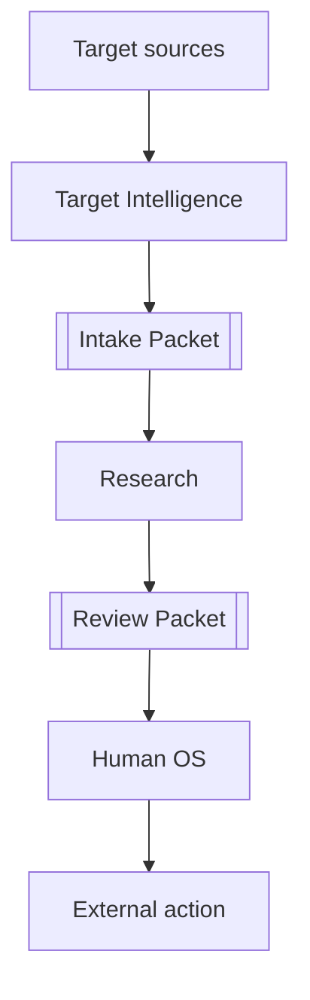
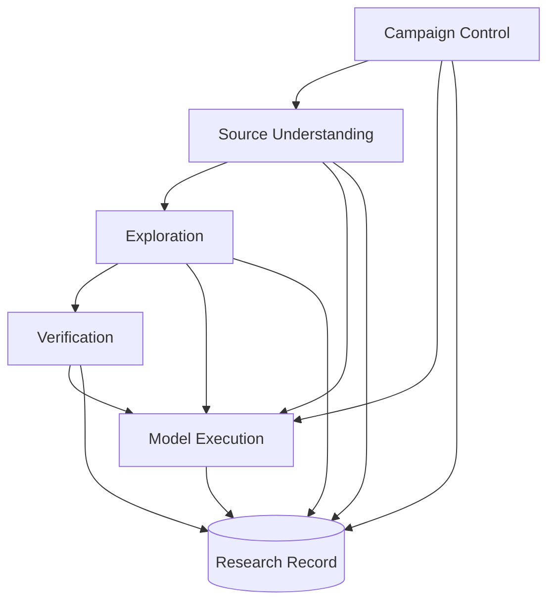
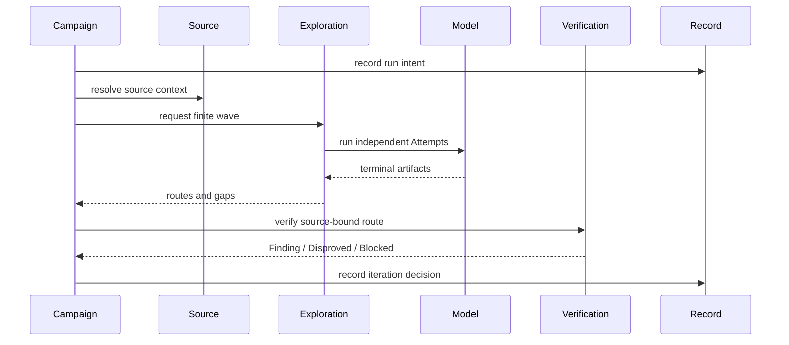
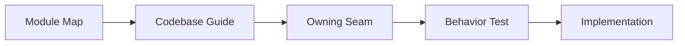

# Module Map

Status: accepted functional view; implementation status belongs in the [Codebase Guide](../../CODEBASE-GUIDE.md)

コードの詳細を追わずに「どのModuleが何を所有し、何を渡すか」を把握する図である。

## Product contexts

- `Target Intelligence`: 対象を選定・取得し、oracleを分離した受入情報を作る。
- `Research`: 自律探索、独立検証、記録、反復を行う。
- `Human OS`: 証拠を確認し、外部行動を明示承認する。

## Research modules

`Campaign Control`が有限workと予算を進行させる。`Source Understanding -> Exploration -> Verification`が証拠を強くする。`Model Execution`はAIを動かすが研究判断を所有しない。`Research Record`だけがdurableな事実とdecisionを保持する。

## Ownership

| Module | Owns | Input | Output | Does not own |
| --- | --- | --- | --- | --- |
| [Campaign Control](../campaign-execution-seam.md) | lifecycle、budget、wave、replay | Campaign Plan | Work Lease、terminal decision | candidateの真偽、provider処理 |
| [Source Understanding](../source-mapping-seam.md) | source inventory、Map、gap、source query | Target Snapshot | Map revision、source evidence | Finding、探索範囲 |
| [Exploration](../exploration-seam.md) | Approach Family、Hypothesis、Fragment、next wave | raw source、任意Map hint | verification request、gap、closure | Finding昇格、runtime実験 |
| [Verification](../verification-seam.md) | independent proof、Witness、Control、outcome | source-bound Hypothesis | Finding、Disproved、Blocked | Finder confidence、priority |
| [Model Execution](../model-execution-seam.md) | provider isolation、tool binding、process lifecycle | Attempt Plan | normalized terminal result | domain verdict |
| [Research Record](../module-architecture.md#research-record) | append、artifact refs、replay | versioned event | durable read model | domain decision |

## One campaign

矢印は責務間のartifact flowであり、内部helperのcall順ではない。すべての外部副作用は記録済みintentに結び付き、大きなartifactはprivate CASのdigestで参照する。

## Reading path

- 現在どこまで動くか: [Codebase Guide](../../CODEBASE-GUIDE.md)
- system contextとtrust zone: [Architecture overview](architecture-overview.md)
- 詳細なownershipと依存方向: [Module architecture](../module-architecture.md)
- 分からない正式語: [日本語用語早見表](../../JAPANESE-GLOSSARY.md)
