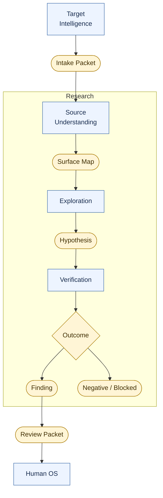
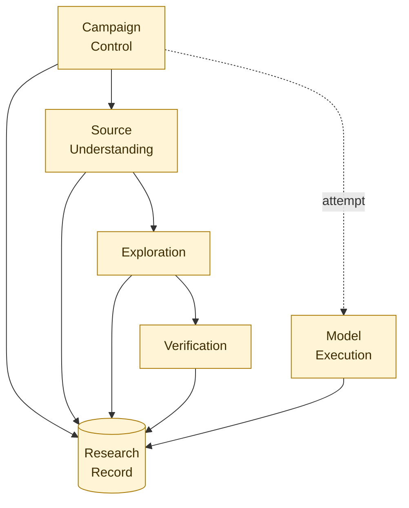
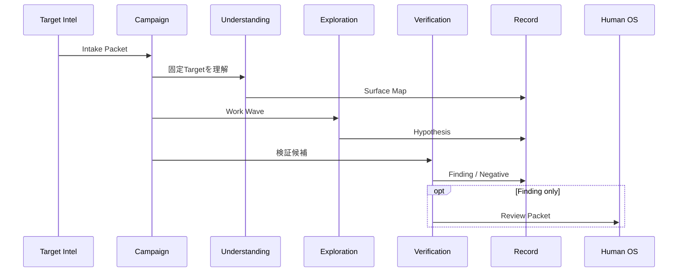
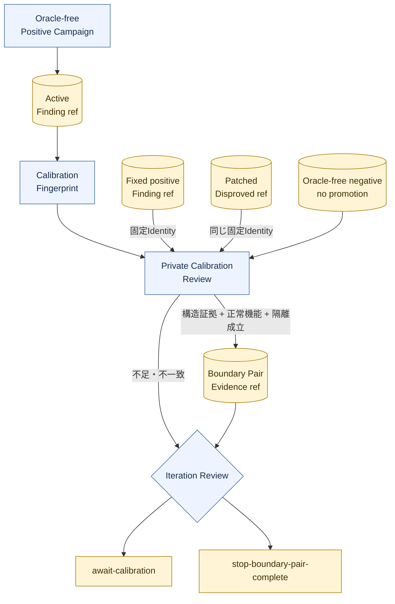

# Module Map

Status: living visual index, 2026-09-02

この文書は、コードの詳細を知らなくても「どのModuleが何を行い、何を受け取り、何を作るか」を把握するための機能図である。設計判断の正本は[Module architecture](../module-architecture.md)、現在のsource・Testとの対応は[Codebase Guide](../../CODEBASE-GUIDE.md)とする。

## 1. 製品が行うこと

- `Target Intelligence`は調査するpluginを選定・取得し、既知脆弱性のoracleを除いた受入情報を作る。
- `Source Understanding`はsourceと必要最小限の観測から攻撃面を構造化する。
- `Exploration`は独立した複数の探索から、反証可能な脆弱性仮説を作る。
- `Verification`は仮説をcleanな環境で再導出し、成立証拠と因果対照実験で真偽を決める。
- `Human OS`は固定された証拠を確認し、追加証拠または外部行動を判断する。

## 2. Researchを支える6 Module

色は2026-09-02時点のproduction実装状況を表す。黄は一部実装、灰は設計のみである。

`Campaign Control`が進行と予算を決める。`Source Understanding -> Exploration -> Verification`が証拠を強くする主経路である。`Model Execution`はAIを実行するが研究上の判断を所有しない。全Moduleの事実と判断は`Research Record`へ追記され、workerが過去の記録を書き換えることはできない。

## 3. Moduleごとの機能

| Module | 主な機能 | 受け取るもの | 作るもの | 所有しないもの |
| --- | --- | --- | --- | --- |
| [Campaign Control](../module-architecture.md#campaign-control) | Campaignを準備・前進・停止・再開し、有限のWork Waveと予算を管理する | Target Snapshot、Campaign Spec、operator command | Work Lease、停止理由、現在状態 | 脆弱性の真偽、provider固有処理 |
| [Source Understanding](../source-mapping-seam.md) | pluginの攻撃面、guard、data flow、未解決gapを構造化し、固定Snapshotのsource queryを解決する | Target Snapshot、PHP Program Index、許可されたRuntime Observation、Source Evidence Query | versioned Surface Map、source response、Lab Baseline | Finding、探索の多数決、Attempt policy |
| [Exploration](../exploration-seam.md) | raw sourceから独立Approach Familyを進め、Wave間でroute、missing link、coverage gapを反復する | Target-bound source tools、Work Lease、Approach Family Registry、任意enrichment | Hypothesis、Route Fragment、Gap Review、次Wave assignment | Findingへの昇格、runtimeの直接操作 |
| [Verification](../module-architecture.md#verification) | 仮説を独立再導出し、cleanなLabで成立・不成立・未検証を確定する | Target Snapshot、最小Hypothesis、typed Experiment | Finding、Negative Result、Blocked Result、Review Packet | Finderの自己評価、raw transcriptによる証明 |
| [Model Execution](../model-execution-seam.md) | 公式provider processを隔離実行し、Attempt/tool binding、timeout、retry、session、usageを管理する | Model Profile、Assignment、外部budget、Source Tool Policy | normalized events、result、Tool Receipt、transcript reference | Campaign priority、Verification verdict、source query semantics |
| [Research Record](../module-architecture.md#research-record) | eventとartifactをappend-onlyに保存し、再現可能なviewを構築する | versioned event、artifact、provenance | Research Ledger、CAS reference、replayed view | domain判断、provider選択 |

## 4. 一つの調査が通る道

この図は概念上の主経路であり、厳密なcall順ではない。実行中は`Campaign Control`が各段階をreconcileし、`Model Execution`が必要なAI Attemptを動かす。すべての重要な遷移は先に`Research Record`へ固定してから外部副作用を進める。

### Development Boundary Pairの閉じ方

private Calibration Reviewは探索agentではなくDevelopment Boundary Pair専用のsystem seamである。Case roleや既知payloadをFinderへ返さず、完成済みterminal refだけを比較する。patched Targetへ正例Hypothesisを当てる作業もFinderではなくprivate graderから同じVerification seamへ入れる。固定positive/negativeは同じCausal Identityを要求するが、別Attemptのactive Findingはmodelの自然言語表現ではなくCalibration Fingerprintで照合する。単一のFinding、異なるsource route、negative Campaignからのfalse promotion、機能破壊によるnegative、plain Docker fallbackのいずれでも完了receiptを作らない。

## 5. 詳細を読むとき

- 現在どこまで動くか、どのsourceとTestか: [Codebase Guide](../../CODEBASE-GUIDE.md)
- Surface MapのInterface、根拠状態、AIとの責任分担: [攻撃面マップ構成](surface-map-architecture.md)
- 全体のcontextと信頼領域: [Architecture overview](architecture-overview.md)
- Module ownershipと依存方向: [Module architecture](../module-architecture.md)
- 探索の分割と合流: [Exploration seam](../exploration-seam.md)
- 現在のFinder並列構成と独立検証への流れ: [探索エージェント構成](exploration-agent-architecture.md)
- 独立Verificationを含むResearch全体: [Architecture](../architecture.md)
- 日本語で分からない正式語: [日本語用語早見表](../../JAPANESE-GLOSSARY.md)
