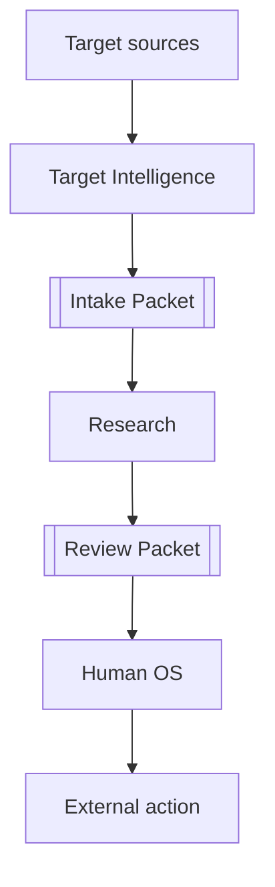
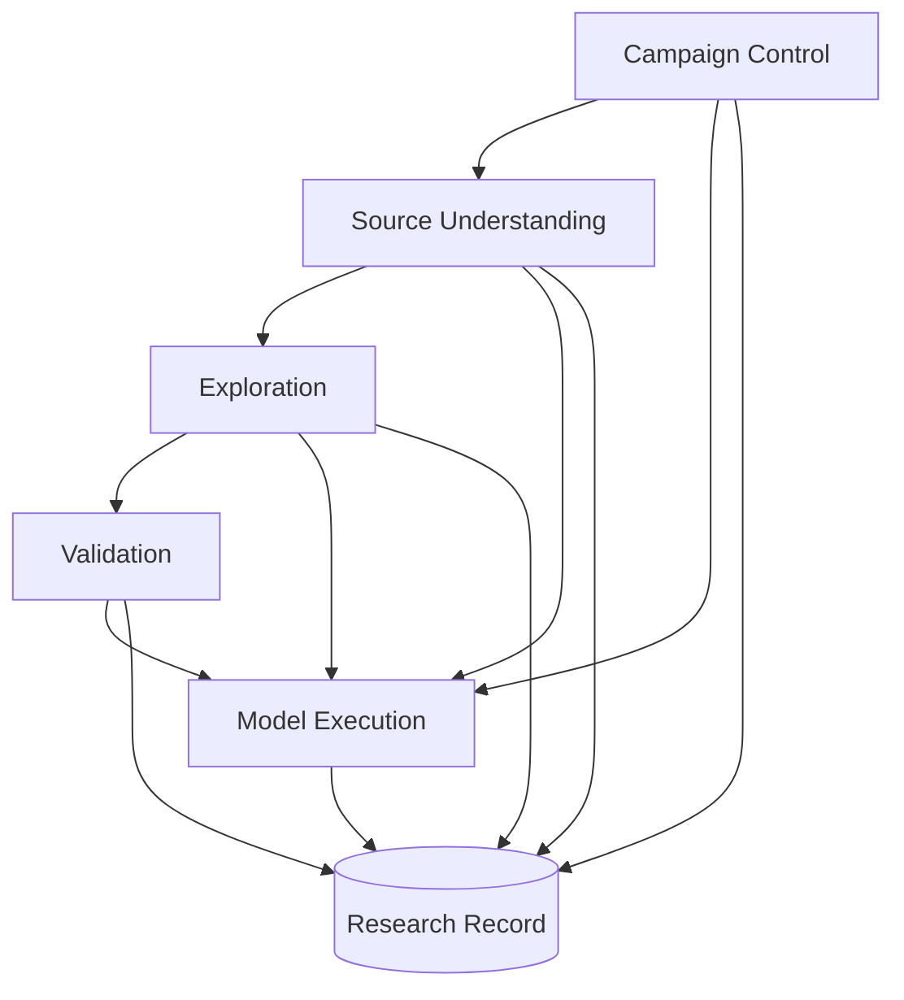
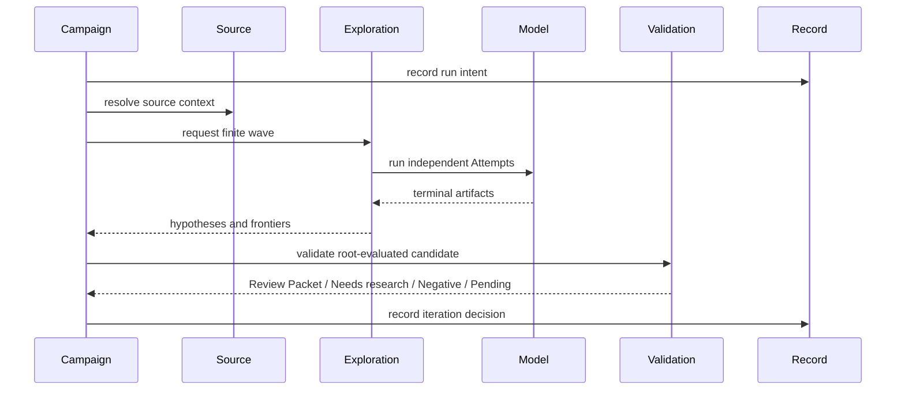
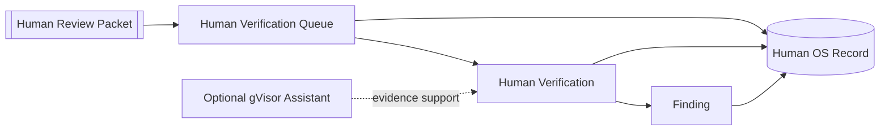

# Module Map

Status: accepted functional view; implementation status belongs in the [Codebase Guide](../../CODEBASE-GUIDE.md)

コード詳細を追わずに「どのModuleが何を所有し、何を渡すか」を把握する図である。

## Product contexts

- `Target Intelligence`: 対象を選定・取得し、oracleを分離した受入情報を作る。
- `Research`: 自律探索、source-only Validation、記録、反復、Review Packet handoffを行う。
- `Human OS`: fresh Human Verification、Finding、外部行動の明示承認を行う。

## Research modules

`Campaign Control`が有限workと予算を進行させる。`Source Understanding -> Exploration -> Validation`がHuman Reviewへ渡せるsource evidenceを強くする。`Model Execution`はAIを動かすが研究判断を所有しない。`Research Record`だけがdurableなResearch事実とdecisionを保持する。

## Ownership

| Module | Owns | Input | Output | Does not own |
| --- | --- | --- | --- | --- |
| [Campaign Control](../campaign-execution-seam.md) | lifecycle、budget、wave、replay | Campaign Plan | Work Lease、terminal decision | candidateの真偽、provider処理 |
| [Source Understanding](../source-mapping-seam.md) | source inventory、Map、gap、source query | Target Snapshot | source evidence、optional Map revision | Finding、探索範囲 |
| [Exploration](../exploration-seam.md) | research thesis、Hypothesis、Fragment、Approach Familyの意味と状態、Depth Admission | raw source、optional static hints | Validation candidate、frontier、family change、closure | Finding昇格、runtime実験、durable event storage |
| [Validation](../validation-seam.md) | independent source review、rubric、conflict、Synthesis、Risk Assessment、Review Packet | Root-evaluated candidate、Validation Threat Context | Ready-for-human、Needs-research、Disproved、Rejected、Validation-pending | Finding、runtime reproduction、human scheduling |
| [Model Execution](../model-execution-seam.md) | provider isolation、tool binding、process lifecycle | Attempt Plan | normalized terminal result | domain verdict |
| Research Record | append-only research facts、artifact refs、replay、Registry projection | versioned event | durable read model | Familyのsemantic identity、delta、reopen判断 |

## One campaign

## Human OS modules

Human OSはResearch Ledgerまたは内部CASを直接読まず、versioned Human Review Packetだけを入力にする。Human Verification Environment、Review Disposition、Finding、Human Deferredを所有し、Researchへ不足を返す時はversioned Evidence Requestを使う。

## Reading path

`Codebase Guide -> owning Seam -> Behavior Test -> implementation`を通常経路とする。

- current implementation: [Codebase Guide](../../CODEBASE-GUIDE.md)
- system context / trust zone: [Architecture Overview](architecture-overview.md)
- research policy: [Research Design Principles](../research-design-principles.md)
- glossary: [日本語用語早見表](../../JAPANESE-GLOSSARY.md)
