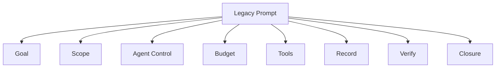
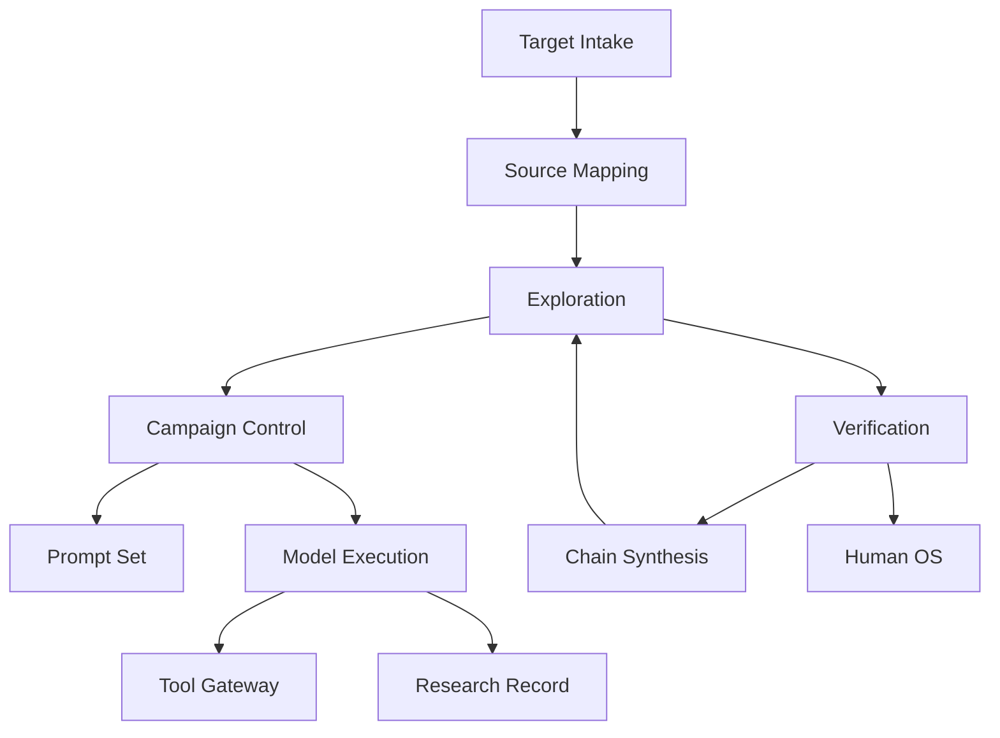
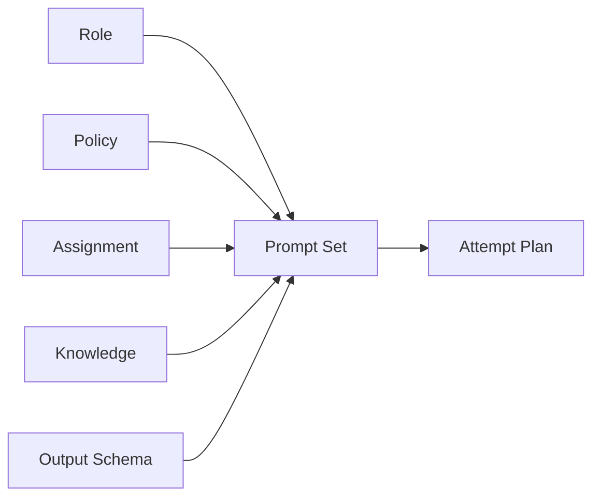
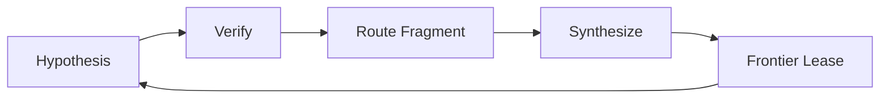

# Prompt責務の分離（Prompt Responsibility Map）

Status: accepted architecture view, 2026-09-02

この図は、旧`wp2shell`・whitebox-harnessの巨大Promptが担っていた責務を、現在のdeep moduleへどのように分離するかを示す。判断根拠は[wp2shell由来Promptの責務分解](../../research/wp2shell-prompt-decomposition.md)に置く。

## 旧構造

一枚のPromptが、modelのreasoningだけでなく、実行制御、権限、並列化、永続化、停止まで担っていた。

## 現在の分離

- `Prompt Set`: role、goal、evidence規則、Focus、closure obligationだけを表す。
- `Campaign Control`: Work Wave、最大3並列、budget、resume、次のactionを所有する。
- `Model Execution`: provider process、effort、timeout、schema decodeを所有する。
- `Tool Gateway`: bounded read/search/symbol/graphとTool Receiptを所有する。
- `Research Record`: CASとLedgerへ事実、仮説、unknown、negative evidenceを保存する。
- `Verification`: fresh contextで成立性を再導出し、WitnessとCausal Controlを作る。
- `Chain Synthesis`: verified primitiveをFrontier探索へ戻す。

## Prompt Setの内部

`Prompt Set`はversionとdigestを持つが、次を所有しない。

- provider/model/effortの選択
- worker spawnまたは再割当て
- physical filesystem path
- network、shell、runtime権限
- Campaign budgetの延長
- Research Ledgerへの直接書込み
- Findingの成立判定またはProgramme Eligibility

## 人間checkpointを自動loopへ置き換える

wp2shellでは、人間がSQLiを確認してからRCE escalationを改めて依頼した。通常の人間介入を置かない本ハーネスでは次のloopへする。

whitebox-harnessはこのloopをroot agent主導で完全自律実行していた。下図はその自律性を弱めるものではなく、Prompt内にあった進行制御をCampaign Controlと型付きartifactへ移すものである。

`Verification`で不成立ならHypothesisを消去せず、反証根拠を記録してloopを閉じる。成立したprimitiveは独立Finding候補として保持しながら、より強いterminalへ接続できる場合だけ新しいFrontier Work Leaseを作る。
