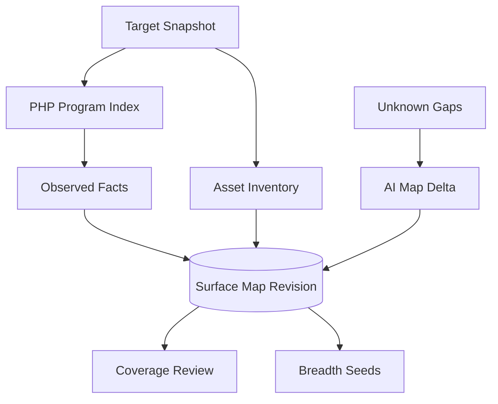
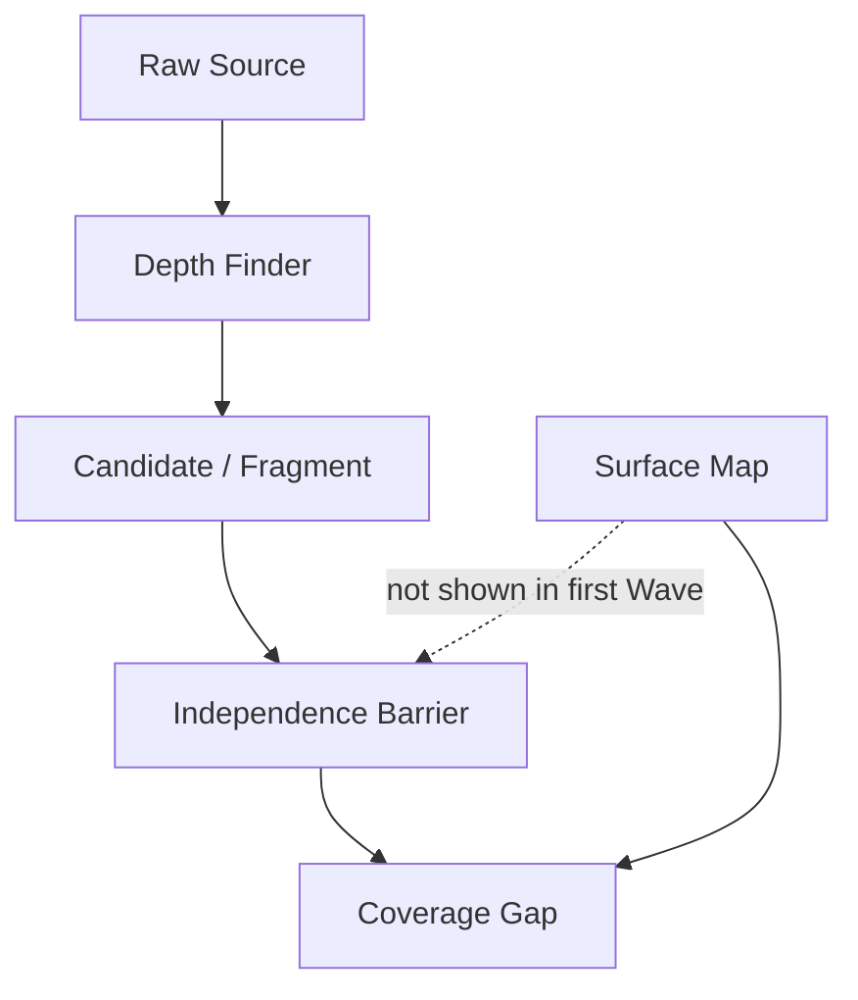

# 攻撃面マップ構成（Surface Map Architecture）

Status: migration-support architecture view, 2026-09-03

Surface Mapは脆弱性探索の主エンジンではなく、決定論的に観測できたsource fact、modelが提案したrelation、未解決gapを混同せず保存する補助artifactである。Depth Campaignの最初のWaveはMapを見ず、raw sourceから探索する。

## 1. 作成と利用

Parserがsource上に存在する構文やregistrationを`observed`として作る。AI Mapperは動的callbackやcross-file relationを提案できるが、既存のobserved factを上書きできず、証拠が足りないrelationは`inferred`または`unknown`に残す。

## 2. Depth Finderとの境界

Map nodeがないpathも常に探索可能で、source anchorを持つcandidateはMap外でも受理する。Map non-matchを安全またはclosureの証拠にしない。Map-assisted coverageは独立raw-source Waveの後にだけ候補を追加できる。

## 3. 根拠状態

| 状態 | 意味 | 禁止する読み替え |
| --- | --- | --- |
| `observed` | parserまたは許可されたruntime observationが固定source/runtimeで直接観測 | attacker reachability、data flow、脆弱性成立 |
| `inferred` | source anchorと推論理由を持つrelation proposal | 確定したcall edgeまたはFinding |
| `unknown` | 必要証拠とgapが明示された未解決relation | 存在しないpath、安全性、解析完了 |

詳細interfaceは[Source Mapping seam](../source-mapping-seam.md)、Finderとの優先関係は[ADR 0113](../../adr/0113-keep-finder-methods-free-behind-an-evidence-shell.md)を参照する。
