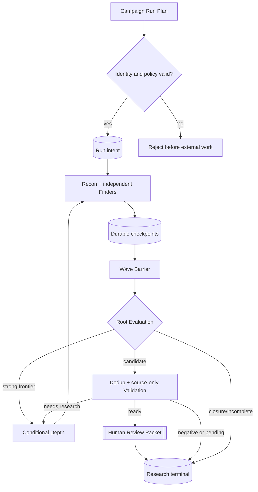
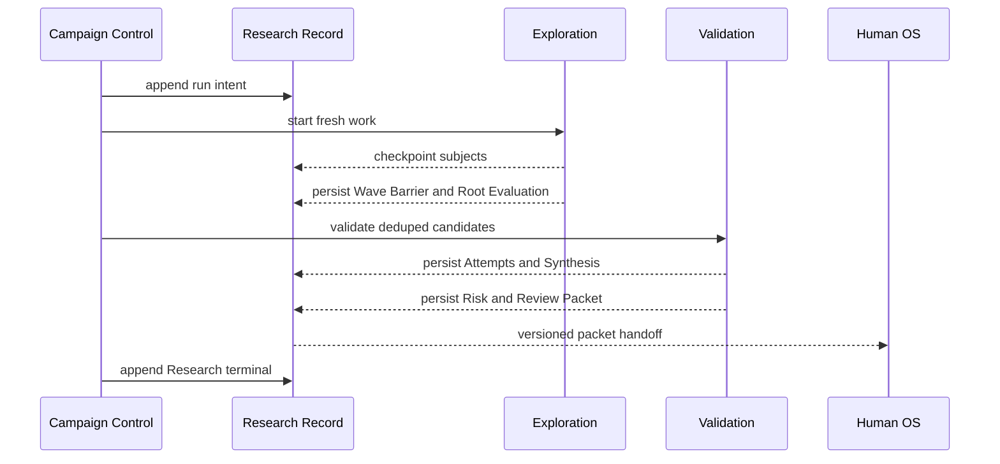

# Campaign execution seam

Status: accepted design; current implementation is tracked only in the [Codebase Guide](../CODEBASE-GUIDE.md)

## Owner and purpose

Researchの`Campaign Control`は、一つの固定Target Snapshotを有限のSemantic Research Wave、conditional Depth、source-only Validation、Human Review Packet handoffまで前進させる。探索方法、provider process、validator fan-out、Human OSのqueueまたはruntime reproductionをcallerへ漏らさず、記録済みのResearch terminalだけを返す。

```ts
interface CampaignRunner {
  prepare(input: NewCampaignInput): Promise<PreparedCampaign>;
  prepareFromTargetIntake(input: TargetIntakeCampaignPreparationInput): Promise<PreparedCampaign>;
  run(plan: CampaignRunPlan): Promise<CampaignRunRecordRef>;
}
```

schema version overloadは既存Ledger replay用に維持できるが、新しいphase別public methodを増やさない。`advanceWave`、`runFinder`、`validateCandidate`、`synthesizeValidation`等は`run`の背後へ隠す。

`CampaignReader.inspect`はterminal Run、実行中progress、Validation disposition、Review Packet refsをResearch Ledger/CASだけから決定的に再構築する。progress reporterはbest-effort observerであり、表示失敗またはheartbeatがCampaign outcomeを変更しない。

## Preparation and plan boundary

`prepareFromTargetIntake`はreadyなTarget Intake PacketとReceiptをResearch CASへdigest固定で複製し、Target SnapshotとTargetFileManifestをcallerに再入力させない。Target Intelligenceの内部storageまたは受入policyをResearchから再実行しない。artifact欠落、改変、binding不一致はworker起動前のtyped integrity failureとする。

新しいCampaign Planは次を固定する。

- Target SnapshotとTargetFileManifest
- oracle-free Target metadata
- Exploration、Validation、Model Executionのversioned policy/profile
- role別budget、Campaign全体budget、最大並列数、Wave ceiling
- read-only Source Tool PolicyとPrompt/Knowledge refs
- legacy policyか現行policyかを分けるschema version

Surface Mapは任意であり、source identity、candidate admission、closureの条件にしない。Lab Baseline、Experiment registry、Human Verification backend、CVE、advisory、patch、expected route/payload、credentialを現行Research Planへ含めない。

## Lifecycle



Finder checkpointはTarget、Manifest、Attempt、Work Lease、ordinalへbindして即時durableにするが、Validation開始はWave BarrierとRoot Evaluation後である。Root Evaluationはcheckpointを含む全subjectを一つ以上のactionへ明示的に置く。invalid evaluationまたはsilent omissionをcandidate rejectionへ丸めない。

一つのValidation CandidateがReady-for-humanになってもactive Family、frontier、gapまたはplanned Waveを消さない。Research terminalは全Exploration workとValidation workのterminal/incomplete状態から決め、Human Deferred、Human Verification、Findingを待たない。

## Exploration and Depth orchestration

初期Waveはwhole-target Baseline FinderとSource-aware Reconを並行開始し、Reconから最大三つのFocused/Wildcard Finderを追加できる。全Finderは同じTarget Snapshot全体へpivotでき、支持数または到着順でcandidateを捨てない。

Iteration Decision、Approach Family change、Depth Work Queue、Root Synthesis、Adversarial Critique、Depth Root Evaluation、Missing-link Waveは各stageのartifactとeventをdurableにしてから次stageを始める。Familyごと最大三つのevidence-generation Wave、Campaign全体最大十二Wave、各Wave最大四Finderを初期ceilingとし、容量を越えたgapは`unscheduledGaps`として残す。

`needs-research`のValidation proof gapは同じApproach FamilyのFrontier Gapとしてのみ戻し、Familyの既存Wave ceilingを消費する。Validationが新しいFamilyを作らず、Campaign Controlがsemantic attach先を推測しない。

Closureは最後のmaterial evidence以後に二回連続するcomplete no-material-delta evaluationを必要とし、後者はfresh Wildcardまたは独立Gap Reviewを含む。active/blocked Family、未解決gap、pending Validation、invalid Attempt、budget overflowがあればCoverage Closureへ丸めない。

## Validation orchestration

Wave BarrierとRoot Evaluationがdurableになった後、Target、Manifest、attacker premise、broken property、ordered route、source anchorからexact candidate identityを作る。Finder、Depth、別proposalから同じidentityが来ても一つのValidation intentへ収束する。

Campaign Controlは[Validation seam](validation-seam.md)へ一つの`ValidationPlan`を渡すだけで、二つのfresh Validator、material conflict時の第三Validator、tool-free Synthesisを個別scheduleしない。Validation Moduleが返すDispositionを次のように扱う。

- Ready-for-human: Risk AssessmentとHuman Review Packetをdurableにしてhandoffする。
- Needs-research: 同じFamilyへ具体的Frontier Gapを戻す。
- Disproved/Rejected: exact candidateのterminal negativeとして保持する。
- Validation-pending: budget/provider/tool/integrity reason付きでResearchをIncompleteにする。

Validation reserveはCampaign全体USD 150のうち初期USD 30とし、Explorationへ貸し出さない。Validatorのcandidate件数quota、tokenだけ、severity scoreで打ち切らず、累積provider costとwall timeをhard stopにする。reserve exhaustionをDisproved、RejectedまたはHuman Deferredへ読み替えない。

## Research and product terminals

Research terminalはExploration/Depth/Validationと全Review Packet handoffの結果を持つ。次を区別する。

- `completed`: 全Research workがterminalで、0件以上のReview Packetをhandoffした。
- `coverage-closed`: evidence-backed Closureを満たし、pending workがない。
- `incomplete`: active Family、gap、Validation-pending、provider/tool/budget failure等が残る。

Product terminalはHuman OSが所有し、active Human Review CaseのDispositionから決める。ResearchのcompletedをProduct successと呼ばず、Human OSのqueue状態をResearch Ledgerへ複製しない。

## Durable side-effect ordering



外部workより先にintentをappendする。artifactをCAS、参照eventをLedgerへdurableにしてからackまたは次stageを開始する。crash後は最後のdurable boundaryから再開し、未ack payload、partial model output、provider conversation、writable stateを別Attemptへ渡さない。

## Replay and legacy compatibility

同じ完了済みPlanの再実行はproviderを起動せず既存refへ収束する。旧Map-first、旧checkpoint-immediate Verification、旧Finding schemaは元policyのままread-only replayし、新policyのValidation dispositionへ自動変換しない。旧/new Campaignはread modelでpolicy versionを明示し、metricを混ぜない。

新policyのdefault切替後は旧Verification Queueへ新しいintentを作らない。既存gVisor LabはHuman OSの任意Assistantとして別Seamから利用する。

## Failure semantics

- integrity/policy不正はmodel起動前に拒否する。
- provider failure、invalid output、policy denial、budget exhaustionをno-new-evidenceまたはnegativeへ丸めない。
- 一Attempt failureで他Attemptまたはdurable checkpointを取り消さない。
- Root Evaluation不成立時はheuristic admission/closureへfallbackしない。
- Validation-pendingをfalse positiveまたはHuman Deferredにしない。
- observer、progress reporter、private transcript sinkの失敗はCampaign outcomeを変えない。
- Human OS handoff失敗はResearch packet artifactを保持し、context間delivery failureとして区別する。

## Behavior test surface

Testは`prepare`、`prepareFromTargetIntake`、`run`、`CampaignReader.inspect`から観測し、private phase method、SQL row、provider argv、prompt wordingを固定しない。

最低限、Target/Manifest integrity、Mapなし開始、Recon/Baseline並行、checkpoint durability、Wave Barrier後のRoot Evaluation、Root Evaluation前にValidationしないこと、minority candidate保持、Depth三Wave ceiling、二段Closure、exact Validation dedup、Validation dispositionのCampaign反映、needs-researchのsame-Family feedback、Ready-for-human後の残探索継続、USD reserve、validation-pending、Research/Product terminal分離、packet handoff、close/reopen replay、legacy Ledger互換を保護する。

探索判断は[Exploration seam](exploration-seam.md)、candidate処遇は[Validation seam](validation-seam.md)、Human OS handoff後は[Human Verification seam](human-verification-seam.md)、provider差は[Model Execution seam](model-execution-seam.md)を正本とする。
