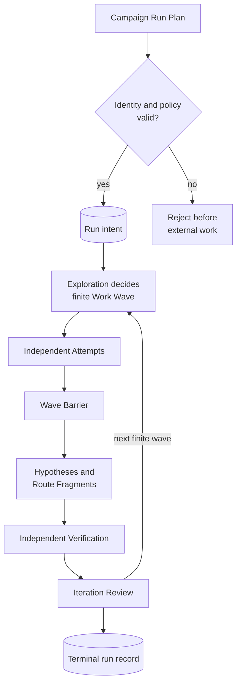
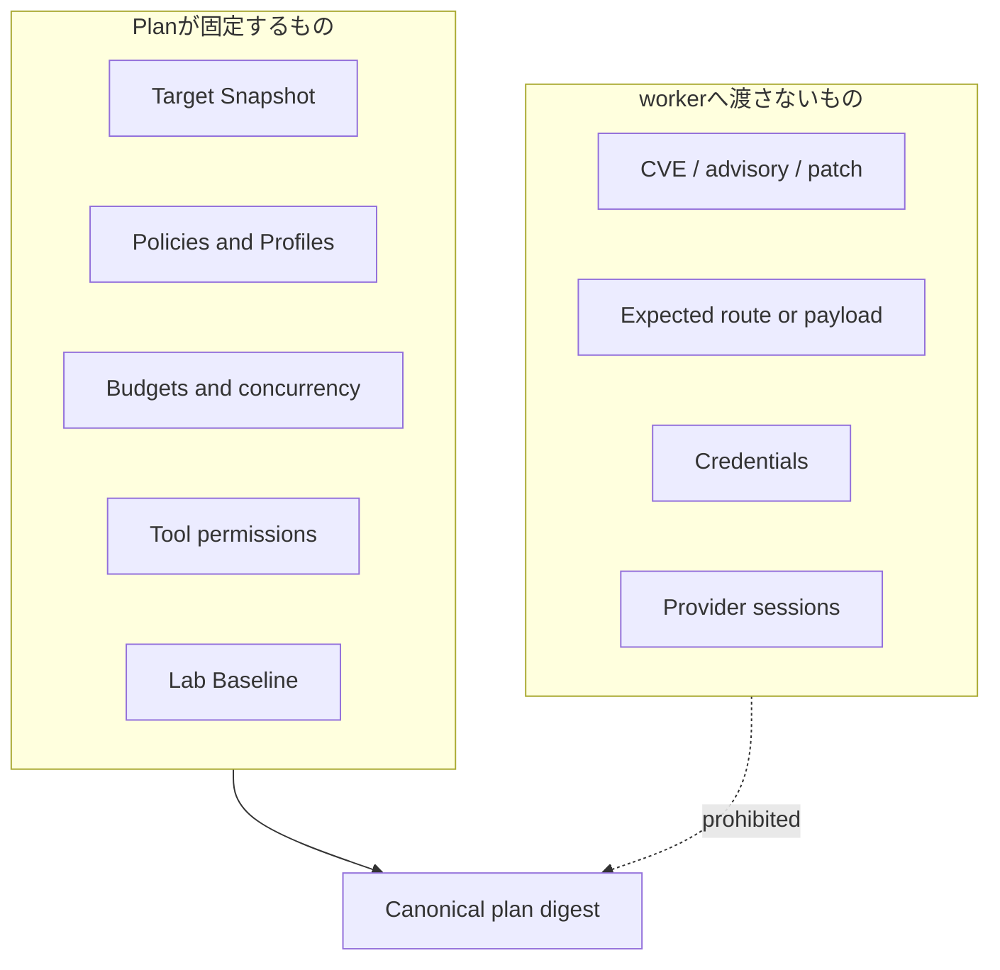
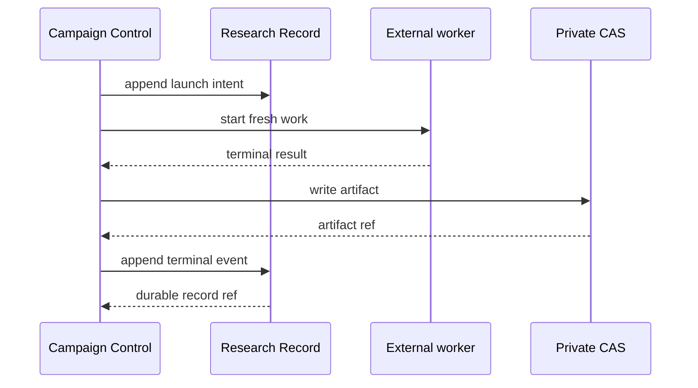
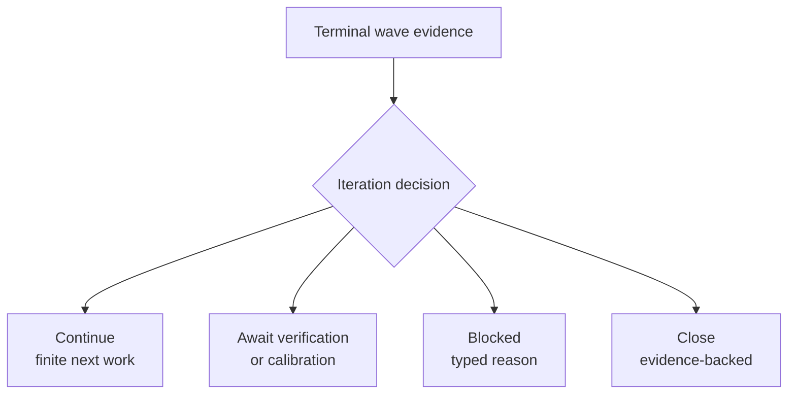

# Campaign execution seam

Status: accepted design; current implementation is tracked only in the [Codebase Guide](../CODEBASE-GUIDE.md)

## Owner and purpose

`Campaign Control`は、一つの固定`Target Snapshot`を有限のWork Waveで前進させる。探索方法、provider process、実験手順をcallerへ漏らさず、記録済みのterminal decisionだけを返す。

```ts
interface CampaignRunner {
  prepare(input: NewCampaignInputV1): Promise<PreparedCampaign>;
  run(plan: CampaignRunPlanV1): Promise<CampaignRunRecordRef>;
}
```

`advanceWave`、`runFinder`、`verifyHypothesis`等のphase別methodは公開しない。安全な順序、予算、再開、stable orderingは`run`の背後へ隠す。

## Campaign lifecycle



一Waveは全Attemptがterminalになるまで合流しない。完了順ではなくWork Lease identityで正規化し、少数派または一件だけのsource-bound routeを多数決で捨てない。

## Plan boundary



Target、Preparation、Lab、artifactのbindingが一致しなければ、modelまたはLabを起動する前に拒否する。一Campaignへ複数のTarget Snapshotを混ぜない。

## Owned orchestration

`Campaign Control`が所有するのは次だけである。

- intentを先に記録すること
- 有限Wave、予約予算、最大並列数を固定すること
- terminal artifactをstable orderで次Moduleへ渡すこと
- Verification結果をIteration Reviewへfoldすること
- terminal recordからidempotentに再生すること

脆弱性の真偽は`Verification`、探索上の次手は`Exploration`、provider差は`Model Execution`、永続化は`Research Record`が所有する。

## Durable side-effect ordering



crash後、terminal eventがなければ古いprovider session、stdout、writable Labを証拠として再利用しない。再開可能条件が揃わないAttemptは`orphaned`として閉じ、残予算内でfresh workを作る。

## Terminal decisions



一回のAttempt失敗、Hypothesis 0件、modelの「見つからない」という自己申告だけではcloseしない。provider障害、予算切れ、unsupported experiment、evidence-backed closureを別のterminal reasonとして保つ。

## Invariants

1. public入口は`prepare`と`run`だけである。
2. 外部副作用より先にversioned intentを記録する。
3. 同じPlan digestの完了済みrunは同じrecord refへ収束する。
4. 到着順、model confidence、支持model数で候補を採否しない。
5. FinderとVerifierはsession、scratch、payload、mutable Labを共有しない。
6. Surface Mapは任意の補助入力であり、Depth Campaign開始条件または探索上限にしない。
7. private calibration oracleをproduction worker inputへ戻さない。

## Behavior test surface

Testは`CampaignRunner.run`と`CampaignReader`から得るdurable viewだけを観測する。内部helper、process argv、call count、timingを固定しない。

最低限、次を保護する。

1. 一つのPlanが有限Waveからterminal decisionまで閉じる。
2. Attempt完了順が変わってもterminal digestが変わらない。
3. 一件の失敗が他のcandidateを消さない。
4. typed Verification blockerがCampaignでも同じ意味を保つ。
5. crash境界ごとの再実行が副作用を重複させない。
6. oracle、既知payload、credentialがworker-visible inputへ入らない。
7. raw-source CampaignをSurface Mapなしで開始できる。

探索の判断は[Exploration seam](exploration-seam.md)、実行transportは[Model execution seam](model-execution-seam.md)、証明は[Verification seam](verification-seam.md)を正本とする。対象別の実測は[実験記録](../experiments/README.md)にだけ置く。
