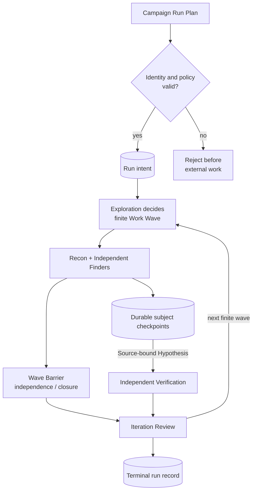
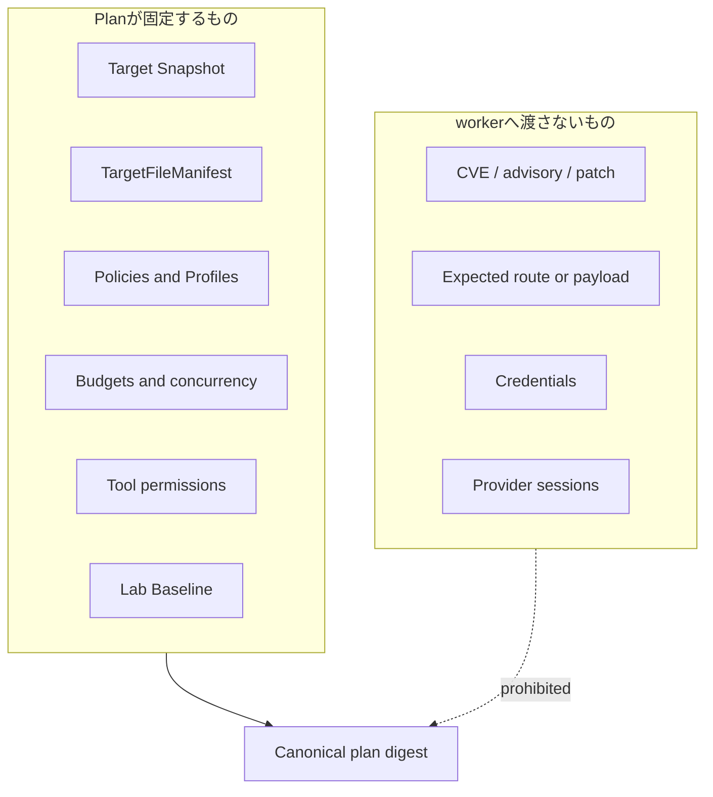
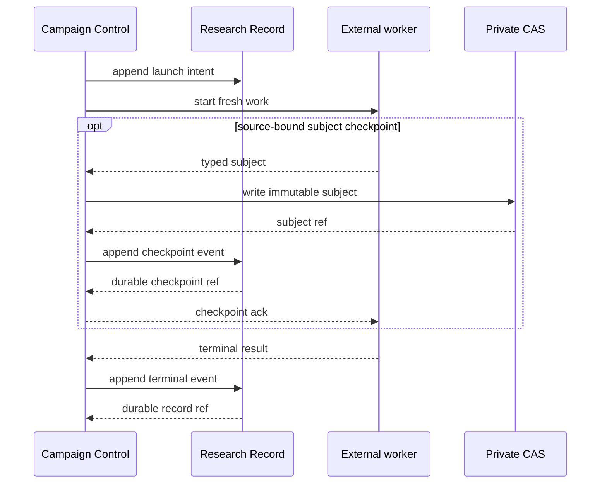
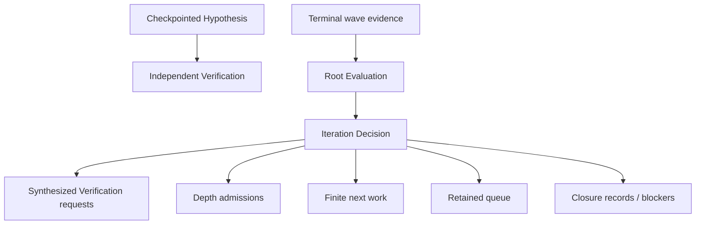

# Campaign execution seam

Status: accepted design; current implementation is tracked only in the [Codebase Guide](../CODEBASE-GUIDE.md)

## Owner and purpose

`Campaign Control`は、一つの固定`Target Snapshot`を有限のWork Waveで前進させる。探索方法、provider process、実験手順をcallerへ漏らさず、記録済みのterminal decisionだけを返す。

```ts
interface CampaignRunner {
  prepare(input: NewCampaignInputV1 | NewCampaignInputV2): Promise<PreparedCampaign>;
  run(plan: CampaignRunPlanV1 | CampaignRunPlanV2): Promise<CampaignRunRecordRefV1 | CampaignRunRecordRefV2>;
}
```

terminal Runの読み取りでは、`CampaignReader.inspect`がRun recordに加え、Verificationの構造証拠から投影した`finding-mechanism-groups` viewを公開する。derived viewはRunやFindingを上書きせず、同じLedgerとCASから決定的に再構築する。groupingの証拠境界とfailure semanticsは[Verification seam](verification-seam.md)を正本とする。

`advanceWave`、`runFinder`、`verifyHypothesis`等のphase別methodは公開しない。安全な順序、予算、再開、stable orderingは`run`の背後へ隠す。

v1 Runは記録済みCampaignのreplay専用であり、新規Campaignはv2だけを生成する。

`NewCampaignInputV2`はTarget Intelligence由来の`Canonical File Manifest`を持つ。`prepare`はpath、原文bytes digest、sizeを変更せず`TargetFileManifest`へ一度だけ投影し、Target SnapshotへbindしたartifactをCASへ保存してからschema version 2のprepared eventへrefを記録する。CAS digest、Target binding、Ledger上の再導出結果が一致しなければ外部worker前に拒否する。schema version 1のinputとprepared eventは既存Campaignのreplay用に読み続ける。

## Campaign lifecycle



一Waveは全AttemptがterminalになるまでClosureまたは次Waveを決めないが、Finderのsubject checkpointは待たない。Source-bound Hypothesisはdurableになり次第Independent Verificationへ投入できる。Wave Barrierは完了順ではなくWork Lease identityで全subjectを正規化し、Finder間の独立性と全件処遇を保護するために使う。少数派または一件だけのsource-bound routeを多数決で捨てず、Root Evaluator failureで既にcheckpointしたcandidateまたはVerification workを取り消さない。

[ADR 0119](../adr/0119-release-finder-checkpoints-before-the-wave-barrier.md)がcandidate公開順序を、[ADR 0120](../adr/0120-run-source-aware-recon-alongside-a-whole-target-baseline.md)が初期Wave topologyを固定する。

## Plan boundary



新規`CampaignRunPlanV2`はTarget Snapshotへbindした`TargetFileManifest` refを必須、Surface Map refを任意とする。Target、Manifest、Preparation、Lab、artifactのbindingが一致しなければ、modelまたはLabを起動する前に拒否する。一Campaignへ複数のTarget SnapshotまたはManifestを混ぜない。任意のMapを使ったPlanはMap refもplan digestへ含めるが、Hypothesisのsource identityはManifestで固定する。

新規`Attempt Plan` schema version 2はrole-discriminated unionとし、Target Snapshot、TargetFileManifest、role-specific assignment、Prompt Set、selected Knowledge、Model Profile、Source Tool Policy、出力schema、予算を一つのdigestへ固定する。Finder assignmentはWork WaveとWork Leaseを、Root Planner / Evaluation / Synthesis / Critic assignmentは評価するimmutable artifact refを持つ。別のFinder Context artifactを重ねない。Attempt Receiptは実行したPlan digestを参照し、Tool Receiptは同じAttempt、assignment、Target、Manifest、Policyへbindする。

Campaign Controlのmaterialization seamは一つに保ち、Work Waveの判別可能な目的からraw-source、missing-link、map-assisted coverage、legacy replayの内部経路を選ぶ。raw-source経路はfilesystem、Surface Map、PHP Program Indexを読まず、versioned Prompt Setからprovider-neutralなcontextを決定的にrenderする。Map excerptとAnalysis Unitの組立てはmap-assisted coverageの内部経路にだけ置き、既存v1経路はreplay専用にする。

## Recall baseline resource policy

既存`semantic-research-baseline-v2`の32 source query、34 turn、15 minutes、USD 2.50というFinder上限は、実Targetで有効なsource追跡とRoot Evaluationを途中停止させたため、新規Prospective Campaignのrecall baselineとして採用しない。provider報告tokenには大きなcache readが含まれ、探索work量または請求額と一対一対応しないため、総tokenだけを主要停止条件にしない。v1 / v2 artifactは元policyのままreplayする。

新規Prospective Campaignの`semantic-research-recall-baseline-v4`は、2000 turn級の常時上限までは採らず、長いsource追跡を許す緩い安全envelopeとして開始する。値は消費目標ではなく、workerへ残量消費を促さない。v3は完了済みRunのreplay用に保持する。v3の4 Verifier Attemptは実測でUSD 30 reserveの大半を残したまま10 Hypothesis中4件で停止したため、新規実行には使わない。

| Role / axis | Initial ceiling |
| --- | ---: |
| Finder source query | 512 |
| Finder cumulative source scan | 16 GiB |
| Finder cumulative source response | 256 MiB |
| Finder model turn | 256 |
| Finder provider cost | USD 20 |
| Finder structured output | 2 MiB |
| Finder wall time | 3 hours |
| Source-aware Recon model turn / source query | 128 / 256 |
| Source-aware Recon provider cost / wall time | USD 10 / 1 hour |
| Root Evaluation model turn / provider cost / wall time | 128 / USD 10 / 1 hour |

一queryのList、Search、Read responseには引き続きbounded paginationを要求する。Attempt aggregateのquery、scan、response、wall time、provider cost、output byteは実行中に強制する。source aggregate ceilingへ達した後は追加sourceを返さないが、workerが既取得evidenceからschema-validなterminal outputを返せた場合はReceiptにbudget exhaustionを残してoutputを保持する。model turnはtransportが生成前に強制できる場合だけhard stopにし、provider報告tokenはinput、cache creation、cache read、outputを分けたtelemetryとして保存する。source query回数、tokenまたは生成後にしか判明しないturnのpostconditionだけを理由に、既にschemaとbindingを満たしたcheckpointまたはterminal artifactを無効化しない。

Campaign全体の初期safety envelopeは3 Semantic Research Wave、12 Finder Attempt、4 concurrent Finder、128 all-model Attempt、USD 150、12 hoursとする。VerificationへUSD 30、2 hours、最大96 Verifier Attempt、各Verification最大8 typed Experimentを予約し、探索へ貸し出さない。96は12 Finder × 8 Hypothesisの構造上限であり、消費目標ではない。candidate件数より先に累積provider costとwall timeがhard stopとして働く。evidence-backed stop、exact duplicate suppression、実際のusage観測によって通常は手前で終える。active Hypothesis、frontier、gap、Verification Queueが残る状態で上限へ達した場合は、durable checkpointと成立済みFindingを保持した`Incomplete Campaign`にする。

Finderはcandidateをterminal outputまで溜めず随時checkpointする。Attempt-local ceiling、provider failure、timeoutが起きてもack済みcheckpointを保持する。公式transportが同一sessionを安全にresumeでき、Attempt Plan、Profile、policy、Target、Manifest、残budgetが一致する場合だけ同じAttemptを継続できる。sessionが失われた場合は元Attemptを閉じ、raw transcriptではなくdurableなtyped checkpointを参照するfresh Attemptを作る。別modelへautomatic fallbackしない。

`provider-failed`、invalid role output、budget exhaustionは他のAttempt、checkpoint、Verificationを取り消さない。失敗またはbudget exhaustionを`no new evidence`へ丸めない。`no new evidence`は、全planned Attemptがsemantic terminalとなり全subjectが明示的に処遇されたWaveだけに付けられる観測である。Coverage Closureには通常のterminal条件に加え、最後のmaterial evidence以後に二回連続したcomplete evaluationでmaterial deltaがなく、後者がfresh Wildcardまたは独立Gap Reviewを含むことを要求する。

Campaign envelope後の継続は、同じTarget / Manifestと未解決subjectをpredecessor refで参照し、新しいCampaign ID、Budget Envelope、Policy / Profile / Prompt Set versionを開始前に固定したFollow-up Campaignだけで行う。旧Campaign record、budget、Family stateを上書きしない。全AttemptとCampaignはqueries、scan / response bytes、turn、token内訳、output、wall time、provider costと停止理由をReceiptへ記録する。ceiling削減はrecall baseline後のablationでcohortのhigh-impact recallを落とさない場合だけ採用する。

## Owned orchestration

`Campaign Control`が所有するのは次だけである。

- intentを先に記録すること
- 有限Wave、予約予算、最大並列数を固定すること
- checkpoint artifactをdurableに公開し、terminal時にstable orderへ収束させること
- Verification結果をIteration Reviewへfoldすること
- terminal recordからidempotentに再生すること

脆弱性の真偽は`Verification`、探索上の次手は`Exploration`、provider差は`Model Execution`、永続化は`Research Record`が所有する。

## Durable side-effect ordering



checkpoint ackはsubject artifactとcheckpoint eventの両方がdurableになった後だけ返す。crash後、terminal eventがなくてもack済みcheckpointは正本として再生できる。古いstdout、未ack payload、writable Labは証拠として再利用しない。公式transport session、Plan identity、残budgetが一致する安全なresume条件が揃わないAttemptは`orphaned`として閉じ、durable checkpointを入力refにしたfresh workを作る。

checkpointされたSource-bound Hypothesisは、同じsemantic identityのVerification intentをLedgerへappendした後、Wave中でもIndependent Verificationを開始できる。Wave完了後は、checkpoint集合とterminal outputの整合を検査し、Iteration DecisionをCASへ先に保存して、そのdecision refを持つ単一のversioned `exploration.iteration-decided` eventをLedgerへappendする。このeventがFamily change集合をatomicに公開し、append成功前にDepthまたは次Waveを開始しない。crashでeventへ到達しなかったFamily changeはRegistryから不可視であり、同じdecision digestの再試行は同じeventまたは既存recordへ収束する。既に開始したVerificationはRoot Evaluation failureで取り消さない。

Approach Family Registryはこのevent列からResearch Recordが再構築するderived viewであり、Campaign ControlはFamilyのsemantic identity、family evidence delta、reopen妥当性を判定しない。任意のprojection tableまたはcacheは正本にせず、削除後のLedger replayで同じRegistry digestへ戻す。

DepthではWaveの`exploration.iteration-decided` eventとRegistry viewがdurableになった後にだけRoot Synthesisをlaunchする。Synthesis artifactとそのterminal Attempt receiptがdurableになる前にCriticをlaunchせず、Critique artifactとterminal receiptがdurableになる前にDepth Root Evaluationをlaunchしない。Depth Root EvaluationのIteration DecisionがCASとLedgerへdurableになる前にVerification、missing-link Wave、Family transitionを開始しない。stage間でprovider session、conversation、scratch、partial outputを再利用せず、crash後は最後のdurable boundaryからfresh Attemptを作る。

現在のproduction sliceは初回Iteration DecisionをCASと専用`exploration.iteration-decided` eventへ固定し、`admit-depth` action groupingからactive Approach FamilyのRegistry viewを再構築してからDepthを開始する。続いてDepth Work QueueをCASへ固定し、そのqueue digestとbatchをSynthesis Attempt intentへ記録して、全batchのSynthesis、Synthesis artifact CAS、Critic、Critique artifact CAS、全Proposalを処遇するfresh Depth Root Evaluationを順序実行する。Depth DecisionとFamily transitionを`exploration.depth-iteration-decided` eventへ先に固定してから、surviving Chain Proposalのtyped Verification Hypothesisと具体的Gapへbindしたfresh Missing-link Finder Waveを開始する。Verification Hypothesisのcausal identity、attacker premise、impact、unknowns、falsifier、next experimentはEvaluatorが明示し、route anchorはHarnessがChain Proposalだけから導出してManifestへ再検査する。同一semantic HypothesisはFinder由来とDepth由来で一回のVerificationへ収束する。Finding、disproved、blockedのVerification refは`exploration.family-verification-resolved` eventで元Familyへ戻し、該当pending identityだけを解消する。単一outcomeからFamily全体のexhaustionを推論しない。Missing-link checkpointは同じVerification Queueへ先行投入し、Wave terminalとPlan refをRun recordへ残す。新しいHypothesis、Route Fragment、Frontier Gapは`exploration.family-evidence-attached` eventで元Familyへattachし、それだけを持つfollow-up Queueからfresh Synthesis / Critic / Evaluationを最大3 Waveまで反復する。容量超過またはevidenceのないGapはtyped unresolved workとして保持し、RunをIncompleteにする。Proposal 0件ではCriticとDepth Evaluationをskipし、typed incompleteでは後続roundを始めず、完了roundと進行済みVerificationをRun recordへ残す。初回またはterminal Depth後のno-material-deltaに続けて、既知subjectをassignmentへ渡さないfresh Wildcard Finderとfresh Root Evaluatorを起動する二段Coverage Closureも実装済みである。review plan、terminal、decision、observation、closure refはRunへ保存し、新subject、Wave issue、active / blocked Family、pending Verification、capacity不足を`coverage-closed`へ丸めない。

既存v1 Ledger recordとCAS artifactは書き換えない。新規PlanとManifest-boundな探索artifactはv2だけを書き、明示的に対応するv1 readerを残す。旧Planのreplayは元のSurface Mapが固定した`manifestDigest`から元のManifestを読み、Target、ref、content digestを再検査する。元artifactが欠ける場合はSurface Map inventoryから再構成せず、worker起動前にtypedなlegacy replay failureとして停止する。[ADR 0118](../adr/0118-bind-source-provenance-to-the-target-file-manifest.md)を正本とする。

## Terminal decisions



Iteration Decisionのactionは非排他的である。同じWaveからVerification、Depth、次workを同時に開始でき、一つのFindingまたはBoundary Pairが成立してもactive research thesis、frontier、gap、Verification Queueを削除しない。Campaign Controlはこれらを独立したwork setとして追跡し、Finding件数ではなく全setのterminal stateでCampaign dispositionを決める。Findingを保持したままbudgetまたはcapability不足で残workを停止する場合は`Incomplete Campaign`であり、Coverage Closureではない。

Coverage Closureは、全active Research Thesis、high-impact frontier、Frontier Gap、Verification QueueがClosure Recordまたはterminal outcomeを持ち、独立Gap Reviewを繰り返しても新しいsource anchor、state transition、capability、causal relation、Hypothesis、Route Fragment、attacker premiseまたはpriority変化が生じない場合だけ選べる。言い換え、支持model数、同じtool hit、confidence、Map completeness、Hypothesis 0件、一Waveの`no new evidence`、modelの「見つからない」という自己申告はClosure根拠にしない。

active itemが予算、provider、source tool、runtime、unsupported Experiment、証拠不足、またはRoot Evaluation不成立で残る場合は、blockerとreopen条件を持つ`Incomplete Campaign`にする。Root Evaluation outputが不正な場合は残予算内でfresh retryできるが、解消できなければheuristic decisionへfallbackしない。provider障害、予算切れ、unsupported Experiment、evidence-backed Closureを別のterminal reasonとして保つ。

Target、Manifest、role、assignment、Prompt Set、Model Profile、Source Tool Policyの不一致、またはroleに必要なsource tool capabilityの欠落はprovider起動前にtyped failureとする。FinderではWork Lease bindingも検査する。TargetFileManifest全件やsource本文をpromptへ埋めるfallbackは行わない。

## Invariants

1. public入口は`prepare`と`run`だけである。
2. 外部副作用より先にversioned intentを記録する。
3. 同じPlan digestの完了済みrunは同じrecord refへ収束する。
4. 到着順、model confidence、支持model数で候補を採否しない。
5. FinderとVerifierはsession、scratch、payload、mutable Labを共有しない。
6. Surface Mapは任意の補助入力であり、Depth Campaign開始条件または探索上限にしない。
7. TargetFileManifestは必須のsource identityであり、Map inventoryで代用しない。
8. private calibration oracleをproduction worker inputへ戻さない。
9. Finding、Disproved、Blockedの一件だけで未処理のresearch workを削除しない。
10. Family stateはCAS artifactとversioned Ledger eventから再構築し、mutable projectionを正本にしない。
11. Synthesis、Critic、Depth Root Evaluationは別Attemptであり、先行stageのtyped artifactがdurableになるまで次stageを開始しない。
12. Verification予約は探索へ貸し出さず、hard ceilingをCoverage Closureへ読み替えない。
13. ack済みcheckpointは後続のAttempt、Evaluator、Campaign failureで削除または上書きしない。
14. Source-bound HypothesisのVerification投入をWave BarrierまたはRoot Evaluationの完了へ従属させない。

## Behavior test surface

Testは`CampaignRunner.run`と`CampaignReader`から得るdurable viewだけを観測する。内部helper、process argv、call count、timingを固定しない。

最低限、次を保護する。

1. 一つのPlanが有限Waveからterminal decisionまで閉じる。
2. Attempt完了順が変わってもterminal digestが変わらない。
3. 一件の失敗が他のcandidateを消さない。
4. typed Verification blockerがCampaignでも同じ意味を保つ。
5. crash境界ごとの再実行が副作用を重複させない。
6. oracle、既知payload、credentialがworker-visible inputへ入らない。
7. raw-source CampaignをSurface Mapなしで開始できる。
8. Manifest mismatchを外部work前に拒否し、既存v1 Planを元のManifest artifactでreplayできる。
9. 同じIterationにVerification requestとDepth Admissionがあっても両方をdurableに開始できる。
10. Finding成立後も残frontierを継続し、予算切れならFindingを保持したIncomplete Campaignになる。
11. Hypothesis 0件または一Waveの`no new evidence`だけではCoverage Closureにならない。
12. invalid Root Evaluationをcandidate破棄またはheuristic terminal decisionへ丸めない。
13. Hypothesis 0件でもRoute FragmentをFamily evidenceとしてdurableに残す。
14. event append前のcrashでFamily changeを公開せず、同じLedgerから同じRegistry digestを再構築する。
15. hard budget ceilingをFamilyの`exhausted`へ丸めず、active workが残ればIncompleteにする。
16. Synthesis、Critic、Depth Root Evaluationのcrash境界でpartial outputまたはprovider sessionを再利用しない。
17. 一Attempt failure、Hypothesis 0件、一回のno-new-evidence、Finding成立のいずれでも残workを自動削除しない。
18. Campaign ceiling後の継続はpredecessor-boundな新しいFollow-up Campaignになり、旧budgetを変更しない。
19. Finder terminal前のcheckpointをclose/reopen後も同じrefで読み、後続provider failureでも保持する。
20. checkpointされたHypothesisは他FinderとRoot Evaluationの完了前にVerification intentを持てる。

探索の判断は[Exploration seam](exploration-seam.md)、実行transportは[Model execution seam](model-execution-seam.md)、証明は[Verification seam](verification-seam.md)を正本とする。対象別の実測は[実験記録](../experiments/README.md)にだけ置く。
