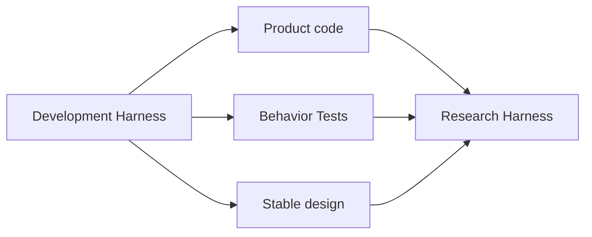
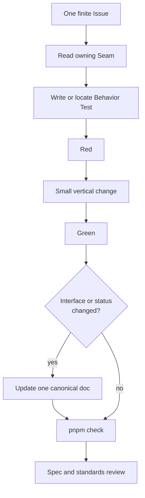
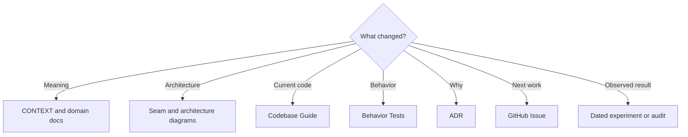
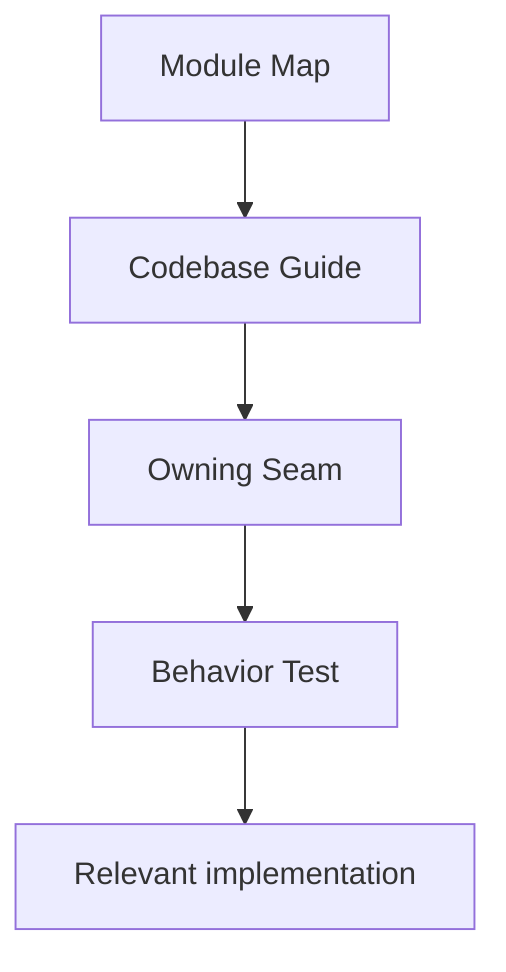
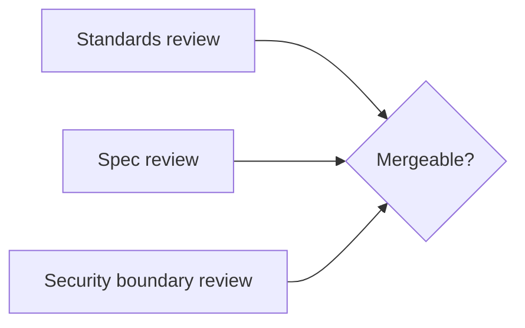

# Development Harness

Status: accepted development contract; current commands are tracked in `package.json`

## Purpose

Development Harnessは、人間とcoding agentが長期保守できる変更単位、正本、検査方法を共有する仕組みである。製品のResearch Harnessとは別であり、CampaignやFindingの一部ではない。



他repositoryはpatternの参考にするが、別の開発ハーネス全体をそのまま移植しない。比較根拠は[Codex Security reference](../research/codex-security-development-harness-reference.md)と[AI-navigable codebase reference](../research/ai-navigable-codebase-specification-reference.md)に置く。

## Small public interface

```text
pnpm test <test-path>   # one behaviorのred-green loop
pnpm check              # commit可能性を判定する全体gate
```

CIは独自の合格規則を作らず、fresh checkoutで同じ`pnpm check`を実行する。network、live credential、model login、registry、外部APIに依存するprobeはoffline gateへ混ぜない。

## One change flow



水平にfoldersや抽象層を先に作らず、観測可能なbehaviorを一つ端から端まで通す。新しいModuleはowner、small Interface、failure semantics、Behavior Testが同じ変更に揃う時だけ追加する。

## Sources of truth



同じstatusや実装説明を複数の文書へコピーしない。詳細な分類と削除規則は[Documentation Guide](../README.md)を正本とする。

## Human comprehension loop



人間が覚えるのはModuleの責務、public Interface、主要なartifact flow、failure semanticsである。helper、table、CLI argv、全ADRを暗記しない。15分以内にこの経路から変更場所と仕様へ戻れない場合だけ、Guideまたは図のnavigationを改善する。

## Growth controls

- 一変更は一つのbehaviorまたは一つの設計判断に限定する。
- concrete failureのない抽象化、fallback、configuration、互換層を先に追加しない。
- private target、未公開Finding、credentialをrepository、Issue、fixtureへ入れない。
- testはpublic Interfaceからresult、failure、cancellation、cleanupを観測する。
- internal helperのcall順を仕様にしない。
- generated inventoryやfile単位wikiを人間向け正本にしない。
- 古くなったsnapshotはhistory/auditsへ凍結し、current designとして更新し続けない。

## Review boundary



Standards reviewはrepository規則への適合、Spec reviewはIssueとSeamのbehaviorへの適合を別々に確認する。Development Harnessがgreenでも、未合意のproduction Interfaceやsecurity boundaryを追加してよいことにはならない。

## Acceptance scenarios

1. 新しい開発者がModule Mapから15分以内にowner、Interface、Test、実装へ辿れる。
2. 同じ変更をローカルとCIで同じgateから判定できる。
3. private artifactなしで全fixture testが動く。
4. 実装statusはCodebase Guide一か所だけの更新で済む。
5. 内部refactorはpublic behaviorを変えず、stable design docの更新を要求しない。
6. 大量生成されたcodeでも、一Issue、一Module、一Behavior Testの単位でreviewできる。
