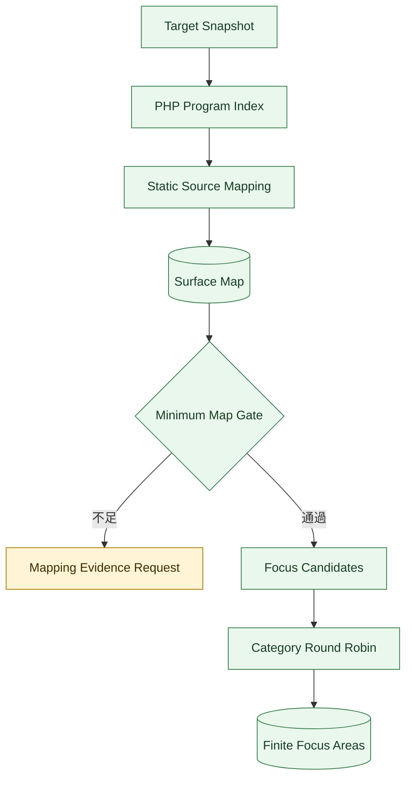
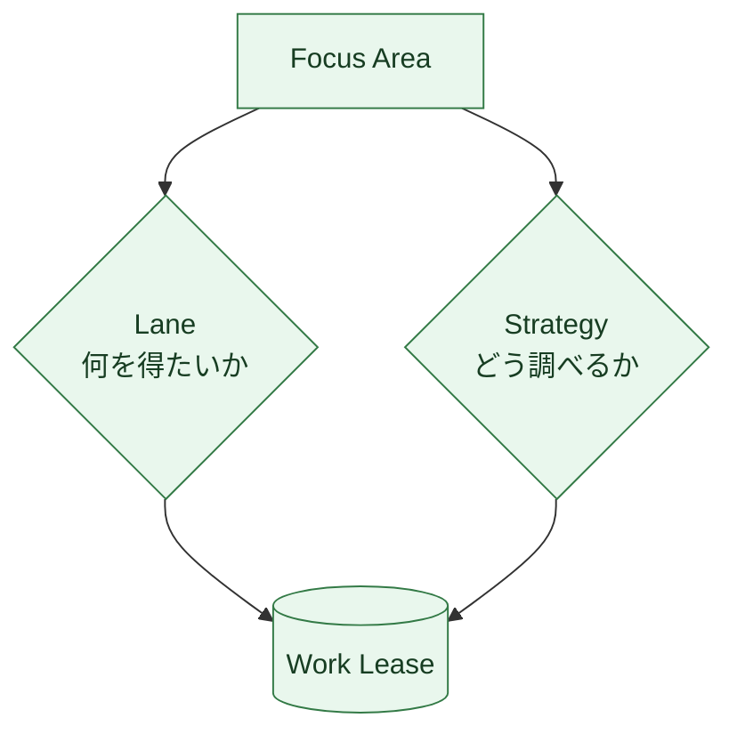
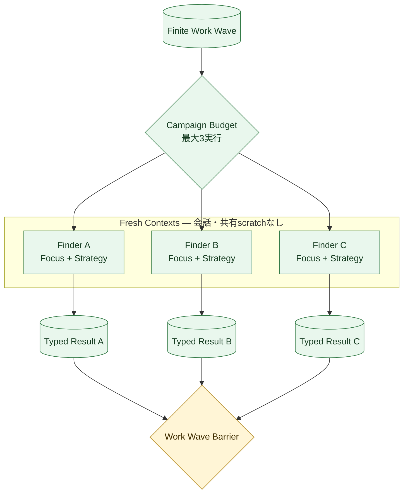
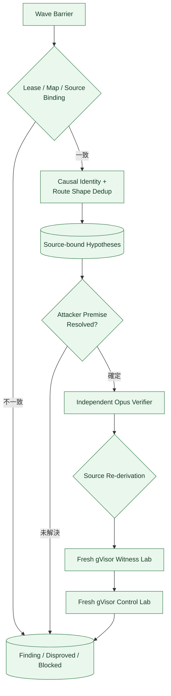
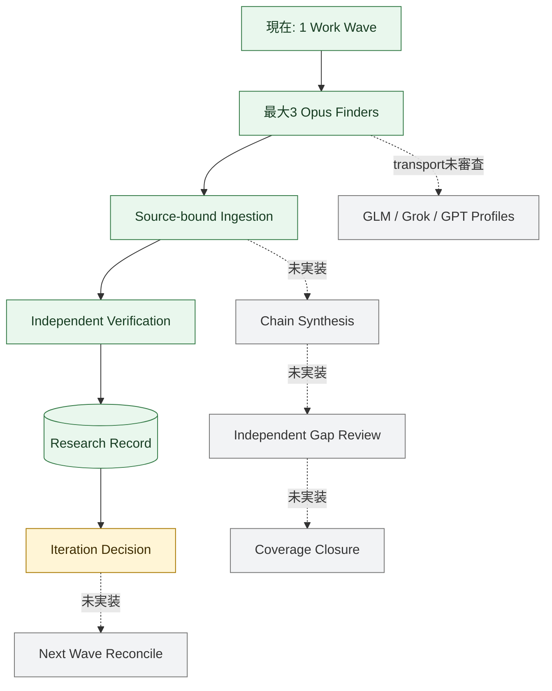

# 探索エージェント構成（Exploration Agent Architecture）

Status: living implementation view, 2026-09-02

この文書は、現在の探索処理をコードの詳細なしで追うための図である。設計上の正本は[Exploration seam](exploration-seam.md)、実装場所とTestは[Codebase Guide](../CODEBASE-GUIDE.md)とする。

図を横長にしないため、`対象理解 -> 作業分割 -> 並列Finder -> 仮説取込 -> 独立検証`を五枚に分ける。緑は実装済み、黄は一部実装、灰は設計のみを表す。

## 1. Surface Mapから調査範囲を作る



Minimum Map Gateは全コードの完全理解を要求しない。ファイル一覧、実在するsource anchor、relationの結合、明示されたgapを検査し、根拠が足りなければ推測せず`Mapping Evidence Request`を返す。

Focus候補はREST entry、hook、source、state、guard、sink、未登録PHP、mapping gapから作る。同種のsurfaceだけで最初のWaveを埋めず、categoryをround-robinして有限件へ切る。

## 2. LaneとStrategyを別々に割り当てる



| 軸 | 現在の値 | 意味 |
| --- | --- | --- |
| Lane | Frontier / Primitive / Coverage | chain候補、単独primitive、未調査領域のどれを進めるか |
| Strategy | Entry Forward | 入力からguard、state、sinkへ進む |
| Strategy | Sink Backward | 危険なsinkから到達可能な入力へ戻る |
| Strategy | State Chain | 保存と読出し、actor交代、request間の順序を追う |
| Strategy | Invariant Review | 正常機能が守るべき権限・完全性を起点にする |
| Strategy | Wildcard | 既知classやsink catalogへ開始点を固定しない |

FinderをSQLi用、XSS用、RCE用という別interfaceへ分けない。全Finderは同じoutput schemaを使い、Focus AreaとStrategyだけを変える。高リスクFocusには可能なら異なるStrategyとmodel familyを重ねる。現在eligibleなのはClaude Opusだけなので、二系統目には`single-eligible-family`例外を明記して同じfamilyを使う。

## 3. 現在のFinder並列構成



現在のproduction pathは一つのWaveから安定順で最大3 Attemptを選び、`Promise.allSettled`で並列実行する。各Finderは次だけを受け取る。

- 自分のFocus Area、Lane、Strategy、上限
- Surface MapとPHP Program Indexから決定的に選んだsource slice
- source-bound Hypothesisを返すためのversioned schema

Finderへ既知CVE、advisory、patched narrative、期待payload、別Finderの結果を渡さない。provider組込みのweb、shell、subagent、ambient MCPも無効にする。結果の到着順は判断に使わず、全Leaseが成功・失敗・取消のterminal resultになってから安定順へ戻す。

## 4. Finder出力から独立検証まで



多数決は使わない。一つのFinderだけが出した候補でも、Surface Mapのobserved anchorとrouteへ拘束でき、反証可能なら残す。重複は支持数ではなくCausal Identityとroute shapeでまとめる。

VerifierはFinderのsession、scratch、自己評価を読まず、固定Targetと最小Hypothesisからsourceを再導出する。現在のStored XSS経路では、Verifierが支持またはsource上の反証根拠とtyped Experimentを作り、Verification ModuleがfreshなgVisor sibling LabでWitnessとCausal Controlを順に実行する。

## 5. 実装済みの閉路と次の拡張



2026-09-02時点で、Brizy 2.8.11の手動較正経路は同じCausal Identityについて`Finding`、2.8.12は`Disproved`を実Opus再導出とfresh gVisor experiment pairで記録した。oracle-free Campaignでは最大3 Finderを実行するproduction compositionまで動作している。これは探索エンジンの最初の垂直スライスであり、複数Wave、Chain Synthesis、Gap Review、multi-provider探索まで完成したことは意味しない。

## 実行主体と権限

| 実行主体 | 読めるもの | 作るもの | 禁止するもの |
| --- | --- | --- | --- |
| Mapper | Target Snapshot、静的解析結果 | Surface Map revision | Finding判定、攻撃実験 |
| Finder | 自分の有限source slice、Focus、Strategy | 型付きHypothesis等 | runtime、browser、network、他Finderの会話 |
| Chain Synthesizer（設計のみ） | barrier後の型付きroute | chain Hypothesis、Frontier Gap | raw transcript、多数決による破棄 |
| Independent Verifier | 固定Target、最小Hypothesis | source再導出、Experiment | Finder sessionの再利用 |
| Lab Control | 型付きExperiment、固定baseline | sanitized observation | Hypothesis/Findingの判断、plain Docker fallback |
| Campaign Control | 不変ref、budget、terminal result | intent、Work Wave、Iteration Decision | provider固有処理、browser操作 |

## コードを追う入口

```text
src/research/
├── source-mapping/       # Surface MapとPHP Program Index
├── exploration/          # Focus、Lane、Strategy、Wave、仮説取込
├── campaign-control/     # source slice、並列Attempt、Verification接続
├── model-execution/      # Claude processとFinder schema
├── verification/         # 独立再導出、gVisor Witness/Control
└── research-record/      # append-only Ledgerとprivate CAS ref
```
