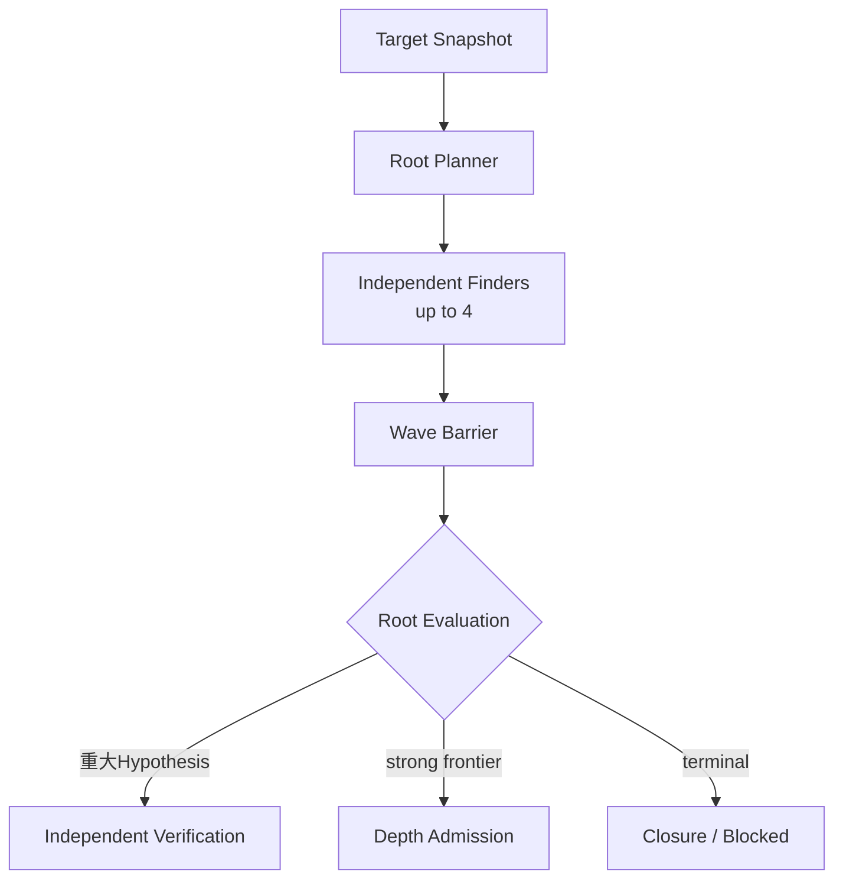
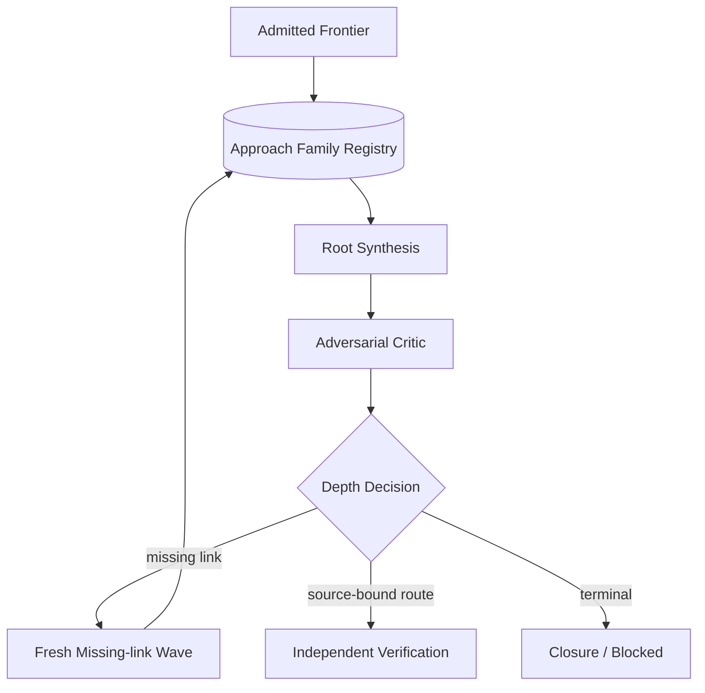

# Exploration seam

Status: accepted design; ADR 0113, ADR 0114, ADR 0117 are authoritative

## Owner and purpose

Explorationは、固定Target Snapshotから独立したresearch ideaを進め、反証可能なHypothesis、再利用可能なRoute Fragment、明示的なgapへ変換し、重大HypothesisをVerificationへ、strong semantic frontierをDepth Admissionへ送るResearch内部Moduleである。Findingへの昇格、runtime操作、provider process、Target取得を所有しない。

現在の実装状態、file、Behavior Testは[Codebase Guide](../CODEBASE-GUIDE.md)だけを正本とする。Target別成否は[experiments](../experiments/README.md)へ置く。

## Seam and Interface

```ts
interface Exploration {
  decide(input: ExplorationDecisionInput): ExplorationDecision;
}
```

callerへRoot Planner、Family Registry、Finder、Root Evaluation、Synthesis、Critic、deduplication、closureを個別methodとして公開しない。これらはExploration implementationへ隠す。

Interfaceは、raw-source-firstのSemantic Research Wave、重大HypothesisのVerification要求、strong frontierのDepth Admission、具体的missing linkのfresh Work Wave、Evidence Request、evidence-backed Closure / Blockedを返せる。未使用schemaを設計だけで先に増やさない。

## Owned artifacts

| Artifact | 意味 |
| --- | --- |
| Research Thesis / Approach Family | mechanism、surface、premise、round、証拠、状態、reopen条件で識別したresearch idea |
| Work Wave | 最大並列数、予算、Target、fresh Attempt、独立性を固定した有限work |
| Source-bound Hypothesis | premise、security property、causal route、impact、unknown、falsifierを持つ完全候補 |
| Route Fragment | 完全impactに届かなくてもsourceで裏付けたcapability、state transition、value production/consumption |
| Depth Admission | high-impact potentialを根拠にmulti-wave深掘りへ追加予算を投資する判断 |
| Closure | active thesis/frontierのterminal state、残るgap、reopen条件を持つ終了根拠 |

raw transcript、provider session、mutable scratch、payload、runtime handleはExploration artifactにしない。

## Normal research loop



Finder同士はconversation、scratch、candidateを共有しない。barrier後にだけ型付きHypothesis、Route Fragment、Unknownをstable orderで統合する。支持model数、到着順、多数決をcandidate破棄またはFinding成立へ使わない。

単独で十分重大なSQLi、Stored XSS、PrivEsc等はそのままVerificationへ進める。一つのFinding候補が出てもstrong frontierが残れば自動終了しない。低優先Findingもsemantic mechanismを含む場合はFragmentとして保持できる。

## Conditional depth loop



Depth Admissionは最終RCE、ATO、PrivEscが既に見えていることを要求しない。strong read/write/file/auth/state capability、secret/reset materialへのread、persistent state、cross-request/cross-actor flow、decode/reparse、producer/consumer mismatch、security assumption mismatch、具体的missing linkを根拠にできる。

Root SynthesisはFragmentをsemanticに接続するmodel-owned判断でありFindingではない。Criticはattacker premise、actor、state identity、request ordering、防御、security assumption、因果hopを攻撃し、具体的missing linkまたはfalsifierへ変換する。Harnessがdeterministic scriptでchainを構築しない。

## Freedom inside the Evidence Shell

Harnessが固定するのはTarget、source provenance、tool、予算、最大並列数、artifact schema、barrier、freshness、停止、fresh Verificationである。Finderは読む順序、pivot、機能間接続、wrapper追跡、cross-request state、parser境界を自由に決める。

`source-first`、`sink-first`、`state-chain`等は開始lensまたは観測labelに限り、固定手順にしない。Vulnerability class別Finder Interfaceを作らない。[ADR 0113](../adr/0113-keep-finder-methods-free-behind-an-evidence-shell.md)を正本とする。

## Static tools

通常のSemantic Research Waveはraw sourceを主経路にする。Surface Map、PHP Program Index、AST、Semgrep、CodeQLはnavigation、evidence、coverage、pattern expansionに使えるが、Map外pathの拒否、non-matchからのsafe判定、Analysis Unit/Focusの探索上限化を許可しない。

## Prioritization and Verification handoff

Priorityはimpact、attacker accessibility、observed premise、route completeness、semantic novelty、strong primitive、missing linkの決定可能性、verification costから作る。model confidence、支持model数、到着順を採否へ使わない。

ExplorationはTarget identity、attacker premise、security property、causal route、source anchors、unknown、falsifier、requested ExperimentをVerificationへ渡す。Finder transcript、session、confidenceは渡さない。

当面の評価優先順位は`high-impact recall -> root-cause quality -> attacker-premise closure -> independent verification -> false-positive behavior -> token/cost`である。[ADR 0117](../adr/0117-optimize-for-high-impact-semantic-recall.md)を正本とする。

## Failure and test surface

provider unavailable、invalid/policy-denied output、source budget exhaustion、missing dependency、unsupported verification、no new evidence、disproved route、evidence-backed closureを区別する。一Waveの失敗、一つのFinding、Finderの自己申告だけでCampaignを終了しない。

Behavior Testは`Exploration.decide`から観測する。最低限、Mapなし開始、Map外candidate受理、最大4 Finderの独立性、minority route保持、一Wave重大FindingのVerification、high-impact potentialによるDepth Admission、fresh Synthesis/Critic/missing-link、terminal reason、Ledger replayを保護する。

全体図は[Autonomous Research Loop](architecture/autonomous-research-loop.md)、Breadth/Depth分離は[ADR 0114](../adr/0114-separate-breadth-and-depth-campaign-policies.md)を参照する。
