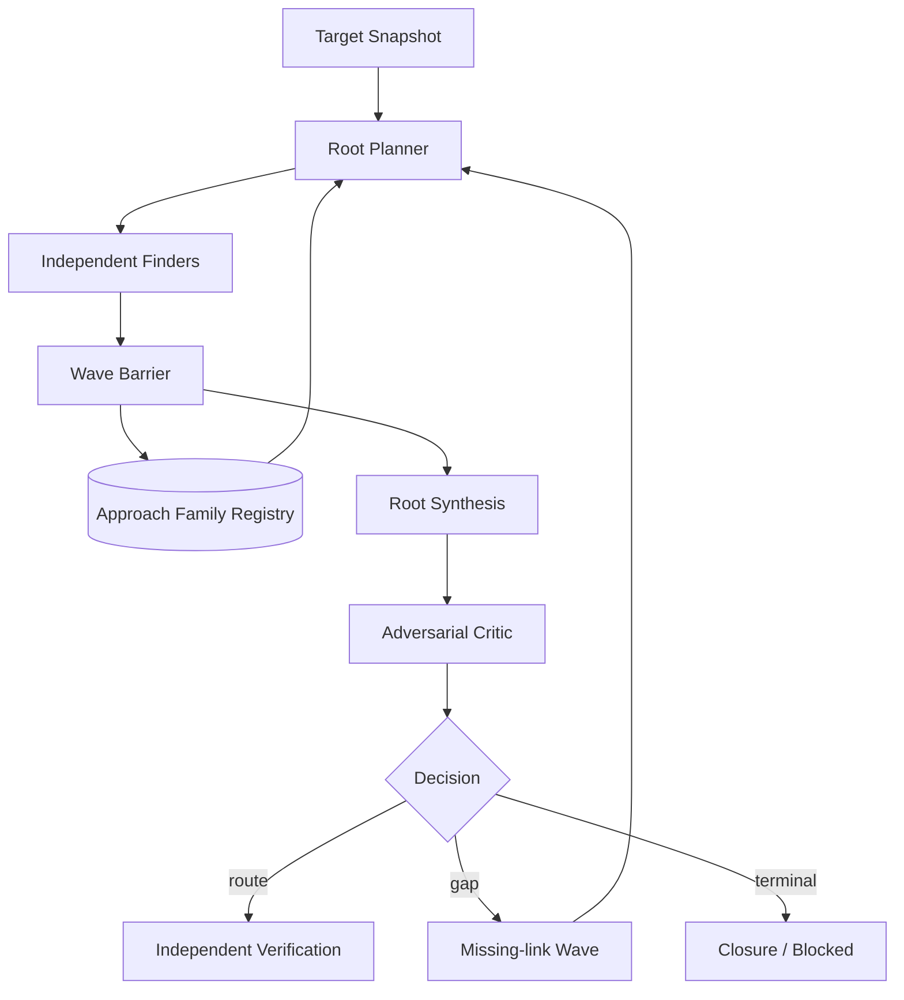

# Exploration seam

Status: accepted design; ADR 0113 and ADR 0114 are authoritative

## Owner and purpose

Explorationは、固定Target Snapshotから独立したresearch ideaを進め、反証可能なHypothesis、再利用可能なRoute Fragment、明示的なgapへ変換するResearch内部Moduleである。Findingへの昇格、runtime操作、provider process、Target取得を所有しない。

現在の実装状態、file、Behavior Testは[Codebase Guide](../CODEBASE-GUIDE.md)だけを正本とする。過去のMap-first実装詳細は[history](../history/README.md)、Target別成否は[experiments](../experiments/README.md)へ置く。

## Seam and Interface

Explorationの外部Seamは一つのdecision Interfaceに保つ。

```ts
interface Exploration {
  decide(input: ExplorationDecisionInput): ExplorationDecision;
}
```

callerへRoot Planner、Family Registry、Finder、Synthesis、Critic、deduplication、closureを個別methodとして公開しない。これらの順序、freshness、stable fold、再開条件はExploration implementationへ隠す。

Interfaceは次の種類のdecisionを返せる。

- 独立Approach Familyを持つ有限Work Wave
- source-bound routeのIndependent Verification要求
- 一つの具体的なmissing linkを追う次Wave
- 追加sourceまたはdependencyを求めるEvidence Request
- evidence-backed Closureまたは理由付きBlocked

次versionのruntime schemaは実装するvertical sliceでBehavior Testと同時に固定する。設計だけで未使用schemaを先に増やさない。

## Owned artifacts

| Artifact | 意味 |
| --- | --- |
| Approach Family | 表面的なPrompt表現ではなく、mechanism、surface、premise、round、証拠、状態、reopen条件で識別したresearch idea |
| Work Wave | 最大並列数、予算、Target、fresh Attempt、独立性を固定した有限work |
| Source-bound Hypothesis | premise、破壊されるsecurity property、causal route、impact、unknown、falsifier、次Experimentを持つ完全候補 |
| Route Fragment | 完全impactに届かないがsourceで裏付けたcapability、state transition、value production/consumption |
| Gap Review | 不足link、coverage debt、dependency不足、反証結果をstable orderで統合した判断材料 |
| Closure | 全familyのterminal state、残るgap、hard ceiling、reopen条件を持つ終了根拠 |

raw transcript、provider session、mutable scratch、payload、runtime handleはExploration artifactにしない。

## Research loop



Finder同士は進行中のconversation、scratch、candidateを共有しない。全Attemptがterminalになったbarrier後にだけ、型付きartifactをstable orderでSynthesisへ渡す。Synthesisの接続結果は新しいHypothesisでありFindingではない。

## Freedom inside the Evidence Shell

Harnessが固定するのはTarget、source provenance、tool、予算、最大並列数、artifact schema、barrier、freshness、停止である。Finderは読む順序、pivot、機能間接続、wrapper追跡、cross-request state、parser境界、dependency調査の仮説を自由に決める。

`source-first`、`sink-first`、`state-chain`、`invariant-review`等は開始lensまたは観測labelに限る。固定手順、checklist、提出可能routeの制限にしない。Vulnerability class別Finder Interfaceを作らない。

詳細は[ADR 0113](../adr/0113-keep-finder-methods-free-behind-an-evidence-shell.md)を正本とする。

## Source Map and static tools

Depth Campaignの最初のWaveはraw-source Context Profileを使う。Surface Map、AST、Semgrep、CodeQL、個別scriptは任意のseed、coverage、pattern expansion、regressionに使えるが、次を許可しない。

- Map nodeがないpathまたはcandidateを拒否する
- static toolのnon-matchを安全性またはclosureの証拠にする
- Analysis Unit、Focus Area、Map excerptを探索範囲の上限にする
- toolが作ったreachabilityをsource evidenceなしにobservedとして扱う

Map-assisted Coverageは独立raw-source Waveのbarrier後に追加候補を作れるが、先行candidateを削除またはdowngradeできない。

## Diversity and prioritization

Root Plannerは同じideaの言い換えを別familyと数えず、相容れない複数familyを複数round維持する。有望度だけで全枠を一familyへ集中させない。blocked familyは新mechanismまたは新source evidenceがある場合だけ再開する。

Priorityはterminal impact、観測済みpremise、route completeness、missing linkの決定可能性、information gain、novelty、verification cost、coverage debtから作る。model confidence、支持model数、到着順を採否またはpriorityへ使わない。

## Verification handoff

Explorationはsource-boundで反証可能な候補だけをVerificationへ送る。Verifierへ渡す最小artifactはTarget identity、attacker premise、security property、causal route、source anchors、unknown、falsifier、requested Experimentである。

Finderのconfidence、priority、transcript、session、別Finderの議論は渡さない。unknown relationをFinding成立条件へ残さず、runtime observationをWitnessとして再利用しない。

## Failure and closure semantics

次を区別し、空配列または「問題なし」へ丸めない。

- provider unavailable
- invalid or policy-denied output
- source evidence budget exhausted
- unsupported attacker premise
- missing dependency
- unsupported verification mechanism
- no new source evidence
- disproved route
- evidence-backed closure

一Waveの失敗またはFinderの自己申告だけでCampaignを終了しない。全Approach Familyがterminalで、blocked routeがreopen条件を持ち、連続Waveで新しいsource evidence、Fragment、familyが増えず、Criticもmaterially new mechanismを提示できず、coverage debtとdependency gapが記録された場合に終了できる。最大時間はhard ceilingであり、消費目標または最低探索時間ではない。

## Test surface

Behavior Testは`Exploration.decide`から観測する。Root Plannerのprivate prompt、内部call順、registry storage row、model thought processを直接testしない。

最低限、次を保護する。

1. Mapなしでもraw-source Waveを開始できる。
2. Map外source anchorを持つHypothesisとFragmentを取り込める。
3. 最大3 Finderが独立Attemptになり、完了順でterminal digestが変わらない。
4. minority routeと相反routeを多数決で失わない。
5. FragmentがSynthesisとCriticを経て具体的なmissing-link Waveを作る。
6. blocked familyは新mechanismなしに再開されない。
7. route成立時だけIndependent Verificationへ進む。
8. provider failure、budget、dependency、unsupported verificationを別のterminal reasonに保つ。
9. close/reopen後もFamily Registry、Wave、decisionを同じLedgerから再生できる。

DepthとBreadthの別運行は[ADR 0114](../adr/0114-separate-breadth-and-depth-campaign-policies.md)、全体図は[自由探索エージェント・ループ](architecture/autonomous-research-loop.md)を参照する。
