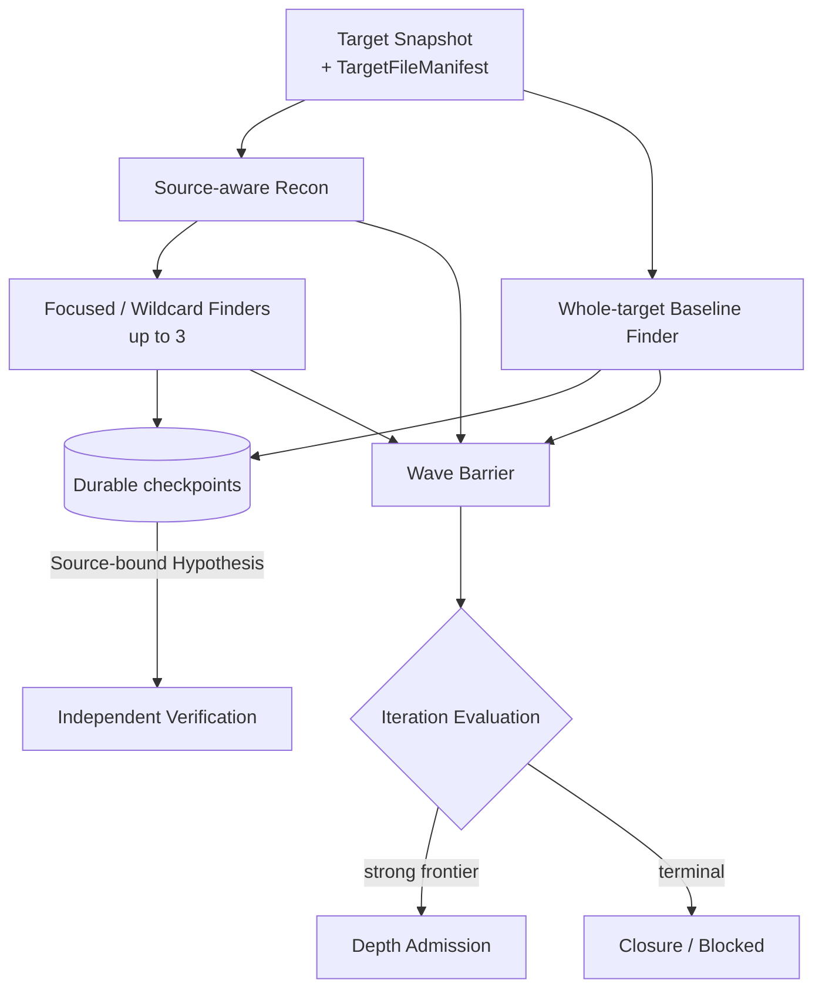
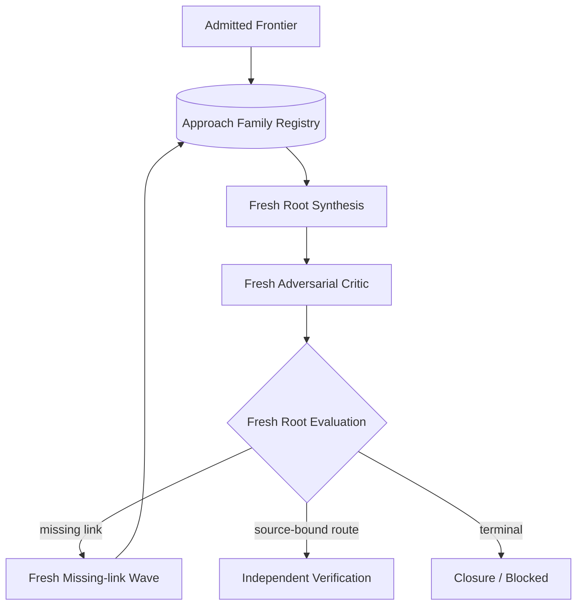

# Exploration seam

Status: accepted design; ADR 0113, ADR 0114, ADR 0117, ADR 0119, ADR 0120 are authoritative

## Owner and purpose

Explorationは、固定Target Snapshotから独立したresearch ideaを進め、反証可能なHypothesis、再利用可能なRoute Fragment、明示的なgapへ変換し、重大HypothesisをVerificationへ、strong semantic frontierをDepth Admissionへ送るResearch内部Moduleである。Findingへの昇格、runtime操作、provider process、Target取得を所有しない。

現在の実装状態、file、Behavior Testは[Codebase Guide](../CODEBASE-GUIDE.md)だけを正本とする。Target別成否は[experiments](../experiments/README.md)へ置く。

## Seam and Interface

```ts
interface Exploration {
  decide(input: ExplorationDecisionInputV1): ExplorationDecisionV1;
  decide(input: ExplorationDecisionInputV2): Promise<ExplorationDecisionV2>;
}
```

同期のschema version 1 overloadは既存Map-first Campaignのreplay専用である。新規schema version 2はfreshなmodel-owned collaboratorを実行するため非同期とし、Target Snapshot、TargetFileManifest、oracle-free metadataを持つMapなし入力から開始する。

callerへRoot Planner、Family Registry、Finder、Root Evaluation、Synthesis、Critic、deduplication、closureを個別methodとして公開しない。これらはExploration implementationへ隠す。

Root PlannerはExplorationが所有するsource-aware Recon collaboratorであり、provider/process実行だけをModel Executionへ委譲する。callerはReconを直接起動せず、`Exploration.decide`が返す型付き判断だけを扱う。Reconはmanifest-boundなsource toolで実sourceを読み、source-backedなFocus Packetを作るが、whole-target Baseline Finderの開始を待たせない。outputが不正またはsemanticに重複する場合はBudget Envelope内のfresh retryを許すが、解消できなければplanning blockedとして記録し、Map-firstまたは固定Strategy portfolioへfallbackしない。

Interfaceは、raw-source-firstのSemantic Research Wave、重大HypothesisのVerification要求、strong frontierのDepth Admission、具体的missing linkのfresh Work Wave、Evidence Request、evidence-backed Closure / Blockedを返せる。未使用schemaを設計だけで先に増やさない。

新規Exploration inputは`Target Snapshot`と`TargetFileManifest` refへ必ずbindし、`Surface Map` refは任意とする。Work Waveとstateのsource identityはTarget Snapshot digestとManifest digestで固定し、任意のMapを使ったPlanだけがそのMap refも入力digestへ含める。HypothesisとRoute Fragmentのsource anchorはManifestで検査し、Map nodeまたはMap inventoryを受理条件にしない。[ADR 0118](../adr/0118-bind-source-provenance-to-the-target-file-manifest.md)を正本とする。

`WorkWavePlan`の次schema revisionはWave目的で判別できるunionとする。raw-source Semantic Researchとmissing-linkのPlanはMapを持てず、map-assisted coverageのPlanだけがMap refを必須入力としてdigestへ含める。全PlanはTarget SnapshotとTargetFileManifestへbindする。既存schema version 1はLedger replay専用として読み取りを維持し、新規Campaignでは生成しない。

`ExplorationDecision`の次schema revisionは、初期または継続Waveを返す`run-wave`と、terminal evidenceを評価した`iteration-decision`の二variantへ深くする。Verification、Depth、次Wave、retain、Closure、Blockerを相互排他的なtop-level variantにしない。

```ts
type ExplorationDecisionV2 =
  | { kind: "run-wave"; plan: WorkWavePlanV2 }
  | {
      kind: "iteration-decision";
      schemaVersion: 2;
      target: TargetSnapshotRef;
      manifest: TargetFileManifestRef;
      wave: WorkWaveRef;
      evaluationSubjects: ExplorationSubjectRef[];
      context:
        | {
            kind: "wave-evaluation";
            workLeases: WorkLeaseRef[];
            attemptResults: AttemptResultRef[];
            toolReceipts: ToolReceiptRef[];
          }
        | {
            kind: "depth-evaluation";
            registry: ApproachFamilyRegistryRef;
            synthesis: ChainSynthesisRef;
            critique: AdversarialCritiqueRef;
          };
      familyChanges: ApproachFamilyChangeV1[];
      actions: IterationActionV2[];
      campaignDisposition: "continue" | "coverage-closed" | "incomplete";
    };

type IterationActionV2 =
  | { kind: "request-verification"; subjects: ExplorationSubjectRef[]; request: VerificationRequest }
  | { kind: "admit-depth"; subjects: ExplorationSubjectRef[]; admission: DepthAdmission }
  | { kind: "schedule-work"; subjects: ExplorationSubjectRef[]; plan: WorkWavePlanV2 }
  | { kind: "retain"; subjects: ExplorationSubjectRef[]; reason: string }
  | { kind: "close"; subjects: ExplorationSubjectRef[]; record: ClosureRecord }
  | { kind: "block"; subjects: ExplorationSubjectRef[]; reason: ExplorationBlocker };

type FamilyEvidenceDelta =
  | "new-mechanism"
  | "route-extension"
  | "premise-change"
  | "priority-change"
  | "contradiction"
  | "corroboration"
  | "duplicate";

type ApproachFamilyChangeV1 =
  | { kind: "open-family"; family: ApproachFamilyGenesisV1; delta: "new-mechanism" }
  | { kind: "attach-evidence"; family: ApproachFamilyRef; evidence: ExplorationSubjectRef[]; delta: Exclude<FamilyEvidenceDelta, "new-mechanism"> }
  | { kind: "block-family"; family: ApproachFamilyRef; blocker: ExplorationBlocker; reopenWhen: ReopenConditionV1 }
  | { kind: "exhaust-family"; family: ApproachFamilyRef; closure: ClosureRecord; reopenWhen: ReopenConditionV1 }
  | { kind: "reopen-family"; family: ApproachFamilyRef; condition: ReopenConditionRef; evidence: ExplorationSubjectRef[] };
```

`evaluationSubjects`はactive Research Thesisと、Waveが作った全Hypothesis、Route Fragment、Frontier Gapのrefをstable orderで一度ずつ列挙する。各subjectは`actions`の一つ以上から参照されなければならず、同じsubjectをVerificationとDepth等の互換actionへ同時に送ってよい。Harnessは集合一致、Target / Manifest / Wave binding、参照先、stable orderingを決定論的に検査する。modelがsubjectを省略したdecisionは不正であり、未記載を暗黙の却下として扱わない。

## Owned artifacts

| Artifact | 意味 |
| --- | --- |
| Research Thesis | security assumptionまたは機能間interactionを表す、Target全体へpivot可能な未検証の研究方向 |
| Research Focus Packet | Reconが実sourceから作る、starting evidenceと独立性を持つboundedな開始点。file allowlistではない |
| Work Wave | 最大並列数、予算、Target、fresh Attempt、独立性を固定した有限work |
| Finder Checkpoint | terminal前にdurable化した一つのHypothesis、Route Fragment、Frontier GapとAttempt内ordinal |
| Source-bound Hypothesis | premise、security property、causal route、impact、unknown、falsifierを持つ完全候補 |
| Route Fragment | 完全impactに届かなくてもsourceで裏付けたcapability、state transition、value production/consumption |
| Frontier Gap | source evidence、必要fact、falsifier、次の決定的actionを持つ未解決のcausal link |
| Approach Family | 同じsecurity assumptionとcore mechanismを追う、Campaign-localなresearch lineage |
| Approach Family Registry | Ledger上のFamily changeから再構築するExploration-owned view |
| Depth Admission | high-impact potentialを根拠にmulti-wave深掘りへ追加予算を投資する判断 |
| Chain Proposal | Root Synthesisが提案した、未検証のsemantic connectionとordered route step |
| Adversarial Critique | Chain Proposalの前提と因果hopを独立に攻撃した全件処遇 |
| Iteration Decision | 全subjectの処遇とCampaign dispositionを固定する非排他的な判断 |
| Closure Record | active thesis/frontierのterminal state、残るgap、reopen条件を持つ終了根拠 |

raw transcript、provider session、mutable scratch、payload、runtime handleはExploration artifactにしない。

## Normal research loop



Finder同士はconversation、scratch、candidateを共有しない。Finderは一つの型付きHypothesis、Route Fragment、Frontier Gapがsource-boundになった時点でcheckpointし、Target、Manifest、Attempt、Work Lease、Attempt内ordinalを検査したCAS artifactとLedger eventがdurableになってから続行する。provider failure、timeout、resume失敗が後で起きても既存checkpointを消さない。同じsemantic identityの再送は同じartifactへ収束し、変更されたpayloadを同じcheckpoint identityで上書きしない。

checkpointされたSource-bound Hypothesisは、schemaとsource bindingを通ればWave BarrierまたはRoot Evaluationを待たずVerification Queueへ入る。これはFinding昇格ではなく、Independent Verificationに反証可能な候補を渡すだけである。Route FragmentとFrontier GapはWave terminal後にstable orderで統合し、Iteration EvaluationとDepthへ渡す。unknownは独立した自由文artifactへせず、必要fact、source evidence、falsifier、次の決定的actionを持つFrontier Gapへ正規化する。支持model数、到着順、多数決をcandidate破棄またはFinding成立へ使わない。

新規`FinderOutput` schema version 2は`hypotheses`、`routeFragments`、`frontierGaps`を必須配列として持ち、0件を空配列で表す。`Hypothesis 0件 + Route Fragmentあり`は正常なsemantic outputであり、`no-source-bound-hypothesis`またはAttempt failureへ丸めない。Finder自身がRegistryとの差分を知らないため、`newEvidence` booleanは持たせない。

最初のSemantic Research Waveでは、Source-aware ReconがTarget Snapshot、TargetFileManifest、oracle-freeなTarget metadataとmanifest-boundな`list / search / read`を使う。同時にwhole-target Baseline Finderを一つ開始し、Recon完了やFocus Packetを開始条件にしない。Surface Map、既知CVE、patch、期待route、別Campaignのartifactはどちらにも見せない。新規Campaignと独立した評価runは過去runを継承しない。同一Snapshotの先行artifactは、明示したFollow-up Campaignまたはmissing-link Waveだけが型付きrefとして参照できる。

通常profileは最大4 Finder枠を持ち、一つをwhole-target Baselineへ、残り最大3枠をsource-backed Focus PacketまたはRecon自身のblind spotを探すWildcardへ使う。ReconはFinder枠に数えないが独立したAttemptと予算を持つ。意味のある独立性を説明できない言い換えで枠を埋めない。独立性はsecurity assumption、機能間interaction、starting evidenceの差で判断し、file集合の排他性は要求しない。同じmodel familyを使っても、異なるWork Lease、fresh context、scratch非共有、barrier前の結果非共有でAttemptを独立させる。

Work LeaseのassignmentはWave目的に従う。最初のSemantic Research WaveはResearch Thesis、missing-link WaveはRoot SynthesisまたはAdversarial Criticが作ったFrontier Gap、optionalなmap-assisted coverageはFocus Areaを参照する。いずれもFinderがTarget Snapshot全体へpivotする権利を制限しない。Map-assistedなnon-matchはraw-source artifactを削除、downgrade、反証できない。

Default Finderへ最初に見せるcontextは、roleとevidence規則、最小のTarget identity、そのFinderだけのBaseline、Focus PacketまたはWildcard assignment、oracle-safeなselected Knowledge、論理的なsource toolとcheckpoint tool、Budget Envelope、出力schemaに限る。他Finderのassignment、Surface Map、Map node、PHP Program Index、Analysis Unit、source本文、TargetFileManifest全件、既知CVE、patch、期待routeを含めない。TargetFileManifestはpromptへ埋め込まず、Finderが必要な時にmanifest-boundな`list / search / read`でsourceをpullする。読む順序、pivot、checkpoint後に探索を続けるかはFinderが決める。

Research ThesisはTargetとManifestへbindしたtyped envelopeとし、Target固有またはWildcardの区分、研究上の問い、motivation、starting basis、他thesisから独立している根拠をbounded proseで持てる。CWE、file allowlist、固定手順をschema fieldにしない。Default raw-sourceとmissing-link Work WaveはAnalysis Unitを作らず、source anchorを必要時にfreshなtool queryで再取得する。Analysis Unitはmap-assisted coverageと既存v1 replayだけに残す。実際に読んだ範囲と走査量はTool Receiptおよびterminal artifactから観測し、事前に選んだAnalysis Unitをraw-source coverageの代理にしない。

単独で十分重大なSQLi、Stored XSS、PrivEsc等はそのままVerificationへ進める。一つのFinding候補が出てもstrong frontierが残れば自動終了しない。低優先Findingもsemantic mechanismを含む場合はFragmentとして保持できる。

## Root Evaluation and admission

Iteration Evaluationは全Attemptのterminal後に、同じ強いmodel familyの専用roleとfresh contextで一度のresearch判断を行う。checkpoint済みHypothesisをVerificationへ送る前置gateではなく、duplicateの統合、Fragment / GapのDepth Admission、追加work、retain、Closure / Blockedを決める。初期baselineではmulti-model合議を要求しない。model familyの分散はProspective Campaignのbaseline後にablationする。Finder conversation、raw transcript、confidence、model identity、到着順、private oracleは渡さない。

入力はTarget、Manifest、Work Wave、Research ThesisとWork Lease、Attempt outcome、全Source-bound Hypothesis、Route Fragment、Frontier Gap、Tool Receiptである。Harnessは全Tool Receipt valueをtrusted control planeで検証してCAS / Ledgerへ保持する一方、Root Evaluatorのpromptには各Receiptのdigest-bound ref、query ordinal、operation、terminal resultとAttempt別集計だけを渡す。Target、Manifest、Assignment、Policy、raw responseまたはsource本文の反復payloadは渡さず、全Receiptのidentityとterminal statusを失わずにcontext amplificationを抑える。Tool Receiptから得るcoverage、deny、budget exhaustionはgap、priority、blockerのcontextにはできるが、読まなかったsource、tool non-match、走査量だけから安全性またはClosureを主張できない。

semanticなVerification / Depth / retain / Closure判断はmodelが行う。Harnessのdeterministic shellは次だけを強制し、severity allowlist、CWE list、impact enum、model confidenceから採否を決めない。

1. 全inputとoutputが同じTarget、Manifest、Waveへbindしている。
2. 全source anchorがManifestに存在し、content digestとrangeが一致する。
3. 全evaluation subjectが一つ以上のactionから参照され、foreign refまたはsilent omissionがない。
4. Verification request、Depth Admission、Closure Recordが必要なevidence ref、falsifier、次actionまたはreopen条件を持つ。
5. Root EvaluationはFindingまたはDisprovedを生成しない。

Root Evaluation outputがschema不正、subject欠落、binding不一致の場合はBudget Envelope内でfresh retryできる。解消できなければ`Incomplete Campaign`として停止し、severity heuristic、Map-first planning、最初のmodel outputへfallbackしない。

Verificationへ送るsemantic基準は、Permitted Attackerがplausibleで、materialなconfidentiality、integrity、availability、identityまたはsite-control propertyの破壊へ至るsource-boundで反証可能なrouteであることとする。attacker premiseが未解決でも、boundedなsource再導出またはExperimentで決定できるならrequestできる。vulnerability class名だけでは十分でも不十分でもない。当該Iterationまたは予算内で選ばれなかった反証前のHypothesisはVerification Queueまたはretain actionに残し、削除しない。

Depth Admissionには、少なくとも一つのsource-boundなstrong capabilityまたはsecurity-semantic mechanismと、Permitted Attackerからhigh impactへ伸びるplausibleなcompositionまたは具体的Frontier Gapを要求する。strong read/write/file/auth/state capability、secret/reset material、persistent attacker-controlled state、cross-request/cross-actor flow、decode/reparse、producer/consumer mismatch、security assumption mismatchはそれぞれAdmissionの根拠候補であり、全項目を満たす必要はない。known final RCE、ATO、PrivEsc、sink match、支持model数は要求しない。強いHypothesisと未完frontierが同居する場合は、同じIteration DecisionにVerification requestとDepth Admissionを併記する。

## Conditional depth loop

Iteration DecisionがCASと単一Ledger eventへdurableになった時点で、modelが選んだ`admit-depth` action groupingから初期のactive Approach Familyを開き、Research RecordがCampaign-localなRegistry viewを再構築する。その後、`admit-depth`と`schedule-work`はversioned `Depth Work Queue`へ決定的に投影してCASとCampaign recordへ固定する。各itemは元Decision digest、Target、Manifest、Wave、全subject ref、Family refとdirectiveを保持する。stable orderで最大4件ずつbatch化し、5件目以降を黙示的に捨てない。Queue materialization、全batchのtool-freeなfresh Root Synthesis、Synthesis CAS後のsource-enabled fresh Critic、Critique CAS後のfresh Depth Root Evaluation、具体的Critic Gapへbindしたfresh Missing-link Finder Wave、Family transition、各Attemptのintent / completion、Run replayまで実装済みである。Depth Evaluationは全Proposalを`request-verification / schedule-missing-link / retain-route / close-route / block-route`の一つへ置き、Critic verdictと矛盾する処遇を拒否する。`request-verification`ではcausal identity、Proposalと一致するattacker premise、impact、unknowns、falsifier、next experimentを必須にし、HarnessがProposalの全source evidenceを重複排除してManifest-bound routeを作る。そのDecisionをLedgerへ固定するまでVerificationとMissing-link Finderを開始しない。同一semantic Hypothesisはoriginに依存せず一回のVerificationへ収束する。Finding、disproved、blockedのoutcomeは`exploration.family-verification-resolved` eventで元Familyへ戻し、対応するpending Verificationだけを解消する。outcome単体でFamily stateを`exhausted`へ変えない。Missing-link assignmentはGapを開始点にするがTarget全体へのpivotを制限せず、返したsemantic subjectを元Familyへattachしたfollow-up Queueでfresh Synthesis / Critic / Evaluationを反復する。最大4 Finder / Wave、Campaign全体最大3 Waveを守り、容量を越えたGapを`unscheduledGaps`として保持する。Proposal 0件ではCriticとDepth Evaluationを起動せず、いずれかのtyped incompleteではpartialを後続へ渡さない。terminalなDepth後も一回のno-material-deltaでは閉じず、fresh Wildcard reviewを含む二回連続のcomplete no-material-deltaとterminal Registryを要求する二段Coverage Closureまで接続済みである。



Depth Admissionは最終RCE、ATO、PrivEscが既に見えていることを要求しない。strong read/write/file/auth/state capability、secret/reset materialへのread、persistent state、cross-request/cross-actor flow、decode/reparse、producer/consumer mismatch、security assumption mismatch、具体的missing linkを根拠にできる。

Root SynthesisはFragmentをsemanticに接続するmodel-owned判断でありFindingではない。Criticはattacker premise、actor、state identity、request ordering、防御、security assumption、因果hopを攻撃し、具体的missing linkまたはfalsifierへ変換する。Harnessがdeterministic scriptでchainを構築しない。

### Root Synthesis and Adversarial Critic

WaveのRoot EvaluationとFamily changeがCASおよびLedgerへdurableになった後にだけ、一つのfresh Root Synthesis Attemptを開始する。Synthesis完了後にそのtyped artifactを保存してからfresh Adversarial Critic Attemptを開始し、最後に別のfresh Root EvaluationがDepthのIteration Decisionを作る。三AttemptはAttempt ID、Attempt Plan、conversation、provider session、scratchを共有しない。Root SynthesisとCriticは最大4個のFinder枠に数えず、各roleに予約した有限予算を使う。

最初のpublic sliceでは、Synthesisは同じTarget、Manifest、WaveへbindしたDepth Work Queueの一batchと、そのitemが参照するResearch Thesis、Hypothesis、Route Fragment、Frontier Gapの完全なtyped artifactだけを受け取る。全batch itemを`used / retained-no-connection`へ一度ずつ置き、2 subject以上を使うconnectionだけを一度のbounded reviewで検討する。将来のCampaign orchestrationでは同じ入力をCampaign、Depth iteration、Registry viewへもbindする。`blocked / exhausted` Familyは重複またはReopen Conditionの評価に必要なtyped summaryだけを渡す。Finderのraw transcript、confidence、model identity、到着順、private oracle、過去の自由文chainは渡さない。

Synthesis outputは全input work itemの処遇と、0個以上の`ChainProposalV1`を持つ。各Proposalは少なくとも次を固定する。

- 参照するFamily、Fragment、Hypothesis、Frontier Gap
- 順序付きroute stepと、各stepのactor、request、state identity、consumed / produced value、source anchor
- sourceで観測したrelationとmodelが提案する未検証connectionの区別
- attacker premise、破壊され得るsecurity property、unknown、falsifier、次の決定的action

HarnessはTarget / Manifest binding、入力全件の処遇、ref、source anchor、stable ordering、step schemaを検査するが、missing edgeの生成、semantic connectionの真偽、route成立を決めない。Chain ProposalはEvidence Route、Source-bound Hypothesis、Verification request、Findingのいずれでもない。

Criticへ渡すのはimmutableなSynthesis artifactとそこに含まれる元のtyped subject refだけであり、Synthesisのconversation、scratch、provider sessionを渡さない。将来のCampaign接続ではRegistry refも追加する。CriticにはManifest-boundなread-only `list / search / read`を専用Source Tool Policyと予算で許可し、少なくとも一回のfresh source readなしにはcompleted resultを受理しない。防御やsource premiseを独立に調べられるが、runtime Experimentは許可しない。

`AdversarialCritiqueV1`は全Chain Proposalをstable orderで一度ずつ処遇し、各Proposalを`survives / needs-evidence / contradicted`のいずれかに置く。これはExploration内の処遇であり、Verificationの`Disproved`ではない。各処遇はattacker premise、actor、state identity、request ordering、defense、causal hop、source bindingのchallengeを0個以上持ち、challengeごとに対象claim、evidence ref、reason、falsifierを固定する。`needs-evidence`は必要fact、predecessor ref、期待観測、falsifier、次の決定的actionを持つFrontier Gapを必須にする。CriticはProposalを黙示的に捨て、新しいsemantic edgeを追加し、FindingまたはVerification verdictを生成できない。

Critique後のfresh Root Evaluationだけが、surviving Proposalをsource-boundで反証可能なVerification requestへ変換し、具体的gapをmissing-link Work Waveへ割り当て、materialな新mechanismをFamily changeへ反映し、またはClosure / Blockedを選ぶ。SynthesisとCriticはwork scheduling、Family transition、Finding昇格を所有しない。

missing-link Work Leaseは一つのFrontier Gapを参照し、Target / Manifest、predecessor Family / Chain Proposal / Critique、未証明の因果関係、falsifier、成功条件、許容するevidence種別を固定する。promptへ渡すのはこのboundedな問いと必要なtyped predecessor summaryだけにし、file allowlist、CWE、期待する答え、固定手順、Registry全体を入れない。Finderはsource anchorをfresh source toolで再取得し、Target全体へpivotできる。支持数を作るため同じgapを複製せず、最大4枠には独立したgapまたはFamilyを割り当てる。

Root Planner、Finder、Root Evaluation、Root Synthesis、Adversarial Criticは別々のModel Profile、Prompt Set、Source Tool Policy、Budget Envelope、output schemaを選べる。初期baselineは同じ強いmodel familyを全roleへ割り当ててよいが、fresh Attemptの分離を省略できない。Profileが要求したmodel separationをprovider都合で満たせない場合だけModel Separation Exceptionを記録し、別modelへ自動fallbackしない。

SynthesisまたはCriticがinvalid output、provider failure、policy denial、budget exhaustionになった時はpartial outputを次stageへ渡さない。roleの予約予算内でfresh retryできるが、解消できなければactive Familyを保った`Incomplete Campaign`とする。Criticの`contradicted`、一回の`no new evidence`、新mechanismなし、Finding成立、hard budget ceilingだけではFamilyを`exhausted`にしない。Depthのevidence-backed stopには、全admitted Familyが`blocked / exhausted`、pending Verificationとmissing-link workがなく、具体的な次actionがないことをfresh Root Evaluationが示し、各terminal FamilyがClosure RecordまたはblockerとReopen Conditionを持つことを要求する。連続何回の`no new evidence`を要求するかとhard ceilingはCampaign policyが所有する。

### Route Fragment and Approach Family Registry

Finderがcheckpointする`RouteFragmentProposal`は、その場でTarget / Manifest bindingとsource anchorを検査した後、source Attempt、Work Lease、Work Wave、Attempt内ordinalを含むimmutableな`Route Fragment`としてCASへ保存する。Wave Barrierはterminal outputとの集合一致とstable orderingを確認するが、既にdurableなFragmentを作り直さない。FragmentはFamilyの子objectではなく独立artifactであり、複数Family、Hypothesis、Frontier Gapから同じrefを参照できる。同一Snapshotの明示的Follow-up CampaignはFragment refをimportできるが、別Snapshotへobserved evidenceとして継承しない。

Approach Familyは一つのCampaign、Target Snapshot、Manifestへscopeする。Family IDはCampaign / Target / Manifest、opening Iteration Decision、stable ordinalを固定したgenesis envelopeのdigestとし、modelが更新するthesis、surface、想定impact、summary文をidentityへ含めない。Follow-up Campaignは先行Familyを変更せず、先行Family refをlineageとして持つ新しいlocal Familyを開く。

同じcore security assumptionとstateまたはcapability transition mechanismを追い、一つの決定的source factまたはfalsifierが両方へ効くなら同一Familyとする。file、surface、actor premiseの精緻化、terminal impact、表現だけの違いでは分けない。一方を反証しても他方が残る独立mechanismなら別Familyにする。fresh Root EvaluationがRegistry viewを見て`attach-evidence`または`open-family`を選び、新規Familyでは最も近い既存Familyと区別するmechanismを明示する。Harnessはsemantic equivalenceを文字列正規化またはhashで判定しない。

`attach-evidence.delta`は次の意味を持つ。

| Delta | 意味 |
| --- | --- |
| `new-mechanism` | 既存Familyで説明できないcore mechanismを示し、新しいFamilyを開く |
| `route-extension` | 新しいsource anchor、state transition、capabilityまたはcausal relationを加える |
| `premise-change` | attacker premiseまたは必要preconditionを変える |
| `priority-change` | source evidenceによりhigh-impact potentialまたは次actionを変える |
| `contradiction` | 既存thesis、premise、routeを弱める新しいsource evidenceを示す |
| `corroboration` | 独立Attemptが既知mechanismを支持するがsemantic frontierを増やさない |
| `duplicate` | 既存evidenceの言い換えまたは同じ観測である |

`new-mechanism`、`route-extension`、`premise-change`、`priority-change`、`contradiction`はmaterially new evidenceになり得る。全subjectが`corroboration`または`duplicate`で、新しいHypothesis、Frontier Gap、priority変化もない時だけWaveを`no new evidence`と導出する。Fragmentが存在すること自体、artifact digestの違い、支持Attempt数をnoveltyにしない。

Familyの許可状態は`active / blocked / exhausted`の三つに限定する。Verificationへ送った`active` Familyは別の`pendingVerification` flagを持ち、Verification結果を状態と混同しない。新規Familyは`active`で始まり、次を許す。

```text
active    -> active | blocked | exhausted
blocked   -> blocked | active (Reopen Condition satisfied)
exhausted -> active (Reopen Condition satisfied)
```

`blocked`は具体的なsource、tool、runtime、provider capabilityまたはprerequisiteがなく現在実行できる決定的actionがない状態であり、blockerとReopen Conditionを必須にする。`exhausted`は全Frontier GapがClosure Recordまたは独立した反証根拠を持ち、次の決定的actionがない状態であり、Closure RecordとReopen Conditionを必須にする。単一Attempt failure、Finding、hard budget ceilingはFamilyを`exhausted`にしない。budget終了時にactive / blocked Familyが残ればCampaignをIncompleteにする。

Reopen Conditionは自由なboolean式にせず、必要fact、期待するevidence種別、比較対象となる先行evidence、決定的な次actionを持つtyped artifactにする。Root Evaluationが新しいmechanismまたはsource evidenceのsemanticな充足を判断し、Harnessは同じSnapshot / Manifestへのbinding、Closure後のevent順、未使用evidence ref、許可状態遷移を検査する。言い換えまたは既存evidenceの別digestだけでは再開できない。

Approach Family Registryは別のmutable storeではなく、versioned `exploration.iteration-decided`、`exploration.depth-iteration-decided`、`exploration.family-evidence-attached`、`exploration.family-verification-resolved` eventから作るprojectionである。Depth Decision eventはVerificationとMissing-link Waveより先にappendし、evidence attachment eventはterminal subjectとfollow-up QueueがCASへ固定された後、Verification resolution eventはVerification recordがdurableになった後にappendする。Research Recordはevent sequence、schema、digest、Target binding、参照artifact、状態遷移を検査してviewを再構築するが、Familyの意味、delta、reopenの妥当性を決めない。検索用cacheまたはindexを置く場合も、削除してLedgerから同じRegistry digestを再生成できなければならない。

既存v1 LedgerとCAS artifactは書き換えず、v1 `routeFragments`からFamily eventを遡及生成しない。v1 readerはFragmentを`legacy-unclassified`として閲覧できるだけにし、同一Snapshot / Manifestへbindした明示的Follow-up Campaignがv2 Root Evaluationを通した時だけ新しいFamily evidenceとしてimportする。

## Freedom inside the Evidence Shell

Harnessが固定するのはTarget、source provenance、tool、予算、最大並列数、artifact schema、barrier、freshness、停止、fresh Verificationである。Finderは読む順序、pivot、機能間接続、wrapper追跡、cross-request state、parser境界を自由に決める。

`source-first`、`sink-first`、`state-chain`等は開始lensまたは観測labelに限り、固定手順にしない。Vulnerability class別Finder Interfaceを作らない。[ADR 0113](../adr/0113-keep-finder-methods-free-behind-an-evidence-shell.md)を正本とする。

## Static tools

通常のSemantic Research Waveはraw sourceを主経路にする。Surface Map、PHP Program Index、AST、Semgrep、CodeQLはnavigation、evidence、coverage、pattern expansionに使えるが、Map外pathの拒否、non-matchからのsafe判定、Analysis Unit/Focusの探索上限化を許可しない。

## Prioritization and Verification handoff

Priorityはimpact、attacker accessibility、observed premise、route completeness、semantic novelty、strong primitive、missing linkの決定可能性、verification costから作る。model confidence、支持model数、到着順を採否へ使わない。

ExplorationはTarget identity、attacker premise、security property、causal route、source anchors、unknown、falsifier、requested ExperimentをVerificationへ渡す。Finder transcript、session、confidenceは渡さない。

当面の評価優先順位は`high-impact recall -> root-cause quality -> attacker-premise closure -> independent verification -> false-positive behavior -> token/cost`である。[ADR 0117](../adr/0117-optimize-for-high-impact-semantic-recall.md)を正本とする。

## Failure and test surface

provider unavailable、invalid/policy-denied output、source budget exhaustion、missing dependency、Root Evaluation不成立、unsupported verification、no new evidence、disproved route、evidence-backed closureを区別する。Manifestの欠落またはTarget binding不一致はworker起動前に拒否し、Map inventoryから補完しない。一Waveの失敗、一つのFinding、Finderの自己申告だけでCampaignを終了しない。

`no new evidence`は、既存artifactとの比較で新しいsource anchor、state transition、capability、causal relation、Hypothesis、Route Fragment、attacker premiseまたはpriority変化がないというWave observationである。言い換え、支持modelの追加、同じtool hit、confidence変化、Map completenessはnew evidenceに数えない。全planned Attemptがsemantic terminalで全subjectを処遇したcomplete Waveだけがこの観測を持てる。通常CampaignのCoverage Closureには、最後のmaterial evidence以後に二回連続のno-material-delta evaluationと、後者にfresh Wildcardまたは独立Gap Reviewがあることを要求する。Depth固有の停止はFamily terminal条件を追加する。一回の`no new evidence`またはhard ceilingだけではClosureにしない。

Behavior Testは`Exploration.decide`から観測する。最低限、Manifest-boundなMapなし開始、Source-aware Reconとwhole-target Baselineの並行開始、Map外candidate受理、Manifest外anchor拒否、最大4 Finderの独立性、checkpoint ack前のCAS / Ledger durability、terminal failure後のcheckpoint保持、同一checkpoint再送の冪等性、HypothesisのWave Barrier前Verification投入、minority route保持、全subjectの明示的処遇、Hypothesis 0件 + Fragmentありの保持、FragmentとFamilyの多対多参照、semantic duplicateの既存Family追加、material deltaとcorroborationの区別、許可Family transition、evidence-backed reopen、VerificationとDepthの同時action、high-impact potentialによるDepth Admission、fresh Synthesis/Critic/missing-link、invalid Root Evaluationのtyped incomplete、失敗またはbudget exhaustionをno-new-evidenceへ丸めないこと、二回のcomplete closure pass、同じLedgerから同じRegistry digestを得るreplay、terminal reasonを保護する。

全体図は[Autonomous Research Loop](architecture/autonomous-research-loop.md)、Breadth/Depth分離は[ADR 0114](../adr/0114-separate-breadth-and-depth-campaign-policies.md)を参照する。
