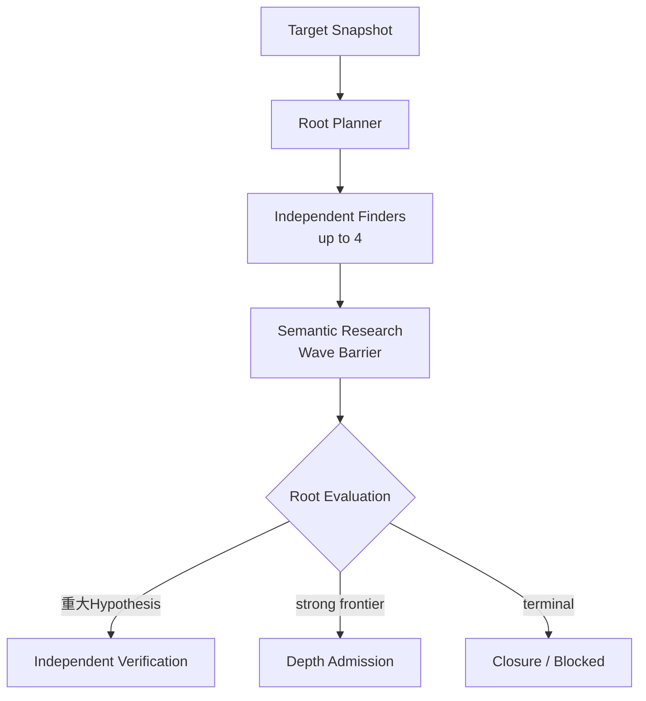
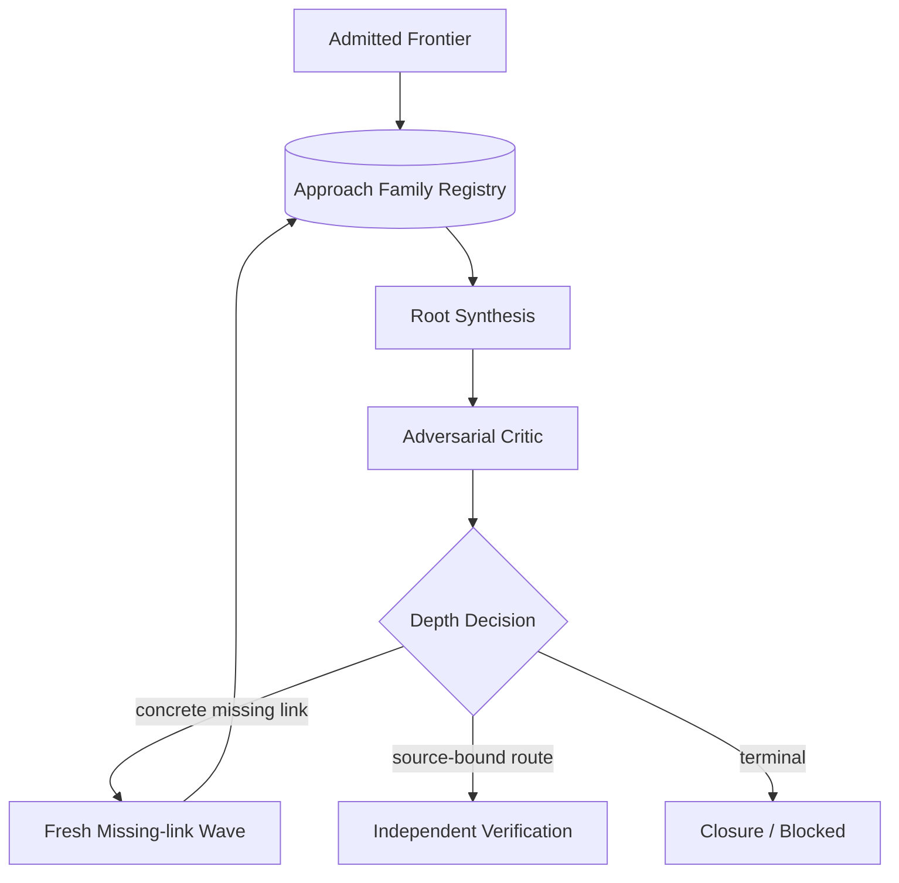

# Exploration seam

Status: accepted design; ADR 0113, ADR 0114, ADR 0117 are authoritative

## Owner and purpose

Explorationは、固定Target Snapshotから独立したresearch ideaを進め、反証可能なHypothesis、再利用可能なRoute Fragment、明示的なgapへ変換し、重大HypothesisをVerificationへ、strong semantic frontierをDepth Admissionへ送るResearch内部Moduleである。Findingへの昇格、runtime操作、provider process、Target取得を所有しない。

現在の実装状態、file、Behavior Testは[Codebase Guide](../CODEBASE-GUIDE.md)だけを正本とする。過去のMap-first実装詳細は[history](../history/README.md)、Target別成否は[experiments](../experiments/README.md)へ置く。

## Seam and Interface

Explorationの外部Seamは一つのdecision Interfaceに保つ。

```ts
interface Exploration {
  decide(input: ExplorationDecisionInput): ExplorationDecision;
}
```

callerへRoot Planner、Family Registry、Finder、Root Evaluation、Synthesis、Critic、deduplication、closureを個別methodとして公開しない。これらの順序、freshness、stable fold、再開条件はExploration implementationへ隠す。

Interfaceは次の種類のdecisionを返せる。

- raw-source-firstの有限Semantic Research Wave
- source-boundな重大HypothesisのIndependent Verification要求
- strong semantic frontierのDepth Admission
- 一つの具体的なmissing linkを追うfresh Work Wave
- 追加sourceまたはdependencyを求めるEvidence Request
- evidence-backed Closureまたは理由付きBlocked

次versionのruntime schemaは実装するvertical sliceでBehavior Testと同時に固定する。設計だけで未使用schemaを先に増やさない。

## Owned artifacts

| Artifact | 意味 |
| --- | --- |
| Research Thesis / Approach Family | 表面的なPrompt表現ではなく、mechanism、surface、premise、round、証拠、状態、reopen条件で識別したresearch idea。通常Waveでは開始thesis、Depthではdurable Familyとして扱う |
| Work Wave | 最大並列数、予算、Target、fresh Attempt、独立性を固定した有限work |
| Source-bound Hypothesis | premise、破壊されるsecurity property、causal route、impact、unknown、falsifier、次Experimentを持つ完全候補 |
| Route Fragment | 完全impactに届かなくてもsourceで裏付けたcapability、state transition、value production/consumption |
| Depth Admission | source-boundなhigh-impact potentialを根拠にmulti-wave深掘りへ追加予算を投資する判断 |
| Gap Review | 不足link、coverage debt、dependency不足、反証結果をstable orderで統合した判断材料 |
| Closure | active thesis/frontierのterminal state、残るgap、hard ceiling、reopen条件を持つ終了根拠 |

raw transcript、provider session、mutable scratch、payload、runtime handleはExploration artifactにしない。

## Normal research loop



Finder同士は進行中のconversation、scratch、candidateを共有しない。全Attemptがterminalになったbarrier後にだけ、型付きHypothesis、Route Fragment、Unknownをstable orderでRoot Evaluationへ渡す。支持model数、到着順、多数決をcandidate破棄またはFinding成立へ使わない。

通常Waveは長いchainを必須成果にしない。単独で十分重大なSQLi、Stored XSS、PrivEsc等はそのままVerificationへ進められる。一つのFinding候補が出ても、強い未解決frontierが残っていれば自動終了しない。低優先Findingもparser、transformation、authorization、state等のsemantic mechanismを含む場合はRoute Fragmentとして保持できる。

## Conditional depth loop



Depth Admissionは最終RCE、ATO、PrivEscが既に見えていることを要求しない。strong read/write/file/auth/state capability、secretまたはreset materialへのread、persistent attacker-controlled state、cross-request/cross-actor flow、decode/reparse、producer/consumer mismatch、security assumption mismatch、複数機能を接続できるRoute Fragment、または閉じればimpactが大きく変わる具体的missing linkを根拠にできる。

Root SynthesisはFragmentをsemanticに接続するmodel-owned判断であり、Findingではない。Adversarial Criticはattacker premise、actor、state identity、request ordering、防御、security assumption、因果hopを攻撃し、成立しない主張を具体的missing linkまたはfalsifierへ変換する。Harnessがdeterministic scriptでchainを構築しない。

## Freedom inside the Evidence Shell

Harnessが固定するのはTarget、source provenance、tool、予算、最大並列数、artifact schema、barrier、freshness、停止、fresh Verificationである。Finderは読む順序、pivot、機能間接続、wrapper追跡、cross-request state、parser境界、dependency調査の仮説を自由に決める。

`source-first`、`sink-first`、`state-chain`、`invariant-review`等は開始lensまたは観測labelに限る。固定手順、checklist、提出可能routeの制限にしない。Vulnerability class別Finder Interfaceを作らない。

詳細は[ADR 0113](../adr/0113-keep-finder-methods-free-behind-an-evidence-shell.md)を正本とする。

## Source Map and static tools

通常のSemantic Research Waveはraw-source Context Profileを主経路にする。Surface Map、PHP Program Index、AST、Semgrep、CodeQL、個別scriptは任意のnavigation、evidence、coverage、pattern expansion、regressionに使えるが、次を許可しない。

- Map nodeがないpathまたはcandidateを拒否する
- static toolのnon-matchを安全性またはclosureの証拠にする
- Analysis Unit、Focus Area、Map excerptを探索範囲の上限にする
- toolが作ったreachabilityをsource evidenceなしにobservedとして扱う

Map-assisted Coverageは独立raw-source Waveのbarrier後に追加候補を作れるが、先行candidateを削除またはdowngradeできない。Surface Mapは探索空間ではなく補助artifactである。

## Diversity and prioritization

Root Plannerは同じideaの言い換えを別thesisと数えず、最大4枠で相互に異なる開始仮説を作る。有望度だけで全枠を一ideaへ集中させない。Depthへ昇格した後はApproach Family Registryが`active / blocked / exhausted`、blocked理由、reopen条件をdurableに保持し、新mechanismまたは新source evidenceがある場合だけblocked familyを再開する。

Priorityはterminal impact、attacker accessibility、観測済みpremise、route completeness、semantic novelty、strong primitive、missing linkの決定可能性、information gain、verification costから作る。model confidence、支持model数、到着順を採否へ使わない。

当面の評価優先順位は`high-impact recall -> root-cause quality -> attacker-premise closure -> independent verification -> false-positive behavior -> token/cost`である。Budgetはhard ceilingであり、recallを落とすcost最適化は採用しない。詳細は[ADR 0117](../adr/0117-optimize-for-high-impact-semantic-recall.md)を正本とする。

## Verification handoff

Explorationはsource-boundで反証可能な候補だけをVerificationへ送る。Verifierへ渡す最小artifactはTarget identity、attacker premise、security property、causal route、source anchors、unknown、falsifier、requested Experimentである。

Finderのconfidence、priority、transcript、session、別Finderの議論は渡さない。Finder confidenceが低いことだけでhigh-impactなsource-bound Hypothesisを破棄しない。unknown relationをFinding成立条件へ残さず、runtime observationをWitnessとして再利用しない。

## Failure and closure semantics

次を区別し、空配列または「問題なし」へ丸めない。

- provider unavailable
- invalid or policy-denied output
- source evidence budget exhausted
- unsupported attacker premise
- missing dependency
- unsupported verification mechanism
- no new source evidence
- disproved route
- evidence-backed closure

一Waveの失敗、一つのFinding、Finderの自己申告だけでCampaignを終了しない。通常研究では重大HypothesisがVerificationへ送られ、strong frontierがなく、主要unknownとdependency gapが記録され、追加の独立lensがmaterially new evidenceを生まない時に終了できる。Depthでは全Approach Familyがterminalで、blocked routeがreopen条件を持ち、連続Waveで新しいsource evidence、Fragment、familyが増えず、Criticもmaterially new mechanismを提示できないことを追加のclosure根拠にする。最大時間はhard ceilingであり、消費目標または最低探索時間ではない。

## Test surface

Behavior Testは`Exploration.decide`から観測する。Root Plannerのprivate prompt、内部call順、registry storage row、model thought processを直接testしない。

最低限、次を保護する。

1. Mapなしでもraw-source Semantic Research Waveを開始できる。
2. Map外source anchorを持つHypothesisとFragmentを取り込める。
3. 最大4 Finderが独立Attemptになり、完了順でterminal digestが変わらない。
4. minority routeと相反routeを多数決で失わない。
5. 一Waveで閉じた重大HypothesisをDepthなしでIndependent Verificationへ送れる。
6. strong semantic frontierは最終RCE/ATOが未確定でもDepth Admissionできる。
7. Depth Admission後、Fragmentがfresh SynthesisとCriticを経て具体的missing-link Waveを作る。
8. blocked familyは新mechanismなしに再開されない。
9. provider failure、budget、dependency、unsupported verificationを別のterminal reasonに保つ。
10. close/reopen後もWave、Depth Admission、Family Registry、decisionを同じLedgerから再生できる。

BreadthとDepthの別policyは[ADR 0114](../adr/0114-separate-breadth-and-depth-campaign-policies.md)、通常研究とDepth Admissionは[ADR 0117](../adr/0117-optimize-for-high-impact-semantic-recall.md)、全体図は[自由探索エージェント・ループ](architecture/autonomous-research-loop.md)を参照する。
