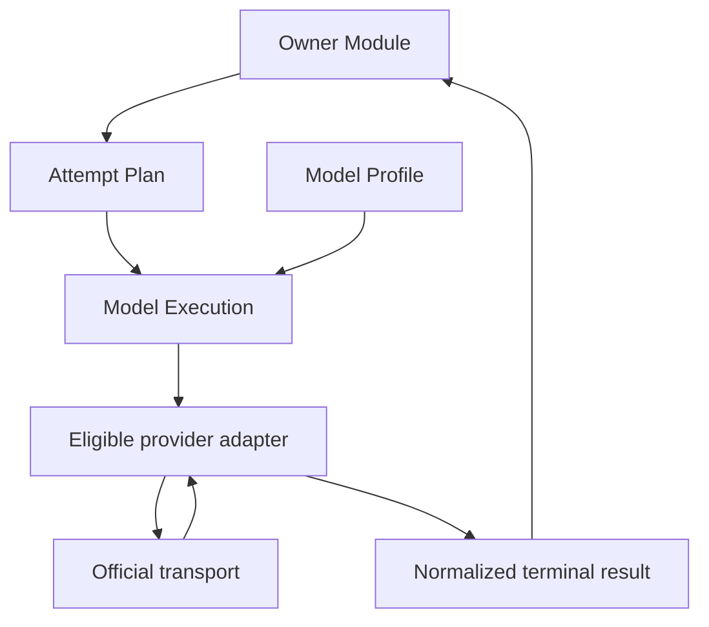
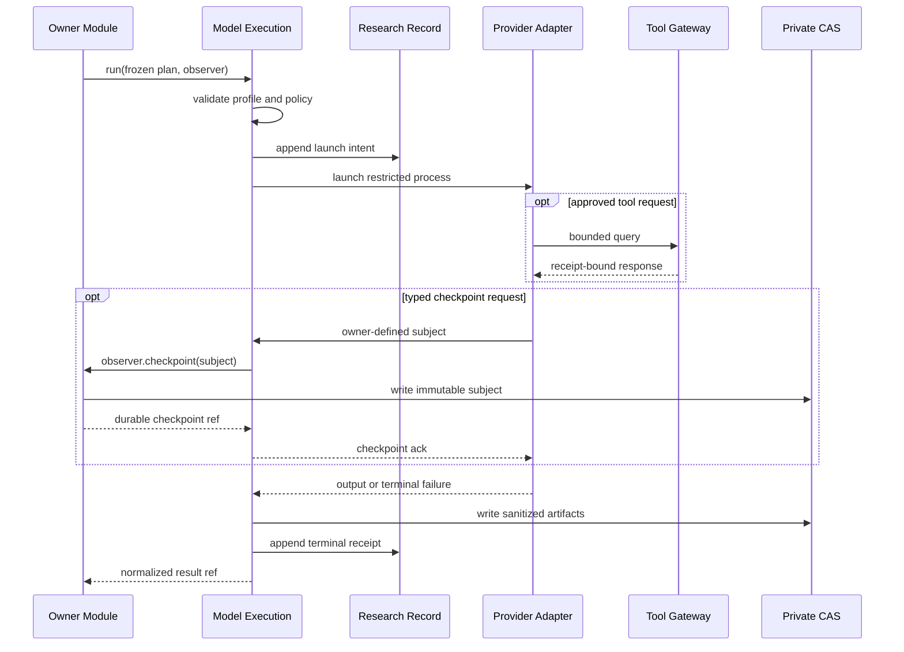
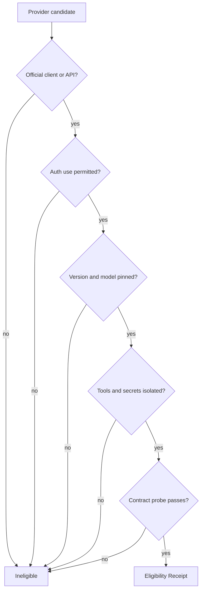
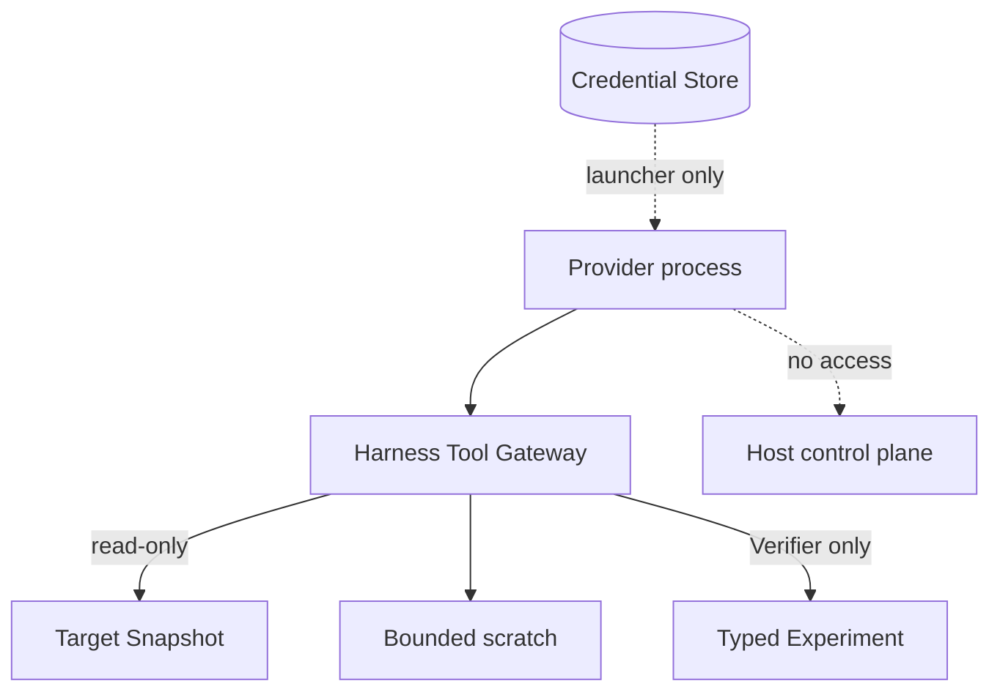
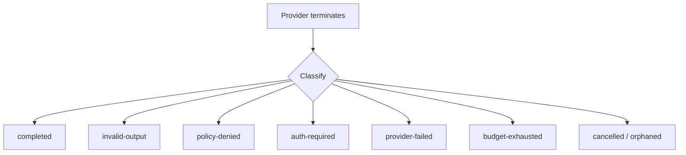

# Model execution seam

Status: accepted provider-neutral design

## Owner and purpose

`Model Execution`は一つの不変`Attempt Plan`を実行し、provider差を含まないterminal resultへ変換する。認証、transport、tool protocol、process lifecycleを隠し、探索や検証の意味判断は所有しない。

```ts
interface ModelExecution {
  run(plan: AttemptPlan, observer?: AttemptObserver): Promise<AttemptExecutionResult>;
}

interface AttemptObserver {
  checkpoint(subject: unknown): Promise<DurableCheckpointRef>;
}
```

observerはowner Moduleがrole schemaとsource bindingを検査し、CAS / Ledgerへdurable writeしてからackする一方向のseamである。provider event stream、token chunk、session、transport retryを公開しない。checkpointを使わないroleはobserverを省略する。callerはprovider executable、argv、credential path、PID、session、retry timingを渡さない。model、provider、effort、tool、budgetはversioned `Model Profile`とPlanで固定する。

新規`AttemptPlanV2`はownerとroleで判別するversioned unionである。Explorationは`finder / root-planner / root-evaluator / root-synthesizer / adversarial-critic`のvariantを持ち、それぞれowner-defined assignmentとoutput schemaを固定する。Finder assignmentだけがWork Leaseを参照し、通常WaveではResearch Thesis、Missing-link WaveではCritic Frontier Gapへbindする。どちらもTarget全体へのpivotを制限しない。判断roleは評価対象となるimmutable artifact refを参照する。共通envelopeはTarget Snapshot、TargetFileManifest、role、assignment、Prompt Set、Model Profile、Source Tool Policy、Budget Envelopeを一つのdigestへ固定する。公開Interfaceはrole別methodへ分裂させず、引き続き一つの`run(plan)`とする。

Model Executionはroleとassignmentの組合せ、Planが要求するtool capability、Profileのrole eligibilityをprovider起動前に検査するが、Synthesis connection、Critique、Root Evaluationの意味を判定しない。同じmodel familyをrole間で使う場合もAttempt ID、provider session、conversation、scratchは共有しない。

## Provider-neutral boundary



`Owner Module`はrole-specific schemaと結果の意味を検査する。Model Executionが保証するのはidentity、policy、lifecycle、schema envelope、artifact durabilityまでであり、Hypothesisの採用やFinding昇格ではない。

## Attempt lifecycle



## Transport admission



consumer OAuth tokenやsubscription credentialを独自HTTP clientへ転用しない。公式CLI、公式SDK、公式APIはそれぞれ別adapterとし、認証用途が公式に許され、制限を検証できる場合だけProfileへ採用する。失敗時に別modelへ自動fallbackしない。

## Tool and secret isolation



provider組込みshell、web、ambient plugin、hook、memory、subagentは無効化する。ReconへはTarget-boundなread-only source toolだけを、Finderへは同じsource tool、隔離scratch、owner-boundな`checkpoint_research`だけを許可し、Experiment toolを渡さない。provider transportへprivate MCPを使う場合もallowlistされたHarness gatewayだけを公開する。VerifierのExperimentもHypothesisとmechanismへ拘束したtyped actionだけにする。

各tool requestにはAttempt、role-specific assignment、Target Snapshot、Policy、query ordinal、budgetをharness側で結合する。FinderではassignmentにWork Leaseも含める。path escape、digest mismatch、unknown tool、schema mismatch、budget超過を実行前に拒否する。

Source Understandingがmanifest-boundな`list / search / read`の論理的意味、canonical path、pagination cursor、result分類、source responseを所有し、Model Executionはそれらをprovider固有toolへbindする。Model ExecutionはAttempt、role-specific assignment、Target Snapshot、TargetFileManifest、Source Tool Policy、query ordinal、残予算をmodel入力ではなくtrusted control planeで注入し、成功、schema不正、denyを含む全tool callをTool Receiptへ固定する。provider Adapterはdirectoryをprefixへ変換したり、partial / not-found / identity mismatchを別結果へ丸めたりしない。file identity mismatchはsourceを返さない回復可能なquery resultであり、ReceiptをIteration Evaluationへ渡しつつFinderの次queryを許す。path escape、Target / Policy binding違反、source query ceilingはAttempt terminalのままにする。

`checkpoint_research`はprovider outputをそのまま永続化せず、observerを通してowner schema、Target / Manifest / Attempt / Work Lease binding、全source anchor、Attempt内ordinalを検査する。CAS artifactとLedger eventがdurableになる前にackしない。同じcheckpoint identityとpayloadの再送は同じrefを返し、同じidentityで異なるpayloadを受理しない。terminal outputでは全checkpoint identityを再列挙し、Wave Barrierが集合一致を確認する。providerが必要なsourceまたはcheckpoint capabilityを安全に公開できない場合、そのroleをcapability blockedとし、TargetFileManifest全件またはsource本文のprompt埋め込みへfallbackしない。

## Terminal results



自由文だけの回答、truncated output、unknown event、model substitution、silent effort fallbackを`completed`にしない。provider errorをHypothesis 0件へ丸めない。raw credential、reasoning trace、sessionをExploration、Verification、Human OSへ渡さない。

現行recall baselineのterminal resultは、providerが報告した全model invocationをstable orderで保持し、補助modelを隠さずinput、cache creation、cache read、output tokenを別々に集計する。さらにprovider duration、turn、structured output byte、providerが報告したcost estimateと、Tool Receiptから得たsource query、scan byte、response byteを記録する。この同じnormalization contractをExplorationとIndependent Verifierが使い、Campaign Controlはowner別とRun全体へ集計する。必要fieldをproviderが返さない場合は0を完全値として扱わず`partial`とする。hardに強制したwall time、cost、query、output等の超過は`budget-exhausted`だが、cache readを含むtoken telemetryまたは生成後にしか判明しないturn thresholdだけでack済みcheckpointやschema-validなcompleted outputを無効化しない。既存v2 resultは元のpostcondition semanticsでreplayする。cost estimateは開発時のceilingと比較に使うprovider報告値であり、請求額の正本として扱わない。

Attempt terminal resultは現行recall baselineのFinder上限512 queryに対応する全Tool Receiptを保持し、ceilingを越えて拒否された最後の1 queryもterminal Receiptとして保持できる。旧64 Receipt上限で長いsource traceをterminal時に失効させない。

## Supervision and recovery

- wall time、source query/tool数、output bytes、provider cost、process count、CPU/memory、並列数を外側supervisorが制限する。transportが生成前のturn停止を提供する場合は緩いemergency ceilingを渡す。token停止を提供しない場合はtelemetryとして保存し、cost ceilingなしでは起動しない。
- timeoutまたはstopでは子を含むprocess tree全体を終了する。
- resumeは同じAttempt、Target、Manifest、Profile、policy、frozen input、provider session、残予算に限る。各resume segmentのusageを合算して同じAttempt receiptへ記録し、ack済みcheckpoint identityを引き継ぐ。provider sessionはAttempt専用のprivate config directoryへ隔離し、必要最小限のcredentialをcopyして終了時に削除する。
- transient transport failureだけをbounded backoff付きでresumeする。失敗segmentのcostを含むusageがない、sessionを安全に隔離できない等のresume条件不足時は再開せず、元Attemptを未完了として閉じる。fresh retryはraw transcriptではなくdurable checkpoint refを入力に持つfresh IDで再割当する。
- provider sessionをCampaign stateの正本にしない。

## Invariants

1. provider固有のmodel名やeffort尺度をdomain contractへ埋め込まない。
2. Profile変更は新しいidentityとなり、silent fallbackしない。
3. credential値はPlan、prompt、Ledger、tool subprocessへ入れない。
4. artifactをprivate CASへ書いた後にterminal receiptを記録する。
5. model confidenceは証拠またはpriorityにならない。
6. 高性能modelだけに成立するhidden behaviorをInterface要件にしない。
7. role間でprovider session、conversation、scratchを共有しない。
8. checkpoint ackより先にsubject artifactとLedger eventをdurableにする。
9. terminal failureはack済みcheckpointを削除またはinvalid化しない。

## Behavior test surface

Testは`run(plan, observer?)`、durable checkpoint、provider-neutral receiptだけを観測する。argv、PID、stdout chunk順、内部timerを固定しない。

contract suiteは、launch identity、role / assignment mismatch、role-specific schema failure、auth failure、tool allowlist、secret isolation、checkpoint durable-before-ack、checkpoint idempotency、terminal failure後のcheckpoint保持、budget termination、process-tree cleanup、同一Attemptのbounded transient resume、checkpointからのfresh retry、crash recovery、redaction、role間session非共有を保護する。provider固有のlive capability probeはfixture testと分け、成功結果を恒久的なEligibilityへ読み替えない。

Recon / Finder / Critic contractは、provider Adapterが変わっても同じPrompt Setとassignmentから同じ論理contextを受け取ること、Default contextにSurface Map、Analysis Unit、TargetFileManifest全件、別Finderのassignmentが混入しないこと、全source responseがAttempt PlanとManifestへbindしたTool Receiptを持つことも保護する。ReconとCriticは少なくとも一回の成功したsource readなしにcompletedにならない。

現在のadapter、Profile、実装path、対応toolは[Codebase Guide](../CODEBASE-GUIDE.md)だけを正本とする。探索roleの自由度は[Exploration seam](exploration-seam.md)、Verification専用toolは[Verification seam](verification-seam.md)を参照する。
