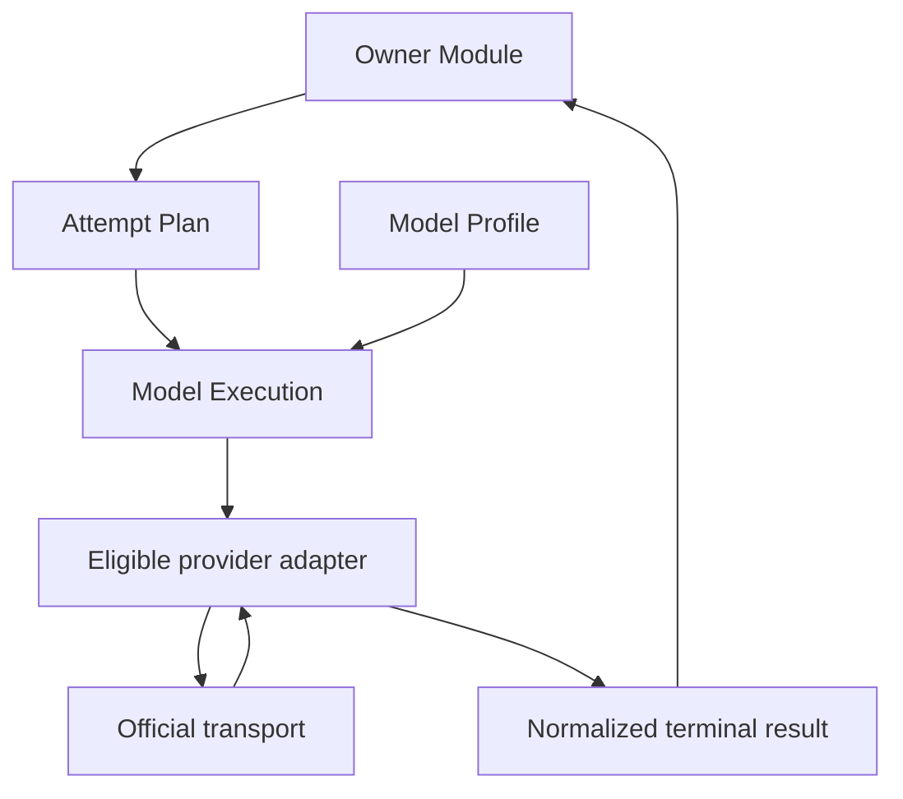
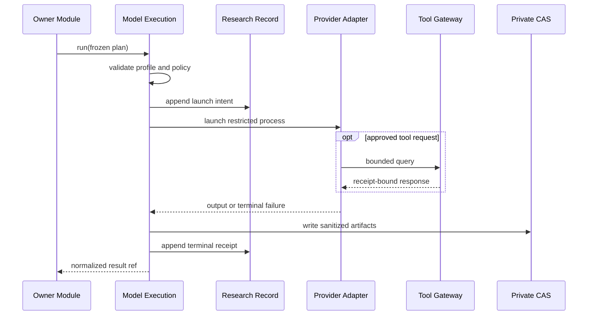
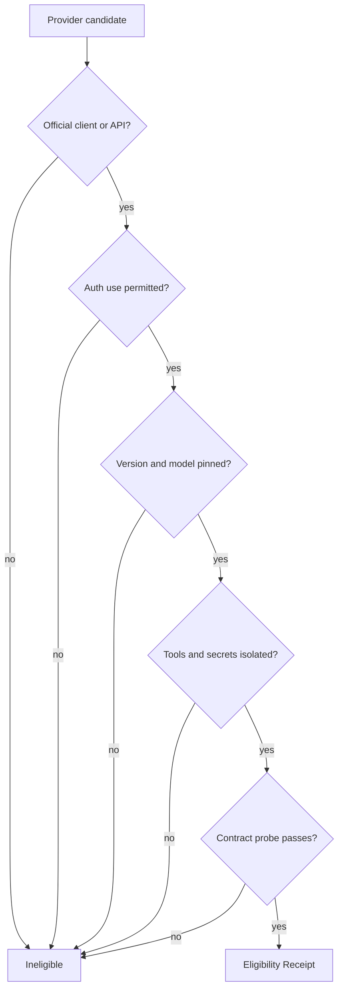
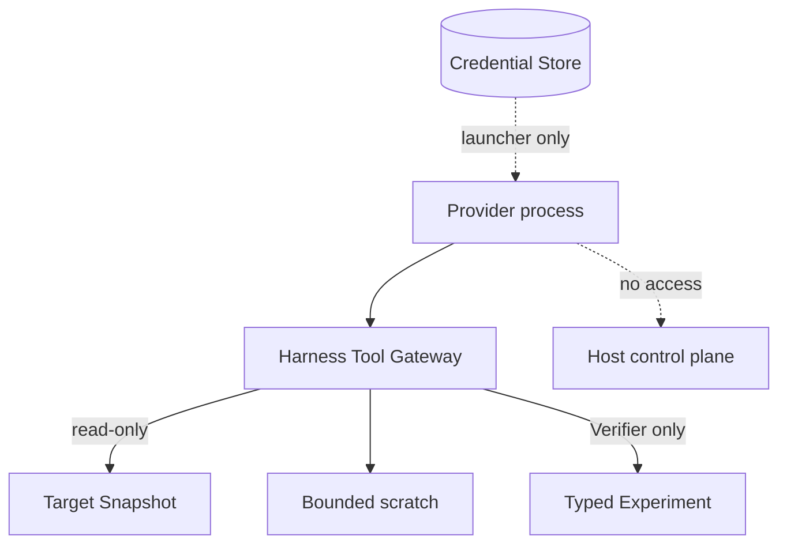
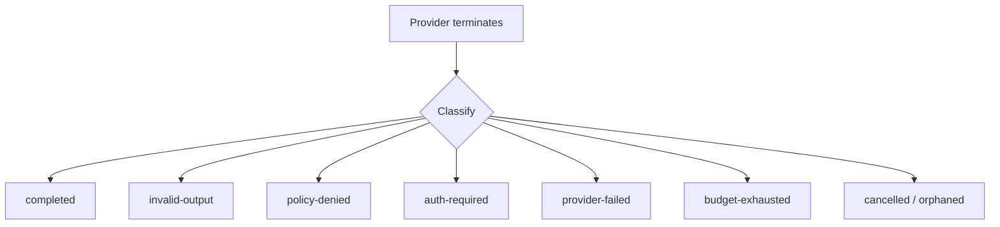

# Model execution seam

Status: accepted provider-neutral design

## Owner and purpose

`Model Execution`は一つの不変`Attempt Plan`を実行し、provider差を含まないterminal resultへ変換する。認証、transport、tool protocol、process lifecycleを隠し、探索や検証の意味判断は所有しない。

```ts
interface ModelExecution {
  run(plan: AttemptPlan): Promise<AttemptExecutionResult>;
}
```

callerはprovider executable、argv、credential path、PID、session、retry timingを渡さない。model、provider、effort、tool、budgetはversioned `Model Profile`とPlanで固定する。

## Provider-neutral boundary



`Owner Module`はrole-specific schemaと結果の意味を検査する。Model Executionが保証するのはidentity、policy、lifecycle、schema envelope、artifact durabilityまでであり、Hypothesisの採用やFinding昇格ではない。

## Attempt lifecycle



## Transport admission



consumer OAuth tokenやsubscription credentialを独自HTTP clientへ転用しない。公式CLI、公式SDK、公式APIはそれぞれ別adapterとし、認証用途が公式に許され、制限を検証できる場合だけProfileへ採用する。失敗時に別modelへ自動fallbackしない。

## Tool and secret isolation



provider組込みshell、web、ambient plugin、hook、MCP、memory、subagentは無効化する。FinderへはTarget-boundな`read/search/symbol/graph`と隔離scratchだけを許可し、Experiment toolを渡さない。VerifierのExperimentもHypothesisとmechanismへ拘束したtyped actionだけにする。

各tool requestにはAttempt、Lease、Target Snapshot、Policy、query ordinal、budgetをharness側で結合する。path escape、digest mismatch、unknown tool、schema mismatch、budget超過を実行前に拒否する。

## Terminal results



自由文だけの回答、truncated output、unknown event、model substitution、silent effort fallbackを`completed`にしない。provider errorをHypothesis 0件へ丸めない。raw credential、reasoning trace、sessionをExploration、Verification、Human OSへ渡さない。

## Supervision and recovery

- wall time、turn/tool数、output bytes、process count、CPU/memory、並列数を外側supervisorが制限する。
- timeoutまたはstopでは子を含むprocess tree全体を終了する。
- resumeは同じAttempt、Profile、policy、frozen input、残予算に限る。
- 安全なresume条件がなければ元Attemptを`orphaned`にし、fresh IDで再割当する。
- provider sessionをCampaign stateの正本にしない。

## Invariants

1. provider固有のmodel名やeffort尺度をdomain contractへ埋め込まない。
2. Profile変更は新しいidentityとなり、silent fallbackしない。
3. credential値はPlan、prompt、Ledger、tool subprocessへ入れない。
4. artifactをprivate CASへ書いた後にterminal receiptを記録する。
5. model confidenceは証拠またはpriorityにならない。
6. 高性能modelだけに成立するhidden behaviorをInterface要件にしない。

## Behavior test surface

Testは`run(plan)`とprovider-neutral receiptだけを観測する。argv、PID、stdout chunk順、内部timerを固定しない。

contract suiteは、launch identity、schema failure、auth failure、tool allowlist、secret isolation、budget termination、process-tree cleanup、transient resume、crash recovery、redactionを保護する。provider固有のlive capability probeはfixture testと分け、成功結果を恒久的なEligibilityへ読み替えない。

現在のadapter、Profile、実装path、対応toolは[Codebase Guide](../CODEBASE-GUIDE.md)だけを正本とする。探索roleの自由度は[Exploration seam](exploration-seam.md)、Verification専用toolは[Verification seam](verification-seam.md)を参照する。
