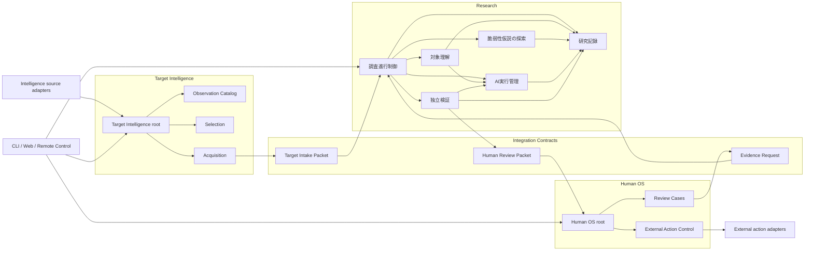
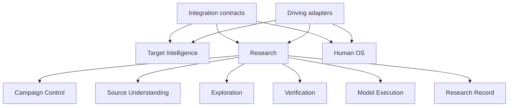

# Module architecture

Status: accepted module boundaries; Exploration policy revised by ADR 0113/0114, 2026-09-03

この文書は、`Target Intelligence -> Research -> Human OS`を一つのstrict TypeScript modular monolithとして実装する際のmodule ownership、公開面、依存方向、record ownershipを固定する。高水準のcontext境界だけで実装を始めず、各production moduleはこの設計上の配置と個別にacceptedなseamを持ってから実装する。

## Design rules

1. contextの外へ見せるのはcommand、query、versioned handoff contractだけとする。parser、provider session、database row、container handleを公開しない。
2. moduleは処理手順ではなく、変化し続ける一つの判断または複雑性を所有する。callerへ内部の順序、retry、file名、provider差を漏らさない。
3. context間は直接moduleをimportせず、schema-onlyのIntegration Contractsを介する。
4. Researchのstate変更はResearch Recordだけが永続化する。各moduleはtyped commandを渡せるがSQLiteや別moduleのtableへ触れない。
5. driving adapterであるCLI、web UI、remote controlはcontext rootだけを呼ぶ。domain policy、resume判断、provider選択を持たない。
6. driven adapterであるprovider CLI、PHP helper、gVisor、browser、Wordfence APIは、それを所有するmoduleの内側に閉じる。
7. 二つ目の実装が存在しない低水準部品へ汎用portを作らない。ただし複数providerで実在するModel Execution contractと、三context間のhandoff contractは最初からversion固定する。

## System topology



矢印はcompile-timeまたはruntimeの利用方向であり、event arrival順を表さない。Research内部でcycleを作らない。特にModel ExecutionはCampaign Control、Exploration Control、Verificationのdomain判断を呼び戻さない。

## Researchの第一階層

Researchを理解・操作するときは、次の6moduleだけを第一階層として扱う。細かい仕組みは各moduleのinterfaceの背後へ隠す。

| 第一階層のmodule | Code上の名称 | 内部へ隠すもの |
| --- | --- | --- |
| 調査進行制御 | Campaign Control | Campaign lifecycle、budget、有限Work Wave、停止・再開 |
| 対象理解 | Source Understanding | Target Workspace、Lab Baseline Builder、Source Mapping、PHP Program Index、Source Evidence Gateway、Mapper |
| 脆弱性仮説の探索 | Exploration | Root Planner、Approach Family Registry、自由探索Wave、Route Fragment、Root Synthesis、Adversarial Critic、Gap Review |
| 独立検証 | Verification | 成立証拠、因果対照実験、反証レビュー、検証環境制御、Review Packaging |
| AI実行管理 | Model Execution | Claude/GPT/Grok/GLM adapter、Attempt/tool binding、session、retry、usage、Tool Receipt、transcript |
| 研究記録 | Research Record | Research Ledger、CAS、replay、参照整合性 |

通常の運用者はprovider CLI、PHP parser、container、SQLite eventを直接操作しない。調査進行制御の`prepare / run`とread-only queryだけを使う。

## Integration Contracts

`src/integration/`は三contextが共有する唯一のcode packageとし、次のruntime schemaだけを置く。

- `TargetIntakePacket@v1`: Target IntelligenceからResearchへ渡す一つの主対象pluginの名前空間付きidentity、主プラグインファイル、正規インストールディレクトリ、Plugin Basename、照合済みversion、取得原本ref、正規化ファイル一覧ref、明示的な環境依存、provenance、Selection Receiptの公開projection。採用結論、policy version、oracle-freeな理由以外の選定内部情報を含めず、全体をoracle-freeとする
- `HumanReviewPacket@v1`: ResearchからHuman OSへ渡すFinding、Evidence Route、成立証拠、因果対照実験、再現情報
- `EvidenceRequest@v1`: Human OSからResearchへ返す不足観測とacceptance criterion

ここへCampaign、Finding、provider、database、UIのbusiness logicを置かない。contractはproducer/consumerの内部型を再exportせず、digest、schema version、provenanceを必須にする。

## Target Intelligence modules

Target Intelligenceの自動観測・選定はMilestone 3までproduction実装しない。Milestone 2ではoperator選定を受ける手動対象投入とoracle-freeなTarget Intake Packet生成だけをbootstrapし、Observation Catalog、候補queue、rankingを先行実装しない。

| Module | Owns | Public seam | Must not know |
| --- | --- | --- | --- |
| Target Intelligence root | manual intake、将来のobserve・select・acquireのapplication flow | commandsとread-only queries | Research Ledger、Hypothesis、Finding |
| Observation Catalog | immutable Target Observation、Intelligence Source、Selection/Oracle分類、脆弱性履歴集計 | `recordObservation`、`readObservation` | Campaign priority、worker prompt |
| Selection | Selection Policy、Wordfence適格性スナップショット、Target Candidate、調査専用候補、Selection Receipt | `evaluateCandidate` | Researchの既知/未知Finding |
| Acquisition | WordPress.orgからのsource取得、premium sourceの手動import、取得原本、正規化ファイル一覧、provenance、oracle除外、Intake Packet生成 | `intake` | Campaign lifecycle、Verification、vendor account credential |

Milestone 2の手動対象投入はoperatorが選んだ一つの対象だけを扱う。入力schemaはsource、version、入手経路、Canonical Configurationに必要な情報、明示的な環境依存だけを許可し、CVE、advisory、疑わしいfile・symbol・parameter、期待するvulnerability classまたはrouteを受理しない。operatorが選定理由を自由文でpromptへ注入する経路も作らない。

受入preflightは理由付きの三値を返し、`ready`だけがTarget Intake Packetを生成できる。

- `ready`: 対象scope、source identity、version、provenance、archive integrity、必要な構成情報が固定できる
- `deferred`: 必要なenvironment dependency、対応runtime、設定情報、取得可能なsource等が不足しているが、追加すれば再評価できる
- `rejected`: plugin scope、正規入手provenance、archive integrity、prospective latest-stable policy、またはoracle-free input policyに違反する

`deferred`と`rejected`は入力digest、policy version、reason codeを持つterminalな受入記録として保持し、CampaignまたはResearch Ledgerを作らない。再試行は入力またはpolicyが変わった新しい受入判定とし、過去記録を上書きしない。Milestone 2で候補を自動選択したり、Campaign停止後に次の対象を自動起動したりしない。詳細は[ADR 0096](../adr/0096-bootstrap-prospective-research-with-manual-intake.md)に記録する。

Acquisitionはuntrusted inputを一つのdeep moduleとして受け入れ、archive処理、directory capture、quota、path検査、hash、private CAS write、manifest生成、oracle-free packet生成をinterfaceの背後に隠す。外部seamは`intake(request) -> IntakeDisposition`一つとし、`unpack`、`checkPaths`、`hashFiles`、`writeOriginal`、`buildManifest`をcallerへ公開しない。これによりcallerが検査前のsourceからpacketを作る順序違反を防ぐ。具体的なinterfaceと受入scenarioは[Target intake seam](target-intake-seam.md)に固定する。

取得原本は展開前にcontent digestを固定し、正規化ファイル一覧は安全にstageした通常fileだけから安定順で作る。absolute path、parent traversal、NULを含むpath、symlink・hardlink、device・FIFO・socket、重複path、caseまたはUnicode正規化で衝突するpath、policy上限を超えるentry数・単体size・総展開sizeをrejectedとする。directory入力もlinkを追わず、staging後のimmutable bytesからmanifestを作る。Composer、npm、install hook、plugin PHP等をhost上で実行せず、script file自体は通常fileとしてdata扱いする。取得原本と正規化ファイル一覧のdurable writeが完了する前にreadyを返さない。詳細は[ADR 0097](../adr/0097-separate-source-admission-from-runtime-setup.md)に記録する。

正規化ファイル一覧のdigestをsource treeの主identityとする。各entryは単一プラグインルートからの正規化相対path、原文bytesのcontent digest、sizeを持ち、file内容の改行、encoding、Unicode、whitespaceを変更しない。archive timestamp、owner、compression methodとlevel、入力local pathはmanifestへ含めない。したがって同じfile treeを異なるarchive packagingで取得した場合は同じsource tree identityになり、取得原本digestとprovenanceは別recordとして残る。

入力が複数のinstall可能plugin、複数の候補root、またはinstall対象を選ぶためのnested archiveを含む外側bundleなら、Acquisitionはheuristicに一つを選ばず`deferred: single-plugin-root-required`を返す。operatorは一つのplugin rootまたはarchiveを明示して新しいintakeを行う。いったん単一プラグインルートが確定した後、そのtree内に含まれるarchive fileは実行・再展開せず通常fileとしてmanifestへ含める。詳細は[ADR 0098](../adr/0098-identify-target-source-by-canonical-file-manifest.md)に記録する。

Acquisitionはplugin identityを配布経路で名前空間化する。WordPress.org sourceはofficial slugから`wporg:<slug>`を作り、要求slug、取得URLまたはAPI observation、package metadataを照合する。premium sourceはoperatorがprovenanceと共に`premium:<vendor>/<product>`を明示し、directory basenameまたは表示用Plugin Nameをidentityとして採用しない。名前空間付きidentityの正規化policyはversion固定し、既存identityをrenameで上書きしない。

主プラグインファイルがrequestで明示された場合は、単一プラグインルート内の通常fileで有効なWordPress plugin headerを持つことを検査する。未指定の場合だけstaticに候補を列挙し、有効候補が一つなら確定、ゼロなら`deferred: main-plugin-file-missing`、複数なら`deferred: main-plugin-file-ambiguous`とする。file順、directory名、最大version等で勝手に選ばない。

主プラグインファイルの`Version` header、request version、WordPress.org等の利用可能な配布metadataをopaqueなversion labelとして照合する。必要な値が欠ける場合は`deferred: version-evidence-missing`、二つ以上のauthoritative valueが一致しない場合は`rejected: version-mismatch`とする。versionをSemVerと仮定して補正、大小比較、推測をしない。確定したplugin identity、main file relative path、version evidence refsと結論をTarget Intake Packetへ固定する。詳細は[ADR 0099](../adr/0099-bind-plugin-identity-main-file-and-version.md)に記録する。

WordPress.org sourceの正規インストールディレクトリはofficial slugと一致させる。premium sourceではvendor配布metadataまたはrequestがcanonical install directoryを明示しなければならず、Plugin Identityのvendor/product、archive名、表示名から生成しない。main plugin file relative pathと結合したPlugin Basenameをpacketへ固定する。値はhost absolute pathではなく`wp-content/plugins`からのlogical relative identityである。

Target Snapshotはcanonical Plugin Basenameを保持し、Campaign setupはそのdirectoryへsource treeをmaterializeしてmain plugin fileをactivateする。別directory名が必要なHypothesisは、根拠、alternate directory、effective Plugin Basenameを持つConfiguration Variantとして新しいWork Leaseまたは後続Campaignへ固定する。canonical値を上書きせず、FindingとWitnessは使用したVariant digestを参照する。詳細は[ADR 0100](../adr/0100-fix-the-canonical-plugin-basename.md)に記録する。

Intelligence Source adapterの停止やWordfence API failureは、既に固定されたTarget Snapshotまたは進行中Campaignを変更しない。

実戦CampaignのSelectionは取得時点の最新安定版だけをTarget Candidateにする。旧versionはoracle既知のBoundary PairはDevelopment Cohortとして分離し、実戦成果へ数えない。

WordfenceはNorth Starを定義する上限ではなく、Target優先度と外部提出の主要programmeとする。現在のoperator profileは`1337 Researcher`とし、thresholdと除外条件は取得日、source URL、content digestを持つ不変スナップショットに固定する。外部規約が変更されても、既存Findingの技術的真偽は変更しない。

SelectionはWordfence対象内を外部提出価値のため優先するが、programme対象外を自動拒否しない。対象外でも技術的価値が高いpluginは調査専用候補として選定できる。主要な選定要素は潜在impact、unauthenticatedまたは通常登録で得られるPermitted Attackerから到達し得る攻撃面、利用規模、現行安定版、更新状況、取得可能性とする。報奨金額、model confidence、Researchの既知/未知結果は順位付けに使わない。

既知脆弱性履歴は初期選定policyの主要因にしない。非oracleな選定基準の実績を得た後に必要性を再評価し、導入する場合も対象固有のCVE、advisory、vulnerability class、affected version、symbol、payload、patchを除いた件数または密度の集計だけを低比重で使う。集計元のOracle Factと脆弱性履歴集計はTarget Intelligence内に留め、Target Intake Packet、Campaign Spec、worker prompt、Research priorityへ渡さない。Selection Receiptの公開projectionには採用結論、policy version、oracle-freeな理由だけを含める。詳細は[ADR 0095](../adr/0095-prioritize-targets-by-non-oracle-research-value.md)に記録する。

対象種別はWordPress pluginだけとする。Wordfence programmeがthemeを受付けていても、Target Candidate、Target Intake Packet、Target Snapshotにtheme variantを作らない。WordPress Coreも非対応・計画外とし、将来用のTarget union、adapter、extension pointを先行導入しない。将来の発展候補はWordPress外のホワイトボックス・バグバウンティ用別productであり、このmoduleを現時点で汎用scanner frameworkにしない。詳細は[ADR 0086](../adr/0086-support-only-wordpress-plugins.md)に記録する。

WordPress.org配布pluginとpremium pluginはどちらも対象にできるが、取得経路を分ける。WordPress.org版はAcquisition adapterがversionとdigestを固定して取得できる。premium版はoperatorが正規入手したlocal archiveまたはdirectoryの手動importだけとし、harnessはvendor accountへloginせず、purchase、license activation、credential保存、自動downloadを行わない。両経路は同じoracle-freeなTarget Intake Packetを出力する。詳細は[ADR 0087](../adr/0087-support-manually-imported-premium-plugins.md)に記録する。

## Research context root

Research contextの外から呼べるapplication APIは次に限定する。

```ts
interface CampaignRunner {
  prepare(input: NewCampaignInput): Promise<PreparedCampaign>;
  run(plan: CampaignRunPlan): Promise<CampaignRunRecordRef>;
}

interface CampaignReader {
  read(campaignId: CampaignId): Promise<CampaignView>;
  inspect(campaignId: CampaignId, subject: SubjectRef): Promise<SubjectView>;
}
```

`run`はLedgerをreplayし、固定PlanをterminalなIteration Decisionまで進めるreconcilerである。CLIやremote controlへ`runMapper`、`spawnAgent`、`resumeClaude`、`appendEvent`を公開しない。現行sliceは一つの有限Work Waveを閉じ、到達形では`continue-unresolved-work`を内部消費して人間の追加指示なしに反復する。

## Research modules

### Campaign Control

Campaign lifecycleと一回の`run`でどこまで進めるかを所有する。Ledger replay、budget reservation、Work Wave barrier、crash recoveryを調整するが、provider eventやPHP ASTを解釈しない。

```text
prepare / run
    -> replay state
    -> build one finite Work Wave
    -> invoke owning execution modules
    -> durably record typed terminal evidence
    -> fold one Iteration Decision
    -> return an immutable run ref
```

Campaign Controlをgod moduleにしない。Focus分割はExploration Control、provider retryはModel Execution、Finding昇格はVerificationが決める。

予算枠はwall time、Attempt数、Work Wave数、concurrencyのhard ceilingと、上位Hypothesis少なくとも1件をfresh Verifier、成立証拠、sibling因果対照実験、反証レビューまで閉じられる検証予約を持つ。Exploration Controlはこの予約を新しいDiscovery Work Leaseに使えない。比率や具体値は設計に固定せず、instrumented pilot後のversioned policyで調整する。

初期運用のactive Campaign上限は全systemで1とし、Campaign Controlが新規開始時に強制する。これはCampaign内のWork Waveを直列化する判断ではなく、同一Campaignの重複しないWork Leaseはbudget内で並列実行できる。実戦証拠が蓄積した後にCampaign上限を上げる場合は、versioned deployment policyとして変更する。

`Completed`はCoverage Closureが成立した時だけ返す。予算消費、provider不可用、toolまたはruntime不足で停止した場合は未完了Campaignとし、残ったFocus Area、Blocked Hypothesis、検証待ち行列をLedger refと共に保持する。zero Findingまたはbudget exhaustionを「脆弱性なし」へ読み替えない。

同じCampaignの予算枠を実行中または停止後に延長しない。未解決gapを続ける場合はTarget priorityと他Candidateと再比較し、選定された時だけ、predecessor Campaign refと引き継ぐgap refsを持つ後続Campaignを新規作成する。

### Target Workspace

readyなTarget Intake Packetから一つのTarget Snapshotと必要最小限の環境依存スナップショットを作り、source identity、read-only mount、Attempt scratch、cleanup receiptを所有する。Research内部へmanual intakeの別経路を作らない。

```ts
open(snapshot: TargetSnapshotRef, policy: WorkspacePolicy): Promise<WorkspaceReceipt>;
close(workspace: WorkspaceReceipt): Promise<CleanupReceipt>;
```

physical host pathはWorkspaceReceipt内のtrusted locatorとして同context内だけで使う。Work Lease、prompt、Human Review Packetへhost pathを渡さない。

`ready`はruntime成功を意味しない。Target Workspaceは安全なread-only materializationまでを所有し、target codeを実行するsetupをLab Baseline Builderへ委ねる。

一つのCampaignで主対象pluginは一つだけとする。環境依存pluginは主対象の実行または具体的なroute検証に必要なものだけを事前固定し、依存全体の攻撃面を独立Focus Areaへ展開しない。任意のplugin組合せを生成する探索も行わない。詳細は[ADR 0088](../adr/0088-use-one-primary-plugin-per-campaign.md)に記録する。

### Lab Baseline Builder

Source Understanding内部のdeep moduleとして、Target Snapshot、環境依存スナップショット、Runtime Profile、Canonical Configurationを表すSetup Planから再利用可能なsealed Lab Baselineを一つ作る。Campaign Controlには`establish(request) -> SetupDisposition`だけを公開し、Plan validation、image pull、network作成、database初期化、plugin配置、activation、principal作成、health probe、正常機能確認、snapshot、cleanupを個別commandとして公開しない。acceptedなinterfaceとtest surfaceは[Campaign setup seam](campaign-setup-seam.md)に固定する。

Runtime ProfileはWordPress core artifact、PHP・database・web server等のOCI image digest、gVisor `runsc` build identity、architectureと必須runtime capabilityを固定する。mutable tagまたは`latest`は観測metadataとして保存できるが実行時解決に使わない。Campaignをprepareした後にprofileの参照先を変更しない。

Builderはfresh filesystemとdatabaseから開始し、固定WordPressを構築して、digest固定した環境依存pluginをSetup Planの宣言順に配置・activateした後、主対象pluginをcanonical Plugin Basenameへ配置・activateする。Setup Planは版付きのtyped actionと客観的postconditionだけを持ち、任意shell、任意PHP、未固定dependency downloadを許可しない。LLMがPlanを提案してもvalidatorのschemaとpolicyを通過しなければ実行しない。target-controlled code、migration、activation hookはgVisor内だけで実行する。

Canonical ConfigurationはUTC・`en_US`を基準とし、別locale等は根拠付きConfiguration Variantの別Setup Planにする。setup administrator、Permitted Attacker、必要なprivileged victimは別Lab principalとし、credential値はSecretRefの最終利用境界だけで注入する。外部serviceはlocal emulator、record/replay、live External Dependency Grantの順で選び、live accountはCampaign専用の非production research accountとする。

`ready`には少なくともWordPress bootstrapとdatabase migrationの完了、全必須dependencyと主対象pluginのactive状態、activation中とprobe中のfatal error不在、frontend・admin・RESTの基本health、対象pluginの正常機能確認と客観的postcondition成立を要求する。全gateとobservationsをSetup Receiptへ固定し、filesystem、database、configuration、principal seed stateをsealしてLab Baselineを作る。一つでも成立しなければreason、最後に成功したstep、runtime receipt、sanitized log refsを持つ`setup-blocked`を返し、Intake Dispositionを変更しない。

Verificationは完成済みLab Baseline refだけを受け取り、Experimentごとにfresh siblingを生成する。setup手順を再解釈したり、dependency version、Setup Plan、Runtime Profile、Canonical Configurationを変更したりしない。変更は別baselineとしてBuilderが作り、canonical baselineを上書きしない。詳細は[ADR 0101](../adr/0101-build-a-sealed-lab-baseline-before-research.md)と[ADR 0102](../adr/0102-execute-only-typed-setup-plans.md)に記録する。

### Source Mapping

Target Snapshotから脆弱性主張を含まないSurface Map revisionを作るdeep moduleである。内部にdeterministic PHP Source Analysis、asset inventory、evidence grading、context selection、Mapper Attempt、必要なruntime revisionだけで行う低影響なRuntime Observation、revision mergeを持ち、callerへparser version、AST traversal、prompt分割、file分類、cross-file synthesis順、Lab handleを漏らさない。

```ts
build(input: SurfaceMappingInput): Promise<SurfaceMapRef>;
```

PHP Program IndexはSource Mapping内部のversioned evidence artifactであり、context rootのpublic interfaceではない。PHPとWordPress registrationを地図の骨格にしつつ、Target manifest上のJavaScript、template、SQL、configuration、bundled vendor codeを分類し、根拠があるassetだけをrelationへ接続する。vendor codeはprovenanceを表示するが、主対象から到達可能という理由だけでscope外にしない。minified、generated、binary、unsupported fileは無制限にmodelへ渡さず、metadataとcoverage gapを残す。

nodeとrelationはTarget Snapshot digest、file digest、byte range、kind、端点等のcanonical claimからstable identityを作り、line numberは表示用metadataとする。根拠状態は`observed | inferred | unknown`の三値に固定し、`unknown`の日本語名を「未解決」とする。PHP Program Indexのfactは`observed`であり、modelは上書きできない。`inferred` relationはsource anchorsまたは版付きKnowledge Capsule refsを必須とし、動的call、組立てhook、reflection等を確定できない時は候補と不足証拠を持つ`unknown`にする。

Mapperの初期promptはstable orderingで選んだgraph近傍とsource sliceだけを持つ。同一Targetの追加readも、anchor、理由、用途を持つContext Requestとして記録する。Agentへ全repositoryを無条件にprompt投入したりphysical host pathを渡したりしない。WordPress Coreとframework semanticsはTargetのsource factにせず、digest固定したKnowledge Capsuleに由来する`inferred` evidenceとして区別する。

dynamic registration、callback、dispatch、state transitionを静的に確定できず、Explorationから情報利得の高いMapping Evidence Requestが返った場合、Source Mappingは版付きRuntime Observation Planをfresh Lab Baseline cloneで実行できる。これはSource Mapping内部のdriven seamであり、Finderへruntime、HTTP、browser、shellを渡さない。Observation Recordは次のMap revisionの根拠になれるが、WitnessまたはFinding evidenceにはならない。

既存Surface Mapを更新する時はpredecessor refを持つ新revisionを作り、旧revisionを変更しない。Source MappingはApproach Familyまたは探索境界を決めない。Exploration ControlはTarget inventoryと過去artifactから独立familyを作り、Surface Mapを独立barrier後のcoverage補助にだけ使える。acceptedなinterface、failure semantics、test surfaceは[Source mapping seam](source-mapping-seam.md)に固定し、詳細な判断は[ADR 0103](../adr/0103-build-evidence-graded-surface-map-revisions.md)に記録する。

### Exploration Control

何をどの異質な研究ideaで次に調べるかを所有するpure decision moduleである。Target Snapshot、repository inventory、Approach Family Registry、過去のterminal artifactから最大4個の独立familyを持つ有限Work Waveを計画する。Attempt outputのdecodeとdedup、minority routeの保持、Work Wave barrier後のRoot SynthesisとAdversarial Critic、独立Gap Review、closureまたは再開判断までを一つのinterfaceへ隠す。

```ts
decide(input: ExplorationDecisionInput): ExplorationDecision;
```

`ExplorationDecision`は`run-wave | revise-map | verify | review-gaps | close | blocked`のいずれかで、Campaign Controlが実行すべき次の有限workだけを返す。`AttemptExecutionResult`はdurable receipt refとprovider非依存のterminal status/outputを持つ。Exploration Controlはrole固有schemaでoutputをdecodeするが、raw stream、session ID、provider eventを受け取らない。providerを起動せず、arrival order、model confidence、programme reward、model多数決だけでpriorityまたは採否を変えない。

共通Finder roleとOutput Schemaを保ち、vulnerability class別moduleまたは固定された`Hunter / Analyst / Builder` hierarchyを作らない。`entry-forward`、`sink-backward`、`state-chain`、権限・security invariant、Wildcardは逐次手順ではなく、Approach Family Registryの観測labelまたは開始lensに限る。Root Plannerは同じideaの言い換えを別familyにせず、barrierまで複数の相容れないrouteを維持する。

Finderは別Finderのconversation、scratch、進行中outputを読まない。Work Wave内の結果は全Attempt terminal後にstable Work Lease ID順でfoldし、型付きRoute Fragment、Hypothesis、state transitionからChain Synthesisを行う。一つのmodelだけが出したsource-bound Hypothesisを捨てず、相反する支持・反証routeをconsensusで潰さない。criticはfalsifierまたは不足証拠を追加できるが拒否権を持たない。

探索は全source解析またはSurface Map completionを待たず、Target manifestとSnapshot-boundなGlob/Grep/Readから開始する。最初のDepth WaveへMap excerpt、AST route、node priorityを見せない。追加sourceまたはdynamic relationが必要ならDependency WishlistまたはMapping Evidence Requestを返せるが、Map nodeの有無をcandidate受理条件にしない。Semgrep等のmatchはHypothesis Seedに留め、non-matchを安全またはclosureの証拠にしない。

同じFinderの自己申告では閉じない。全Approach Familyがterminal化し、blocked routeに再開条件があり、連続Waveで新しいsource evidence、Fragment、familyが増えず、Criticもmaterially new mechanismを提示できない場合だけevidence-backed closureを提案する。acceptedなinterfaceと移行元挙動は[Exploration seam](exploration-seam.md)、自由探索policyは[ADR 0113](../adr/0113-keep-finder-methods-free-behind-an-evidence-shell.md)、Breadth/Depth分離は[ADR 0114](../adr/0114-separate-breadth-and-depth-campaign-policies.md)、Finder上限は[ADR 0116](../adr/0116-use-four-finder-slots-per-depth-wave.md)に記録する。

### Model Execution

一つのAttemptをprovider差から隔離して実行するdeep moduleである。Prompt Set rendering、Model Profile、Transport Eligibility、Provider Credential Store、role別tool manifest、Agent Sandbox、Segment lifecycle、wall/turn/process/usage ceiling、transcript CAS、分類済みresume、normalized Attempt Receiptを所有する。

```ts
run(plan: AttemptPlan): Promise<AttemptExecutionResult>;
```

`AttemptPlan`はWork Lease、role、Target Snapshot、Prompt Set、selected Knowledge、Model Profile、Sandbox Policy、Output Schema、tool manifest、reserved budgetを固定する。`AttemptExecutionResult`はdurable Attempt Receipt、normalized termination/usage、schema-validなterminal outputまたはtyped failureを返し、raw transcriptはprivate CAS refとして保持する。provider adapterはplanをversion固定argv/configへ変換するだけで、role、model、effort、retry policyを選択しない。

transportは公式配布、公式に許可された認証・用途、version固定、安全性probe、credential isolation、structured output、process terminationを確認したTransport Eligibility Receiptがある場合だけ採用する。consumer OAuthまたはsubscription keyを独自APIへ転用せず、条件を満たさないmodel candidateを非公式transportで補わない。Direct API adapterは公式API/service credentialを別途導入した場合だけ追加する。

Provider Credential Storeはprovider別のlogin stateをResearch LedgerとCASの外で管理する。launcher以外のmodel、Target mount、tool、scratch、prompt、transcriptへsecret値を公開しない。CLIのtool subprocessから認証状態を隔離できない場合はproduction不適格とする。auth failureは`auth-required`として停止し、別credentialまたはmodelへ自動fallbackしない。

全roleはversion固定したharness所有toolだけを使う。read/search/graph queryと隔離scratch computeを共通にできるが、DiscoveryへExperimentを渡さない。Verifierと必要なSkepticだけにtyped Experimentを追加する。provider組込みshell、filesystem tool、web、plugin、hook、ambient MCP、memory、subagentは無効化し、無効化できないtransportを採用しない。

Model Executionはwall time、Segment/Attempt count、turn/tool、output、process tree、providerが返すusage、token、rate-limitを記録し、外側のsupervisorがhard ceilingを強制する。停止時はprocess group/cgroup全体を終了する。subscription上の推定金額は比較telemetryであり、正確な強制単位とみなさない。providerが信頼できるusage ceilingを公開する場合は、Model Profile固有の追加hard ceilingにできる。

resumeは分類済み一時障害に限り、同じAttempt、session、Model Profile、Sandbox Policy、frozen input、残予算でだけ行う。初期のClaude process adapterはModel Execution内部に置く。GLM、Codex、Grokという第二以降の実adapterは、公式性と安全性probeを個別に通過した後だけ追加する。provider session refをAttempt Receiptから別Work Lease、Verifier、Skepticへ渡さない。

Remote ControlはCampaignRunnerとCampaignReaderだけを呼び、Model Executionの`run`、provider PTY、session、process signal、credentialへ直接接続しない。acceptedなinterface、failure semantics、test surfaceは[Model execution seam](model-execution-seam.md)に固定する。transport判断は[ADR 0104](../adr/0104-admit-only-official-model-transports.md)、tool判断は[ADR 0105](../adr/0105-expose-only-harness-owned-attempt-tools.md)に記録する。

### Verification

HypothesisからFindingまたはnegative outcomeまでを閉じるload-bearing deep moduleである。fresh source re-derivation、cheap category gate、Experiment Plan、成立証拠（Witness）、sibling因果対照実験（Causal Control）、反証レビュー（Skeptic Review）、Frontier Independent Reproductionを所有する。

```ts
verify(plan: VerificationPlan): Promise<VerificationRecordRef>;
```

Campaign Controlへ`runWitness`、`runControl`、`askSkeptic`を個別公開しない。Verificationが全必須証拠を確認した場合だけFinding promotion commandをResearch Recordへ渡す。Discovery transcript、scratch、provider self-verdictを証拠として受理しない。

Verificationは版付きの誤検出除外基準を適用する。主な入力はWordfenceの公式な共通誤検出例だが、各条件はsourceまたはExperimentで判定可能なfalsifierに変換する。単なる文言一致やmodel自己申告で破棄しない。`out-of-scope`というHypothesis outcomeはCampaignの技術的調査範囲外だけを意味し、Wordfenceの提出対象外を意味しない。

隔離検証環境と追加modelを使う前に、Verificationはsymbolとsource rangeの実在、WordPress entry registrationからの到達性、attacker role、capability check、nonce、主張sinkまでのsource relationを事前検査する。source evidenceが必要条件の不成立を決定的に示す場合だけ`conclusively-disproved`にでき、静的に判定できない場合は`inconclusive`として検証待ち行列へ残す。

検証待ち行列はimpact、attacker reachabilityの観測根拠、次のExperimentの決定可能性、費用、coverage debtで並べ、予算内の上位から隔離検証へ送る。未選択HypothesisはqueueとLedgerに保持し、DisprovedまたはFindingに読み替えない。model confidenceはこの優先度に使わない。

Findingの原因が環境依存plugin内だけにある場合は、現CampaignのFindingにせず、そのpluginを主対象とする別Campaign候補を作る。主対象の不安全な処理が起点で、依存が意図されたgadget、sink、またはruntime capabilityを提供するrouteは、依存を前提として明記した主対象Findingにできる。

### 検証環境制御（Lab Control）

Verificationだけが利用するdriven moduleである。gVisor、隔離検証環境、WordPress runtime、browser、database、Credential Broker、External Dependency Grantを一つのtyped Experiment境界へ隠す。

```ts
execute(plan: ExperimentPlan): Promise<ExperimentObservationRef>;
```

このmoduleはHypothesisまたはFindingを判断しない。同じ隔離検証環境で成立証拠と因果対照実験を連続実行せず、共通Lab Baselineからfresh siblingを作る。gVisor unavailable時はevidentiary resultを返さない。

### Iteration Review

terminal Work Waveのpositive/negative/blocked evidenceを安定順でfoldし、次のFocus Plan、priority change、Lesson Proposal、Rule Proposal、stop/continue decisionを作る。

```ts
review(input: IterationReviewInput): IterationDecision;
```

raw transcriptをglobal Knowledgeへ昇格せず、LessonとRuleはそれぞれpromotion gateを通す。Exploration ControlがWave内のHypothesis、Chain Synthesis、closureを判断する責務と、Iteration ReviewがCampaign横断で次版のpolicy、Knowledge、rule候補を決める責務を分ける。

Development Boundary Pairでは、private Calibration Reviewがpositive Finding、同じCausal Identityのpatched Disproved、benign functional control、oracle-free negativeの非昇格をterminal refsだけから判定し、Boundary Pair Evidenceを返せる。これはIteration Reviewへ渡すprivate system seamであり、Exploration、Verification、model judgeの代替ではない。patched negativeを二つのoracle分離経路で評価する理由は[ADR 0109](../adr/0109-test-patched-snapshots-through-two-oracle-separated-paths.md)に固定する。

Iteration Reviewは改善候補を試験投入版として作れるが、現Campaignへ適用しない。通常のpromptまたはpriority変更は小さなDevelopment smokeの後、次の少数実戦Campaignだけでcanary適用する。static rule、global Knowledge、誤検出除外policyは自己強化riskが高いため、小さなSealed Evaluationも通過する。

### Review Packaging

confirmed FindingからHuman OSへ必要な最小証拠だけを集め、digest固定したHuman Review Packetを作る。

```ts
prepare(finding: FindingRef): Promise<HumanReviewPacketRef>;
```

raw transcript、credential、writable Lab、private不要データを含めない。Human Dispositionまたは外部提出判断を所有しない。

### Research Record

Researchの唯一のpersistence writerであり、append-only Ledger、pure replay、private content-addressed artifact storeを一つの整合性境界として所有する。

```ts
record(command: ResearchRecordCommand): Promise<RecordReceipt>;
read(query: ResearchQuery): Promise<ResearchView>;
putArtifact(input: ArtifactInput): Promise<ArtifactRef>;
readArtifact(ref: ArtifactRef): Promise<Uint8Array>;
```

大きなartifactは先にdurable CASへ置き、成功したdigestだけをLedger eventへ記録する。Model ExecutionはSegment intent/completion、VerificationはExperiment/decision、Campaign ControlはCampaign/Wave/Leaseをtyped commandとして記録できるが、全てResearch Recordがschema、sequence、ownershipを検証して書く。

Research Recordはdomain判断をしない。たとえばAttemptをretryすべきか、HypothesisをFindingへ昇格できるかは呼出元moduleが決め、Recordは許可された状態遷移と参照整合性だけを検証する。

## Ten-control ownership

10動詞はプロジェクト最上位の設計原則であり、phase名ではなく横断controlとして実装する。実装責任が宙に浮かないようprimary ownerを定める。

| Control | Primary owner | Collaborating module | Observable output |
| --- | --- | --- | --- |
| confine | Target Workspace / 検証環境制御 | Model Execution | Workspace/Lab receipt、denied capability |
| constrain | Campaign Control | Model Execution / Verification | fixed budget/policy、terminal reason |
| focus | Exploration Control | Source Mapping | raw-source inventory、Approach Family Registry、任意のSurface Map enrichment、coverage gap |
| motivate | Exploration Control | Model Execution | goalとsuccess evidenceを持つAttempt Plan |
| parallelize | Exploration Control | Campaign Control | non-overlapping Work Waveとbarrier |
| hypothesize | Exploration Control | Model Execution / Source Mapping | schema-valid Hypothesis、Chain Synthesis、Mapping Evidence Request |
| verify | Verification | 検証環境制御 / Model Execution | Verification Record、成立証拠、因果対照実験 |
| record | Research Record | 全Research module | append receipt、artifact ref、replay view |
| prioritize | Exploration Control | Iteration Review | deterministic Ordered Work、minority routeの保持 |
| iterate | Iteration Review | Campaign Control | next plan、Lesson/Rule Proposal、stop reason |

`record`のsemantic contentは各owner moduleが決め、Research Recordはdurabilityとintegrityを所有する。`constrain`や`confine`をmodel promptのお願いだけで実装済みとみなさない。

## Human OS modules

| Module | Owns | Public seam | Must not do |
| --- | --- | --- | --- |
| Human OS root | review intake、human commands、read-only queue | Human Review commands/queries | Research event mutation |
| Review Cases | Human Review Case、Disposition history、Evidence Request | `openCase`、`recordDisposition`、`requestEvidence` | Findingの再定義、provider execution |
| Programme Eligibility | Findingと現行Wordfence適格性スナップショットの別判定、Finding後の既知重複照合 | `assessEligibility`、`checkKnownDuplicate` | Findingの技術的真偽、Research priority、worker prompt |
| External Action Control | explicit authorization、scope、expiry、action receipt | `authorize`、`revoke`、`readAuthorization` | implicit submit、Researchの自動公開 |

external report、vendor communication、issue、PR adapterは有効なExternal Action Authorizationを毎回要求する。Human Confirmationだけでは送信できない。

Human OSの表示とqueueは「技術的に不成立」「技術的に成立・programme対象外」「技術的に成立・programme対象内」を混同しない。前者だけが誤検出であり、後二者はどちらもFindingとして保持する。

Wordfence vulnerability feed、advisory、CVEとの既知重複照合はFindingが技術的に成立した後だけ行う。結果はHuman OSの既知重複判定に保存し、Researchのpriority、prompt、Verification outcomeを変更しない。

既知重複は、対象plugin identity、affected version rangeの重なり、root cause、attacker-controlled primitive、破壊されるsecurity propertyを照合する。同じvulnerability class、file、sink、またはCVE titleだけで重複にしない。重複してもResearch側Findingと証拠は削除せず、Human OSで`known-duplicate`として提出候補とprospective novelty metricから除外する。ruleまたはLessonへ使う場合は通常のOracle Leakage Gateを省略しない。

## Record ownership

| Record | Semantic owner | Persistence path | Other contexts see |
| --- | --- | --- | --- |
| Target Observation / Selection Receipt / 脆弱性履歴集計 | Observation Catalog / Selection | Target Intelligence-owned store | Target Intake Packetへ採用結論、policy version、oracle-freeな理由とprovenanceだけ |
| 取得原本 / 正規化ファイル一覧 / Intake Disposition | Acquisition | Target Intelligence-owned private CAS and record store | readyなTarget Intake Packetのcontent refs、digest、provenanceだけ |
| Wordfence適格性スナップショット | Selection / Programme Eligibility | 各contextが取得したimmutable policy record | 取得日、source URL、content digest、normalized rule |
| Target Snapshot | Target Workspace | Research Record | Human Review Packetのfixed identityだけ |
| 環境依存スナップショット | Target Workspace | Research Record | Human Review Packetに必要なprerequisite identityだけ |
| Setup Plan / Setup Receipt / Lab Baseline | Lab Baseline Builder | Research Record / private CAS | Verificationへsealed baseline refだけ |
| PHP Program Index / Runtime Observation / Surface Map revision | Source Mapping | Research Record / private CAS | context外へ出さない |
| Focus/Strategy/Lease/Hypothesis/Route Fragment/Closure/Gap Review | Exploration Control | Research Record | context外へ出さない |
| Transport Eligibility / Attempt / Segment / transcript | Model Execution | Research Record / private CAS | context外へraw recordまたはprovider sessionを出さない |
| Provider authentication state | Model Execution | Provider Credential Store | context外へsecret値を出さず、Research Recordへopaque auth receiptだけ |
| Experiment evidence / Verification Record / Finding | Verification | Research Record | Human Review Packetへ固定された最小証拠だけ |
| Lesson / Rule / Iteration decision | Iteration Review | Research Record | accepted後のversioned Knowledge/Ruleだけ |
| Human Review Case / Disposition / Evidence Request | Review Cases | Human OS-owned store | Evidence Request contractだけをResearchへ返す |
| Programme適格性判定 | Programme Eligibility | Human OS-owned store | Finding ref、snapshot ref、status、reason |
| 既知重複判定 | Programme Eligibility | Human OS-owned store | Finding ref、external record refs、status、reason |
| External Action Authorization / receipt | External Action Control | Human OS-owned store | 対象action adapterが最小scopeだけ読む |

Research内の全recordはResearch Recordが実際のwriteを行うが、recordの意味と生成条件は上表のsemantic ownerが持つ。同じSQLite databaseを使ってもtableとevent streamのownerを越えて直接更新しない。read modelもowner contextが作り、別contextの内部projectionへjoinしない。

## Dependency rules

許可する依存:

```text
driving adapters -> context root -> context modules -> owned driven adapters
all contexts -> integration schemas
domain decision modules -> immutable refs and pure value types
execution modules -> Research Record public seam
```

禁止する依存:

- Target IntelligenceからResearch内部またはHuman OS内部
- ResearchからTarget Intelligenceのfeed、raw advisory、Oracle Fact storage
- Human OSからResearch Ledger table、provider adapter、隔離検証環境handle
- CLI/web/remote controlからSQLite、provider CLI、PHP helper、container runtime
- Model ExecutionからExploration priority、Finding promotion、Campaign stop policy
- FinderまたはExploration ControlからLab handle、HTTP/browser、arbitrary shell
- 検証環境制御からHypothesis mutationまたはHuman Review
- PHP Source Analysisからtarget autoload、WordPress bootstrap、target Composer script

CIでmodule boundary enforcementを追加するのは、folder migration後に実際の違反を検出できる時点とする。それまではbarrel importとreview checklistで守り、未使用のlint frameworkを先行導入しない。

## Ownership tree



folderはownershipを示すために使い、各名詞ごとにfileを分けない。Module内部は一つの深いentry pointから始め、複雑性が実測されるまでrepository/service/interfaceの層を増やさない。現在のpathは[Codebase Guide](../CODEBASE-GUIDE.md)だけを正本とする。

## Failure semantics across modules

- Target intake/acquisition failure: `deferred`または`rejected`のterminalな受入記録をTarget Intelligence側へ残し、Research Campaignを作らない。
- Lab setup failure: Setup Receiptとsanitized evidenceを残し、Campaignをセットアップ阻害の未完了状態にする。Intakeをrejectedへ変えず、hostまたはplain Dockerへfallbackしない。
- parse diagnostic: PHP Program IndexとSurface Mapのgapとして残し、target全体の解析成功へ読み替えない。
- Runtime Observation failure: dynamic relationをfalseまたはDisprovedへ変えず、reason付きunknownとして次のMap revisionへ残す。
- provider transient failure: 同一Attempt内だけでbounded Segment resume候補とする。別model/transportへfallbackしない。
- provider terminal failureまたはbudget exhaustion: Attemptをterminalにし、CampaignをCompletedへ読み替えない。
- inconclusive preflightまたは未選択Verification: Hypothesisを消さず検証待ち行列へ残し、Campaign停止時は未完了と記録する。
- minorityまたはconflicting Hypothesis: model多数決やcritic verdictで消さず、source bindingを満たす限り別routeとして保持する。
- artifact write failure: 参照eventをappendせず、partial artifactを昇格しない。
- unknown event/schema: projectionを止め、既存stateを変更しない。
- gVisor/Lab failure: evidentiary Observationを返さず、Findingへ昇格しない。
- Human Evidence Request: 元Finding/Packet/Dispositionを書き換えず、新しいResearch workとして追記する。
- external action failure: authorizationとattempt receiptをHuman OSへ残し、Findingの真偽を変更しない。

## Acceptance scenarios for this design

1. Wordfence APIが停止しても、固定済みTarget SnapshotのCampaignはResearchだけで再開できる。
2. provider processが途中で429となっても、Model Execution以外はsession IDやresume argvを知らない。
3. PHP file一件が壊れても、Source Mappingはdiagnosticを持つSurface Mapを返し、Exploration ControlはCoverage Gapを作れる。
4. DiscoveryがStored XSSを主張しても、Model Executionの成功だけではFindingにならず、Verificationがfreshな成立証拠とsibling因果対照実験を要求する。
5. Human reviewerが追加証拠を求めても、Research Ledgerの過去eventは変更されず、新しいEvidence Requestからworkが作られる。
6. Remote Controlから直接`claude --resume`、SQLite更新、vendor送信はできない。
7. 将来ClaudeからCodexへprofileを追加しても、Exploration、Verification、Human OSはprovider event形式を知らない。
8. RCE Experimentがfile writeまで成功しても、nonce付きExecution Canaryが観測されなければRCE Findingへ昇格しない。
9. 一つのFinderだけがcross-request chainを示しても、source-boundなら多数決で消えずVerification候補へ残る。
10. dynamic callbackはFinderへruntime権限を与えずRuntime ObservationでMap revisionへ入り、そのrecord単独ではFindingにならない。
11. Gap Reviewerが未所有surfaceを見つけたCampaignはCoverage Closureにならず、次の有限Work Waveを作る。
