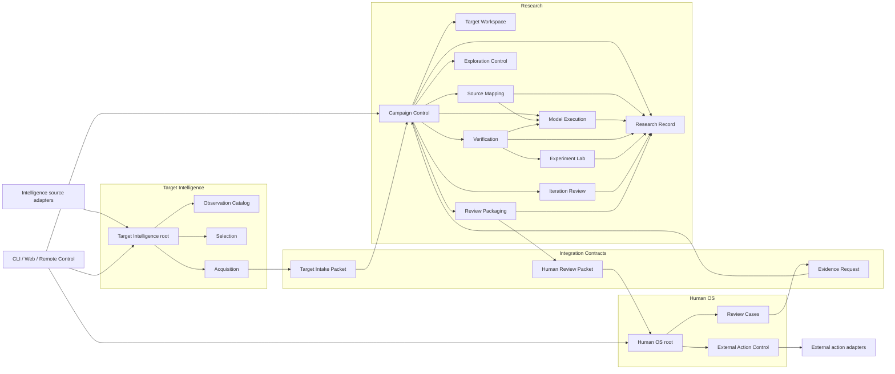

# Module architecture

Status: accepted, 2026-09-01

この文書は、`Target Intelligence -> Research -> Human OS`を一つのstrict TypeScript modular monolithとして実装する際のmodule ownership、公開面、依存方向、record ownershipを固定する。高水準のcontext境界だけで実装を始めず、各production moduleはこの設計上の配置と個別にacceptedなseamを持ってから実装する。

## Design rules

1. contextの外へ見せるのはcommand、query、versioned handoff contractだけとする。parser、provider session、database row、container handleを公開しない。
2. moduleは処理手順ではなく、変化し続ける一つの判断または複雑性を所有する。callerへ内部の順序、retry、file名、provider差を漏らさない。
3. context間は直接moduleをimportせず、schema-onlyのIntegration Contractsを介する。
4. Researchのstate変更はResearch Recordだけが永続化する。各moduleはtyped commandを渡せるがSQLiteや別moduleのtableへ触れない。
5. driving adapterであるCLI、web UI、remote controlはcontext rootだけを呼ぶ。domain policy、resume判断、provider選択を持たない。
6. driven adapterであるprovider CLI、PHP helper、gVisor、browser、Wordfence APIは、それを所有するmoduleの内側に閉じる。
7. 二つ目の実装が存在しない低水準部品へ汎用portを作らない。ただし複数providerで実在するModel Execution contractと、三context間のhandoff contractは最初からversion固定する。

## System topology



矢印はcompile-timeまたはruntimeの利用方向であり、event arrival順を表さない。Research内部でcycleを作らない。特にModel ExecutionはCampaign Control、Exploration Control、Verificationのdomain判断を呼び戻さない。

## Integration Contracts

`src/integration/`は三contextが共有する唯一のcode packageとし、次のruntime schemaだけを置く。

- `TargetIntakePacket@v1`: Target IntelligenceからResearchへ渡すoracle-freeなsource、provenance、Selection Receipt
- `HumanReviewPacket@v1`: ResearchからHuman OSへ渡すFinding、Evidence Route、Witness、Causal Control、再現情報
- `EvidenceRequest@v1`: Human OSからResearchへ返す不足観測とacceptance criterion

ここへCampaign、Finding、provider、database、UIのbusiness logicを置かない。contractはproducer/consumerの内部型を再exportせず、digest、schema version、provenanceを必須にする。

## Target Intelligence modules

Target IntelligenceはMilestone 3までproduction実装しないが、Researchへoracleを漏らさないため境界だけ先に固定する。

| Module | Owns | Public seam | Must not know |
| --- | --- | --- | --- |
| Target Intelligence root | observe、select、acquireのapplication flow | commandsとread-only queries | Research Ledger、Hypothesis、Finding |
| Observation Catalog | immutable Target Observation、Intelligence Source、Selection/Oracle分類 | `recordObservation`、`readObservation` | Campaign priority、worker prompt |
| Selection | Selection Policy、Target Candidate、Selection Receipt | `evaluateCandidate` | Researchの既知/未知Finding |
| Acquisition | source取得、provenance、digest、oracle除外、Intake Packet生成 | `acquireSelectedTarget` | Campaign lifecycle、Verification |

Intelligence Source adapterの停止やWordfence API failureは、既に固定されたTarget Snapshotまたは進行中Campaignを変更しない。

## Research context root

Research contextの外から呼べるapplication APIは次に限定する。

```ts
interface CampaignRunner {
  prepare(input: NewCampaignInput): Promise<PreparedCampaign>;
  advance(campaignId: CampaignId, until: AdvanceUntil): Promise<CampaignView>;
  requestStop(campaignId: CampaignId, reason: StopReason): Promise<StopReceipt>;
}

interface CampaignReader {
  read(campaignId: CampaignId): Promise<CampaignView>;
  inspect(campaignId: CampaignId, subject: SubjectRef): Promise<SubjectView>;
}
```

`advance`はLedgerをreplayし、必要な有限workを決め、durable receiptまで進めるreconcilerである。CLIやremote controlへ`runMapper`、`spawnAgent`、`resumeClaude`、`appendEvent`を公開しない。

## Research modules

### Campaign Control

Campaign lifecycleと一回の`advance`でどこまで進めるかを所有する。Ledger replay、budget reservation、Work Wave barrier、crash recoveryを調整するが、provider eventやPHP ASTを解釈しない。

```text
prepare / advance / requestStop
    -> replay state
    -> ask one decision module for the next finite action
    -> invoke the owning execution module
    -> durably record its typed result
    -> return a projection
```

Campaign Controlをgod moduleにしない。Focus分割はExploration Control、provider retryはModel Execution、Finding昇格はVerificationが決める。

### Target Workspace

Target Intake Packetまたはmanual intakeからTarget Snapshotを作り、source identity、read-only mount、Attempt scratch、cleanup receiptを所有する。

```ts
open(snapshot: TargetSnapshotRef, policy: WorkspacePolicy): Promise<WorkspaceReceipt>;
close(workspace: WorkspaceReceipt): Promise<CleanupReceipt>;
```

physical host pathはWorkspaceReceipt内のtrusted locatorとして同context内だけで使う。Work Lease、prompt、Human Review Packetへhost pathを渡さない。

### Source Mapping

Target Snapshotから脆弱性主張を含まないSurface Mapを作るdeep moduleである。内部にdeterministic PHP Source AnalysisとMapper Attemptを持ち、callerへparser version、AST traversal、prompt分割、cross-file synthesis順を漏らさない。

```ts
build(input: SurfaceMappingInput): Promise<SurfaceMapRef>;
```

PHP Program IndexはSource Mapping内部のversioned evidence artifactであり、context rootのpublic APIではない。parse diagnosticはSurface Mapのcoverage gapへ保持し、Campaign全体の成功へ読み替えない。

### Exploration Control

何を次に調べるかを所有するpure decision moduleである。Surface MapからFocus Areaを作り、三Exploration Laneを含む有限Work Waveを計画し、Attemptのrole outputをHypothesis、Closure Record、Context Requestへdecodeしてdeduplicateする。

```ts
plan(state: ExplorationState): WorkWavePlan;
accept(state: ExplorationState, attempt: AttemptExecutionResult): ExplorationDelta;
rank(state: ExplorationState): OrderedWork;
```

`AttemptExecutionResult`はdurable receipt refとprovider非依存のterminal status/outputを持つ。Exploration Controlはrole固有schemaでoutputをdecodeするが、raw stream、session ID、provider eventを受け取らない。providerを起動せず、arrival order、model confidence、programme rewardだけでpriorityを変えない。Work Wave内の結果は全Attempt terminal後にstable Work Lease ID順でfoldする。

### Model Execution

一つのAttemptをprovider差から隔離して実行するdeep moduleである。Prompt Set rendering、Model Profile、tool policy、Agent Sandbox、Segment lifecycle、wall/turn/usage ceiling、transcript CAS、分類済みresume、normalized Attempt Receiptを所有する。

```ts
run(plan: AttemptPlan): Promise<AttemptExecutionResult>;
```

`AttemptPlan`はWork Lease、role、Target Snapshot、Prompt Set、selected Knowledge、Model Profile、Sandbox Policy、reserved budgetを固定する。`AttemptExecutionResult`はdurable Attempt Receipt、normalized termination/usage、terminal outputを返し、raw transcriptはprivate CAS refとして保持する。provider adapterはplanをversion固定argv/configへ変換するだけで、role、model、effort、retry policyを選択しない。

初期のClaude process adapterはModel Execution内部に置く。GLM、Codex、Grokという第二以降の実adapterを追加するとき、同じcontract suiteを通るprovider adapter seamを確定する。provider session refは同じAttemptのresumeにだけ使い、Attempt Receiptから別Work Leaseへ渡さない。

### Verification

HypothesisからFindingまたはnegative outcomeまでを閉じるload-bearing deep moduleである。fresh source re-derivation、cheap category gate、Experiment Plan、Witness、sibling Causal Control、Skeptic、Frontier Independent Reproductionを所有する。

```ts
verify(plan: VerificationPlan): Promise<VerificationRecordRef>;
```

Campaign Controlへ`runWitness`、`runControl`、`askSkeptic`を個別公開しない。Verificationが全必須証拠を確認した場合だけFinding promotion commandをResearch Recordへ渡す。Discovery transcript、scratch、provider self-verdictを証拠として受理しない。

### Experiment Lab

Verificationだけが利用するdriven moduleである。gVisor、WordPress runtime、browser、database、Credential Broker、External Dependency Grantを一つのtyped Experiment境界へ隠す。

```ts
execute(plan: ExperimentPlan): Promise<ExperimentObservationRef>;
```

LabはHypothesisまたはFindingを判断しない。同じLab instanceでWitnessとCausal Controlを連続実行せず、共通Lab Baselineからfresh siblingを作る。gVisor unavailable時はevidentiary resultを返さない。

### Iteration Review

terminal Work Waveのpositive/negative/blocked evidenceを安定順でfoldし、次のFocus Plan、priority change、Lesson Proposal、Rule Proposal、stop/continue decisionを作る。

```ts
review(input: IterationReviewInput): IterationDecision;
```

raw transcriptをglobal Knowledgeへ昇格せず、LessonとRuleはそれぞれpromotion gateを通す。Exploration Controlが一件のAttemptを受理する責務と、Iteration ReviewがWave全体から次の方針を決める責務を分ける。

### Review Packaging

confirmed FindingからHuman OSへ必要な最小証拠だけを集め、digest固定したHuman Review Packetを作る。

```ts
prepare(finding: FindingRef): Promise<HumanReviewPacketRef>;
```

raw transcript、credential、writable Lab、private不要データを含めない。Human Dispositionまたは外部提出判断を所有しない。

### Research Record

Researchの唯一のpersistence writerであり、append-only Ledger、pure replay、private content-addressed artifact storeを一つの整合性境界として所有する。

```ts
record(command: ResearchRecordCommand): Promise<RecordReceipt>;
read(query: ResearchQuery): Promise<ResearchView>;
putArtifact(input: ArtifactInput): Promise<ArtifactRef>;
readArtifact(ref: ArtifactRef): Promise<Uint8Array>;
```

大きなartifactは先にdurable CASへ置き、成功したdigestだけをLedger eventへ記録する。Model ExecutionはSegment intent/completion、VerificationはExperiment/decision、Campaign ControlはCampaign/Wave/Leaseをtyped commandとして記録できるが、全てResearch Recordがschema、sequence、ownershipを検証して書く。

Research Recordはdomain判断をしない。たとえばAttemptをretryすべきか、HypothesisをFindingへ昇格できるかは呼出元moduleが決め、Recordは許可された状態遷移と参照整合性だけを検証する。

## Ten-control ownership

10動詞はphase名ではなく横断controlだが、実装責任が宙に浮かないようprimary ownerを定める。

| Control | Primary owner | Collaborating module | Observable output |
| --- | --- | --- | --- |
| confine | Target Workspace / Experiment Lab | Model Execution | Workspace/Lab receipt、denied capability |
| constrain | Campaign Control | Model Execution / Verification | fixed budget/policy、terminal reason |
| focus | Exploration Control | Source Mapping | Surface Map、Focus Plan、coverage gap |
| motivate | Exploration Control | Model Execution | goalとsuccess evidenceを持つAttempt Plan |
| parallelize | Exploration Control | Campaign Control | non-overlapping Work Waveとbarrier |
| hypothesize | Exploration Control | Model Execution | schema-valid HypothesisとClosure Record |
| verify | Verification | Experiment Lab / Model Execution | Verification Record、Witness、Control |
| record | Research Record | 全Research module | append receipt、artifact ref、replay view |
| prioritize | Exploration Control | Iteration Review | deterministic Ordered Work |
| iterate | Iteration Review | Campaign Control | next plan、Lesson/Rule Proposal、stop reason |

`record`のsemantic contentは各owner moduleが決め、Research Recordはdurabilityとintegrityを所有する。`constrain`や`confine`をmodel promptのお願いだけで実装済みとみなさない。

## Human OS modules

| Module | Owns | Public seam | Must not do |
| --- | --- | --- | --- |
| Human OS root | review intake、human commands、read-only queue | Human Review commands/queries | Research event mutation |
| Review Cases | Human Review Case、Disposition history、Evidence Request | `openCase`、`recordDisposition`、`requestEvidence` | Findingの再定義、provider execution |
| External Action Control | explicit authorization、scope、expiry、action receipt | `authorize`、`revoke`、`readAuthorization` | implicit submit、Researchの自動公開 |

external report、vendor communication、issue、PR adapterは有効なExternal Action Authorizationを毎回要求する。Human Confirmationだけでは送信できない。

## Record ownership

| Record | Semantic owner | Persistence path | Other contexts see |
| --- | --- | --- | --- |
| Target Observation / Selection Receipt | Observation Catalog / Selection | Target Intelligence-owned store | Target Intake Packetへ採用されたsanitized factとprovenanceだけ |
| Target Snapshot | Target Workspace | Research Record | Human Review Packetのfixed identityだけ |
| Surface Map | Source Mapping | Research Record | context外へ出さない |
| Focus/Lease/Hypothesis/Closure | Exploration Control | Research Record | context外へ出さない |
| Attempt / Segment / transcript | Model Execution | Research Record | context外へraw recordを出さない |
| Experiment evidence / Verification Record / Finding | Verification | Research Record | Human Review Packetへ固定された最小証拠だけ |
| Lesson / Rule / Iteration decision | Iteration Review | Research Record | accepted後のversioned Knowledge/Ruleだけ |
| Human Review Case / Disposition / Evidence Request | Review Cases | Human OS-owned store | Evidence Request contractだけをResearchへ返す |
| External Action Authorization / receipt | External Action Control | Human OS-owned store | 対象action adapterが最小scopeだけ読む |

Research内の全recordはResearch Recordが実際のwriteを行うが、recordの意味と生成条件は上表のsemantic ownerが持つ。同じSQLite databaseを使ってもtableとevent streamのownerを越えて直接更新しない。read modelもowner contextが作り、別contextの内部projectionへjoinしない。

## Dependency rules

許可する依存:

```text
driving adapters -> context root -> context modules -> owned driven adapters
all contexts -> integration schemas
domain decision modules -> immutable refs and pure value types
execution modules -> Research Record public seam
```

禁止する依存:

- Target IntelligenceからResearch内部またはHuman OS内部
- ResearchからTarget Intelligenceのfeed、raw advisory、Oracle Fact storage
- Human OSからResearch Ledger table、provider adapter、Verification Lab handle
- CLI/web/remote controlからSQLite、provider CLI、PHP helper、container runtime
- Model ExecutionからExploration priority、Finding promotion、Campaign stop policy
- Experiment LabからHypothesis mutationまたはHuman Review
- PHP Source Analysisからtarget autoload、WordPress bootstrap、target Composer script

CIでmodule boundary enforcementを追加するのは、folder migration後に実際の違反を検出できる時点とする。それまではbarrel importとreview checklistで守り、未使用のlint frameworkを先行導入しない。

## Target source layout

```text
src/
  integration/                 # schema-only cross-context handoffs
  target-intelligence/
    index.ts                   # context public API only
    observation/
    selection/
    acquisition/
  research/
    index.ts                   # CampaignRunner / CampaignReader only
    campaign-control/
    target-workspace/
    source-mapping/
      php-program-index/       # concrete helper seam, not context-public
    exploration-control/
    model-execution/
      claude-process/          # first concrete provider adapter
    verification/
    experiment-lab/
    iteration-review/
    review-packaging/
    research-record/
  human-os/
    index.ts                   # context public API only
    review-cases/
    external-action-control/
  adapters/
    cli/
    remote-control/
    web/
tools/
  php-program-index/           # pinned PHP child implementation
```

folderはownershipを示すために使い、各名詞ごとにfileを分けない。module内部は一つの深いentry pointから始め、複雑性が実測されるまでrepository/service/interfaceの層を増やさない。

## Current-code gap and migration

現在のcodeは動作しているが、module mapに対して次の差分がある。

| Current | Gap | Migration before new behavior |
| --- | --- | --- |
| `src/research/index.ts` | Campaign APIとPHP Source Analysisを同じcontext-public barrelへexport | PHP APIを`source-mapping/php-program-index`のmodule barrelへ移し、Research rootから隠す |
| `src/research/contracts.ts` | Campaign input、application interface、errorが一file | `campaign-control`へ移し、integration contractとは分離する |
| `src/research/sqlite-research.ts` | Campaign decision、projection、SQLiteが同居 | behaviorを変えず、Campaign ControlとResearch Recordの二moduleへ段階分離する |
| `src/research/canonical-json.ts` | context rootの汎用utilityに見える | Research Record所有のcanonical artifact/event encodingへ置く |
| `src/cli.ts` | root直下だが薄いadapterとしては適切 | behaviorを変えず`adapters/cli`へ移すのは次にCLIを触る時だけ |

全面rewriteはしない。最初の移行は既存testをgreenのまま保つmechanical refactorとし、次の順に進める。

1. Research root APIとinternal module barrelを分離する。
2. PHP Program IndexをSource Mapping内部へ移し、既存public behavior testのimportだけをmodule seamへ変える。
3. Campaign lifecycleからResearch Recordのappend/replay/CASを分離する。
4. ここまでのmodule boundary testと既存17 testがgreenになってから、Model Executionのproposed seamを作る。
5. Claude process adapterはそのseamがacceptedになるまで実装しない。

## Failure semantics across modules

- Target acquisition failure: Target Intelligence内でterminal receiptを残し、Research Campaignを作らない。
- parse diagnostic: PHP Program IndexとSurface Mapのgapとして残し、target全体の解析成功へ読み替えない。
- provider transient failure: 同一Attempt内だけでbounded Segment resume候補とする。別model/transportへfallbackしない。
- provider terminal failureまたはbudget exhaustion: Attemptをterminalにし、CampaignをCompletedへ読み替えない。
- artifact write failure: 参照eventをappendせず、partial artifactを昇格しない。
- unknown event/schema: projectionを止め、既存stateを変更しない。
- gVisor/Lab failure: evidentiary Observationを返さず、Findingへ昇格しない。
- Human Evidence Request: 元Finding/Packet/Dispositionを書き換えず、新しいResearch workとして追記する。
- external action failure: authorizationとattempt receiptをHuman OSへ残し、Findingの真偽を変更しない。

## Acceptance scenarios for this design

1. Wordfence APIが停止しても、固定済みTarget SnapshotのCampaignはResearchだけで再開できる。
2. MapperのClaude processが途中で429となっても、Model Execution以外はsession IDやresume argvを知らない。
3. PHP file一件が壊れても、Source Mappingはdiagnosticを持つSurface Mapを返し、Exploration ControlはCoverage Gapを作れる。
4. DiscoveryがStored XSSを主張しても、Model Executionの成功だけではFindingにならず、Verificationがfresh Witnessとsibling Controlを要求する。
5. Human reviewerが追加証拠を求めても、Research Ledgerの過去eventは変更されず、新しいEvidence Requestからworkが作られる。
6. Remote Controlから直接`claude --resume`、SQLite更新、vendor送信はできない。
7. 将来ClaudeからCodexへprofileを追加しても、Exploration、Verification、Human OSはprovider event形式を知らない。
8. RCE Experimentがfile writeまで成功しても、nonce付きExecution Canaryが観測されなければRCE Findingへ昇格しない。

## Design approval gate

この文書は2026-09-01にacceptedとなった。まずcurrent-code gapの1〜3をbehavior-preserving refactorとして別commitにし、その後Model Executionのpublic seamを別文書で`proposed`にする。そのseamがacceptedになるまでOpus transportのproduction codeを実装しない。
