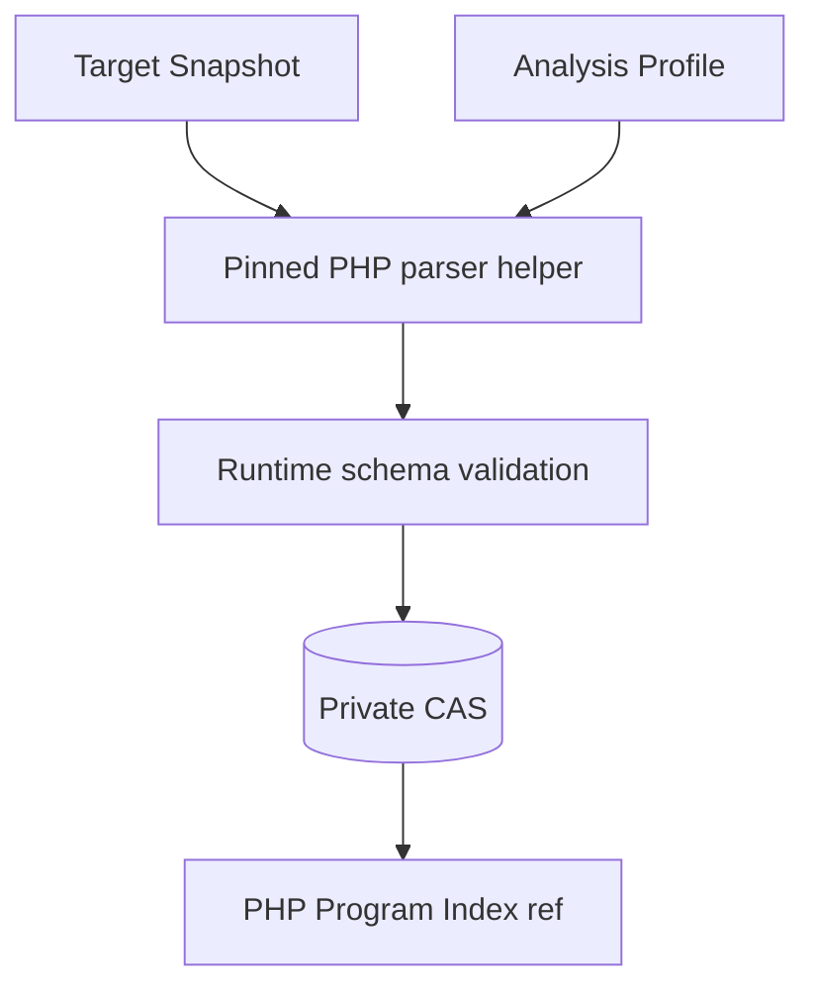
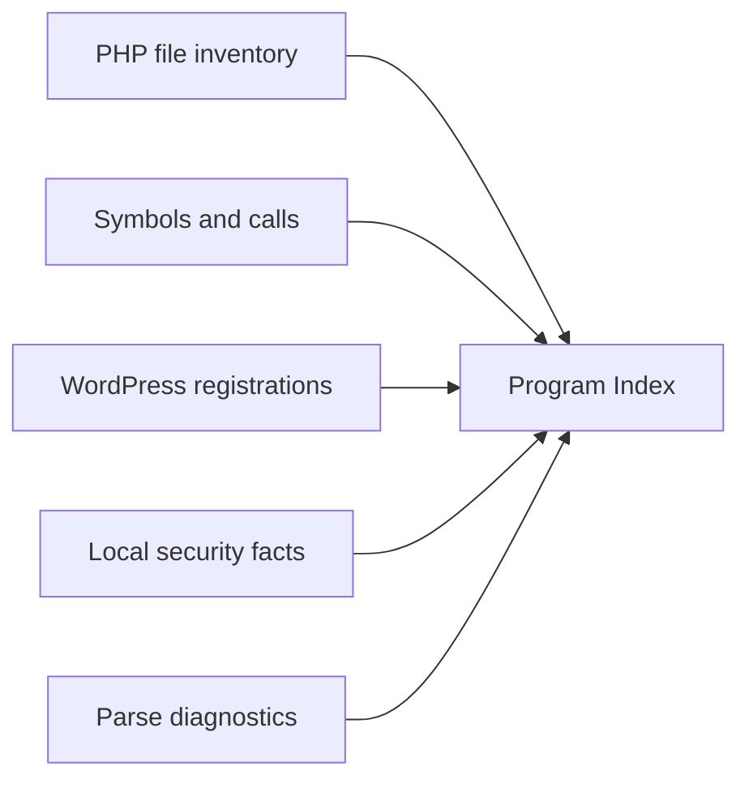
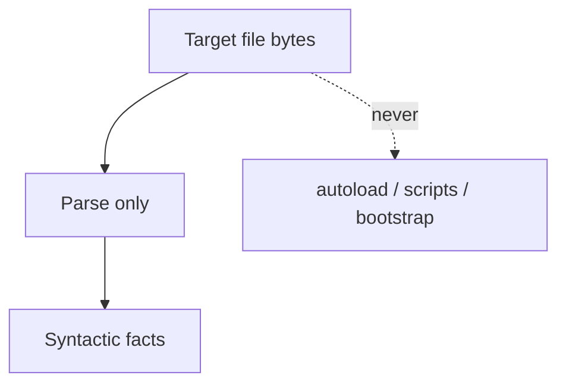
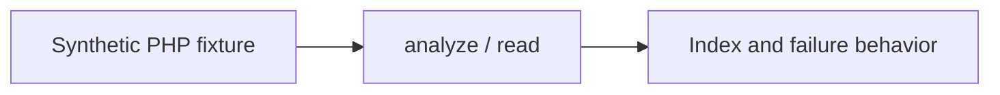

# PHP Program Index seam

Status: accepted internal seam; current generator version belongs in the [Codebase Guide](../CODEBASE-GUIDE.md)

`PHP Source Analysis`は固定TargetとAnalysis Profileからcontent-addressed `PHP Program Index`を作る。Source Mapping内部だけで使い、Research contextのpublic Interfaceにはしない。

```ts
interface PhpSourceAnalysis {
  analyze(input: AnalyzePhpSourceInput): Promise<PhpProgramIndexRef>;
  read(ref: PhpProgramIndexRef): Promise<PhpProgramIndex>;
}
```

## Data flow



local source pathはlocatorでありartifact identityへ含めない。同じTarget bytesとProfileはmachine上のpathに関係なく同じdigestへ収束する。

## Index contents



局所的なsecurity factにはrequest input、authorization guard、state read/write、database、filesystem、code/process、HTML output等の構文上の候補を含められる。ただしIndexはtaint、reachability、attacker control、sanitization、severity、脆弱性を判定しない。

dynamic name、receiver、callback、argumentを一意に決められない場合は推測せず未解決またはdiagnosticとして残す。Source MappingとFinderが必要な関係を別の証拠から判断する。

## Safety boundary



- target code、autoload、Composer script、WordPress bootstrapを実行しない。
- target root外のpathまたはsymlinkを読まない。
- stdin/stdoutはversioned JSONとし、stderrをhandoffに使わない。
- child outputをruntime schemaで検査し、atomic write後にrefを返す。
- timeout、output ceiling、memory ceilingを適用し、partial artifactを昇格しない。
- bundled vendorの扱いはversioned Profileで決め、一律除外を永続的な設計にしない。

## Versioning

parser、抽出規則、schemaが変わればgeneratorまたはProfile identityを変える。readerは明示的に対応する旧versionだけを受理し、unknown versionを推測しない。新Target Snapshotへ旧Indexのfactを移植しない。

## Behavior test surface



Testはpublicなinternal Interfaceからsorted inventory、symbol、registration、local security fact、diagnostic、digest決定性、path拒否、malformed output拒否を観測する。raw ASTやvisitor helperを直接固定しない。

IndexをMapへ変換する責務と根拠状態は[Source mapping seam](source-mapping-seam.md)を参照する。
