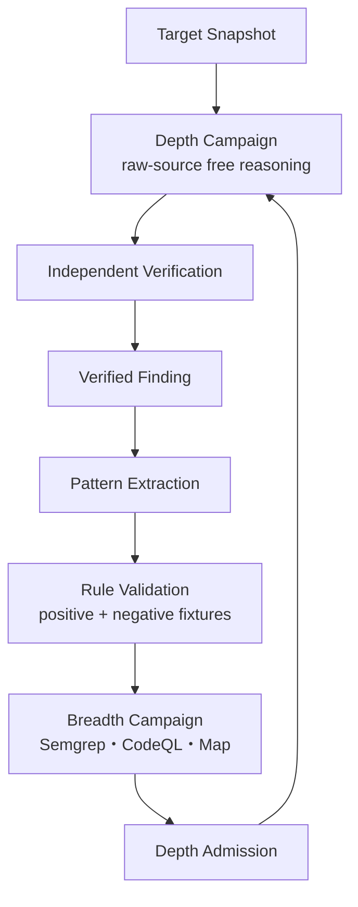

# 調査設計原則（Research Design Principles）

Status: accepted, 2026-09-03

この文書は、脆弱性探索に関する設計判断を読む最初の正本である。最上位にはWordfence Argus記事から採った10動詞を置き、公開実装へ落とす運用原則にはAnthropicのDefending Code Reference Harnessを使う。個別のinterfaceと例外はaccepted ADRが決める。

## 1. 最上位の10原則

| 原則 | このharnessでの意味 |
| --- | --- |
| Confine（隔離する） | Target、worker、credential、runtime、networkを必要最小限の信頼領域へ閉じる |
| Constrain（制約する） | scope、予算、tool、並列数、停止条件をmodelの外側で強制する |
| Focus（焦点を定める） | 高水準のsecurity goalと未解決gapを与え、手順は固定しない |
| Motivate（動機づける） | 高impactな完全chainと、次に閉じるべき具体的な不足linkを明示する |
| Parallelize（並列化する） | 言い換えではない独立したidea familyを、相互に見せず同時に育てる |
| Hypothesize（仮説化する） | premise、route、impact、unknown、falsifierを反証可能なartifactにする |
| Verify（検証する） | Discoveryと状態を共有しないfresh verifierとclean labで成立条件を再導出する |
| Record（記録する） | positive、negative、blocked、unknownをsource provenanceとともに追記する |
| Prioritize（優先する） | impact、到達可能性、情報利得、chain gap、検証費用から次の有限workを選ぶ |
| Iterate（高速反復する） | waveごとの証拠を統合・批判し、方法、rule、次の問いへ短く還元する |

10動詞は10段pipelineでも10個のmoduleでもない。全Campaignと各反復で観測するcontrol propertyである。詳細は[ADR 0001](../adr/0001-ten-verbs-as-control-properties.md)を参照する。

## 2. Anthropicベストプラクティスの採用方法

[Anthropic Defending Code Reference Harness: Best Practices](https://github.com/anthropics/defending-code-reference-harness/blob/main/docs/best-practices.md)を、次の運用原則として採用する。

| 公開ベストプラクティス | このharnessへの適用 |
| --- | --- |
| systemを把握して探索空間を分割する | Root Plannerがrepository inventoryと過去artifactから独立idea familyを割り当てる。ただし最初のDepth FinderへSurface Map routeを見せず、Mapを探索境界にしない |
| modelへ必要なcontext toolを渡す | Snapshot-boundなGlob・Grep・Readを主経路にする。小さな一時scriptは制約内で許せるが、semantic verdictをscriptへ委譲しない |
| DiscoveryとVerificationを分離する | Discoveryは高recall、Verificationは候補を積極的に反証する。conversation、scratch、writable runtimeを共有しない |
| verifierへ投資する | category別のprogrammatic gate、executable witness、causal control、clean sandboxをFinding昇格条件にする |
| Finder→Critic→Judgeを分ける | Finder、Adversarial Critic、Independent Verificationを別Attemptにし、同じmodelの自己確認を独立性と呼ばない |
| 独立runのunionを取る | 多数決ではなくsource-bound candidateの和集合を保持する。少数routeを支持数で捨てない |
| 一度のfan-outより短い反復を優先する | Wave→Synthesis→Critic→Missing-link Waveを回し、同じPromptの並列数だけを増やさない |
| partial chainの不足primitiveをfresh runへ渡す | Route Fragmentから一つの具体的なmissing linkを作り、新しいFinderへ限定された問いとして渡す |
| findingをruleとregressionへ変える | 検証済みFindingのうち構文的に一般化できる部分だけをSemgrep/CodeQLへ変換する。ruleは安価なcoverage floorであり、次の自由探索の代替ではない |
| 実Targetを早期に回す | 完璧なMapやbenchmark suiteを待たず、小さいvertical sliceを実戦投入し、失敗をtyped artifactとtestへ戻す |
| large repositoryでは再分割する | summary、cheap ranking、source search、Dependency Wishlistを使い、単にagent数を増やさない |
| setupとattackを分離しsupervisorを守る | acquisition/setupのegressとDiscovery/Verificationのnetwork policyを分け、root control planeをuntrusted sourceから隔離する |

Anthropic文書の「map the system first」は、探索前に完全なSurface Mapを生成してFinderへ強制する意味には採らない。ここで必要なのは重複を避けるための対象把握と分割であり、Depth Campaignの最初のFinderはraw sourceだけを見て自由にpivotできる。[ADR 0113](../adr/0113-keep-finder-methods-free-behind-an-evidence-shell.md)がこの適応を固定する。

## 3. 深掘りと横展開を混ぜない

主探索はDepth Campaignである。高推論modelとraw-source navigationを使い、wrapper、state、second-order flow、複数request、機能間chainを追う。検証済みの発見から一般化できる構文patternだけをruleへ変換し、Breadth Campaignで多数Targetへ横展開する。

rule化できないsemantic chainを無理に一つのstatic ruleへ潰さない。途中primitiveだけを候補seedとして抽出し、最終判断はDepthへ戻す。Semgrep、CodeQL、AST、Surface Mapのnon-matchを安全性または探索終了の証拠にしない。二Modeの責任は[ADR 0114](../adr/0114-separate-breadth-and-depth-campaign-policies.md)を参照する。

## 4. 衝突時の優先規則

1. Depthの最初のWaveはraw-source firstとし、Surface Map、AST route、既知rule hitを必須入力にしない。
2. Finderへ`source-first`、`sink-first`、`state-chain`等を固定手順として強制しない。Approach Family Registryのlabelまたは開始lensに限る。
3. Surface Mapは後段coverage、候補seed、記録、rule expansionへ使えるが、Map外pathを探索対象外にしない。
4. Harnessは隔離、provenance、budget、artifact、barrier、停止を決定論的に管理し、chainを発想する意味判断はmodelへ残す。
5. 通常のResearch loopは人間介入なしで反復する。Human OSはFinding後の外部提出判断と例外的なEvidence Requestを所有し、探索方法を操作しない。
6. 実装済みのMap-first bootstrapまたは固定Strategy記述は移行元の現状説明であり、到達設計ではない。ADR 0113以後の判断が優先する。

## 5. 設計変更の受入条件

探索関連の変更は、少なくとも次を説明できなければ採用しない。

- 10原則のどれを改善し、何を観測すれば確認できるか。
- 高recall Discoveryと厳しいVerificationのどちらに属するか。
- raw-source routeを削除またはdowngradeしないか。
- model/providerを差し替えてもartifactとsecurity boundaryが保たれるか。
- positiveだけでなくnegative、blocked、unknownを残せるか。
- 実Targetで短く試し、失敗をtestまたは設計判断へ戻せるか。
